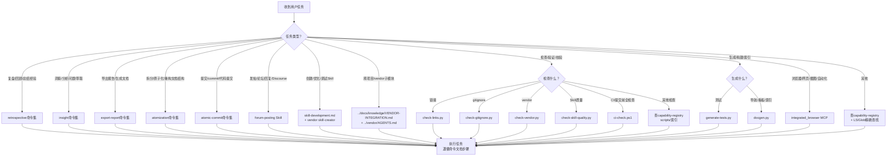

# SpecWeave Agent Onboarding

> **这是什么？** 本文件是 AI Agent 接入 SpecWeave 项目的第二份必读文档（第一份是 [AGENTS.md](../apps/zhujian-wudao/AGENTS.md)）。它提供能力索引和快速路由，帮助你在新会话中 1-2 轮工具调用内建立完整的上下文认知，无需盲目遍历目录。
>
> **为什么需要这个文件？** AI 在新会话中记忆清零。过去 Agent 需要 LS/Glob 遍历多个目录才能知道有哪些能力可用——这违反了 Agent-First 设计原则。本文件与 [capability-registry.md](capability-registry.md) 共同构成 L0-L1 能力发现层。

---

## 快速开始（3 步）

```
步骤 1：你正在读本文件 ✅
步骤 2：读取 [capability-registry.md](capability-registry.md) 了解有哪些能力可用
步骤 3：根据任务类型，按下表路由到对应能力，按需加载详细文档
```

---

## 能力速查表

| 你要做什么 | 应该用什么 | 去哪里找 |
|-----------|-----------|---------|
| **执行复盘**（项目/阶段/事件回顾） | retrospective 命令集 | [commands/retrospective.md](commands/retrospective.md) |
| **萃取洞察**（数据分析/问题诊断） | insight 命令集 | [commands/insight.md](commands/insight.md) |
| **导出报告**（结构化报告生成） | export-report 命令集 | [commands/export-report.md](commands/export-report.md) |
| **原子化文档**（拆分大文件） | atomization 命令集 | [commands/atomization.md](commands/atomization.md) |
| **原子化提交**（Git提交规范） | atomic-commit 命令集 | [commands/atomic-commit.md](commands/atomic-commit.md) |
| **操作论坛帖子**（发帖/编辑/回复/草稿） | forum-posting Skill | [skills/forum-posting/SKILL.md](skills/forum-posting/SKILL.md) |
| **浏览器自动化**（网页交互/测试/截图） | integrated_browser MCP | MCP 工具（系统内置） |
| **检查链接有效性** | check-links.py 脚本 | [scripts/check-links.py](scripts/check-links.py) |
| **验证 Git 忽略规则** | check-gitignore.py 脚本 | [scripts/check-gitignore.py](scripts/check-gitignore.py) |
| **检查 vendor 合规性** | check-vendor.py 脚本 | [scripts/check-vendor.py](scripts/check-vendor.py) |
| **原子化一键收尾** | finalize-atomization.py 脚本 | [scripts/finalize-atomization.py](scripts/finalize-atomization.py) |
| **生成测试骨架** | generate-tests.py 脚本 | [scripts/generate-tests.py](scripts/generate-tests.py) |
| **生成导航表** | generate-nav.py / docgen.py 脚本 | [scripts/docgen.py](scripts/docgen.py) |
| **生成 Spec 看板** | generate-dashboard.py 脚本 | [scripts/generate-dashboard.py](scripts/generate-dashboard.py) |
| **生成 SG 日志仪表盘** | generate-sg-dashboard.py 脚本 | [scripts/generate-sg-dashboard.py](scripts/generate-sg-dashboard.py) |
| **检查 Skill 质量**（五要素合规） | check-skill-quality.py 脚本 | [scripts/check-skill-quality.py](scripts/check-skill-quality.py) |
| **分析阶段守卫日志** | check-stage-guardrails.py 脚本 | [scripts/check-stage-guardrails.py](scripts/check-stage-guardrails.py) |
| **阶段守卫运行时** | check-stage-guardrail-runtime.py 脚本 | [scripts/check-stage-guardrail-runtime.py](scripts/check-stage-guardrail-runtime.py) |
| **CI 综合检查** | ci-check.ps1 / ci-check.sh | [scripts/ci-check.ps1](scripts/ci-check.ps1) |
| **构建引用反向索引** | build-ref-index.py 脚本 | [scripts/build-ref-index.py](scripts/build-ref-index.py) |
| **初始化新项目脚手架** | agents.py init 脚本 | [scripts/agents.py](scripts/agents.py) |
| **查阅技术知识库**（操作/排障/最佳实践） | docs/knowledge/ | [docs/knowledge/README.md](../docs/knowledge/README.md) |
| **查阅复盘模式库**（可复用方法论/代码/架构模式） | docs/retrospective/patterns/ | [docs/retrospective/patterns/README.md](../docs/retrospective/patterns/README.md) |
| **查阅开发规范** | docs/development-standards.md | [docs/development-standards.md](../docs/development-standards.md) |

---

## 必知 vs 按需

| 文档 | 何时读 | 优先级 |
|------|--------|--------|
| [AGENTS.md](../apps/zhujian-wudao/AGENTS.md) | **每个会话必读**（启动协议步骤1） | 🔴 必须 |
| [capability-registry.md](capability-registry.md) | **每个会话必读**（本协议步骤2） | 🔴 必须 |
| [.agents/rules/stage-guardrails.md](rules/stage-guardrails.md) | 涉及跨阶段操作前 | 🟡 按需 |
| [.agents/protocols/pre-document-reading.md](protocols/pre-document-reading.md) | 进入开发阶段前（PDR协议） | 🟡 按需 |
| [.agents/rules/skill-development.md](rules/skill-development.md) | 创建/优化 Skill 前 | 🟡 按需 |
| 具体模块/角色/工作流规范 | 操作该模块时 | 🟢 按需 |
| docs/knowledge/*.md | 需要相关领域知识时 | 🟢 按需 |
| docs/retrospective/patterns/*.md | 需要方法论/代码/架构模式参考时 | 🟢 按需 |

> 💡 **原则**：不要预读所有文档。先用速查表定位目标能力，再读取该能力的详细文档。遵循"渐进式披露"（Progressive Disclosure）原则。

---

## 任务类型 → 路由映射



---

## 新会话启动确认格式

当你是新会话的 Agent，请在首次输出中确认：

```
📋 上下文已建立：已读取 [AGENTS.md](../AGENTS.md)、[ONBOARDING.md](ONBOARDING.md)、[capability-registry.md](capability-registry.md)
任务类型识别：<复盘/Skill操作/检查/其他>
将使用：<对应能力>
```

如果是从先前会话上下文恢复（收到 summary），仍需重新读取本文件，不要假设摘要中已包含完整路由信息。

---

## 会话启动协议（修订版）

```
1. 读取 AGENTS.md（全局规则 + 启动协议路由表）
2. 读取 ONBOARDING.md（本文件，能力索引入口）
3. 读取 capability-registry.md（完整能力清单）
4. 根据任务类型，按路由映射定位到具体能力
5. 按需读取目标能力的详细文档（不预读全部）
6. 执行任务
```

> **为什么从原来的"读取大量前置文档"改为"索引导向"？**
> - PDR 协议的初衷是防止 AI 基于"想象中的项目"工作，但全量预读的成本太高（上下文窗口浪费在大量当前任务不需要的文档上）
> - 本协议提供"导航地图"而非"全部资料"——AI 先知道有什么能力，再按需加载细节
> - PDR 协议仍然有效：进入具体开发阶段时，该读的前置文档仍需按 [pre-document-reading.md](protocols/pre-document-reading.md) 读取
