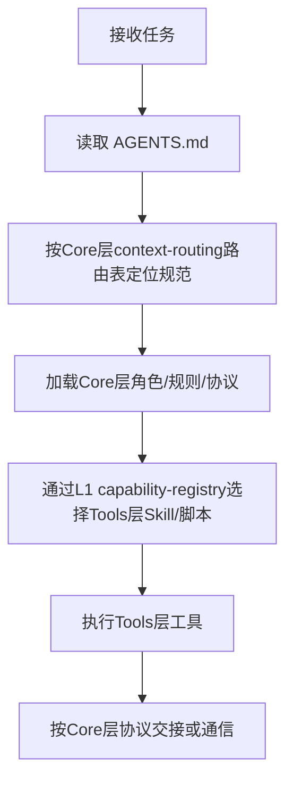

# .agents 目录说明

本目录是项目 AI 智能体规范的容器，存放角色定义、自我演进模块、系统提示词、工具规范、协作协议、工作流、模板与自动化脚本。所有智能体在执行任务前，应先通过项目根目录的 `AGENTS.md` 进行上下文路由，再进入本目录加载对应规范。

## 目录结构

```
.agents/
├── ONBOARDING.md             # [Core] Agent Onboarding 入门指南（L0入口）
├── capability-registry.md    # [Core] 能力注册中心（L1静态索引）
├── capability-boundaries.md  # [Core] 能力边界声明（原子化文件）
├── global-core-rules.md      # [Core] 全局核心规则（启动协议/内容分流/三阶段递进/元文档优先/修复闭环等，持续演进）
├── context-routing.md        # [Core] 上下文路由表（vendor预检+常规任务路由）
├── VENDOR-INTEGRATION.md     # [Core] 跨项目子模块协同规范
├── capabilities/             # [Core] 渐进式披露三层架构规范与模板
├── roles/                    # [Core] 智能体角色定义
├── modules/                  # [Core] 自我演进模块定义（8模块/四层闭环）
├── prompts/                  # [Core] 系统提示词与 few-shot 示例
├── tools/                    # [Core] 工具调用规范（如何使用工具）
├── protocols/                # [Core] 协作协议（含PDR前置阅读、三层路由、阶段守卫等）
├── rules/                    # [Core] 规则体系（阶段守卫/硬编码/数据安全/AI编码/元文档优先等133+规则文件）
├── workflows/                # [Core] 标准工作流
├── templates/                # [Core] 任务与交接模板
├── teams/                    # [Core] 团队管理功能模块（含4个专项团队）
├── systems/                  # [Core] 系统级架构定义
├── cases/                    # [Core] 项目复用案例
├── commands/                 # [Core] 标准化指令集（10个：复盘/洞察/第一性原理/原子化/Mermaid等）
├── worlds/                   # [Core] 团队协作执行与环境管理
├── checklists/               # [Core] 标准化检查清单（风险评分等）
├── scripts/                  # [Tools] 验证与自动化脚本（320+Python脚本，含tests/lib/mdi/sg_dashboard）
├── skills/                   # [Tools] Skill 技能门面（16个：ci-check/docgen/insight/mermaid/forum-posting等）
└── config/                   # [Tools] 工具配置文件（discourse等）
```

> 标记说明：`[Core]` = 核心规范层（稳定规则/协议/定义），`[Tools]` = 执行工具层（脚本/实现/配置）。详见「规范分层治理」章节。

## 根级原子文件

| 文件 | 层级 | 职责 | 来源 |
|---|---|---|---|
| [ONBOARDING.md](ONBOARDING.md) | L0 | Agent Onboarding 入门指南：快速开始、能力速查表、任务类型路由 | Skill发现协议P0实施 |
| [capability-registry.md](capability-registry.md) | L1 | 能力注册中心：scripts/skills/commands/workflows/protocols/rules/knowledge全量索引 | Skill发现协议P0实施 |
| [capability-boundaries.md](capability-boundaries.md) | L2 | 各角色能力边界与职责限制（Non-Goals） | AGENTS.md 原子化拆分 |
| [global-core-rules.md](global-core-rules.md) | L2 | 全局核心规则（启动协议优先、内容敏感度分流、三阶段递进、元文档优先、修复即闭环等，持续演进） | AGENTS.md 原子化拆分 |
| [context-routing.md](context-routing.md) | L2 | 上下文路由表：vendor方法论资产预检表 + 常规任务路由映射表 | AGENTS.md 原子化拆分 |
| [VENDOR-INTEGRATION.md](VENDOR-INTEGRATION.md) | L2 | 跨项目子模块协同规范：边界划分、交互接口、版本控制、三层路由合规 | vendor子模块协同 |

## 各子目录职责说明

| 目录 | 分层 | 职责 | 内容 |
|---|---|---|---|
| capabilities/ | Core | 渐进式披露三层架构规范与模板 | ARCHITECTURE.md(L2规范)、ONBOARDING-TEMPLATE.md、REGISTRY-TEMPLATE.md |
| capability-registry/ | Core | L1能力注册中心详细索引 | scripts/skills/commands/workflows/protocols/rules/knowledge 分类索引 |
| roles/ | Core | 智能体角色定义与协作场景 | 7个核心角色定义（orchestrator/architect/developer/reviewer/tester/co-founder/team-admin），及协作场景 |
| modules/ | Core | 自我演进模块定义 | 8个自我演进子智能体（感知/认知/执行/治理四层闭环） |
| prompts/ | Core | 系统提示词与 few-shot | 按角色分子目录，每个含 system-prompt.md 与 few-shot.md |
| tools/ | Core | 工具调用规范（规范层） | 文件操作、代码执行、搜索、通信四类工具的使用规范（不是工具实现） |
| protocols/ | Core | 协作协议 | 会话启动、任务交接、消息传递、冲突解决、PDR前置阅读、三层路由、应用生命周期、临时依赖、onboarding |
| rules/ | Core | 规则体系 | 阶段守卫（含运行时）、硬编码治理、数据安全、内容敏感度预检、RACI规范、AI编码准则、元文档优先、三阶段递进、修复闭环、frontmatter标准、CMD-LOG规范等133+原子化规则文件 |
| workflows/ | Core | 标准工作流 | 功能开发、代码审查、测试流程（含 Mermaid 流程图） |
| templates/ | Core | 模板资产 | 任务模板、交接模板、Mermaid模板 |
| teams/ | Core | 团队管理功能模块 | 团队管理员角色、团队生命周期、权限系统、4个专项团队（flexloop/mermaid/home-assistant/trae-edge-case） |
| systems/ | Core | 系统级架构定义 | 提示词萃取系统等架构文档 |
| cases/ | Core | 项目复用案例 | agentforge-adoption.md 等案例文档 |
| commands/ | Core | 标准化指令集（规范层） | 10个指令集：复盘、洞察、第一性原理、导出报告、原子化、原子提交、Mermaid管理、文件创建、Home Assistant、对抗性评审 |
| worlds/ | Core | 团队协作执行与环境管理（规范层） | 多用户权限管理、协作编辑、变更追踪、版本控制、多环境配置、环境变量管理、资源隔离、环境状态监控 |
| checklists/ | Core | 标准化检查清单 | 风险评分检查清单等可复用检查项 |
| scripts/ | Tools | 自动化脚本（实现层） | 320+Python脚本：check-*.py验证脚本、生成脚本、CI脚本、一次性修复工具；含tests/测试目录、lib/共享库（15+子模块）、mdi/（Markdown Interface解析/生成/验证）、sg_dashboard/（阶段守卫仪表盘）、forum_bot/（论坛自动化） |
| skills/ | Tools | Skill 技能门面（L1索引层） | 16个SKILL.md：ci-check/docgen/insight/mermaid/forum-posting/link-check/atomization-finalize/retrospective/atomic-commit/check-duplication等，遵循五要素模型（<500行） |
| config/ | Tools | 工具配置文件 | discourse/agent-browser.json 等外部工具配置 |

## 规范分层治理（Core vs Tools）

本目录采用 **Core（核心规范）/ Tools（执行工具）** 双层治理模型，明确规范定义层与工具执行层的边界，确保依赖方向单向（Tools → Core），避免循环依赖。

该分层是对渐进式披露三层架构（L0/L1/L2）的**正交补充**：L0/L1/L2解决"信息粒度与加载时机"问题，Core/Tools解决"职责边界与依赖方向"问题。

### 分层原则

| 维度 | Core 层（规范核心） | Tools 层（执行工具） |
|------|---------------------|----------------------|
| **定位** | 定义"应该怎么做"的稳定规范 | 实现"具体怎么做"的可执行工具 |
| **变更频率** | 低（原则、协议、角色定义） | 中高（脚本迭代、功能新增、bug修复） |
| **依赖方向** | 不依赖 Tools 层 | 必须遵循 Core 层规范 |
| **测试要求** | 文档一致性验证（链接/格式/溯源） | 单元测试+集成测试+基准测试（覆盖率≥80%） |
| **面向对象** | Agent认知层（决策依据） | Agent执行层（操作实现） |
| **代码含量** | 仅模板/示例代码片段（非执行） | 完整可执行代码实现 |

### 跨层引用规则

1. **Core → Core**：规范之间可互相引用（如 rules/ 引用 protocols/），但应避免循环依赖
2. **Tools → Core**：Skill/脚本必须引用Core层规范定义（如SKILL.md引用commands/下的L2规范）
3. **Tools → Tools**：脚本之间可通过lib/共享库复用
4. **Core 层引用 Tools 的合理场景**：
   - **L1索引层**（capability-registry.md、context-routing.md）：其职责就是索引所有能力路径，必须包含脚本/Skill路径
   - **commands/ 命令集**：定义标准化操作流程时，步骤中说明"使用XX脚本进行验证"是合理的执行指引
   - **禁止的反向依赖**：Core层（rules/、protocols/、roles/等非索引/非流程文件）中**不得**包含：具体代码实现、大段代码片段、脚本内部API调用、复制粘贴脚本逻辑。引用工具能力时应说"使用文件名检查能力"（通过L1注册表查找），而非直接内联实现细节
5. **commands/ 的特殊定位**：commands/ 属于Core层（定义"标准化操作流程"规范），skills/xxx-cmd/ 属于Tools层（对commands/的Skill门面封装）
6. **tools/ 目录的澄清**：`tools/` 属于Core层——它定义的是"如何使用工具"的规范（如文件操作规范、代码执行规范），不是工具的代码实现；工具实现位于scripts/

### 边界判定清单

新增文件时按以下问题判定归属：

- [ ] 这个文件定义的是**规则/原则/流程**（→ Core），还是**可执行代码/自动化操作**（→ Tools）？
- [ ] 修改这个文件是否需要更新测试用例？是 → Tools；否（仅文档一致性检查）→ Core
- [ ] 这个文件是否被多个Skill/脚本共同引用作为规范依据？是 → Core
- [ ] 这个文件是否包含具体的函数实现、CLI参数解析、文件IO操作？是 → Tools
- [ ] 这个文件是否描述"应该怎么做"的约束？是 → Core
- [ ] 这个文件是否可以被独立执行（python/ps1/sh）？是 → Tools

> **例外处理**：一次性修复脚本（如fix-flexloop-reverse-links.py）放在scripts/但标注为工具类，不属于长期能力；模板文件中的代码示例属于Core层（作为规范参考），不属于可执行代码。

### 与 docs/ 目录的关系（受众分层）

Core/Tools分层（.agents/内）是面向AI智能体的职责分层；而 `.agents/` vs `docs/` 是面向受众的分层：

| 目录 | 受众 | 内容 |
|------|------|------|
| `.agents/` | AI 智能体 | 角色定义、操作规范、工具脚本、协作协议（Agent执行所需） |
| `docs/` | 人类读者 | 知识库、最佳实践、复盘报告、可复用模式、开发规范（人类阅读所需） |

三者关系正交：
- **受众分层**：.agents/（AI）vs docs/（人类）
- **信息粒度**：L0/L1/L2（渐进式披露，按需加载）
- **职责分层**：Core（规范）vs Tools（执行）

---

## 使用流程示例



> 说明：上述流程为通用路由示例。当任务涉及团队协作执行与环境管理（如多用户权限管理、协作编辑、变更追踪、版本控制、多环境配置与切换、环境变量管理、资源隔离、环境状态监控等场景）时，应在路由阶段进入 `worlds/` 加载对应Core层规范，再按上述流程执行。

## 与 AGENTS.md 的关系

- `AGENTS.md` 是精简入口文件（约100行），定义启动协议（4步骤+自检清单，含内容敏感度预检步骤2.3）、22项核心规范入口导航表、开发规范概要与知识库索引，是智能体启动时首先读取的最高优先级契约。
- `.agents/global-core-rules.md` 承载全局核心规则（启动协议优先、内容敏感度分流、沟通语言、按需读取、上下文节省、Mermaid优先、代码修改、歧义澄清、Spec目录规范、禁止临时依赖、三阶段递进、元文档优先、修复即闭环、查阅知识库、简单任务验证等，持续演进），从 AGENTS.md 拆分后持续演进。
- `.agents/context-routing.md` 承载从 AGENTS.md 拆分出的完整上下文路由表（vendor方法论资产预检+常规任务路由，90+路由项）。
- `.agents/` 是详细规范容器，承载各角色、提示词、工具规范、协议、工作流、模板与脚本的具体内容（320+脚本、133+规则文件、438+可复用模式）。
- 两者关系为"入口 ↔ 容器"：`AGENTS.md` 负责路由与全局约束，`.agents/` 负责具体规范与可执行细节。智能体应先读 `AGENTS.md`，再按需进入 `.agents/` 加载相关规范。
- 信息架构遵循 L0/L1/L2 渐进式披露：AGENTS.md+ONBOARDING.md(L0) → capability-registry.md+context-routing.md+skills/(L1) → 详细规范文档(L2)。

## Changelog

<!-- changelog -->
- 2026-07-12 | refactor | 第一性原理全面复盘更新：目录结构新增checklists/、capability-registry/；更新统计数据（320+脚本、133+规则文件、16个Skill、10个指令集、438+可复用模式）；子目录职责表补充PDR前置阅读、阶段守卫运行时、MDI解析器、论坛自动化、对抗性评审等新增内容；「与AGENTS.md的关系」补充L0/L1/L2渐进式披露说明；明确core-rules持续演进不固定条数。来源：第一性原理+全项目复盘
- 2026-07-11 | feat | 同步内容敏感度预检规则：更新"与AGENTS.md的关系"章节中全局核心规则描述（不再标注固定数量"8条"，改为列举关键规则+持续演进说明）。来源：联想AI妙记私域网页分析复盘
- 2026-07-01 | feat | 新增规范分层治理（Core vs Tools）章节：明确Core/Tools双层治理模型、分层原则、跨层引用规则、边界判定清单；更新目录结构图标注[Core]/[Tools]；补充缺失目录（capabilities/、rules/、config/）；澄清tools/（规范层）与scripts/（实现层）的边界；添加TOML frontmatter；补充三层正交关系说明（受众分层×信息粒度×职责分层）
