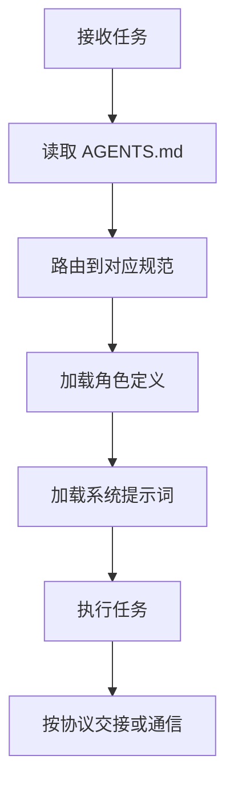

# .agents 目录说明

本目录是项目 AI 智能体规范的容器，存放角色定义、自我演进模块、系统提示词、工具规范、协作协议、工作流、模板与自动化脚本。所有智能体在执行任务前，应先通过项目根目录的 `AGENTS.md` 进行上下文路由，再进入本目录加载对应规范。

## 目录结构

```
.agents/
├── ONBOARDING.md             # Agent Onboarding 入门指南（L0入口）
├── capability-registry.md    # 能力注册中心（L1静态索引）
├── capability-boundaries.md  # 能力边界声明（原子化文件）
├── global-core-rules.md      # 全局核心规则（8条，从AGENTS.md拆分）
├── context-routing.md        # 上下文路由表（任务类型→必读规范映射，从AGENTS.md拆分）
├── roles/                    # 智能体角色定义
├── modules/                  # 自我演进模块定义
├── prompts/                  # 系统提示词与 few-shot 示例
├── tools/                    # 工具调用规范
├── protocols/                # 协作协议
├── workflows/                # 标准工作流
├── templates/                # 任务与交接模板
├── scripts/                  # 验证与自动化脚本
├── skills/                   # Skill 技能门面与完整Skill
├── teams/                    # 团队管理功能模块
├── systems/                  # 系统级架构定义
├── cases/                    # 项目复用案例
├── commands/                 # 标准化指令集
└── worlds/                   # 团队协作执行与环境管理
```

## 根级原子文件

| 文件 | 职责 | 来源 |
|---|---|---|
| [ONBOARDING.md](ONBOARDING.md) | Agent Onboarding 入门指南（L0发现层）：快速开始、能力速查表、任务类型路由 | Skill发现协议P0实施 |
| [capability-registry.md](capability-registry.md) | 能力注册中心（L1静态索引层）：scripts/skills/commands/workflows全量索引 | Skill发现协议P0实施 |
| [capability-boundaries.md](capability-boundaries.md) | 各角色能力边界与职责限制 | AGENTS.md 原子化拆分 |
| [global-core-rules.md](global-core-rules.md) | 全局核心规则（8条）：启动协议优先、沟通语言、按需读取、上下文节省、Mermaid优先、代码风格、Spec目录规范、临时依赖禁止等 | AGENTS.md 原子化拆分 |
| [context-routing.md](context-routing.md) | 上下文路由表：vendor方法论资产预检表 + 常规任务路由映射表 | AGENTS.md 原子化拆分 |
| [VENDOR-INTEGRATION.md](VENDOR-INTEGRATION.md) | 跨项目子模块协同规范：边界划分、交互接口、版本控制、更新同步、测试隔离、模式萃取、三层路由合规 | vendor子模块协同、跨边界调用 |

## 各子目录职责说明

| 目录 | 职责 | 内容 |
|---|---|---|
| roles/ | 智能体角色定义与协作场景 | 5 个核心角色的 TOML frontmatter + Markdown 定义，及角色协作场景 |
| modules/ | 自我演进模块定义 | 8 个自我演进子智能体（感知/认知/执行/治理四层闭环） |
| prompts/ | 系统提示词与 few-shot | 按角色分子目录，每个含 system-prompt.md 与 few-shot.md |
| tools/ | 工具调用规范 | 文件操作、代码执行、搜索、通信四类工具规范 |
| protocols/ | 协作协议 | 任务交接、消息传递、冲突解决、临时依赖管理、应用开发生命周期 |
| workflows/ | 标准工作流 | 功能开发、代码审查、测试流程（含 Mermaid 流程图） |
| templates/ | 模板资产 | 任务模板、交接模板、主题任务模板 |
| scripts/ | 自动化脚本 | check-gitignore.py 等验证脚本与共享工具库 |
| skills/ | Skill 技能门面与完整Skill | 命令集Skill门面（5个）+ 完整Skill（如forum-posting）+ SKILL-TEMPLATE模板 |
| teams/ | 团队管理功能模块 | 团队管理员角色、团队生命周期、权限系统、验证机制、角色自动创建 |
| systems/ | 系统级架构定义 | 提示词萃取系统等架构文档 |
| cases/ | 项目复用案例 | agentforge-adoption.md 等案例文档 |
| commands/ | 标准化指令集 | 复盘、洞察、导出报告、原子化、原子提交 |
| worlds/ | 团队协作执行与环境管理 | 多用户权限管理、协作编辑、变更追踪、版本控制、多环境配置与切换、环境变量管理、资源隔离、环境状态监控 |

## 使用流程示例



> 说明：上述流程为通用路由示例。当任务涉及团队协作执行与环境管理（如多用户权限管理、协作编辑、变更追踪、版本控制、多环境配置与切换、环境变量管理、资源隔离、环境状态监控等场景）时，应在路由阶段进入 `worlds/` 加载对应规范，再按上述流程执行。

## 与 AGENTS.md 的关系

- `AGENTS.md` 是精简入口文件（约70行），定义启动协议、核心规范入口导航表、开发规范概要与知识库索引，是智能体启动时首先读取的最高优先级契约。
- `.agents/global-core-rules.md` 承载从 AGENTS.md 拆分出的8条全局核心规则。
- `.agents/context-routing.md` 承载从 AGENTS.md 拆分出的完整上下文路由表（vendor方法论资产+常规任务路由）。
- `.agents/` 是详细规范容器，承载各角色、提示词、工具、协议、工作流、模板与脚本的具体内容。
- 两者关系为"入口 ↔ 容器"：`AGENTS.md` 负责路由与全局约束，`.agents/` 负责具体规范与可执行细节。智能体应先读 `AGENTS.md`，再按需进入 `.agents/` 加载相关规范。
