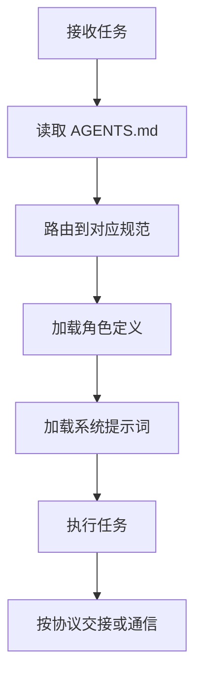

# .agents 目录说明

本目录是项目 AI 智能体规范的容器，存放角色定义、自我演进模块、系统提示词、工具规范、协作协议、工作流、模板与自动化脚本。所有智能体在执行任务前，应先通过项目根目录的 `AGENTS.md` 进行上下文路由，再进入本目录加载对应规范。

## 目录结构

```
.agents/
├── roles/           # 智能体角色定义
├── modules/         # 自我演进模块定义
├── prompts/         # 系统提示词与 few-shot 示例
├── tools/           # 工具调用规范
├── protocols/       # 协作协议
├── workflows/       # 标准工作流
├── templates/       # 任务与交接模板
└── scripts/         # 验证与自动化脚本
```

## 各子目录职责说明

| 目录 | 职责 | 内容 |
|---|---|---|
| roles/ | 智能体角色定义 | 5 个核心角色的 TOML frontmatter + Markdown 定义 |
| modules/ | 自我演进模块定义 | 8 个自我演进子智能体（感知/认知/执行/治理四层闭环） |
| prompts/ | 系统提示词与 few-shot | 按角色分子目录，每个含 system-prompt.md 与 few-shot.md |
| tools/ | 工具调用规范 | 文件操作、代码执行、搜索、通信四类工具规范 |
| protocols/ | 协作协议 | 任务交接、消息传递、冲突解决、临时依赖管理 |
| workflows/ | 标准工作流 | 功能开发、代码审查、测试流程（含 Mermaid 流程图） |
| templates/ | 模板资产 | 任务模板、交接模板 |
| scripts/ | 自动化脚本 | check-gitignore.py 等验证脚本 |

## 使用流程示例



## 与 AGENTS.md 的关系

- `AGENTS.md` 是入口文件，定义全局核心规则、角色索引、协作协议概要与上下文路由表，是智能体启动时首先读取的最高优先级契约。
- `.agents/` 是详细规范容器，承载各角色、提示词、工具、协议、工作流、模板与脚本的具体内容。
- 两者关系为"入口 ↔ 容器"：`AGENTS.md` 负责路由与全局约束，`.agents/` 负责具体规范与可执行细节。智能体应先读 `AGENTS.md`，再按需进入 `.agents/` 加载相关规范。
