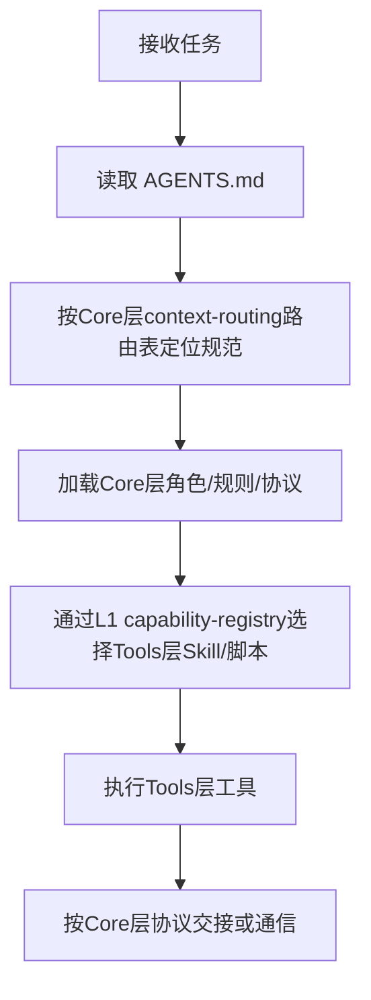

# .agents 目录说明

本目录是项目 AI 智能体规范的容器，存放角色定义、自我演进模块、系统提示词、工具规范、协作协议、工作流、模板与自动化脚本。所有智能体在执行任务前，应先通过项目根目录的 `AGENTS.md` 进行上下文路由，再进入本目录加载对应规范。

## 目录结构

```
.agents/
├── ONBOARDING.md             # [Core] Agent Onboarding 入门指南（L0入口）
├── capability-registry.md    # [Core] 能力注册中心（L1静态索引）
├── capability-boundaries.md  # [Core] 能力边界声明（原子化文件）
├── governance-layers.md      # [Core] 规范分层治理（原子化文件）
├── subdirectory-responsibilities.md # [Core] 子目录职责说明（原子化文件）
├── global-core-rules.md      # [Core] 全局核心规则（启动协议/内容分流/三阶段递进/元文档优先/修复闭环等，持续演进）
├── context-routing.md        # [Core] 上下文路由表（vendor预检+常规任务路由）
├── VENDOR-INTEGRATION.md     # [Core] 跨项目子模块协同规范
├── brand/                    # [Core] 品牌资源（Logo/SVG/HTML）
├── capabilities/             # [Core] 渐进式披露三层架构规范与模板
├── roles/                    # [Core] 智能体角色定义
├── modules/                  # [Core] 自我演进模块定义（8模块/四层闭环）
├── prompts/                  # [Core] 系统提示词与 few-shot 示例
├── tools/                    # [Core] 工具调用规范（如何使用工具）
├── protocols/                # [Core] 协作协议（含PDR前置阅读、三层路由、阶段守卫等）
├── rules/                    # [Core] 规则体系（阶段守卫/硬编码/数据安全/AI编码/元文档优先等133+规则文件）
├── workflows/                # [Core] 标准工作流
├── templates/                # [Core] 任务与交接模板
├── teams/                    # [Core] 团队管理功能模块（含4个专项团队）
├── systems/                  # [Core] 系统级架构定义
├── cases/                    # [Core] 项目复用案例
├── commands/                 # [Core] 标准化指令集（13个：复盘/洞察/第一性原理/萃取/原子化/原子提交/Mermaid/对抗审查/导出报告/方法论编排等）
├── worlds/                   # [Core] 团队协作执行与环境管理
├── checklists/               # [Core] 标准化检查清单（风险评分等）
├── scripts/                  # [Tools] 验证与自动化脚本（341+Python脚本，含tests/lib/mdi/sg_dashboard/forum_bot）
├── skills/                   # [Tools] Skill 技能门面（19个：ci-check/docgen/insight/mermaid/forum-posting/link-check/atomization/atomic-commit/seven-concepts等）
└── config/                   # [Tools] 工具配置文件（discourse等）
```

> 标记说明：`[Core]` = 核心规范层（稳定规则/协议/定义），`[Tools]` = 执行工具层（脚本/实现/配置）。详见「规范分层治理」章节。

## 根级原子文件

| 文件 | 层级 | 职责 | 来源 |
|---|---|---|---|
| [ONBOARDING.md](ONBOARDING.md) | L0 | Agent Onboarding 入门指南：快速开始、能力速查表、任务类型路由 | Skill发现协议P0实施 |
| [capability-registry.md](capability-registry.md) | L1 | 能力注册中心：scripts/skills/commands/workflows/protocols/rules/knowledge全量索引 | Skill发现协议P0实施 |
| [capability-boundaries.md](capability-boundaries.md) | L2 | 各角色能力边界与职责限制（Non-Goals） | AGENTS.md 原子化拆分 |
| [subdirectory-responsibilities.md](subdirectory-responsibilities.md) | L2 | `.agents/` 各子目录职责详细说明 | README.md 原子化拆分 |
| [global-core-rules.md](global-core-rules.md) | L2 | 全局核心规则（启动协议优先、内容敏感度分流、三阶段递进、元文档优先、修复即闭环等，持续演进） | AGENTS.md 原子化拆分 |
| [context-routing.md](context-routing.md) | L2 | 上下文路由表：vendor方法论资产预检表 + 常规任务路由映射表 | AGENTS.md 原子化拆分 |
| [VENDOR-INTEGRATION.md](VENDOR-INTEGRATION.md) | L2 | 跨项目子模块协同规范：边界划分、交互接口、版本控制、三层路由合规 | vendor子模块协同 |

## 各子目录职责说明

完整职责表见 [subdirectory-responsibilities.md](subdirectory-responsibilities.md)。

## 规范分层治理（Core vs Tools）

本目录采用 **Core（核心规范）/ Tools（执行工具）** 双层治理模型；完整分层原则、跨层引用规则、边界判定清单与 docs 目录关系见 [governance-layers.md](governance-layers.md)。

---

## 使用流程示例


```mermaid
flowchart TD
    A["接收任务"] --> B["读取 AGENTS.md"]
    B --> C["按Core层context-routing路由表定位规范"]
    C --> D["加载Core层角色/规则/协议"]
    D --> E["通过L1 capability-registry选择Tools层Skill/脚本"]
    E --> F["执行Tools层工具"]
    F --> G["按Core层协议交接或通信"]
```

> 说明：上述流程为通用路由示例。当任务涉及团队协作执行与环境管理（如多用户权限管理、协作编辑、变更追踪、版本控制、多环境配置与切换、环境变量管理、资源隔离、环境状态监控等场景）时，应在路由阶段进入 `worlds/` 加载对应Core层规范，再按上述流程执行。

## 与 AGENTS.md 的关系

- `AGENTS.md` 是精简入口文件（约100行），定义启动协议（4步骤+自检清单，含内容敏感度预检步骤2.3）、22项核心规范入口导航表、开发规范概要与知识库索引，是智能体启动时首先读取的最高优先级契约。
- `.agents/global-core-rules.md` 承载全局核心规则（启动协议优先、内容敏感度分流、沟通语言、按需读取、上下文节省、Mermaid优先、代码修改、歧义澄清、Spec目录规范、禁止临时依赖、三阶段递进、元文档优先、修复即闭环、查阅知识库、简单任务验证等，持续演进），从 AGENTS.md 拆分后持续演进。
- `.agents/context-routing.md` 承载从 AGENTS.md 拆分出的完整上下文路由表（vendor方法论资产预检+常规任务路由，90+路由项）。
- `.agents/` 是详细规范容器，承载各角色、提示词、工具规范、协议、工作流、模板与脚本的具体内容（341+脚本、133+规则文件、526+可复用模式）。
- 两者关系为"入口 ↔ 容器"：`AGENTS.md` 负责路由与全局约束，`.agents/` 负责具体规范与可执行细节。智能体应先读 `AGENTS.md`，再按需进入 `.agents/` 加载相关规范。
- 信息架构遵循 L0/L1/L2 渐进式披露：AGENTS.md+ONBOARDING.md(L0) → capability-registry.md+context-routing.md+skills/(L1) → 详细规范文档(L2)。

## Changelog

<!-- changelog -->
- 2026-09-03 | refactor | 原子化拆分 README 详细章节：新增 subdirectory-responsibilities.md 承载完整职责表，新增 governance-layers.md 承载 Core/Tools 规范分层治理，README 仅保留索引链接与摘要，减少启动读取 token。来源：seven-concepts-cmd README原子化
- 2026-07-24 | docs | 核心资源一致性更新：目录树新增brand/目录；更新统计数据（341+脚本、133+规则文件、19个Skill、13个指令集、526+可复用模式）；子目录职责表同步更新commands/skills/scripts计数；「与AGENTS.md的关系」更新模式数量。来源：方法论编排 update-core-resources spec
- 2026-07-12 | refactor | 第一性原理全面复盘更新：目录结构新增checklists/、capability-registry/；更新统计数据（320+脚本、133+规则文件、16个Skill、10个指令集、438+可复用模式）；子目录职责表补充PDR前置阅读、阶段守卫运行时、MDI解析器、论坛自动化、对抗性评审等新增内容；「与AGENTS.md的关系」补充L0/L1/L2渐进式披露说明；明确core-rules持续演进不固定条数。来源：第一性原理+全项目复盘
- 2026-07-11 | feat | 同步内容敏感度预检规则：更新"与AGENTS.md的关系"章节中全局核心规则描述（不再标注固定数量"8条"，改为列举关键规则+持续演进说明）。来源：联想AI妙记私域网页分析复盘
- 2026-07-01 | feat | 新增规范分层治理（Core vs Tools）章节：明确Core/Tools双层治理模型、分层原则、跨层引用规则、边界判定清单；更新目录结构图标注[Core]/[Tools]；补充缺失目录（capabilities/、rules/、config/）；澄清tools/（规范层）与scripts/（实现层）的边界；添加TOML frontmatter；补充三层正交关系说明（受众分层×信息粒度×职责分层）
