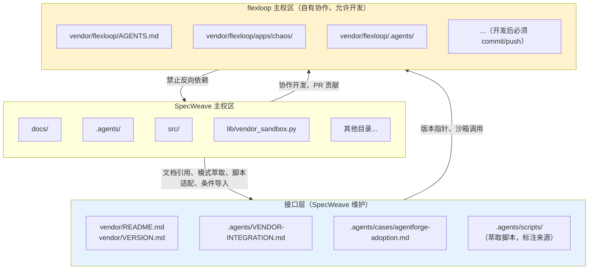
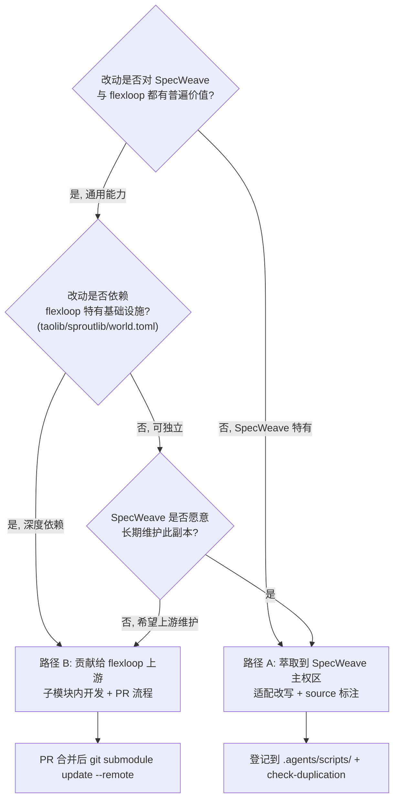
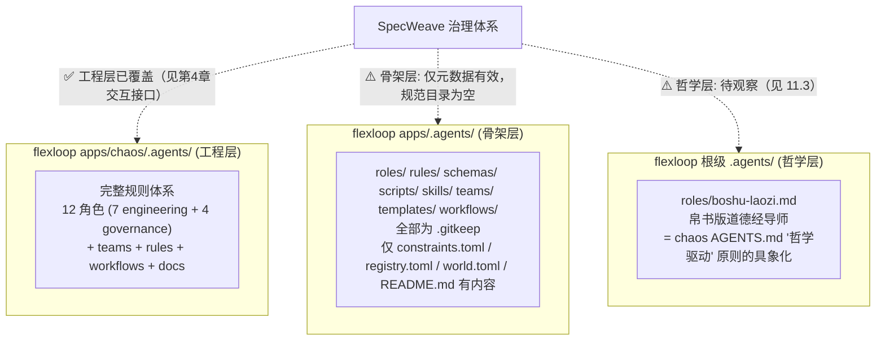

# flexloop (AgentForge) 子模块协同规范

本文档是跨项目子模块协同规范的权威版本，定义SpecWeave与vendor子模块的边界划分、交互接口、版本管理。

本文档定义 SpecWeave 与通过 git submodule 引入的 flexloop (AgentForge) 项目之间的边界划分、交互接口、版本管理与操作规范。

## 第1章 概述

flexloop（对外品牌名 AgentForge）是一个 AI Agent 协作基础设施项目，提供角色体系、协作协议、自我演进模块、验证脚本等完整的智能体协作框架实现。

flexloop 是 SpecWeave 团队**自有协作子模块**，SpecWeave 团队对 flexloop 拥有完全修改权限，可在子模块内直接开发并向上游贡献。

采用 git submodule 方式引入的原因：
- **保持项目独立性**：flexloop 是一个完整的独立 Git 仓库，有自己的版本历史、issue 跟踪和发布节奏
- **支持双向开发迭代**：允许在子模块内开发，修改可直接 push 到 flexloop 远程仓库，实现双向协作
- **版本可追溯**：通过 gitlink 精确锁定到具体 commit，确保构建可重现
- **避免源码合并**：不将源码直接合入主仓库，保持主仓库整洁

两个项目的关系：
- SpecWeave 是元规范框架，定义角色、协议、工作流、验证体系等抽象规范
- flexloop/AgentForge 是 SpecWeave 规范体系的落地参考实现，同时也是超集扩展（包含更多工程化能力）
- 两者是"规范-实现"关系，SpecWeave 提供抽象定义，flexloop 提供可运行的工程化参考

依赖方向：严格单向 SpecWeave → flexloop。SpecWeave 可以引用、参考、萃取 flexloop 的内容，SpecWeave 团队对 flexloop 拥有完全修改权限，但 flexloop 对 SpecWeave 无任何依赖。

## 第2章 快速入门

克隆仓库后初始化子模块：

```bash
git submodule update --init vendor/flexloop
```

检查子模块当前状态：

```bash
git submodule status vendor/flexloop
```

基本目录结构：

```
SpecWeave/
├── vendor/
│   ├── README.md              # SpecWeave 维护的 vendor 元数据总览
│   ├── VERSION.md             # SpecWeave 维护的版本清单（含锁定 commit）
│   └── flexloop/              # git submodule（flexloop 主权区，自有协作，允许开发）
│       ├── .git/              # submodule 独立 Git 仓库
│       ├── AGENTS.md          # flexloop 自身的智能体入口
│       ├── apps/chaos/        # flexloop 主应用目录（含 uv 环境和测试）
│       └── ...
└── .agents/
    ├── VENDOR-INTEGRATION.md  # 本文档（协同规范）
    ├── cases/
    │   └── agentforge-adoption.md  # AgentForge 案例引用
    └── scripts/               # 从 flexloop 萃取的脚本（标注来源）
```

## 第3章 边界划分原则

项目空间划分为三个区域，各区域有明确的主权和操作规则：

**SpecWeave 主权区**：除 `vendor/` 外的所有目录。SpecWeave 完全控制，可以自由创建、修改、删除文件。

**flexloop 主权区**：`vendor/flexloop/` 下所有内容（.git 追踪的 submodule 内容）。**允许子模块内开发，所有修改必须 commit 并 push 到 flexloop 远程仓库，禁止未提交的工作树修改长期存留**。定制需求可在子模块内开发后通过 PR 合并，或通过模式萃取到 SpecWeave 主权区。

**接口层**：位于 SpecWeave 主权区内，用于管理与 flexloop 的交互，包含：
- `vendor/README.md` 和 `vendor/VERSION.md`：SpecWeave 维护，记录元数据和版本锁定信息
- `.agents/VENDOR-INTEGRATION.md`：本文档，协同操作规范
- `.agents/cases/agentforge-adoption.md`：案例文档，对照说明复用模式
- `.agents/scripts/` 中从 flexloop 萃取并适配的脚本（在文件中标注来源）
- `lib/vendor_sandbox.py`：沙箱运行和条件导入工具（SpecWeave 维护）



## 第3.5章 协作四原则

与第三方只读子模块"不侵入、不直引、不跟版、不裸考"的四不原则不同，自有协作子模块遵循以下协作四原则：

| 原则 | 含义 | 第三方只读模式 | 自有协作模式 |
|------|------|----------------|--------------|
| **可编辑** | 允许在子模块内开发，修改必须 commit/push 到 flexloop 仓库 | ❌ 禁止任何本地修改 | ✅ 允许开发，修改必须提交并推送 |
| **条件引** | 通过 try/except ImportError 条件导入，未初始化时优雅降级 | ❌ 禁止任何 import | ✅ 允许条件导入，禁止裸 import 和 sys.path 永久插入 |
| **跟分支** | 跟踪 main 分支，通过 `git submodule update --remote` 按需更新 | 🔒 固定 commit，不跟踪分支 | 🔄 跟踪 main 分支，按需更新 |
| **沙箱护** | 运行 flexloop 脚本必须使用沙箱工具（vendor_sandbox.py），限制写入范围 | — | ✅ 必须通过沙箱运行，隔离环境 |

核心区别：第三方只读模式下 flexloop 是不可触碰的外部依赖；自有协作模式下 flexloop 是可双向迭代的协作仓库，但仍需通过条件导入和沙箱机制保护 SpecWeave 主体的稳定性。

## 第4章 交互接口规范

与 flexloop 的交互有五种标准方式，每种方式均有明确的正例和反例。

### 4.1 文档引用

✅ **正确做法**：
- 使用相对路径引用 SpecWeave 内部文档：`[AgentForge案例](cases/agentforge-adoption.md)`
- 使用相对路径引用 flexloop 内文档（只读参考）：`[flexloop Python 规则](../vendor/flexloop/apps/chaos/.agents/rules/python.md)`
- 链接文本使用描述性名称，便于读者理解

❌ **错误做法**：
- 使用本地绝对路径：`file:///d:/spaces/SpecWeave/vendor/flexloop/...`（在不同机器/克隆位置会断链）
- 在 flexloop 的 Markdown 文件中添加指向 SpecWeave 的链接（形成反向依赖，破坏单向依赖原则）
- 将 flexloop 文档复制到 SpecWeave 后不标注来源（信息失同步风险）

### 4.2 脚本复用（萃取）与条件导入

与 flexloop 代码交互有两种方式：脚本萃取（推荐用于稳定功能）和条件导入（适用于可选功能）。

**方式一：脚本萃取（推荐）**

✅ **正确做法**：
- 将 flexloop 中有普遍价值的脚本**复制**到 `.agents/scripts/`
- 适配 SpecWeave 代码风格、命名规范、路径处理、导入方式
- 使用 `.agents/scripts/lib/` 共享库，不重复实现已有功能
- 在文件头部注释标注来源：`# Source: vendor/flexloop/apps/chaos/.agents/scripts/xxx.py`
- 在 TOML frontmatter 使用 `source = "vendor/flexloop/apps/chaos/.agents/scripts/xxx.py"`
- 为萃取后的代码编写测试用例，验证在 SpecWeave 环境中正常工作

❌ **错误做法**：
- 直接 import vendor/flexloop/ 内的 Python 模块（应使用条件导入方式，见 4.5）
- 通过 `sys.path.insert` 永久添加 vendor 路径到 Python 模块搜索路径
- 直接调用 vendor/ 内脚本执行（应使用沙箱工具，见 4.6）
- 复制脚本后不做适配，保留 flexloop 特有的路径和导入

**方式二：条件导入**

对于需要直接调用 flexloop 模块且允许子模块未初始化时优雅降级的场景，使用条件导入（详见 4.5 节）。

### 4.3 模式参考

✅ **正确做法**：
- 通过案例文档（如 [agentforge-adoption.md](cases/agentforge-adoption.md)）对照说明模式差异
- 保持两套规则体系各自独立，不要求对方遵循己方规范
- 在 SpecWeave 文档中说明"flexloop 是如何实现的"作为参考

❌ **错误做法**：
- 直接复制 flexloop 的规则文件到 `.agents/rules/` 不做适配
- 要求 flexloop 遵循 SpecWeave 规范（两个项目独立演进）
- 将 flexloop 的特定实现作为 SpecWeave 的强制标准

### 4.4 禁止行为清单

以下行为严格禁止：

- ❌ 在 `vendor/flexloop/` 内创建/修改文件后不 commit 就提交到 SpecWeave 主仓库（允许开发但必须先 push）
- ❌ 裸 import vendor. 模块（无 try/except 保护，必须使用条件导入）
- ❌ 将 `vendor/` 路径加入 sys.path 永久（条件导入临时添加后恢复除外）
- ❌ 在主项目测试中遍历或收集 vendor/ 下的测试用例
- ❌ 将 flexloop 作为 pip 包安装到主项目 .venv 虚拟环境
- ❌ 在 SpecWeave 的 CI 流水线中运行 flexloop 的测试套件

### 4.5 条件导入

通过 `lib/vendor_sandbox.py` 提供的 `conditional_import()` 和 `FLEXLOOP_AVAILABLE` 标志，可以安全地导入 flexloop 模块。当子模块未初始化或不可用时，导入会返回 `None`，调用方需优雅降级。

```python
from lib.vendor_sandbox import conditional_import, FLEXLOOP_AVAILABLE

if FLEXLOOP_AVAILABLE:
    taolib_cli = conditional_import("apps.chaos.src.taolib.cli")
    if taolib_cli is not None:
        # 使用 flexloop 功能
        pass
# FLEXLOOP_AVAILABLE 为 False 时优雅降级
```

✅ **正确做法**：
- 始终先检查 `FLEXLOOP_AVAILABLE` 标志
- 使用 `conditional_import()` 而非直接 import
- 对返回 `None` 的情况做好降级处理
- 导入失败时不影响 SpecWeave 核心功能运行

❌ **错误做法**：
- 裸 `import vendor.flexloop.xxx` 或 `from vendor.flexloop.xxx import yyy`
- 不检查 `FLEXLOOP_AVAILABLE` 就直接调用导入的模块
- 条件导入失败时抛出异常导致程序崩溃
- 永久修改 `sys.path` 指向 vendor 目录

### 4.6 沙箱运行规范

运行 flexloop 脚本必须使用 `lib/vendor_sandbox.py` 提供的沙箱工具，限制写入范围和环境变量，避免污染 SpecWeave 主环境。

```python
from lib.vendor_sandbox import run_flexloop_script
result = run_flexloop_script(".agents/scripts/check_gitignore.py", ["--fix"])
if result.returncode == 0:
    print("成功")
```

✅ **正确做法**：
- 使用 `run_flexloop_script()` 在隔离环境中执行 flexloop 脚本
- 脚本路径相对于 `vendor/flexloop/` 目录
- 检查 `returncode` 判断执行结果
- 沙箱自动限制文件写入范围为 SpecWeave 允许的目录

❌ **错误做法**：
- 直接 `subprocess.run()` 调用 vendor/ 内脚本
- cd 到 vendor/flexloop/ 后直接执行脚本而不使用沙箱
- 允许 flexloop 脚本写入 SpecWeave 主权区任意位置
- 在沙箱外运行 flexloop 脚本修改主项目环境

## 第5章 版本控制策略

**跟踪策略**：默认**跟踪 flexloop 仓库的 main 分支**，通过 `git submodule update --remote` 按需拉取最新版本。不自动更新，所有更新必须经过人工审核和验证。

**版本标识格式**：使用分支名 + commit 短哈希的组合格式，便于人类阅读和精确追溯：
- 格式：`main@d618849a`
- 含义：main 分支，commit 哈希前缀 d618849a
- 可选附加 tag 信息：`main@d618849a (v0.7.1-270-gd618849)`

**当前锁定版本**：
- 分支：`main`
- 完整 commit：`d618849a0742772dd9d4ffb472c3e1f7e7f3ab4e`
- 版本标识：`main@d618849a`
- 记录位置：[vendor/VERSION.md](../vendor/VERSION.md)

**更新频率**：按需更新，不做定期自动更新。触发更新的场景：
- flexloop PR 合并后需要同步到 SpecWeave
- 发现 flexloop 有需要的新特性
- 发现 flexloop 有重要的 Bug 修复
- 需要参考 flexloop 的最新实现模式

**兼容性评估**：更新前必须查看 flexloop 的 `CHANGELOG.md`，检查：
- 是否有破坏性变更（Breaking Changes）
- 目录结构是否发生变化（影响文档引用路径）
- 脚本接口是否变更（影响萃取脚本和条件导入的兼容性）

**回滚机制**：
- 快速回滚：`git submodule update vendor/flexloop` 恢复到 VERSION.md 中记录的 commit
- 指定版本回滚：`cd vendor/flexloop && git checkout <prev-commit>`
- 回滚后必须重新验证关键引用、萃取脚本和条件导入的正确性

## 第6章 子模块更新与开发流程

子模块更新必须严格遵循以下 4 步法，确保过程可控、可追溯、可回滚。

### 6.1 子模块更新流程（同步上游）

#### 步骤1：更新前检查

确认工作树清洁，记录当前版本：

```bash
git status
git submodule status vendor/flexloop
```

如有未提交的变更，先处理完毕再开始更新。

#### 步骤2：执行更新

方式一：进入子模块目录，拉取 main 分支最新代码：

```bash
cd vendor/flexloop
git fetch
git checkout main
git pull origin main
cd ../..
```

方式二（推荐）：使用 submodule 命令直接更新到远程跟踪分支：

```bash
git submodule update --remote vendor/flexloop
```

`--remote` 会拉取上游 main 分支的最新 commit，必须经过兼容性评估和验证后才能提交。

#### 步骤3：更新后验证

完成版本切换后，执行以下验证：

1. 更新 [vendor/VERSION.md](../vendor/VERSION.md) 中的分支名和 commit 哈希
2. 检查文档引用：验证所有指向 vendor/flexloop/ 的相对路径是否仍然有效
3. 检查萃取脚本：确认从 flexloop 萃取的脚本与新版本兼容
4. 检查条件导入：验证通过 conditional_import 导入的模块接口未发生变化
5. 人工抽查：对照 flexloop CHANGELOG，抽查关键功能和目录结构

#### 步骤4：提交更新

将子模块指针变更和版本元数据一并提交：

```bash
git add vendor/flexloop vendor/VERSION.md
git commit -m "chore(vendor): update flexloop to main@<commit-hash>"
```

提交信息应清晰说明更新到的 commit 哈希和更新原因。

### 6.2 子模块开发流程（向 flexloop 贡献代码）

在 vendor/flexloop/ 内开发新功能或修复 Bug，必须遵循以下流程：

1. **进入子模块目录**：
   ```bash
   cd vendor/flexloop
   ```

2. **创建功能分支**：
   ```bash
   git checkout -b feature/your-feature-name
   ```

3. **编辑代码**：在子模块内进行开发，遵循 flexloop 的代码规范。

4. **在 flexloop 环境中测试**：
   ```bash
   cd apps/chaos
   uv sync
   uv run pytest
   cd ../..
   ```

5. **Commit 并 push 到 flexloop 远程仓库**：
   ```bash
   git add .
   git commit -m "feat: describe your changes"
   git push -u origin feature/your-feature-name
   ```

6. **在 gitcode.com 创建 PR**：访问 `gitcode.com:flexloop/flexloop` 创建 Pull Request，等待代码审查和合并。

7. **PR 合并后同步到 SpecWeave**：回到 SpecWeave 根目录，更新子模块指针：
   ```bash
   cd /path/to/SpecWeave
   git submodule update --remote vendor/flexloop
   ```

8. **更新版本记录**：更新 [vendor/VERSION.md](../vendor/VERSION.md) 中的版本记录。

9. **提交 gitlink 更新**：
   ```bash
   git add vendor/flexloop vendor/VERSION.md
   git commit -m "chore(vendor): update flexloop after PR merge"
   ```

**重要**：禁止在 vendor/flexloop/ 内有未 commit 的修改时就提交到 SpecWeave 主仓库。所有子模块内的修改必须先 push 到 flexloop 仓库并合并到 main 分支后，才能更新 SpecWeave 的 gitlink 指针。

## 第7章 测试环境隔离

两个项目的测试环境必须完全隔离，禁止交叉污染。

**Python 环境**：
- SpecWeave 使用根目录 `.venv/` 虚拟环境
- flexloop 使用 `vendor/flexloop/apps/chaos/` 下的 uv 环境
- 初始化 flexloop 环境：`cd vendor/flexloop/apps/chaos && uv sync`

**pytest 配置**：
- SpecWeave 的 pytest 必须排除 vendor/ 目录，在 pytest.ini 或 pyproject.toml 中配置：
  ```ini
  norecursedirs = vendor .temp .venv
  ```
- 确保测试收集器不会遍历 vendor/ 下的测试文件

**独立运行 flexloop 测试**：

```bash
cd vendor/flexloop/apps/chaos
uv run pytest
```

必须在 flexloop 自己的目录和环境中运行其测试，不要在 SpecWeave 根目录调用。

**测试数据隔离**：
- 两个项目的测试数据、fixture、临时文件完全隔离
- SpecWeave 测试不访问 vendor/flexloop/ 下的任何测试数据
- flexloop 测试也不访问 SpecWeave 的文件

## 第8章 模式萃取与同步

### 8.0 贡献 vs 萃取决策树

在 flexloop 与 SpecWeave 之间流转改动时，必须先判定走"萃取到主权区"还是"贡献给上游"，避免灰色地带。



判定要点：

- **通用性 + 依赖性双维度判定**，而非仅看"是否好用"
- **路径 A（萃取）**：适合 SpecWeave 特有需求，或希望自主演进、不依赖 flexloop 基础设施的脚本
- **路径 B（贡献）**：适合依赖 flexloop 基础设施（taolib/sproutlib/world.toml 等）且对 flexloop 也有价值的能力
- **禁止灰色地带**：临时修改必须在合并前二选一收尾，不允许"既不萃取也不贡献"的悬挂状态

从 flexloop 中萃取有价值的模式和脚本到 SpecWeave，需遵循以下 6 步流程：

### 萃取流程

1. **评估通用性**：判断该模式/脚本是否仅适用于 flexloop 特定场景？是否对 SpecWeave 有普遍价值？仅萃取有跨项目复用价值的内容。

2. **阅读理解**：完整阅读原始实现，理解其依赖关系、前置假设、输入输出约定、边界条件处理。

3. **适配改写**：
   - 调整命名规范以符合 SpecWeave 风格
   - 修改路径处理，使用 `.agents/scripts/lib/` 中的共享路径工具
   - 调整导入语句，使用 SpecWeave 的共享库
   - 调整输出格式，遵循 `lib.cli` 的输出规范
   - 移除 flexloop 特有的约束和依赖

4. **来源标注**：
   - 在 Python 脚本头部添加注释：`# Source: vendor/flexloop/apps/chaos/.agents/scripts/xxx.py`
   - 在 TOML frontmatter 中添加：`source = "vendor/flexloop/apps/chaos/.agents/scripts/xxx.py"`
   - 如有重大适配修改，简要说明适配内容

5. **测试验证**：
   - 为萃取后的代码编写适配 SpecWeave 环境的测试用例
   - 运行测试验证在 SpecWeave 环境中正常工作
   - 边界条件测试，确保不依赖 flexloop 特有路径

6. **登记更新**：
   - 更新相关索引文件（如 `.agents/scripts/README.md`）
   - 如适用，更新 [agentforge-adoption.md](cases/agentforge-adoption.md) 案例文档
   - 运行 `python scripts/check-duplication.py` 确认未引入重复代码

### 回流建议

SpecWeave 的创新改进若同样适用于 flexloop：
- **直接在子模块内开发**（遵循 6.2 子模块开发流程）：在 vendor/flexloop/ 内创建功能分支，修改后 commit 并 push，通过 PR 合并到 flexloop main 分支
- 也可以通过向 gitcode.com:flexloop/flexloop 提交 issue 的方式反馈建议
- 提供清晰的问题描述、改进方案和代码示例
- **禁止**在 vendor/flexloop/ 内修改后不 commit/push 就直接提交到 SpecWeave 仓库

## 第9章 常见问题与故障排查

### Q: `git status` 显示 `modified: vendor/flexloop (modified content)`？

A: 说明 submodule 工作树内有未提交的本地修改。

**如果是正在进行的开发工作**：遵循 6.2 子模块开发流程，在功能分支上继续开发，完成后 commit 并 push 到 flexloop 仓库，通过 PR 合并。

**如果是意外修改或运行脚本生成的临时文件**：
```bash
cd vendor/flexloop
git checkout .
git clean -fd
```

或者如果需要保留本地修改做参考，可以暂存：
```bash
cd vendor/flexloop
git stash
```

**重要**：提交到 SpecWeave 主仓库前必须确认 `git status vendor/flexloop` 不显示 modified content。子模块内的修改必须先 push 到 flexloop 仓库并合并到 main 分支后，才能通过 `git submodule update --remote` 更新 gitlink 指针。

### Q: 克隆后 vendor/flexloop 是空目录？

A: Git 克隆默认不会自动初始化和检出 submodule 内容。需要手动初始化：

```bash
git submodule update --init vendor/flexloop
```

首次克隆完整命令（自动初始化所有 submodule）：

```bash
git clone --recurse-submodules <repository-url>
```

### Q: 更新 submodule 后出现冲突？

A: submodule 本身作为一个 gitlink 指针，不会产生传统的文件合并冲突。可能的冲突场景：

- 如果 `vendor/VERSION.md` 有冲突：手动解决冲突，确认 commit 哈希与实际 submodule 指针一致
- 如果 submodule 处于 detached HEAD 状态：
  ```bash
  cd vendor/flexloop
  git checkout <expected-commit>
  ```

冲突解决后运行 `git submodule status` 确认指针正确。

### Q: 想直接运行 flexloop 的某个脚本？

A: **推荐使用沙箱工具运行**（见 4.6 节）：

```python
from lib.vendor_sandbox import run_flexloop_script
result = run_flexloop_script(".agents/scripts/check_gitignore.py", ["--fix"])
```

或者 cd 到 vendor/flexloop 对应目录，使用其自有环境运行：

```bash
cd vendor/flexloop/apps/chaos
uv run python .agents/scripts/check_gitignore.py
```

不要在 SpecWeave 根目录直接调用 vendor/ 内的脚本，避免路径和环境污染。

### Q: CI 中需要 submodule 吗？

A: 如果 CI 任务涉及条件导入或沙箱运行 flexloop 功能，需要初始化 submodule。需在 CI 脚本中添加：

```bash
git submodule update --init
```

条件导入模式下，FLEXLOOP_AVAILABLE 为 False 时功能会优雅降级，因此非关键路径的 CI 检查也可以不初始化 submodule。

## 第10章 快速检查清单

执行任何与 vendor/flexloop 相关的操作前，快速过一遍以下检查项：

- [ ] 我在 vendor/flexloop/ 内的修改是否已 commit 并 push？（禁止未提交的修改长期存留）
- [ ] 我是否使用了条件导入（try/except）？禁止裸 import
- [ ] 我是否将 vendor/ 路径加入了 sys.path 永久？（不应如此，条件导入临时添加除外）
- [ ] 更新 submodule 后，我是否同步更新了 vendor/VERSION.md 中的分支名和 commit 记录？
- [ ] `git status vendor/flexloop` 是否显示 clean（无 modified content）？
- [ ] 所有 Markdown 文档引用是否使用相对路径（无 file:/// 绝对路径）？
- [ ] 萃取的脚本是否标注了 source 来源？
- [ ] 我是否在 SpecWeave 环境而非 flexloop 环境中运行了 flexloop 测试？（不应如此）
- [ ] 运行 flexloop 脚本是否使用了 vendor_sandbox.py 沙箱工具？

全部确认无误后再进行提交。

## 第11章 flexloop .agents 体系定位

flexloop 的 `.agents` 体系实际分三层，SpecWeave 治理文件此前仅覆盖工程层。本章明确三层结构与 SpecWeave 的关系，并声明根级 `.agents` 的处置策略。

### 11.1 三层结构



### 11.2 各层处置策略

| 层级 | 路径 | 处置策略 | SpecWeave 引用方式 |
|------|------|----------|---------------------|
| 工程层 | `vendor/flexloop/apps/chaos/.agents/` | 已纳入既有治理（第4章接口、第8章萃取） | 相对路径引用 + 条件导入 + 沙箱运行 |
| 骨架层 | `vendor/flexloop/apps/.agents/` | 仅元数据文件（constraints/registry/world.toml）有效，规范子目录为空骨架 | 不直接引用；如需元数据通过沙箱读取 |
| 哲学层 | `vendor/flexloop/.agents/` | 待观察模式（见 11.3） | 暂不引用、暂不萃取 |

### 11.3 哲学层处置：待观察模式

flexloop 根级 `.agents/roles/boshu-laozi.md`（帛书版道德经导师）是 flexloop "哲学驱动"原则（chaos AGENTS.md 第1节"以'反者道之动，弱者道之用'为重要设计依据"）的具象化角色，属于"知识/哲学角色"，非工程角色。

SpecWeave 当前角色体系（orchestrator/architect/developer/reviewer/tester/co-founder/team-admin）全部为工程角色，未引入"知识角色"概念。处置策略如下：

- **当前状态**：标记为"待观察模式"，SpecWeave 暂不引用、暂不萃取
- **登记位置**：在 [cases/agentforge-adoption.md](cases/agentforge-adoption.md) 案例文档中记录该模式作为 flexloop 的特色实践
- **触发萃取条件**：当 SpecWeave 出现领域知识角色需求（如特定专业领域的 AI 研习导师）时，再评估是否萃取"知识角色"类到 `.agents/roles/`，并定义对应 frontmatter schema
- **禁止行为**：在触发萃取条件前，不得在 SpecWeave 主权区创建知识角色文件，不得要求 flexloop 移除或改造 boshu-laozi

## 相关模式

- [双模式子模块治理](../docs/retrospective/patterns/methodology-patterns/governance-strategy/dual-mode-submodule-governance.md)
- [Vendor生命周期治理](../docs/retrospective/patterns/methodology-patterns/governance-strategy/vendor-lifecycle-governance.md)
- [子模块元数据外部化](../docs/retrospective/patterns/architecture-patterns/submodule-metadata-externalization.md)
