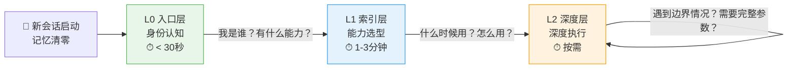

# 渐进式披露三层架构规范

> **本规范来源**：[insight-a-progressive-disclosure-architecture.md](../../docs/retrospective/reports/insight-extraction/retrospective-architecture-priority-20260629/insights/insight-a-progressive-disclosure-architecture.md)
>
> **核心原则**：任何成熟的规范/能力体系都应该有三层入口，解决"文档成熟度"与"可发现性"的根本矛盾。

---

## 一、为什么需要三层架构

**问题**：AI Agent 在新会话中记忆清零。全量预读所有文档成本太高（浪费上下文窗口），完全不读又会基于"想象中的项目"工作。

**根因**：把"信息完整性"等同于"一次性加载全部信息"——这是人类线性阅读的思维惯性，不是 Agent 信息架构的最优解。

**解决方案**：渐进式披露（Progressive Disclosure）——按需加载，逐层深入。

---

## 二、三层架构定义

```
┌─────────────────────────────────────────────────────────┐
│  L0 入口层（ONBOARDING.md）                               │
│  ─────────────────────────────────────────────────────  │
│  • 行数限制：< 100 行                                     │
│  • 目标读者：新会话首次接入的 Agent                         │
│  • 核心内容：身份声明 + 能力速查表 + 路由决策树              │
│  • 阅读时间：< 30秒                                       │
│  • 回答的问题："我是谁？这里有什么？我该去哪？"              │
├─────────────────────────────────────────────────────────┤
│  L1 索引层（SKILL.md / REGISTRY.md）                      │
│  ─────────────────────────────────────────────────────  │
│  • 行数限制：< 500 行/能力                                │
│  • 目标读者：已确定任务类型、准备执行的 Agent                │
│  • 核心内容：触发词 + 决策树 + 核心步骤 + 安全清单          │
│  • 阅读时间：1-3 分钟                                     │
│  • 回答的问题："什么时候用？怎么用？要注意什么？"            │
├─────────────────────────────────────────────────────────┤
│  L2 深度层（完整规范文档）                                 │
│  ─────────────────────────────────────────────────────  │
│  • 行数限制：不限                                         │
│  • 目标读者：需要深入理解边界情况、底层机制的 Agent          │
│  • 核心内容：完整参考手册、原理阐述、边缘情况、完整参数表    │
│  • 阅读时间：按需                                         │
│  • 回答的问题："为什么这样设计？完整参数是什么？异常怎么处理？"│
└─────────────────────────────────────────────────────────┘
```

---

## 三、Agent 认知旅程

三层架构对应**新会话Agent从记忆清零到深度执行**的三个认知阶段，逐层降低认知负担：



| 认知阶段 | 对应层 | Agent 状态 | 加载策略 |
|---------|--------|-----------|---------|
| **身份确立** | L0 | "我刚接入，完全不知道这是什么项目" | 必须加载（<100行，<30秒） |
| **能力选型** | L1 | "我知道这是什么系统了，现在选工具执行任务" | 按需加载对应的SKILL.md（<500行） |
| **深度执行** | L2 | "基本操作已掌握，遇到需要深入了解的细节" | 仅在需要时加载具体L2文档章节 |

> **为什么不一次性加载所有L2文档？** AI Agent的上下文窗口是有限资源。全量加载所有规范可能消耗数千token——这些token本应用于处理用户的实际任务。渐进式披露确保Agent在正确的时间加载正确粒度的信息。

---

## 四、各层内容边界

### L0 入口层（ONBOARDING.md）— 必须包含

| 要素 | 说明 | 行数预算 |
|------|------|---------|
| 身份声明 | 一句话说明"这是什么系统/模块" | 1-2行 |
| 快速开始 | 3步以内的启动流程 | 5-8行 |
| 能力速查表 | 按任务类型的能力→路径映射表（10-25条） | 20-40行 |
| 必知 vs 按需 | 文档优先级分类表 | 8-12行 |
| 路由决策树 | Mermaid流程图或文本决策树 | 15-25行 |
| 启动确认格式 | 新会话Agent的上下文确认模板 | 5-8行 |

**禁止包含**：详细步骤、完整参数表、原理论述、异常处理——这些属于L1/L2。

### L1 索引层（SKILL.md / REGISTRY.md）— 必须包含

| 要素 | 说明 | SKILL | REGISTRY |
|------|------|-------|----------|
| 元数据frontmatter | name/version/description/触发词 | ✅ | ✅ |
| 功能描述 | 一句话核心功能 + 方案对比表 | ✅ | ✅（分类描述） |
| 触发条件 | 关键词、场景、何时使用 | ✅ | ✅（全局分类索引） |
| 决策树 | 方案选择逻辑 | ✅ | ❌（全局路由在L0） |
| 核心步骤 | 常用操作的最小步骤集 | ✅ | ❌ |
| 安全清单 | 写操作前的逐项确认 | ✅ | ✅（安全等级标注） |
| 索引表 | 能力条目清单（名称/用途/触发词/路径） | ❌ | ✅ |

**禁止包含**：完整API文档、所有边缘情况处理、架构设计原理——引用L2文档。

### L2 深度层（参考文档）— 包含

- 完整的API参数表和返回值说明
- 架构设计决策记录（ADR）和原理论述
- 所有边缘情况和错误码的完整处理
- 实现细节和内部机制
- 完整的示例代码和测试用例
- 变更历史和迁移指南

**没有行数限制**，但应保持良好的组织结构和内部导航。

---

## 五、跨层引用规则

1. **L0 只引用 L1**：ONBOARDING.md 中的链接指向 SKILL.md / REGISTRY.md / 核心文档索引，不直接链接到深度文档
2. **L1 引用 L0 和 L2**：SKILL.md 开头引用 ONBOARDING.md（"返回入口"），核心步骤内联，细节引用L2
3. **L2 可引用 L1**：深度文档中可链接回SKILL.md作为"快速开始"入口
4. **禁止跨层跳跃**：L0不直接链接到L2的具体小节（除非是特别高频的参考）

---

## 六、质量检查清单

### L0 ONBOARDING 合规检查

- [ ] 总行数 < 100行（含frontmatter）
- [ ] 能力速查表覆盖 80% 以上常见任务
- [ ] 路由决策树覆盖所有主要任务类型
- [ ] 所有链接指向 L1 层或核心索引
- [ ] 阅读时间 < 30秒（Agent可在1-2轮工具调用内建立认知）
- [ ] 有明确的"新会话启动确认格式"

### L1 SKILL 合规检查

- [ ] 总行数 < 500行（含frontmatter）
- [ ] frontmatter包含完整触发词（含同义词、口语化表达）
- [ ] 有关键规则的 Why 解释（`> **为什么？**`引用块）
- [ ] 多方案时有清晰的决策树
- [ ] 写操作有dry-run/幂等/验证/确认的安全检查
- [ ] 常用步骤内联，复杂内容引用L2
- [ ] 符合[五要素模型](../rules/skill-five-elements-mindmap.md)（Trigger-Ready Description、Decision Tree、Progressive Disclosure、Why-Explanation、Safety Checklist）

### L1 REGISTRY 合规检查

- [ ] 每个能力条目包含：名称、用途、触发关键词、安全等级、路径
- [ ] 按功能分类组织（检查/生成/分析/自动化/CI等）
- [ ] 标注脚本/Skill/命令/工作流类型
- [ ] 安全等级明确（只读/读+修复/写/读+写）
- [ ] 标注是否支持dry-run

### L2 深度文档合规检查

- [ ] 有良好的内部目录结构和小节标题
- [ ] L1中引用的深度内容在L2中有明确锚点
- [ ] 不重复L1中已有的核心步骤（通过引用避免重复）
- [ ] 包含变更记录和版本历史

---

## 七、反模式

| 反模式 | 表现 | 问题 |
|--------|------|------|
| **入口过重** | ONBOARDING.md >100行，包含详细步骤 | Agent浪费上下文窗口在不需要的信息上 |
| **分层断裂** | SKILL.md直接复制L2完整内容 | L1膨胀为"另一个深度文档"，失去索引价值 |
| **路由缺失** | L0没有决策树，只罗列文件列表 | Agent仍需盲目遍历目录 |
| **信息孤岛** | 各层之间无相互链接 | 无法按需深入，也无法回到入口 |
| **重复定义** | 同一内容在L0/L1/L2中重复出现 | 修改时容易不一致 |

---

## 八、与现有模式和体系的关系

### 与互补模式的关系

| 模式 | 关系 | 区别 |
|------|------|------|
| **上下文渐进式披露**（[progressive-context-disclosure.md](../../docs/retrospective/patterns/methodology-patterns/ai-collaboration/progressive-context-disclosure.md)） | **微观互补**：本模式是L1层内部的文档组织策略 | 本规范定义L0-L1-L2三层宏观架构；progressive-context-disclosure定义单个L1 Skill内部如何组织参考文档（入口索引+按需加载），解决的是token效率问题 |
| **Skill五要素模型**（[skill-five-elements-model.md](../../docs/retrospective/patterns/methodology-patterns/ai-collaboration/skill-five-elements-model.md)） | **L1结构规范**：定义L1层SKILL.md的五要素结构 | 五要素模型回答"L1文档该写什么"，本规范回答"L0/L1/L2如何分层和互引" |
| **Skill发现协议SOP**（[skill-discovery-protocol.md](../../docs/retrospective/patterns/methodology-patterns/ai-collaboration/skill-discovery-protocol.md)） | **运行时实现**：本规范的三层架构是发现协议的静态信息基础 | 本规范是文档组织架构；发现协议SOP是Agent运行时如何利用三层架构进行能力发现的流程 |

### 与现有协议的关系

- **PDR协议**（[pre-document-reading.md](../protocols/pre-document-reading.md)）：前置文档读取协议，定义"何时必须读哪些文档"，与本规范互补——本规范定义"文档如何分层组织"，PDR定义"何时读哪层"
- **阶段守卫**（[stage-guardrails.md](../rules/stage-guardrails.md)）：L2层规范，定义开发阶段边界和拦截机制，不重构

### 嵌套关系示意

```
渐进式披露三层架构（本规范）
├─ L0 ONBOARDING.md（<100行，身份+路由）
├─ L1 SKILL.md / REGISTRY.md（<500行/能力，选型+步骤）
│   └─ 【L1内部使用】上下文渐进式披露
│       ├─ SKILL.md入口索引（加载策略声明）
│       └─ references/*.md 按需选读（按工作流阶段加载）
└─ L2 深度规范文档（不限行数，完整参考）
```

---

## 九、正例

以下是SpecWeave项目中已落地的三层架构实例：

### 实例1：全局能力发现体系

| 层 | 文件 | 行数 | 说明 |
|----|------|------|------|
| L0 | [ONBOARDING.md](../ONBOARDING.md) | 86行 | 全局入口：身份声明+启动协议+能力速查表+路由决策树 |
| L1 | [capability-registry.md](../capability-registry.md) | 231行 | 全局能力注册表：命令集、Skill、脚本、知识参考索引 |
| L2 | commands/、rules/、protocols/等 | 不限 | 各命令集完整规范、规则定义、协议详细文档 |

### 实例2：5个命令集Skill（L1层）

| Skill | 行数 | 合规性 |
|-------|------|--------|
| [atomic-commit-cmd](../skills/atomic-commit-cmd/SKILL.md) | 127行 | ✅ <500行，含决策树+安全清单+Why解释 |
| [atomization-cmd](../skills/atomization-cmd/SKILL.md) | 131行 | ✅ <500行，含决策树+安全清单+Why解释 |
| [retrospective-cmd](../skills/retrospective-cmd/SKILL.md) | 117行 | ✅ <500行，含决策树+安全清单+Why解释 |
| [insight-cmd](../skills/insight-cmd/SKILL.md) | 124行 | ✅ <500行，含决策树+安全清单+Why解释 |
| [export-report-cmd](../skills/export-report-cmd/SKILL.md) | 122行 | ✅ <500行，含决策树+安全清单+Why解释 |

每个L1 Skill都通过 `../../commands/` 引用对应的L2深度文档（如 `../../commands/atomic-commit.md`），遵循L1→L2引用规则。

---

## 十、版本历史

- **v1.1.0** (2026-06-30): 补充Agent认知旅程视角（三层对应记忆清零→深度执行的认知阶段）；明确与progressive-context-disclosure、Skill五要素模型、Skill发现协议SOP的互补关系；新增正例章节（全局体系+5个命令集Skill实例）；成熟度从L1升级至L2（已有3次以上落地验证）；修复章节编号。
- **v1.0.0** (2026-06-30): 初始版本。基于架构优先级复盘洞察A（渐进式披露架构）制定。
