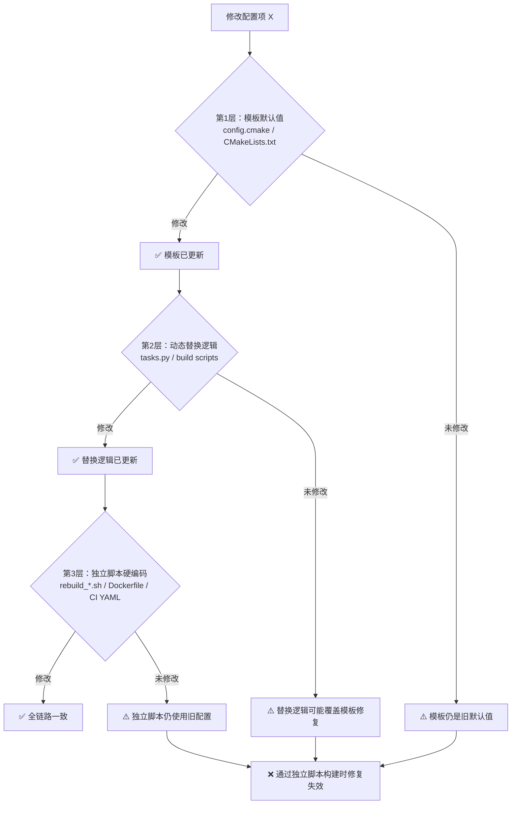

# 构建配置变更检查清单（三层覆盖）

> 📅 创建日期：2026-07-18
> 🔒 来源：XMNN Runtime 1.2.1-fix-cp314 重新打包复盘（配置持久化三层覆盖缺失根因）
> 🎯 用途：修复/变更 CMake/Makefile 等构建配置时，强制检查所有可能覆盖该配置的路径，防止"修复被静默重置"

---

## 一、何时使用本清单

**强制触发场景**（任一命中即必须执行）：

- 修改 CMake/Makefile 模板中的 `set(... ON/OFF)` 默认值
- 修改 build script（tasks.py / build.sh / invoke tasks）中的配置生成逻辑
- 修复"配置项被错误启用/禁用"类问题
- 跨多个构建路径（CI/CD、本地、Docker、独立脚本）统一配置项
- 修改 dataclass / config 类中影响生成产物的字段默认值

**不适用场景**：

- 单一来源的配置（如只在 .env 文件中读取的环境变量）
- 一次性脚本中的临时配置（无复用价值）
- 功能性代码改动（非配置项变更）

---

## 二、三层覆盖模型

构建配置通常存在三层覆盖路径，**任何一层遗漏都会导致修复失效**：



| 层级 | 文件特征 | 风险 |
|------|---------|------|
| **L1 模板层** | `config.cmake`、`CMakeLists.txt`、`Makefile.in` | 默认值被改回 / 不被尊重 |
| **L2 动态替换层** | `tasks.py`、`build.py`、`invoke`/`click` 命令 | 字符串替换依赖特定值 → 模板改后替换失败 |
| **L3 独立脚本层** | `rebuild_*.sh`、`Dockerfile`、CI YAML | 硬编码 `-DXXX=ON`，绕过 L1+L2 |

---

## 三、变更检查清单

### 步骤0：变更前定位（必做）

- [ ] **0.1 配置项名称已记录**：明确要修改的配置项（如 `USE_LTO`、`USE_CODEGENC`）
- [ ] **0.2 目标值已记录**：旧值 → 新值（如 `ON` → `OFF`）
- [ ] **0.3 修改原因已记录**：为什么改（关联 issue / 复盘 / 报告）

### 步骤1：L1 模板层检查

- [ ] **1.1 模板文件已定位**：通过 `Grep "set(<CONFIG>" cmake/` 找到所有模板
- [ ] **1.2 模板默认值已修改**：`set(<CONFIG> <NEW_VALUE>)`
- [ ] **1.3 模板注释已更新**：解释为何改为新值（含根因说明，如"LTO 会丢弃静态注册代码"）
- [ ] **1.4 同名模板已全部检查**：如存在 `config.cmake.full` / `config.cmake.minimal` 等变体

### 步骤2：L2 动态替换层检查

- [ ] **2.1 替换逻辑已定位**：`Grep "<CONFIG>" tasks.py build.py` 找到所有动态生成逻辑
- [ ] **2.2 字符串替换 → 正则替换**：`content.replace('set(X ON)')` → `re.sub(r'set\(X\s+(ON|OFF)\)', ...)`
  - **原因**：字符串替换依赖模板当前值，模板默认值改变后会静默失败
- [ ] **2.3 dataclass 默认值已修改**：不仅是 `from_args()` 方法，直接实例化 `BuildConfig()` 也要正确
- [ ] **2.4 环境变量回退路径已检查**：`os.environ.get('XXX', default)` 中的 default 也要更新
- [ ] **2.5 配置缓存键已检查**：如果存在 `get_cache_key()`，确认新字段已纳入哈希

### 步骤3：L3 独立脚本层检查

- [ ] **3.1 独立脚本已定位**：`Grep "<CONFIG>" dev-env/ scripts/ docker/ .github/` 找硬编码 `-D<CONFIG>=`
- [ ] **3.2 cmake 命令行参数已更新**：脚本中 `-D<CONFIG>=<NEW_VALUE>`
- [ ] **3.3 Dockerfile / CI YAML 已检查**：构建镜像和 CI 流水线中的 ENV / ARG
- [ ] **3.4 文档示例已同步**：README / BUILDING.md 中的示例命令

### 步骤4：验证（必做）

- [ ] **4.1 配置生成逻辑测试**：写最简 Python 脚本调用 `_generate_config_content()`，断言输出包含 `set(<CONFIG> <NEW_VALUE>)`
- [ ] **4.2 三层一致性 Grep**：`Grep "<CONFIG>"` 全仓库，所有出现位置的值都是 `<NEW_VALUE>`（或符合预期的条件逻辑）
- [ ] **4.3 端到端构建验证**：执行一次完整构建，确认 CMakeCache.txt 中 `<CONFIG>` 值正确
- [ ] **4.4 回归测试**：相关功能测试通过（如 `relay.build` 能成功）

### 步骤5：归档

- [ ] **5.1 提交信息说明三层覆盖**：commit message 描述修改了哪三层
- [ ] **5.2 关联复盘/issue**：提交信息引用源复盘报告或 issue

---

## 四、常见陷阱（Gotchas）

### 陷阱1：字符串替换静默失败

```python
# ❌ 危险：依赖模板当前值是 ON
content = content.replace('set(USE_LTO ON)', 'set(USE_LTO OFF)')

# ✅ 正确：正则替换处理任意默认值
content = re.sub(r'set\(USE_LTO\s+(ON|OFF)\)', 'set(USE_LTO OFF)', content)
```

**识别信号**：模板默认值修改后，构建产物的配置"莫名"被重置为旧值。

### 陷阱2：只改 from_args() 不改 dataclass 默认值

```python
# ❌ 危险：dataclass 默认值仍是 True
@dataclass
class BuildConfig:
    use_hide_symbols: bool = True  # 直接实例化时错误

    @classmethod
    def from_args(cls):
        return cls(use_hide_symbols=False)  # 只有 from_args 正确

# ✅ 正确：dataclass 默认值也是 False
@dataclass
class BuildConfig:
    use_hide_symbols: bool = False
```

**识别信号**：通过 `inv config` 调用正确，但通过 `BuildConfig()` 直接实例化的代码路径错误。

### 陷阱3：忘记检查独立脚本

独立脚本（如 `rebuild_*.sh`）直接通过 `cmake -DXXX=ON` 命令行参数覆盖配置，**完全绕过模板和 tasks.py**。如果只改 L1+L2 而忘记 L3，通过独立脚本构建时修复失效。

**识别信号**：CI/CD 或 Docker 构建结果与本地构建不一致。

### 陷阱4：缓存键未纳入新字段

如果存在基于配置哈希的缓存机制（如 `.cmake_cache_<build>.hash`），新增/修改配置字段时未纳入 `get_cache_key()`，会导致配置变更不触发重新配置。

**识别信号**：修改配置后 `ninja` 不重新配置，仍使用旧 CMakeCache。

---

## 五、与相关模式的关系

- **[static-registration-compile-config.md](../docs/retrospective/patterns/code-patterns/static-registration-compile-config.md)**：本清单是静态注册模式中"配置修复"步骤的具体展开
- **[bulk-replace-zero-omission-verify.md](../docs/retrospective/patterns/code-patterns/bulk-replace-zero-omission-verify.md)**：步骤 4.2 的 Grep 验证采用此模式（全局 Grep 确认零遗漏）

---

## 六、使用示例

### 示例1：修复 USE_LTO 配置（来自 XMNN 复盘）

```bash
# 步骤1：模板层
# 修改 cmake/config.cmake: set(USE_LTO OFF) + 更新注释说明 LTO 与静态注册冲突

# 步骤2：动态替换层
# 修改 tasks.py:
#   - dataclass: use_lto: bool = False
#   - 替换逻辑: re.sub(r'set\(USE_LTO\s+(ON|OFF)\)', ...)

# 步骤3：独立脚本层
# 修改 rebuild_tvm_codegenc.sh: 添加 -DUSE_LTO=OFF

# 步骤4：验证
python -c "
from tasks import BuildConfig, _generate_config_content
cfg = BuildConfig()  # 直接实例化测试 dataclass 默认值
assert cfg.use_lto is False, 'dataclass 默认值错误'
content = _generate_config_content(cfg)
assert 'set(USE_LTO OFF)' in content, '生成内容错误'
print('✅ 三层覆盖验证通过')
"
```

### 示例2：检查全仓库一致性

```bash
# 用 Grep 检查所有出现 USE_LTO 的位置
Grep "USE_LTO" --output_mode=content -n
# 预期：所有位置都是 OFF 或符合条件逻辑
```

---

## 七、质量验收

执行完本清单后，逐项确认：

- [ ] 三层覆盖全部修改完成（L1 模板 + L2 动态替换 + L3 独立脚本）
- [ ] 字符串替换已升级为正则替换（如涉及）
- [ ] dataclass 默认值已修改（如涉及）
- [ ] 配置生成逻辑测试通过
- [ ] 全仓库 Grep 一致性验证通过
- [ ] 端到端构建验证通过
- [ ] 提交信息引用源复盘/issue
