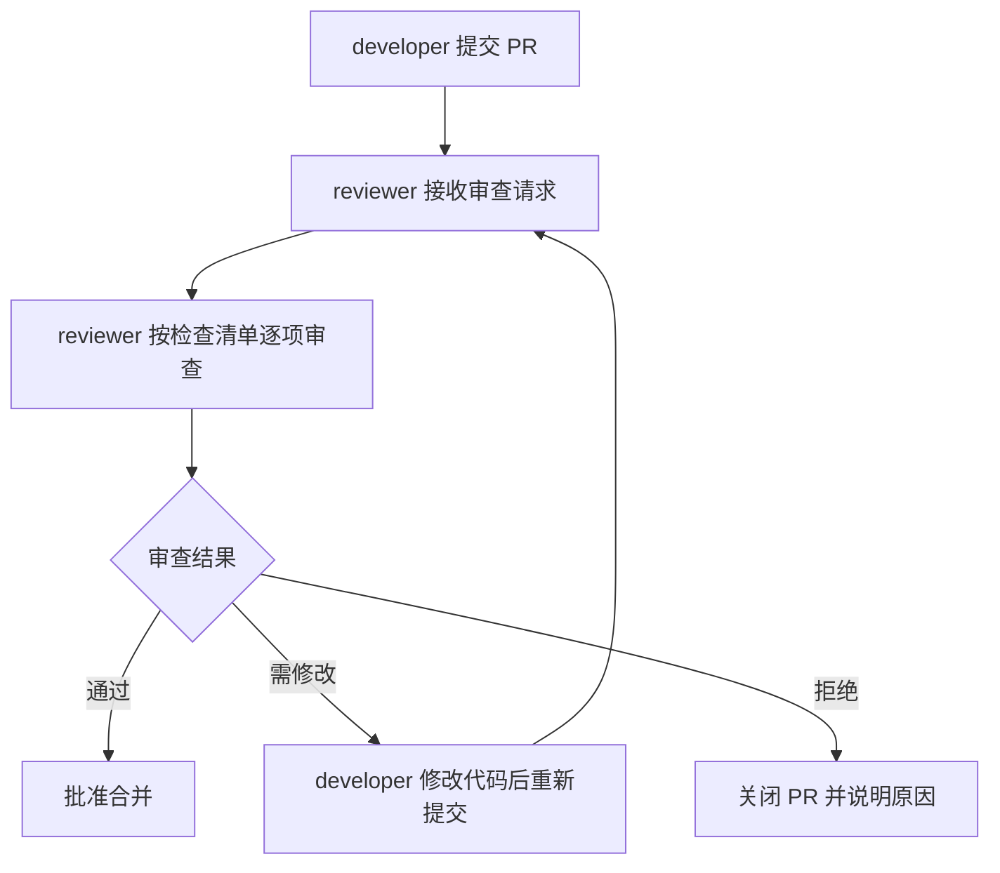

# Code Review 检查清单

> 📅 更新日期：2026-07-08
> 🔒 新增：敏感信息硬编码专项检查（§4.1）

---

## 一、审查流程



---

## 二、总览检查清单

| 序号 | 检查项 | 说明 | 通过标准 |
|:---:|--------|------|---------|
| 1 | 代码规范 | 遵循项目编码规范 | 无 lint 错误，命名清晰，结构合理 |
| 2 | 功能正确性 | 实现符合需求 | 功能测试通过，边界条件已处理 |
| 3 | 测试覆盖 | 单元测试覆盖率达标 | 覆盖率 ≥ 80%，覆盖正常/边界/异常场景 |
| 4 | **敏感信息安全** | 无硬编码敏感信息 | **通过敏感信息检测（必检项，详见§四）** |
| 5 | 输入输出安全 | 输入校验与输出编码 | 无注入风险，API不返回敏感字段 |
| 6 | 依赖安全 | 第三方依赖安全 | 无CVE高危漏洞，来源可信 |
| 7 | 性能 | 无性能退化 | 无明显性能问题，查询已优化 |
| 8 | 文档 | 必要文档已更新 | 接口文档/设计说明/CHANGELOG已同步 |
| 9 | 治理闭环 | 重复性问题触发治理 | 二次同类问题必须附根因分析+预防措施，commit 含 `governance-loop` 标记 |

---

## 三、逐项审查标准

### 1. 代码规范

- [ ] 代码风格符合项目配置（`../../.editorconfig`、`eslint`、`prettier` 等）
- [ ] 命名清晰、含义准确，符合项目命名约定
- [ ] 文件结构与模块划分合理，无冗余代码、无注释掉的代码块
- [ ] 无超长函数/类，单一职责原则

### 2. 功能正确性

- [ ] 实现逻辑与需求文档/PR描述一致
- [ ] 边界条件与异常路径已处理（null、空值、越界、超时等）
- [ ] 关键业务逻辑具备必要的注释说明
- [ ] 没有引入意外的副作用

### 3. 测试覆盖

- [ ] 单元测试覆盖率不低于 80%
- [ ] 测试用例覆盖：正常路径、边界条件、异常场景
- [ ] 测试代码可独立运行，无外部依赖残留
- [ ] Mock数据使用合理，不硬编码真实敏感信息

---

### 4. 🔒 安全性（重点审查）

#### 4.1 敏感信息硬编码检查（必检项）

> 💡 **自动化辅助**：pre-commit 钩子会在 `git commit` 时自动检测，CI 流水线也会运行检测。Code Review 时仍需人工确认以下 10 个类别。

reviewer **必须逐项确认**以下类别不存在硬编码：

| 序号 | 类别 | 检查要点 | 常见风险位置 |
|:---:|------|---------|-------------|
| ① | **API密钥/Token** | 无硬编码的 API Key、Access Token、Secret Key（如 `sk-xxx`、`ghp_xxx`、`Bearer xxx`） | 配置文件、常量定义、请求头、SDK初始化代码 |
| ② | **数据库凭据** | 无硬编码的数据库密码、含明文密码的连接串 | 数据库配置、ORM连接、`DATABASE_URL` |
| ③ | **账号密码** | 无硬编码的用户名/密码组合（包括默认密码） | 测试代码、初始化脚本、默认账号配置 |
| ④ | **私钥/证书** | 无私钥内容（PEM格式BEGIN/END标记）、PEM证书 | 认证模块、JWT配置、SSL/TLS配置 |
| ⑤ | **手机号/个人信息** | 无真实手机号、身份证号、银行卡号等个人信息 | 测试数据、Mock数据、日志输出 |
| ⑥ | **内部URL/IP** | 无生产环境内网地址（`10.x.x.x`、`192.168.x.x`、`172.16-31.x.x`）、IP:Port组合 | 服务发现配置、Webhook地址、调试地址 |
| ⑦ | **云服务凭据** | 无云服务商 AK/SK、Access Key（如阿里云AK、AWS AKIA前缀等） | 云存储配置、短信/邮件服务配置 |
| ⑧ | **个人路径** | 无开发者本地绝对路径（`/Users/xxx/`、`C:\Users\xxx\`、`/home/xxx/`） | 日志路径、配置路径、导入路径、shebang行 |
| ⑨ | **.env文件** | `.env`、`.env.local`、`.env.production` 等包含真实密钥的文件未被提交 | 仓库根目录、配置目录（确认已在 `.gitignore` 中） |
| ⑩ | **第三方服务密钥** | 无微信/支付宝/支付平台密钥、OAuth Client Secret、Webhook Signing Secret | 支付模块、第三方登录、回调处理 |

**豁免规则**（满足以下条件可放行）：
- [ ] 代码行尾带有 `# nosec` 注释标记，确认为示例/测试数据
- [ ] `../../.env.example` 等模板文件只包含占位符（如 `your-api-key-here`、`sk-xxxxxxxxxxxxxxxxxxxx`）
- [ ] 公开文档中的示例密钥使用明确的占位符格式，不具备真实有效性

**开发者自查命令**（提交前运行）：
```bash
# 扫描敏感信息
python ../scripts/check-sensitive-info.py

# 自动修复部分问题
python ../scripts/check-sensitive-info.py --fix
```

#### 4.2 输入输出安全

- [ ] 所有外部输入均经过校验与消毒，不存在 SQL 注入、XSS、命令注入、路径遍历风险
- [ ] API 响应中不返回敏感字段（密码、Token、完整手机号、身份证号等），已脱敏处理
- [ ] 错误信息不泄露系统内部路径、堆栈信息、数据库结构、内部IP
- [ ] 文件上传功能有类型/大小/内容校验，无任意文件上传风险

#### 4.3 依赖安全

- [ ] 新增依赖已确认无已知 CVE 高危漏洞
- [ ] 不引入来源不明、维护不活跃的第三方包
- [ ] 依赖版本锁定文件（`package-lock.json`、`pdm.lock`、`requirements.txt`等）已同步更新
- [ ] 没有引入已知存在后门或恶意代码的包

---

### 5. 性能

- [ ] 无明显的性能退化（与基线对比无显著差异）
- [ ] 避免不必要的循环嵌套与重复计算（N+1查询等）
- [ ] 数据库查询与外部API调用已优化（加索引、批量操作、缓存合理使用）
- [ ] 大文件/大数据量处理有流式/分页机制

### 6. 文档

- [ ] 接口变更已同步更新 API 文档
- [ ] 复杂逻辑/算法已补充必要的设计说明
- [ ] README 或 CHANGELOG 已按要求更新
- [ ] 新增的配置项已在文档中说明

---

## 四、审查结果处理

| 结果 | 处理方式 |
|------|---------|
| ✅ **通过** | reviewer 在 PR 上批准（Approve），通知 orchestrator 执行合并 |
| ⚠️ **需修改** | reviewer 列出具体修改建议（comment），退回 developer 修改后重新提交审查 |
| ❌ **拒绝** | reviewer 说明拒绝原因（Close with comment），关闭 PR 并通知 orchestrator |

---

## 五、快速参考卡（打印/贴便利贴用）

```
Code Review 必查项（9项）：
1.规范  2.功能  3.测试  4.🔒敏感信息  5.输入输出
6.依赖  7.性能  8.文档  9.治理闭环

敏感信息10类必检：
①API密钥  ②数据库密码  ③账号密码  ④私钥证书  ⑤个人信息
⑥内网地址  ⑦云AK/SK  ⑧本地路径  ⑨.env文件  ⑩第三方密钥

提交前自查：python ../scripts/check-sensitive-info.py
紧急跳过：SENSITIVE_CHECK_SKIP=1 git commit（不推荐）
```
