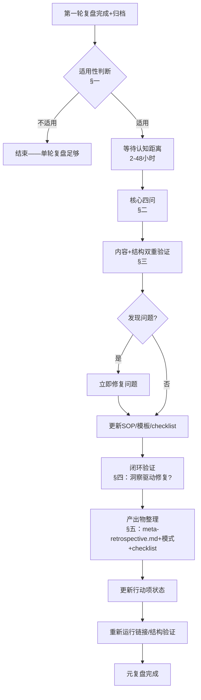

# 元复盘执行检查清单

> 基于第一性原理知识体系复盘元复盘（v1.1）+ 元复盘双轮法 + 元复盘闭环模式提炼，用于在项目复盘完成后执行**第二层复盘**（对复盘本身的复盘），确保复盘方法论持续迭代，形成"做事→复盘→元复盘→修复→方法论升级"的完整闭环。
>
> **适用场景**：
> - 项目持续时间超过1天或涉及多轮迭代
> - 项目产出具有知识沉淀价值（不仅仅是一次性任务）
> - 复盘本身暴露了复盘SOP/模板的不足
> - 团队有复用复盘经验到未来项目的需求
>
> **不适用场景**：
> - 一次性简单任务（如修复一个小bug）——单轮复盘即可
> - 完全创新型项目无任何可迁移经验——元复盘产出为空
> - 紧急热修复（hotfix）——元复盘在修复验证后补做即可

---

## 使用方法

本checklist为**可选实践**，不强制所有复盘都做元复盘。当决定执行元复盘时，按以下顺序完成：

1. **适用性判断**（§一）：确认本次复盘是否值得做元复盘
2. **核心四问**（§二）：回答元复盘的四个根本性问题
3. **结构验证**（§三）：双重验证——内容正确性+文件位置正确性
4. **闭环验证**（§四）：确保元复盘中识别的问题驱动实际修复
5. **产出与更新**（§五）：更新SOP模板/模式库/行动项状态
6. **反模式检查**（§六）：避免元复盘中的常见错误

---

## 一、适用性判断（执行前）

决定是否执行元复盘前，先回答以下问题：

- [ ] **项目复杂度门槛**：本次复盘的项目是否持续超过1天或涉及3个以上文件/3轮以上迭代？
- [ ] **知识沉淀价值**：本次复盘是否产出了可跨项目迁移的方法论/模式/SOP？
- [ ] **方法论改进空间**：复盘过程中是否暴露了现有SOP/模板/checklist的不足？
- [ ] **认知距离条件**：第一轮复盘完成后是否已间隔至少2小时（推荐24-48小时）以获得"远距离视角"？

**判断结果**：
- 全部✅ → **强烈推荐执行元复盘**
- 3项✅ → **建议执行元复盘**
- ≤2项✅ → **可不执行**，单轮复盘即可

---

## 二、核心四问（元复盘主体）

元复盘必须回答以下四个根本性问题，缺一不可：

| # | 核心问题 | 检查要点 | 典型产出 |
|---|---------|---------|---------|
| 1 | **这次复盘本身哪些地方做对了？为什么？** | 哪些做法/流程/决策被证明有效？背后的根本原因是什么（是运气、流程、还是方法论）？这些有效做法是否可固化到SOP？ | 成功实践清单、可固化流程 |
| 2 | **这次复盘本身犯了什么错误？根因是什么？** | 特别是复盘方法论本应预防但仍然发生的错误。用5-Whys追问根因，不停留在表面。根因是"人不够仔细"还是"流程有漏洞"？ | 问题根因分析、反模式、流程改进点 |
| 3 | **复盘SOP/模板/checklist哪些地方需要改进？** | 现有工具是否覆盖了所有需要检查的维度？是否存在验证语义缺口（如内容验证≠结构验证）？模板是否需要增加强制字段？ | SOP升级建议、模板更新需求、新checklist提案 |
| 4 | **我们从"如何做好复盘"中学到了什么之前不知道的东西？** | 本次复盘揭示了哪些关于复盘本身的新认知？这些认知是否可迁移到其他类型的复盘？是否形成新的方法论模式？ | 元洞察（META-INSIGHT）、新模式入库候选 |

**四问质量自检**：
- [ ] 每个问题的回答都包含具体事实依据（引用了复盘报告中的具体内容），而非空泛评价
- [ ] 问题2的根因分析至少追问了3层Why，未停留在"疏忽""不小心"等表面原因
- [ ] 问题3的改进建议具体可执行（能转化为SOP条款/checklist项），而非"下次注意"
- [ ] 问题4的元洞察具有跨项目迁移性（换一个项目仍然成立），而非仅适用于当前项目

---

## 三、结构验证：内容+位置双重检查

基于META-INSIGHT-005（默认位置偏差）和META-INSIGHT-006（内容验证≠结构验证），元复盘收尾时必须执行双重验证：

### 3.1 内容验证（质量检查）

- [ ] 所有文件frontmatter字段完整（id/title/date/type/status/source，主文件含version）
- [ ] 本地链接有效（运行check-links.py验证）
- [ ] frontmatter中status标记正确（进行中/已完成，不是所有文件都标completed）
- [ ] 所有数据/事实可追溯到source字段标注的来源

### 3.2 结构验证（位置检查）

- [ ] **spec目录纯净度**：`.trae/specs/<主题>/<项目名>/` 下只保留spec三件套（spec.md/tasks.md/checklist.md），无中间分析文件、报告文件、支撑材料
- [ ] **产出路径正确性**：所有产出物都在tasks.md中每个Task的Output字段指定的目标路径下，无文件散落在当前工作目录或spec目录
- [ ] **报告归档位置**：最终报告存放在 `docs/retrospective/reports/<主题分类>/<报告目录>/` 下，目录名符合命名规范（kebab-case+日期后缀）
- [ ] **支撑文件位置**：中间分析产物/支撑文档放在报告目录下的 `supporting-analysis/` 子目录
- [ ] **索引已更新**：`docs/retrospective/reports/README.md` 已登记新报告；主题看板和全局看板计数与实际一致

**默认位置偏差防御**：
> 无显式路径约束时，所有执行者（人或AI）默认将文件放在当前工作目录——这不是疏忽，是系统默认行为。预防方式不是"更仔细"，而是"每个Task必须包含Output字段指定目标路径"。

---

## 四、闭环验证：洞察必须驱动实际修复

基于META-INSIGHT-007（元复盘洞察必须驱动实际修复，否则就是纸上谈兵）：

- [ ] **问题不只是描述**：元复盘中识别的每个问题，都有对应的修复动作，不是只写"存在XX问题"然后结束
- [ ] **SOP已更新**：元复盘提出的SOP/模板改进建议，已实际更新到对应文件（不是"建议下次更新"）
- [ ] **checklist已补充**：如果识别了新的检查维度，已补充到对应checklist中（如本checklist本身就是第一性原理元复盘的产出）
- [ ] **行动项状态正确**：元复盘"下一步行动"表格中，已完成的项标记✅，待执行的项明确标注前置条件和预计时机，不能全部标记"待执行"
- [ ] **修复已验证**：修复动作执行后，重新运行链接验证/结构验证，确认修复有效

**闭环判定标准**：
> 元复盘完成的标志不是"写完了meta-retrospective.md"，而是"元复盘中识别的问题已被修复，且修复经验已沉淀到方法论中"。

---

## 五、产出物标准

元复盘完成后，应产出以下内容：

| 产出物 | 位置要求 | 说明 |
|--------|---------|------|
| 元复盘文档 | 报告目录下 `meta-retrospective.md` | 包含核心四问回答、元洞察编号（META-INSIGHT-XXX）、行动项表格、Changelog |
| SOP/模板更新 | 对应SOP/模板文件 | 版本号升级，Changelog记录元复盘驱动的变更 |
| 新模式（可选） | `docs/retrospective/patterns/` 对应目录 | 元洞察中可跨项目迁移的通用规律，按模式文档格式撰写 |
| 新checklist（可选） | `.agents/checklists/` | 识别到新的结构化决策模型时提取 |
| 行动项更新 | 元复盘文档内"下一步行动"表格 | 已完成✅/待执行⏸️，待执行项标注前置条件 |

**元洞察编号规范**：
- 格式：`META-INSIGHT-XXX`（三位数字，从001开始递增）
- 每条元洞察应包含：洞察名称、核心内容、依据/来源、与其他洞察的关联、适用范围

---

## 六、反模式清单

执行元复盘时需要避免的常见错误：

- [ ] **只夸不批**：元复盘变成"复盘成功经验总结会"，只写做对的地方，不写/轻写做错的地方 → 失去元复盘价值
- [ ] **根因甩锅**：错误原因归为"不够仔细""时间不够""疏忽了"等意志力层面原因，而非追问到流程/结构/工具层面的缺陷
- [ ] **纸上谈兵**：元复盘中识别的问题和改进建议只写入文档，不实际执行修复和SOP更新 → 违反闭环原则
- [ ] **洞察过窄**：元洞察只适用于当前项目（如"下次做第一性原理复盘时要注意XX"），不具备跨项目迁移性 → 不是真正的元洞察
- [ ] **跳步执行**：第一轮复盘刚写完就立即做元复盘，没有认知距离 → 仍被项目细节淹没，无法获得远距离视角
- [ ] **强制元复盘**：不管项目大小/复杂度，要求所有复盘都做元复盘 → 浪费精力在低价值项目上，元复盘本身成为负担
- [ ] **只验证内容不验证结构**：链接检查通过、frontmatter完整就认为没问题，不检查文件是否在正确目录 → 出现默认位置偏差问题
- [ ] **行动项全部"待执行"**：下一步行动中所有项都标记待执行，没有在元复盘过程中立即落地任何改进 → 元复盘价值无法兑现

---

## 七、元复盘执行流程图

---

## 八、与其他模式/工具的关系

| 关联项 | 关系 |
|--------|------|
| meta-retrospective-two-round-method.md | 上游——本checklist是双轮法中第二轮（元复盘）的执行工具 |
| meta-retrospective-closed-loop.md | 上游——本checklist将闭环模式五步流程细化为可操作的检查项 |
| retrospective-cmd | 调用入口——复盘指令完成后可选择触发元复盘checklist |
| knowledge-system-construction-template.md | 同层级——SOP模板提供知识体系构建流程，本checklist提供元复盘质量控制 |
| check-links.py | 被调用——内容验证环节使用此脚本验证链接有效性 |

---

*本检查清单基于第一性原理知识体系复盘元复盘（v1.1，2次验证）、元复盘双轮法、元复盘闭环模式提炼，当前为v1.0版本（L1实验性）。随着在更多复盘中验证，本清单将同步迭代更新。*

*创建时间：2026-07-13*
*来源项目：retrospective-first-principles-knowledge-system-20260710*
