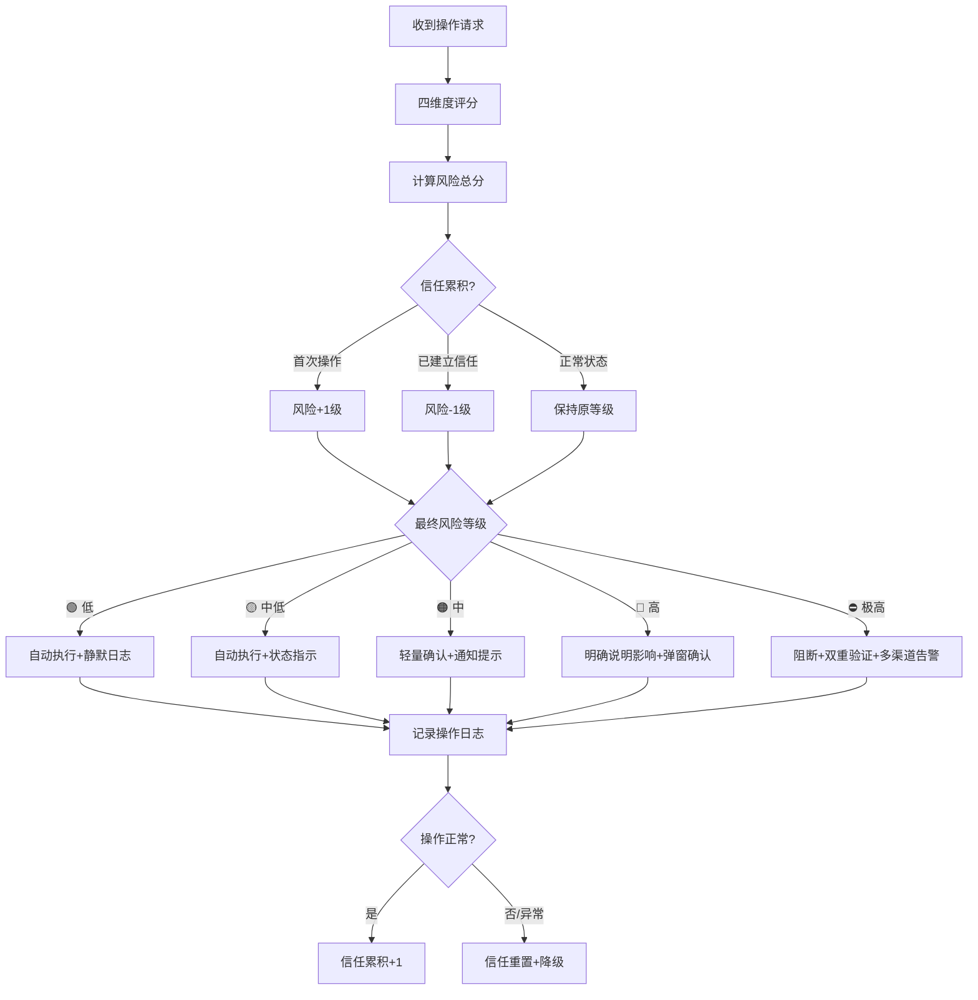

# 风险评分决策检查清单

> 基于[安全不打扰UX模式](../../docs/retrospective/patterns/methodology-patterns/ai-collaboration/non-intrusive-security-ux.md)的风险分级响应矩阵，用于快速评估操作风险等级并决定响应方式。
>
> 适用场景：AI Agent工具权限设计、自动化流程安全闸门、DevOps部署审批、产品功能权限分级。

---

## 使用方法

对每个待评估的操作，依次完成四维度评分，计算总分后查风险等级表，选择对应的响应方式。

---

## 一、四维度风险评分

为每个操作在四个维度上打分（1-5分），加权求和得到风险总分。

| 维度 | 权重 | 1分（最低风险） | 2分 | 3分 | 4分 | 5分（最高风险） |
|------|------|----------------|-----|-----|-----|----------------|
| **用户/主体** | 20% | 系统自身/可信服务账号 | 已认证常规用户 | 新认证用户/临时授权 | 匿名/未认证 | 身份异常/疑似攻击者 |
| **设备/环境** | 20% | 常用设备+常用网络 | 常用设备+新网络 | 新设备+验证通过 | 陌生IP/可疑地理位置 | 已知恶意IP/黑名单环境 |
| **操作类型** | 40% | 只读查询（搜索/读取/列表） | 常规写入（创建/编辑/生成） | 外部通信（网络请求/API调用） | 敏感修改（删除/配置变更/发消息） | 高危操作（数据销毁/权限提升/资金转移/生产环境变更） |
| **影响范围** | 20% | 仅影响临时数据/单个会话 | 影响个人工作区/非关键文件 | 影响项目级资源/团队可见 | 影响系统配置/多用户数据 | 不可逆破坏/全系统影响/生产环境 |

**风险总分** = 用户分×0.2 + 环境分×0.2 + 操作分×0.4 + 影响分×0.2

---

## 二、风险等级与响应矩阵

| 总分区间 | 风险等级 | 响应方式 | 验证方式 | 提醒方式 | Agent场景示例 |
|---------|---------|---------|---------|---------|-------------|
| **1.0 - 1.8** | 🟢 低风险 | 默认允许，自动通过 | 无验证 / 隐式验证（设备指纹/行为模式） | 静默日志 | 文件读取、代码搜索、文档生成、只读查询 |
| **1.9 - 2.6** | 🟡 中低风险 | 允许执行，记录可追溯 | 无额外验证，变更可回滚 | 状态指示器（视觉标记） | 创建文件、编辑代码、生成内容 |
| **2.7 - 3.4** | 🟠 中风险 | 需确认但非阻断 | 轻量验证（一键确认/已记住设备免密） | 通知栏提示（非阻断） | 首次外部API调用、跨项目文件访问 |
| **3.5 - 4.2** | 🔴 高风险 | 必须确认后执行 | 强验证（明确说明操作内容和影响+人类确认） | 弹窗确认 | 删除文件、执行Shell命令、对外发消息、修改配置 |
| **4.3 - 5.0** | ⛔ 极高风险 | 阻断+多重确认 | 双重验证（二次确认+独立验证通道） | 阻断告警+多渠道通知 | rm -rf、数据库删除、生产部署、资金操作、权限提升 |

---

## 三、信任累积调整

基础风险评分通过后，可根据历史信任度进行调整：

| 信任状态 | 调整方式 | 说明 |
|---------|---------|------|
| **首次操作** | 风险等级+1级 | 新设备/新用户/新工具类型首次操作，上调一级响应 |
| **信任累积中** | 不调整 | 3-10次同类正常操作后，保持原评分 |
| **已建立信任** | 风险等级-1级（不低于低风险） | 10次以上无异常的同类操作，可降级响应（如高风险降为中风险确认） |
| **异常触发后** | 重置信任 | 出现异常行为/错误操作后，信任度清零，重新累积 |
| **长期未使用** | 信任衰减 | 超过30天未使用的权限，信任度降为初始状态 |

---

## 四、Agent工具权限速查表

基于风险评分模型，对AI Agent常见工具调用的推荐权限配置：

| 工具类别 | 典型操作 | 默认风险等级 | 建议配置 |
|---------|---------|------------|---------|
| **文件读取** | Read/Grep/SearchCodebase | 🟢 低 | 默认可用，记录日志 |
| **文件搜索** | Glob/Find | 🟢 低 | 默认可用 |
| **文件写入** | Write/Edit/MultiEdit | 🟡 中低 | 默认可用，支持undo回滚 |
| **文件删除** | DeleteFile | 🔴 高 | 必须确认，显示将删除的文件列表 |
| **命令执行** | Shell（只读命令） | 🟡 中低 | 默认可用（git status/ls等） |
| **命令执行** | Shell（写入/构建命令） | 🟠 中 | 首次确认，信任累积后自动执行 |
| **命令执行** | Shell（危险命令） | ⛔ 极高 | 双重确认，命令黑名单硬阻断（rm -rf/format等） |
| **网络请求** | WebFetch/WebSearch | 🟡 中低 | 默认可用 |
| **浏览器操作** | Browser导航/点击/截图 | 🟠 中 | 首次需确认，仅限指定域名时可自动 |
| **MCP工具调用** | run_mcp | 🟠 中 | 按具体工具风险分级 |
| **代码诊断** | GetDiagnostics | 🟢 低 | 默认可用 |
| **Git操作** | git add/commit | 🟡 中低 | 默认可用 |
| **Git操作** | git push/force push | 🔴 高 | 必须确认，force push需额外警告 |

---

## 五、决策流程图

---

## 六、反模式清单

使用本检查清单时需要避免的常见错误：

- [ ] **全弹窗确认**：不管风险等级一律弹窗确认 → 导致"弹窗盲视"，高风险确认被忽略
- [ ] **全自动执行**：为了效率让所有操作自动执行 → 低风险操作没问题，但高风险操作出事故代价极大
- [ ] **信任只增不减**：信任累积后永远不降级 → 账号被攻陷后风险敞口极大
- [ ] **权重不调整**：不同场景用相同权重 → 金融场景操作维度权重应更高，内部工具环境维度权重可降低
- [ ] **无回滚机制**：中风险自动执行但没有undo → 误操作无法快速恢复
- [ ] **忽略影响范围**：只看操作类型不看影响范围 → `rm file.txt`和`rm -rf /`同是删除操作，风险天差地别

---

*本检查清单基于[non-intrusive-security-ux](../../docs/retrospective/patterns/methodology-patterns/ai-collaboration/non-intrusive-security-ux.md)模式（L1实验性）提取，当前为v1.0版本。随着模式在更多场景中验证，本清单将同步更新。*

*创建时间：2026-07-05*
