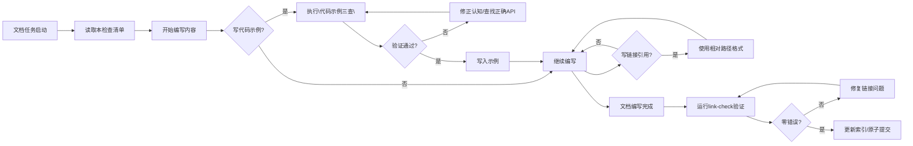

# 技术文档编写前置检查清单（Tech Doc Writing Pre-check Checklist）

> **适用场景**：编写技术教程、wiki、API文档、学习笔记等包含代码示例和链接引用的文档时，**开始编写前**和**提交前**必须逐项检查。
> **触发时机**：文档类任务启动后→内容生成前，以及文档完成后→提交/更新索引前。
> **来源**：WeasyPrint学习任务复盘（retrospective-weasyprint-learning-20260713），基于两个真实踩坑问题沉淀。

---

## 一、代码示例编写前三查（ACT-002）

**问题背景**：写API示例时凭记忆，导致引用了不存在的`default_url_fetcher`API，事后返工修复。

**强制规则**：编写任何代码示例（尤其是API调用、类方法、函数参数）之前，必须完成以下三项检查：

| 序号 | 检查项 | 检查方法 | 通过标准 |
|------|--------|---------|---------|
| 1 | **查公开API导出** | Grep搜索目标库的`__init__.py`或`__all__`列表 | 要写的API/类/函数确实在公开导出列表中 |
| 2 | **查源码实际存在** | Grep搜索源码中该名称的定义（类定义/函数定义） | 源码中确实存在该名称的定义，且参数签名和记忆一致 |
| 3 | **查官方文档示例** | 查看官方文档/官方README中的示例代码用法 | 示例写法和官方推荐用法一致，参数名/参数顺序无误 |

### 自动化检查命令（Python项目）

```bash
# 检查1：查公开导出
Grep -n "__all__" external/<project>/<package>/__init__.py

# 检查2：查源码定义
Grep -n "def <function_name>\|class <class_name>" external/<project>/

# 检查3：（人工）打开官方文档对应章节对比示例
```

**反模式**：
- ❌ "我记得这个API是这么用的"——凭记忆写示例不验证
- ❌ 只看博客文章不查官方文档——第三方博客可能过时或写错
- ❌ 写完示例才发现API不存在，返工修改整篇文档

---

## 二、链接引用规范前置确认（ACT-003）

**问题背景**：初始编写时使用了`file:///`绝对路径，违反项目路径引用规范，事后批量修改16处链接。

**强制规则**：文档开始编写前先确认路径规范，提交前必须运行link-check验证。

### 2.1 编写前确认

| 序号 | 检查项 | 规范要求 |
|------|--------|---------|
| 1 | **路径格式** | Markdown交叉引用**必须使用相对路径**，禁止使用`file:///`开头的绝对路径 |
| 2 | **路径分隔符** | 统一使用正斜杠`/`，即使Windows环境也不要用反斜杠`\` |
| 3 | **锚点格式** | 引用具体行号使用`#L<start>-L<end>`格式，两个L不能省略 |
| 4 | **链接文本** | 使用文件名/目录名/函数名作为链接文本，不要包裹反引号 |

✅ 正确示例：
```markdown
参见 [utils.py](src/utils.py#L20-L30)
参见 [安装指南](../installation.md)
```

❌ 错误示例：
```markdown
参见 [`utils.py`](file:///d:/spaces/project/src/utils.py#L20-30)
参见 .\docs\guide.md
```

### 2.2 提交前强制验证

文档完成后、提交前**必须**运行链接检查：

```bash
cd d:\spaces\SpecWeave

# 第一步：检查本地链接（必做）
python .agents/scripts/check-links.py --path <你的文档或目录路径>

# 第二步：如果有修复，先预览再执行
python .agents/scripts/check-links.py --path <路径> --fix --dry-run
python .agents/scripts/check-links.py --path <路径> --fix

# 第三步（发布前）：检查外部链接可达性
python .agents/scripts/check-links.py --path <路径> --check-external
```

验证通过标准：
- [ ] 没有"文件不存在"的本地链接错误
- [ ] 没有`file:///`开头的绝对路径（会被自动修复，但最好一开始就不写）
- [ ] 相对路径层级正确（`../`层数符合目录结构）
- [ ] （可选）外部链接返回200状态码

---

## 三、执行时机与流程



---

## 四、完整提交前自检清单（文档类任务）

- [ ] **代码示例三查完成**：所有API/类/函数示例都验证了公开导出、源码存在、官方文档一致
- [ ] **路径规范符合要求**：没有`file:///`绝对路径，全部使用相对路径，分隔符为正斜杠
- [ ] **link-check验证通过**：运行`check-links.py`后本地链接零错误
- [ ] **frontmatter元数据完整**：YAML frontmatter包含必需字段，source字段正确标注来源
- [ ] **索引已更新**：新增文档后运行docgen更新对应目录的README索引
- [ ] **（可选）外部链接检查**：发布前运行`--check-external`验证外链可达

---

## 五、失败案例与教训

| 问题 | 根因 | 遵循本清单可避免 |
|------|------|-----------------|
| WeasyPrint教程引用不存在的`default_url_fetcher` | 凭记忆写API，未验证 | ✅ 代码示例三查第2项（查源码实际存在） |
| 文档中16处`file:///`绝对路径 | 编写前未确认规范，写完才批量修复 | ✅ 编写前确认路径格式 + 提交前link-check验证 |

---

## Changelog

- 2026-07-13 | feat | 初始版本：基于WeasyPrint学习复盘ACT-002/ACT-003沉淀，包含代码示例三查、链接引用规范、完整自检清单
