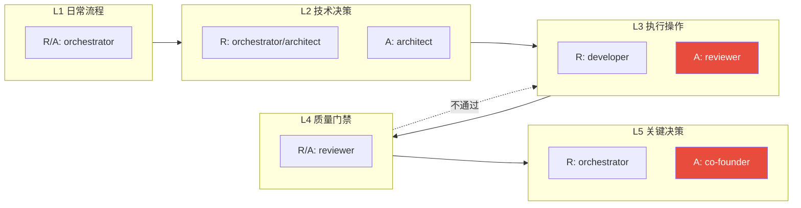
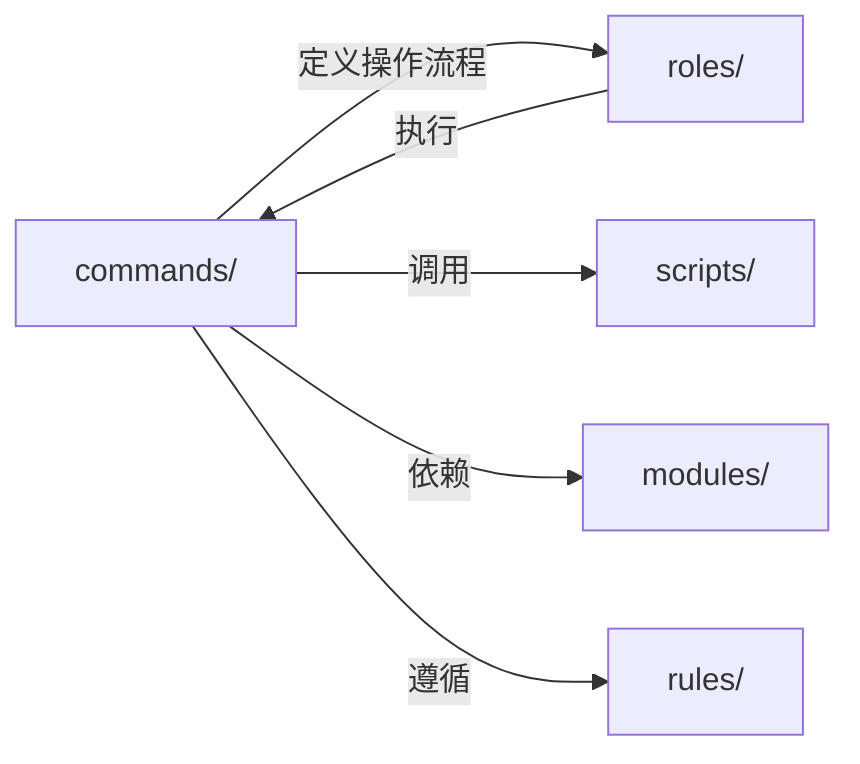
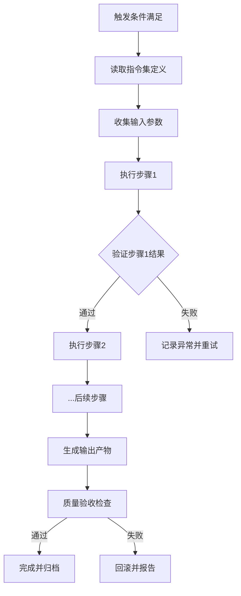

# Commands 指令集目录

`.agents/commands/` 目录存放智能体执行的标准化指令集，定义各核心操作的执行步骤、输入输出规范与质量验收标准。

## 设计理念

指令集是智能体与任务之间的桥梁，将高层任务需求转化为可执行的标准化操作流程。每条指令集包含：

- **触发条件**：何时启动该指令集
- **执行步骤**：标准化的操作流程
- **输入规范**：所需的上下文与参数
- **输出规范**：预期产出物与格式
- **质量验收**：验证标准与成功条件

## 指令集清单

| 指令集 | ID | 用途 | 关联模块 |
|--------|----|------|---------|
| 复盘 | retrospective | 项目复盘流程，生成复盘报告与改进建议 | [自我复盘](../modules/self-retrospective.md) |
| 洞察 | insight | 数据分析与问题诊断，识别优化机会与异常 | [自我洞察](../modules/self-insight.md) |
| 导出报告 | export-report | 结构化报告导出，支持多格式与归档 | [自我复盘](../modules/self-retrospective.md) |
| 原子化 | atomization | 文档与代码的原子化拆分，确保单一职责 | [自我萃取](../modules/self-extraction.md) |
| 原子提交 | atomic-commit | Git 原子化提交规范，确保单次提交单一职责 | [自我迭代](../modules/self-iteration.md) |
| 文件创建 | file-creation | 文件创建标准化流程，包含三步前置检查 | [自我管理](../modules/self-management.md) |
| Mermaid图表管理 | mermaid | Mermaid图表生成、解析、检查、修复与协作管理 | [自我管理](../modules/self-management.md) |
| Home Assistant集成 | home-assistant | Home Assistant智能家居系统集成，设备控制与状态查询（可选模块） | [HA集成技能](../skills/home-assistant/SKILL.md) |

## 治理流程RACI责任分配总览

遵循[角色最小化原则](../../docs/retrospective/patterns/methodology-patterns/governance-strategy/role-minimization-principle.md)（RACI扩展优先于角色新增），所有治理流程均通过RACI矩阵明确角色职责，不新增独立角色。每条指令集文档内包含详细的逐活动RACI矩阵，本节提供跨流程的角色职责总览。

> 📋 **RACI编写规范**：新建/修改指令集RACI矩阵时，必须遵循 [RACI治理规范与模板](../rules/raci-governance-standards.md) 中的三大强制规则（A唯一性、R≠A分离、双列设计），使用标准模板和质量Checklist。

### RACI角色定义

| 标记 | 含义 | 约束 |
|:---:|---|---|
| **R** | Responsible（执行者） | 实际完成工作的角色，可多个，必须加粗 |
| **A** | Accountable（审批者/最终负责人） | 每项活动**有且仅有一个**，对结果负最终责任，必须加粗 |
| C | Consulted（咨询者） | 提供意见和专业输入，双向沟通 |
| I | Informed（知情者） | 事后被告知结果，单向沟通 |

### 跨流程RACI总览（关键活动A角色汇总）

| 治理活动 | 复盘(retrospective) | 洞察(insight) | 导出报告(export-report) | 原子化(atomization) | 原子提交(atomic-commit) | 文件创建(file-creation) | Mermaid图表管理(mermaid) |
|---|:---:|:---:|:---:|:---:|:---:|:---:|:---:|
| 触发与范围确认 | **orchestrator** | **orchestrator** | **orchestrator** | **orchestrator** | **orchestrator** | **orchestrator** | **orchestrator** |
| 方案/计划制定 | **orchestrator** | **architect** | **orchestrator** | **architect** | **orchestrator** | **orchestrator** | **architect** |
| 数据/源文件分析 | **orchestrator** | **orchestrator** | **reviewer** | **architect** | **reviewer** | **orchestrator** | **developer** |
| 核心执行（分析/拆分/提交） | **orchestrator** | **architect** | **reviewer** | **reviewer** | **reviewer** | **developer** | **developer** |
| 质量验收 | **reviewer** | **reviewer** | **reviewer** | **reviewer** | **reviewer** | **reviewer** | **reviewer** |
| 归档与通知 | **orchestrator** | **orchestrator** | **orchestrator** | **orchestrator** | **orchestrator** | **orchestrator** | **orchestrator** |
| 常规审批 | **reviewer** | **reviewer** | **reviewer** | **reviewer** | **reviewer** | **reviewer** | **reviewer** |
| 重大/敏感场景审批 | **co-founder** | **co-founder** | **co-founder** | **co-founder**¹ | **co-founder**² | **co-founder**³ | **co-founder**⁴ |

> ¹ 原子化跨模块涉及重大架构调整时需co-founder审批；常规跨模块由reviewer审批
> ² 原子提交`--no-verify`强制跳过hooks仅紧急情况下经co-founder审批，禁止常规使用
> ³ 文件创建涉及规范类文件或跨模块重大变更时需co-founder审批；常规文件创建由reviewer审批
> ⁴ Mermaid复杂跨模块架构图（>20节点、多subgraph）需co-founder审批；常规图表由reviewer审批

### 五层审批模型（R/A双列设计）

审批层级遵循 [双列设计原则](../rules/raci-governance-standards.md)：区分"主要执行者(R)"和"最终审批者(A)"，执行操作层严格R≠A分离。

| 层级 | 主要执行者 (R) | 最终审批者 (A) | 适用场景 |
|---|---|---|---|
| **L1 日常流程** | orchestrator | orchestrator | 流程触发、进度协调、范围确认、数据采集、过程分析、内容准备、报告生成协调、归档通知、预警发布、提交信息构建 |
| **L2 技术决策** | orchestrator / architect | architect | 方案设计、源文件/架构分析、根因分析、趋势分析、技术问题定位、异常检测规则判定 |
| **L3 执行操作** | developer | reviewer | 代码实现、文件拆分、引用更新、格式转换、文件生成、脱敏操作、提交执行、完整性修复 |
| **L4 质量门禁** | reviewer | reviewer | 质量验收、范围/边界检查、预提交验证、提交后验证、导出源验证、引用更新验证、完整性验证、异常检测质量审核、报告/洞察提炼审核、跨模块常规审批 |
| **L5 关键决策** | orchestrator | **co-founder** | 重大复盘审批、重大异常/敏感数据审批、架构调整审批、紧急越权审批（强制跳过hooks等） |

**R≠A分离原则**：L3执行操作层中developer承担具体执行(R)，但不得自行审批产出物质量——reviewer作为独立质量门禁(A)审核后放行。L4质量门禁层允许reviewer R/A是因为该层活动本身就是审查/验证行为（不产生新的修改产出物），且异常有明确升级路径至L5 co-founder。

### RACI设计约束（三大强制规则）

1. **[A唯一性约束](../rules/raci-governance-standards.md)**：每项治理活动有且仅有一个 **A** 角色，双A冲突必须按审批层级拆分为多行
2. **[R≠A分离原则](../rules/raci-governance-standards.md)**：执行操作类活动R(developer)与A(reviewer)必须分离，禁止自我审批；仅质量门禁类活动允许reviewer R/A
3. **[双列设计原则](../rules/raci-governance-standards.md)**：审批模型必须使用R/A双列，禁止单列"审批角色"

**角色A域分配规则**：
- orchestrator A域：L1日常流程（触发、协调、采集、归档）
- architect A域：L2技术决策（方案设计、架构分析、根因分析）
- reviewer A域：L3执行审批 + L4质量门禁（质量验收、常规审批、安全审计）
- co-founder A域：L5关键决策（重大审批、架构变更、核心数据操作、紧急绕过），严格限定不干预日常

## 与其他目录的关系

- **roles/**：角色定义决定何时调用哪个指令集
- **scripts/**：指令集调用自动化脚本执行具体操作
- **modules/**：指令集是自我演进模块的具体操作落地
- **rules/**：指令集必须遵循规则体系中的约束条件

## 文件命名规范

- 采用英文小写命名，使用连字符 `-` 分隔单词
- 统一格式：`<功能>.md`，如 `retrospective.md`
- 包含 YAML frontmatter，标注 `id`、`category`、`source` 字段；完整元数据通过 x-toml-ref 引用外部 TOML 文件

## 指令集执行流程

