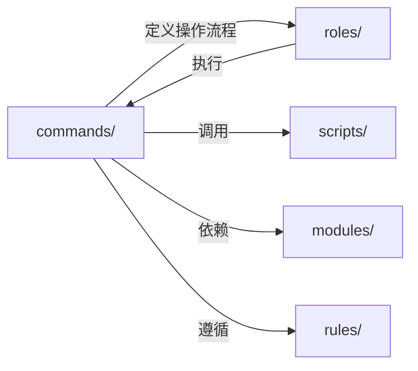
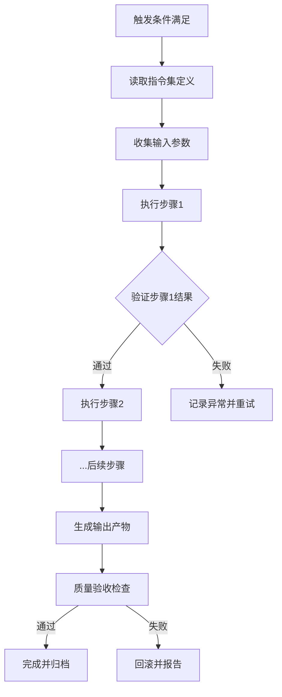

# Commands 指令集目录

`.agents/commands/` 目录存放智能体执行的标准化指令集，定义各核心操作的执行步骤、输入输出规范与质量验收标准。

## 设计理念

指令集是智能体与任务之间的桥梁，将高层任务需求转化为可执行的标准化操作流程。每条指令集包含：

- **触发条件**：何时启动该指令集
- **执行步骤**：标准化的操作流程
- **输入规范**：所需的上下文与参数
- **输出规范**：预期产出物与格式
- **质量验收**：验证标准与成功条件

## 指令集清单

| 指令集 | ID | 用途 | 关联模块 |
|--------|----|------|---------|
| 复盘 | retrospective | 项目复盘流程，生成复盘报告与改进建议 | [自我复盘](../modules/self-retrospective.md) |
| 洞察 | insight | 数据分析与问题诊断，识别优化机会与异常 | [自我洞察](../modules/self-insight.md) |
| 导出报告 | export-report | 结构化报告导出，支持多格式与归档 | [自我复盘](../modules/self-retrospective.md) |
| 原子化 | atomization | 文档与代码的原子化拆分，确保单一职责 | [自我萃取](../modules/self-extraction.md) |
| 原子提交 | atomic-commit | Git 原子化提交规范，确保单次提交单一职责 | [自我迭代](../modules/self-iteration.md) |

## 与其他目录的关系

- **roles/**：角色定义决定何时调用哪个指令集
- **scripts/**：指令集调用自动化脚本执行具体操作
- **modules/**：指令集是自我演进模块的具体操作落地
- **rules/**：指令集必须遵循规则体系中的约束条件

## 文件命名规范

- 采用英文小写命名，使用连字符 `-` 分隔单词
- 统一格式：`<功能>.md`，如 `retrospective.md`
- 包含 TOML frontmatter，标注 `id`、`category`、`source` 字段

## 指令集执行流程

