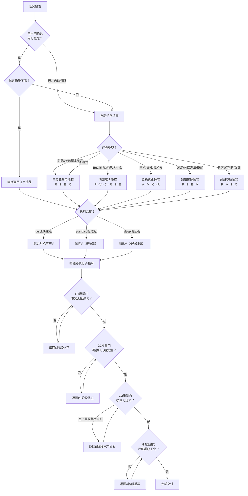

# 七概念方法论编排指令集

> **元指令（Orchestrator Command）**：本指令是七概念方法论体系的统一入口，根据任务场景自动识别并编排 R/F/I/E/V/A/C 七个概念的组合调用，串联质量门，确保流程正确、产出合格。

## 指令定位

七概念方法论编排指令是**元级指令**，不直接执行具体操作，而是：
1. **场景识别**：根据用户需求/任务特征判断属于哪种场景
2. **组合决策**：选择需要激活的概念组合与流程路径
3. **流程编排**：按正确顺序调用各子指令集，传递上下文
4. **质量门控**：在关键节点执行质量检查，不合格则返工
5. **产出整合**：汇总各概念产出，形成完整交付物

**与子指令集的关系**：
```
seven-concepts（元指令，编排者）
    ├── retrospective（R·复盘）
    ├── first-principles（F·第一性原理）
    ├── insight（I·洞察）
    ├── extraction（E·萃取）
    ├── adversarial-review（V·对抗性审查）
    ├── atomization（A·原子化）
    └── atomic-commit（C·原子提交）
```

## 触发条件

- 用户明确要求使用"七概念方法论"进行分析/复盘/重构
- 项目里程碑完成，需要标准复盘流程
- 重大问题/故障发生，需要根因分析到沉淀闭环
- 技术债重构，需要原子化拆分+质量保障
- 用户需求模糊/复杂，需要系统性方法论支撑
- 智能体判断任务需要多概念组合才能完成（而非单指令可解决）

**不应触发的场景**：
- 简单原子提交（直接用atomic-commit）
- 单纯文件拆分（直接用atomization）
- 已有明确结论只需要导出报告（直接用export-report）

## 输入规范

| 参数 | 类型 | 必选 | 说明 |
|------|------|------|------|
| scenario | string | 否 | 明确指定场景类型：`milestone`/`incident`/`refactoring`/`knowledge`/`innovation`/`auto`。默认`auto`（自动识别） |
| subject | string | 是 | 任务对象描述（如："智能文档系统v2.0上线复盘"、"支付模块性能问题根因分析"） |
| scope | string | 否 | 范围：`project`/`iteration`/`task`/`incident`/`module` |
| depth | string | 否 | 执行深度：`quick`（快速版，跳过对抗审查）/`standard`（标准版）/`deep`（深度版，全流程），默认`standard` |
| with_validation | boolean | 否 | 是否启用对抗审查，默认true（≥4人/深度版启用；quick版默认false） |
| deliverables | list | 否 | 预期产出物清单，默认根据场景自动判断 |
| time_budget | string | 否 | 时间预算（如："90min"/"3h"），用于流程裁剪 |

## RACI责任分配矩阵

| 核心活动 | orchestrator | architect | developer | reviewer | co-founder |
|:---|:---:|:---:|:---:|:---:|:---:|
| 场景识别与路径选择 | **R/A** | C | C | C | I |
| 概念组合确认与裁剪决策 | **R/A** | C | I | C | I |
| 子指令调用与上下文传递 | **R/A** | I | I | I | I |
| 阶段质量门检查 | C | C | I | **R/A** | I |
| 产出整合与最终交付 | **R/A** | C | I | C | I |
| 全流程质量验收 | C | C | I | **R/A** | I |
| 重大场景（项目级复盘/架构级重构）审批 | R | C | I | C | **A** |

### 审批权限边界

- **常规任务场景**：orchestrator负责场景识别和流程编排，reviewer负责质量门验收
- **技术深度场景**（根因分析/架构重构）：architect参与概念组合确认，审批技术判断
- **项目级/重大故障场景**：co-founder最终审批，确认复盘深度和敏感内容处理
- **质量门争议**：reviewer作为质量门禁最终判定，技术争议由architect仲裁

## 七概念缩写速查

| 缩写 | 概念 | 对应指令 | 层级定位 |
|:---:|------|---------|---------|
| **R** | 复盘（Retrospective） | retrospective | 感知层 |
| **F** | 第一性原理（First Principles） | first-principles | 认知层 |
| **I** | 洞察（Insight） | insight | 认知层 |
| **E** | 萃取（Extraction） | extraction | 沉淀层 |
| **V** | 对抗性审查（Adversarial Review） | adversarial-review | 验证层（横切） |
| **A** | 原子化（Atomization） | atomization | 执行层 |
| **C** | 原子提交（Atomic Commit） | atomic-commit | 执行层/沉淀层 |

## 场景识别与组合决策树

### 自动识别规则

根据用户输入关键词和任务特征自动判断场景：

| 场景类型 | 识别关键词/特征 | 概念组合 | 标准链路 |
|---------|----------------|---------|---------|
| **里程碑复盘** | 复盘、总结、回顾、Sprint结束、版本交付、上线后 | R→I→E→C | R（事实采集）→ I（洞察分析）→ E（模式萃取）→ [可选V] → C（行动项提交） |
| **问题解决/故障排查** | Bug、故障、问题、P0/P1、根因、为什么会发生 | F→V→C→R→I→E | F（5Why根因）→ V（验证根因）→ C（修复提交）→ R（事后复盘）→ I→E（沉淀） |
| **重构优化/技术债** | 重构、优化、技术债、坏味道、拆分、太大了 | A→V→C→(R) | A（原子化拆分）→ V（等价性验证）→ C（原子提交）→ [可选R（小复盘）] |
| **知识沉淀/方法论** | 总结方法、沉淀模式、经验、最佳实践、怎么做 | R→I→E→V→入库 | R（案例收集）→ I（本质发现）→ E（模式萃取）→ V（对抗验证）→ E入库 |
| **创新突破/方案设计** | 新方案、创新、从零开始、架构设计、怎么设计 | F→V→I→C | F（公理识别）→ V（假设攻击）→ I（洞察方案）→ C（PoC提交） |

### 决策树（Mermaid流程图）



## 五种标准流程编排

### 流程1：里程碑复盘（R→I→E→C）

**适用场景**：Sprint结束、版本交付、项目周期结束
**预期产出**：复盘报告 + 3条洞察 + 1-2个模式 + 3-5个原子行动项

```
步骤1：调用 retrospective（R）
  输入：scope=milestone, subject=<主题>
  输出：事实清单（≥20条客观事实，无因果词）
  → 质量门G1：事实无因果词检查（不合格返工）

步骤2：调用 insight（I）+ first-principles（F）
  输入：事实清单
  输出：3条核心洞察（每条含四元组：陈述/证据/反常识/行动）
  → 质量门G2：洞察四元组完整性检查（不合格返工）

步骤3（可选）：调用 adversarial-review（V）
  输入：洞察结论
  输出：审查意见 + 修正后的洞察
  跳过条件：depth=quick 或 <4人小组

步骤4：调用 extraction（E）
  输入：修正后的洞察
  输出：1-2个结构化可复用模式（含触发场景/步骤/反模式/迁移验证）
  → 质量门G3：模式可迁移性检查（无法迁移则重新抽象）

步骤5：调用 atomization（A）
  输入：洞察中的行动建议
  输出：原子行动项清单（每项符合5项原子标准）
  → 质量门G4：原子性检查（不合格重写）

步骤6：调用 atomic-commit（C）
  输入：行动项+模式文档+复盘报告
  输出：原子化提交 + 索引更新
```

### 流程2：问题解决（F→V→C→R→I→E）

**适用场景**：线上故障、P0/P1 Bug、根因不明的问题
**预期产出**：根因分析 + 修复提交 + 事后复盘 + 1个模式

```
步骤1：调用 first-principles（F）
  输入：问题描述
  输出：5Why根因分析（≥5层追问到系统性根因）

步骤2：调用 adversarial-review（V）
  输入：根因结论
  输出：根因验证（魔鬼代言人攻击，确认根因不是表面原因）
  注意：此环节V不可跳过，错误的根因导致错误的修复

步骤3：开发者执行修复 → 调用 atomic-commit（C）
  输出：修复提交（单一职责，包含测试用例验证修复）
  → 质量门：修复验证通过，问题不再复现

步骤4：调用 retrospective（R）
  输入：问题时间线+修复记录
  输出：故障复盘事实清单

步骤5：调用 insight（I）
  输入：复盘事实
  输出：问题预防洞察

步骤6：调用 extraction（E）
  输入：预防洞察
  输出：问题预防模式/检查项
  → 质量门G3：模式可用于预防同类问题
```

### 流程3：重构优化（A→V→C→R）

**适用场景**：技术债偿还、大文件拆分、架构优化
**预期产出**：原子化拆分方案 + 等价性验证报告 + 原子提交 + 小复盘

```
步骤1：调用 atomization（A）
  输入：待重构模块/文件
  输出：原子化拆分方案（单一职责拆分计划）

步骤2：调用 adversarial-review（V）
  输入：拆分方案
  输出：等价性验证（功能不变？有无遗漏依赖？）
  → 质量门：功能等价，无回归风险

步骤3：按拆分方案执行重构 → 调用 atomic-commit（C）
  每个拆分点一次原子提交
  每次提交后运行测试验证

步骤4（可选）：mini retrospective（R）
  输出：重构经验小复盘
```

### 流程4：知识沉淀（R→I→E→V→入库）

**适用场景**：同类经验≥2次、方法论沉淀、最佳实践入库
**预期产出**：案例集 + 结构化模式文档 + 成熟度标注 + 索引更新

```
步骤1：调用 retrospective（R）
  输入：≥2个独立案例
  输出：跨案例事实对比表

步骤2：调用 insight（I）+ first-principles（F）
  输出：跨案例共性洞察

步骤3：调用 extraction（E）
  输出：完整模式文档（含所有模板要素）

步骤4：调用 adversarial-review（V）
  输入：模式文档
  输出：多视角攻击意见 + 模式修正
  → 质量门G3：跨领域迁移验证通过

步骤5：调用 atomic-commit（C）
  输出：模式入库 + 索引更新 + 交叉引用修复
```

### 流程5：创新突破（F→V→I→C）

**适用场景**：新架构探索、新方案设计、从零开始的创新
**预期产出**：公理体系 + 假设攻击报告 + 洞察方案 + PoC提交

```
步骤1：调用 first-principles（F）
  输入：问题域描述
  输出：基础公理列表（不可再分的要素）

步骤2：调用 adversarial-review（V）
  输入：公理体系
  输出：假设攻击（哪些公理可能不成立？失败场景？）
  → 质量门：≥3个失败场景已防御

步骤3：调用 insight（I）
  输入：公理+失败边界
  输出：自下而上重构的创新方案

步骤4：PoC实现 → 调用 atomic-commit（C）
  输出：PoC代码/设计文档提交
```

## 质量门定义（G1-G4）

| 质量门 | 检查点 | 检查内容 | 不合格处理 | 适用流程 |
|:---:|--------|---------|-----------|---------|
| **G1** | 事实无因果词 | 事实清单中是否有"因为/所以/导致/错误/失误"等判断词 | 返回R阶段重写事实，剥离判断 | 所有涉及R的流程 |
| **G2** | 洞察四元组完整 | 每条洞察是否包含：陈述/证据(Fxx)/反常识/下次行动 | 返回I/F阶段补充缺失部分 | 所有涉及I的流程 |
| **G3** | 模式可迁移 | 模式是否能迁移到≥1个非当前领域场景 | 返回E阶段重新抽象，提升抽象层级 | 所有涉及E的流程 |
| **G4** | 行动项原子化 | 行动项是否符合：单一职责/可验证/有Owner/有时间/可独立交付 | 返回A阶段重写行动项 | 所有涉及行动项的流程 |
| **V门** | 对抗有实质内容 | 审查意见≥5条且具体，至少采纳2条修正 | 重新审查，不接受"写得很好"类客套话 | 启用V的流程 |

## 执行原则

### 顺序不可颠倒原则

概念层级依赖是严格的：
- **R（事实）必须在I（洞察）之前**：没有干净的事实基础，洞察一定有偏差
- **I（洞察）必须在E（萃取）之前**：没有想清楚"为什么"，就总结"怎么做"，是经验主义
- **V（审查）必须在C（提交）之前**：没有经过对抗的产出，质量门等于虚设
- **A（原子化）必须在C（提交）之前**：大的东西必须先拆再提交，保证单一职责

违反顺序的常见后果：先有结论再找事实（确认偏误）、凭经验萃取模式（无效模式）、未审查就提交（漏测/回归）。

### 裁剪规则

根据时间预算和深度灵活裁剪，但**核心链路顺序不可变**：

| 时间预算 | 里程碑复盘流程裁剪 |
|---------|------------------|
| 90分钟快速版 | 跳过V对抗审查，每个环节压缩5分钟 |
| 3小时标准版 | 全流程执行，V环节20分钟 |
| 6小时工作坊版 | 全流程+组间对抗+讲师点评+真实项目实操 |

**不可裁剪的最小闭环**：R→I→C（事实→洞察→行动），即使30分钟迷你复盘也必须走这三步。

### 上下文传递规范

调用子指令时必须传递完整上下文：
- 调用I时，必须传递R产出的事实清单（引用事实编号）
- 调用E时，必须传递I产出的洞察（包含四元组）
- 调用V时，必须传递待审查的完整产出（不能只给结论）
- 调用C时，必须传递所有前置产出（报告/模式/行动项）

禁止在上下文不完整时直接跳过前置步骤调用子指令。

## 输出规范

根据不同场景产出对应交付物包：

| 产出物 | 里程碑复盘 | 问题解决 | 重构优化 | 知识沉淀 | 创新突破 |
|--------|:---------:|:-------:|:-------:|:-------:|:-------:|
| 客观事实清单 | ✅ | ✅ | — | ✅ | — |
| 5Why根因分析 | — | ✅ | — | — | ✅ |
| 核心洞察（3条） | ✅ | ✅ | — | ✅ | ✅ |
| 可复用模式（1-2个） | ✅ | ✅ | — | ✅ | — |
| 对抗审查记录 | 🔘可选 | ✅必做 | ✅必做 | ✅必做 | ✅必做 |
| 原子行动项（3-5个） | ✅ | ✅ | — | — | — |
| 原子化拆分方案 | — | — | ✅ | — | — |
| PoC/修复提交 | — | ✅ | ✅ | ✅ | ✅ |
| 模式入库+索引更新 | ✅ | ✅ | — | ✅ | — |

## 与Skill门面的对应关系

当用户通过Skill触发时，对应关系：
- 用户说"复盘/总结一下" → 触发本指令 scenario=milestone
- 用户说"帮我分析下这个Bug/问题" → 触发本指令 scenario=incident
- 用户说"重构/拆分这个模块" → 触发本指令 scenario=refactoring
- 用户说"沉淀一下方法/总结个模式" → 触发本指令 scenario=knowledge
- 用户说"用七概念方法论分析" → 触发本指令 scenario=auto

## 关联资源

### 子指令集
- [复盘指令集](retrospective.md)
- [第一性原理指令集](first-principles.md)
- [洞察指令集](insight.md)
- [萃取指令集](extraction.md)
- [对抗性审查指令集](adversarial-review.md)
- [原子化指令集](atomization.md)
- [原子提交指令集](atomic-commit.md)

### 方法论体系文档
- [七概念方法论体系索引](../../docs/retrospective/patterns/methodology-patterns/governance-strategy/seven-concepts-methodology-index.md)
- [本质定位与五层层级模型](../../docs/retrospective/patterns/methodology-patterns/governance-strategy/seven-concepts-positioning-model.md)
- [组合触发决策树](../../docs/retrospective/patterns/methodology-patterns/governance-strategy/seven-concepts-trigger-decision-tree.md)
- [五种核心组合应用流程](../../docs/retrospective/patterns/methodology-patterns/governance-strategy/seven-concepts-core-workflows.md)
- [质量标准与检查清单](../../docs/retrospective/patterns/methodology-patterns/governance-strategy/seven-concepts-quality-standards.md)
- [实战演练材料](../../docs/retrospective/patterns/methodology-patterns/governance-strategy/exercises/README.md)
