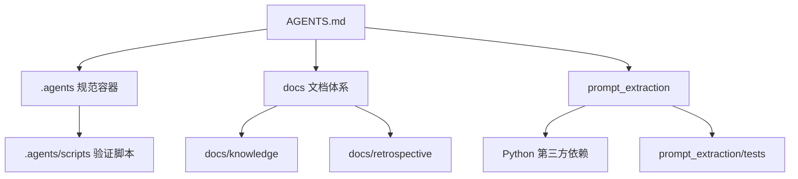
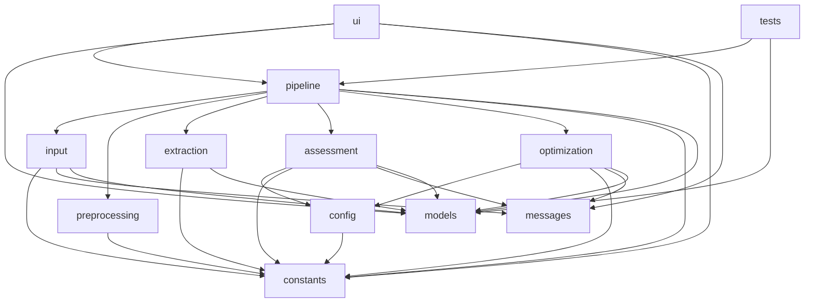
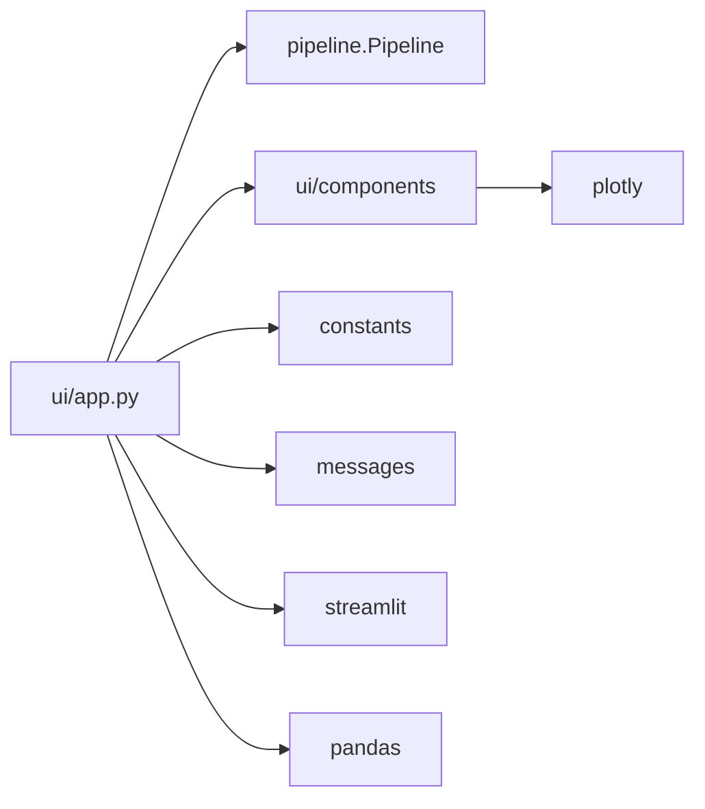
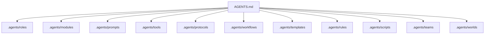
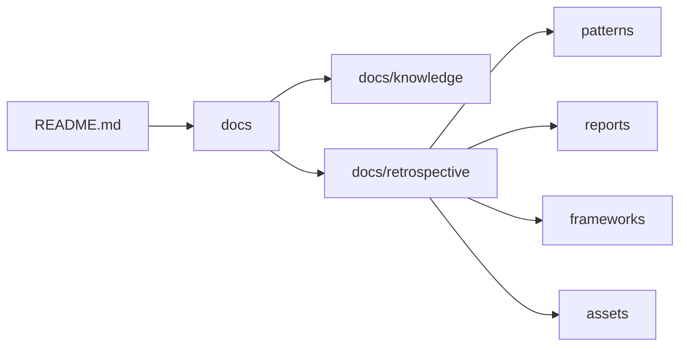

# 依赖关系

## 依赖关系总览

本项目的依赖关系可以分为四类：

1. 文档与规范资产之间的引用依赖。
2. `.agents/` 规范体系内部的角色、协议、工作流与脚本依赖。
3. `prompt_extraction/` Python 子项目内部模块依赖。
4. Python 第三方运行依赖。

## Python 第三方依赖

依赖文件：[`prompt_extraction/requirements.txt`](../../../prompt_extraction/requirements.txt)

| 依赖 | 版本约束 | 用途 |
|---|---|---|
| `streamlit` | `>=1.28.0` | Web UI 展示 |
| `pandas` | `>=2.0.0` | CSV 结果导出、表格数据处理 |
| `pytest` | `>=7.4.0` | 单元测试与集成测试 |
| `plotly` | `>=5.17.0` | 雷达图等可视化组件 |

## `prompt_extraction/` 模块依赖图

## 底层基础模块

### `constants/`

`constants/` 是提示词萃取系统的单一常量来源，保存：

| 文件 | 内容 |
|---|---|
| `thresholds.py` | 质量阈值、权重、评分常量、等级阈值 |
| `keywords.py` | 指令关键词、约束关键词、歧义词、输出类型映射、标点映射等 |
| `patterns.py` | 预编译正则表达式 |
| `paths.py` | 默认输出路径 |
| `styles.py` | UI 展示样式常量 |
| `__init__.py` | 汇总再导出所有常量 |

设计价值：业务模块不各自维护重复常量，降低硬编码扩散风险。

### `models.py`

`models.py` 定义跨模块共享的数据模型，是流水线的类型契约。

依赖特点：

- 被 `input`、`extraction`、`assessment`、`optimization`、`pipeline`、`ui`、`tests` 广泛依赖。
- 自身只依赖 Python 标准库，不依赖业务模块。
- 是全系统中最稳定的领域模型层。

### `messages/`

`messages/` 集中保存错误文案、评分建议、优化说明和 UI 文案。

依赖特点：

- 被 `input`、`assessment`、`optimization`、`ui` 使用。
- 有助于将文案从业务逻辑中剥离，降低文案变更对代码逻辑的影响。

### `config.py`

`config.py` 当前主要作为向后兼容门面，从 `constants` 中重导出配置项。

依赖特点：

- `assessment` 和 `optimization` 仍通过 `config` 读取质量阈值、权重、等级阈值等。
- 后续如需清理，可逐步迁移到直接引用 `constants`。

## 流水线依赖关系

`Pipeline` 是业务编排层，负责连接各独立模块。

| 阶段 | 调用模块 | 依赖方向 |
|---|---|---|
| 输入处理 | `input.input_handler` | `pipeline -> input` |
| 文本清洗 | `preprocessing.cleaner` | `pipeline -> preprocessing` |
| 文本标准化 | `preprocessing.normalizer` | `pipeline -> preprocessing` |
| 特征提取 | `extraction.extractor` | `pipeline -> extraction` |
| 质量评估 | `assessment.evaluator` | `pipeline -> assessment` |
| 优化生成 | `optimization.optimizer` | `pipeline -> optimization` |
| 结果导出 | `pandas` | `pipeline -> pandas` |

该设计让各业务模块保持相对独立，模块之间不直接相互调用，而是在流水线中组合。

## UI 依赖关系

`ui/app.py` 依赖：

- `Pipeline`：执行实际处理。
- `PromptRecord`：标注结果列表类型。
- `constants`：读取颜色、顺序、截断长度等样式与展示常量。
- `messages`：读取页面文案。
- `components`：复用评分卡、雷达图、diff 展示、导出按钮。
- `streamlit`、`pandas`：页面渲染与表格展示。

## 测试依赖关系

`prompt_extraction/tests/` 覆盖以下层级：

| 测试文件 | 主要覆盖对象 |
|---|---|
| `test_input.py` | 输入解析与输入处理 |
| `test_preprocessing.py` | 清洗与标准化 |
| `test_extraction.py` | 特征提取 |
| `test_assessment.py` | 质量评分 |
| `test_optimization.py` | 优化生成 |
| `test_pipeline.py` | 流水线编排 |
| `test_integration.py` | 端到端流程 |

测试依赖 `pytest`，部分导出场景依赖 `pandas`。

## 规范体系依赖关系

### 入口到规范容器

`AGENTS.md` 通过索引表引用 `.agents/` 内的角色、模块、协议、规则、工具、工作流、模板和提示词。

### 文档与知识资产依赖

`README.md` 是面向人类读者的项目入口，引用 `docs/`、`.agents/` 和 `prompt_extraction/`。`docs/retrospective/` 中的复盘报告和模式库又为后续开发提供可复用方法论。

## 自动化脚本依赖

多数 `.agents/scripts/` 脚本遵循零依赖或低依赖原则，优先使用 Python 标准库，以降低运行门槛。

| 脚本 | 主要依赖 | 说明 |
|---|---|---|
| `check-gitignore.py` | Python 标准库、Git 命令 | 验证忽略规则和 Git 状态 |
| `check-links.py` | Python 标准库、可选 HTTP 请求能力 | 检查 Markdown 链接 |
| `check-spec-consistency.py` | Python 标准库、正则解析 | 检查规格、任务、清单一致性 |
| `generate-nav.py` | Python 标准库 | 扫描文档并生成导航 |
| `check-move.py` | Python 标准库 | 移动文件并更新相对链接 |
| `check-source-traceability.py` | Python 标准库、TOML/frontmatter 解析逻辑 | 建立溯源索引 |
| `check-role-permissions.py` | Python 标准库、TOML 解析逻辑 | 校验角色权限声明 |

## 依赖设计评价

| 方面 | 评价 |
|---|---|
| 模块分层 | `constants`、`models` 位于底层，业务模块通过 `Pipeline` 组合，层次清晰 |
| 循环依赖 | 未发现关键业务模块之间存在明显循环依赖 |
| 第三方依赖 | Python 子项目依赖少，集中在 UI、数据处理、测试和图表 |
| 文档依赖 | 文档体系引用较多，应依赖链接检查脚本维持一致性 |
| 可扩展性 | 新增评分维度、提取规则或 UI 组件时可局部扩展，影响面较可控 |
