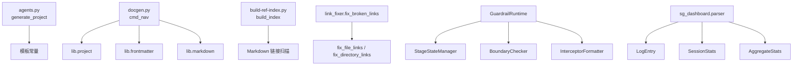

---
source:
  - ../../scripts/agents.py
  - ../../scripts/docgen.py
  - ../../scripts/build-ref-index.py
  - ../../scripts/lib/project.py
  - ../../scripts/lib/frontmatter.py
  - ../../scripts/lib/link_fixer/cli.py
  - ../../scripts/lib/spec_loader.py
  - ../../scripts/lib/stage_guardrails/state/manager.py
  - ../../scripts/lib/stage_guardrails/boundary.py
  - ../../scripts/lib/stage_guardrails/runtime.py
  - ../../scripts/sg_dashboard/models.py
  - ../../scripts/sg_dashboard/parser.py
status: stable
updated_at: 2026-08-23
---

# 关键类与函数

## 阅读说明

本页只收录“对理解整个仓库最关键”的代码入口，而不是罗列所有脚本。筛选标准是：

- 处于共享库中心位置
- 被多个脚本复用
- 直接承担路由、索引、状态机或运行时门面角色

## 顶层 CLI 入口

### `generate_project()`

- 位置：[agents.py](../../scripts/agents.py#L171-L242)
- 作用：为新项目生成 `AGENTS.md`、`.agents/roles/*.md` 和 `.gitignore` 骨架
- 输入：`target_dir`、`name`、`project_type`、`lang`、`roles`、`dry_run`
- 输出：`{"created": [], "skipped": [], "errors": []}` 形式的结果字典
- 特点：把角色预设、语言规则和模板渲染集中在一个入口里，是脚手架能力的核心实现

### `cmd_nav()`

- 位置：[docgen.py](../../scripts/docgen.py#L124-L158)
- 作用：扫描目标目录中的 Markdown 文档并更新带 marker 的导航区块
- 依赖：
  - [resolve_project_root()](../../scripts/lib/project.py#L18-L53)
  - [parse_frontmatter_unified()](../../scripts/lib/frontmatter.py#L508-L536)
  - `lib.markdown.update_marker_region`
- 典型场景：刷新 `README.md`、`.agents/docs/README.md` 等导航表

### `build_index()`

- 位置：[build-ref-index.py](../../scripts/build-ref-index.py#L171-L210)
- 作用：扫描项目内所有 Markdown 文件，构建“谁引用了谁”的反向索引
- 输入：`project_root`、`verbose`
- 输出：`RefIndex`
- 核心价值：为文件移动、删除和批量修链提供事实基础

## 共享基础设施 API

### `resolve_project_root()`

- 位置：[project.py](../../scripts/lib/project.py#L18-L53)
- 作用：从任意锚点文件向上查找项目根目录
- 查找策略：
  - 优先找到包含 `AGENTS.md` 的最近祖先
  - 找不到时回退到包含 `README.md` 的最近祖先
- 价值：消除脚本里硬编码的 `parent.parent.parent`

### `parse_frontmatter_unified()`

- 位置：[frontmatter.py](../../scripts/lib/frontmatter.py#L508-L536)
- 作用：统一解析 YAML/TOML frontmatter，并处理 `x-toml-ref`
- 重要行为：
  - 优先识别 YAML
  - 支持 YAML + 外部 TOML 合并
  - 对纯 TOML frontmatter 给出兼容性处理
- 价值：让文档类脚本在元数据读取上有单一可信入口

### `fix_broken_links()`

- 位置：[link_fixer/cli.py](../../scripts/lib/link_fixer/cli.py#L32-L110)
- 作用：提供一站式断链修复 API，同时支持目录级和文件级修复
- 关键参数：
  - `project_root`
  - `rename_map`
  - `line_remap`
  - `prefer_subdir`
  - `dry_run`
- 典型调用方：`check-links.py`、`finalize-atomization.py`

## 规范加载与渐进式披露

### `LoadedSpec`

- 位置：[spec_loader.py](../../scripts/lib/spec_loader.py#L320-L327)
- 作用：表示单个已加载规范文件的元数据
- 关键字段：`path`、`layer`、`content`、`char_count`、`loaded_from`

### `LoadResult`

- 位置：[spec_loader.py](../../scripts/lib/spec_loader.py#L329-L373)
- 作用：聚合一次规范加载的结果
- 关键能力：
  - 统计各层已加载文件数
  - 跟踪 `missing_specs`
  - 通过 `summary()` 输出人类可读摘要

### `SpecLoader`

- 位置：[spec_loader.py](../../scripts/lib/spec_loader.py#L376-L497)
- 作用：实现 L0/L1/L2 的渐进式规范加载
- 内建层级：
  - `L0_SPECS`
  - `L1A_CORE_SPECS`
  - `L1B_INDEX_SPECS`
- 核心特点：
  - 自动解析项目根目录
  - 支持磁盘缓存
  - 支持按任务类型按需加载

## 阶段守卫核心 API

### `StageStateManager`

- 位置：[state/manager.py](../../scripts/lib/stage_guardrails/state/manager.py#L21-L115)
- 作用：维护单个会话的阶段状态机
- 管理内容：
  - 当前阶段与当前角色
  - 阶段转换记录
  - 跳转申请记录
  - 已完成阶段列表
- 对外表现：是 `GuardrailRuntime` 的状态来源

### `BoundaryChecker`

- 位置：[boundary.py](../../scripts/lib/stage_guardrails/boundary.py#L450-L549)
- 作用：根据阶段和角色判断某个操作是否合法
- 特点：
  - 只读操作全局放行
  - 对无活跃阶段、非法阶段、非法角色分别返回不同拒绝结果
  - 返回值是结构化 `BoundaryResult`，而不是简单布尔值

### `GuardrailRuntime`

- 位置：[runtime.py](../../scripts/lib/stage_guardrails/runtime.py#L83-L207)
- 作用：把状态管理、边界校验和输出格式化封装为统一运行时门面
- 核心方法：`guard_operation()`
- 处理链路：
  1. 读取当前阶段状态
  2. 检查 baby-code 豁免
  3. 调用 `BoundaryChecker.check()`
  4. 格式化日志与用户消息
  5. 统计拦截与绕过次数

## SG Dashboard 数据模型

### `LogEntry`

- 位置：[sg_dashboard/models.py](../../scripts/sg_dashboard/models.py#L25-L39)
- 作用：表示单条结构化日志
- 关键字段：`event`、`stage`、`role`、`session`、`ctx`、`source_file`、`line_num`

### `SessionStats`

- 位置：[sg_dashboard/models.py](../../scripts/sg_dashboard/models.py#L41-L63)
- 作用：表示单个会话的统计快照
- 统计内容：阶段进入/退出、操作检查/放行/拦截、跳转申请、错误数、会话完成状态

### `AggregateStats`

- 位置：[sg_dashboard/models.py](../../scripts/sg_dashboard/models.py#L65-L107)
- 作用：表示跨会话聚合结果
- 派生属性：
  - `interception_rate`
  - `approval_rate`
  - `completion_rate`

### `parse_log_file()`

- 位置：[sg_dashboard/parser.py](../../scripts/sg_dashboard/parser.py#L39-L77)
- 作用：把单个日志文件解析为 `LogEntry` 列表
- 特点：
  - 只处理含 `[SG-LOG]` 或 `[PDR-LOG]` 的行
  - 使用 `LOG_LINE_RE` 提取结构化字段
  - 通过 `parse_ctx()` 解析 JSON 上下文

## 调用关系速览

## 识别规律

- 顶层脚本多数只负责命令编排，真正的业务逻辑在 `lib/`。
- 共享类型与结果对象大量使用 `dataclass`，便于在脚本间传递结构化状态。
- 仓库中最具“平台内核”性质的 API 不是某个应用函数，而是路径解析、frontmatter 解析、规范加载、边界校验和日志聚合这几类基础能力。
