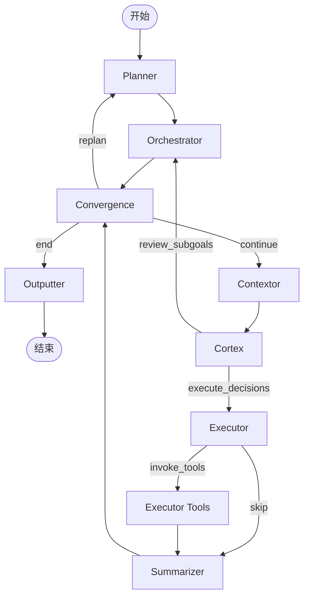

# 架构解析：9-Agent 协作系统

## 设计理念

mobile-use 的核心突破在于**任务分解**——将"自然语言指令→手机操作"这一复杂问题拆解为多个专业化 Agent 的分层协作循环，而非用单一 Agent 端到端解决。这是其在 AndroidWorld 基准达到 100% 准确率的关键架构决策。

**单 Agent 的问题**：一个 LLM 同时承担"理解目标→规划步骤→感知界面→决策操作→执行工具→总结进度"所有职责，容易出现上下文混乱、错误累积、无法从失败中恢复。

**多 Agent 分层**：每个 Agent 职责单一，通过 LangGraph 状态机传递信息，形成"规划→感知→决策→执行→审查"的闭环。

## 9 个 Agent 职责矩阵

| Agent | 核心职责 | 输入 | 输出 | 类比 |
|---|---|---|---|---|
| **Planner** | 将用户目标分解为有序子目标列表 | 初始目标、历史记录 | `Subgoal[]` 子目标计划 | 项目经理 |
| **Orchestrator** | 管理子目标生命周期，标记完成/触发重规划 | 当前子目标、执行进度 | 更新后的子目标状态、complete_subgoals_by_ids | 调度员 |
| **Contextor** | 采集设备当前状态（UI层级、截图、前台App） | 设备连接 | latest_ui_hierarchy、latest_screenshot、focused_app_info | 侦察兵 |
| **Cortex** | 分析当前状态，为 Executor 生成结构化决策指令 | UI层级、截图、当前子目标、历史思考 | structured_decisions（操作指令）、complete_subgoals_by_ids | 决策者 |
| **Executor** | 将决策指令转换为具体工具调用 | structured_decisions | executor_messages（含tool_calls） | 操作员 |
| **Executor Tools** | 实际执行移动操作（点击/滑动/输入等） | tool_calls | 工具执行结果 | 手 |
| **Summarizer** | 总结本轮执行结果，更新进度认知 | 工具执行结果、状态快照 | agents_thoughts（思考记录） | 记录员 |
| **Outputter** | 格式化最终输出结果 | 最终状态、输出配置 | 格式化后的最终结果 | 报告员 |
| **Hopper** | （辅助）处理App间跳转导航决策 | 当前App、目标位置 | 导航操作建议 | 导航员 |
| **Video Analyzer** | （可选）分析屏幕录制视频内容 | 视频帧 | 视频内容描述 | 视频分析员 |

> **注意**: Hopper、Video Analyzer、Outputter 为辅助节点，不在主执行循环的核心路径中。

## LangGraph 状态机

整个系统基于 LangGraph 的 `StateGraph` 构建，状态通过 `State` 类定义，使用 Reducer 模式管理并发更新。

### 核心执行循环



### 三个门控节点详解

#### 1. convergence_gate（收敛门）
**位置**：Orchestrator 和 Summarizer 之后

**判断逻辑**：
```python
def convergence_gate(state) -> "continue" | "replan" | "end":
    if 任一子目标失败:
        return "replan"      # 需要重新规划
    if 所有子目标完成:
        return "end"         # 任务完成
    if 没有当前运行的子目标:
        return "end"         # 异常终止
    return "continue"        # 继续执行当前子目标
```

**作用**：这是主循环的"红绿灯"，决定是继续下一步、重新规划还是结束任务。

#### 2. post_cortex_gate（Cortex后路由）
**位置**：Cortex 之后

**判断逻辑**：
- 如果有子目标需要标记完成 → 走 Orchestrator 路径（review_subgoals）
- 如果有结构化决策需要执行 → 走 Executor 路径（execute_decisions）
- 两者可同时为真，Orchestrator 和 Executor 并行执行

**作用**：Cortex 可以同时完成"标记子目标完成"和"生成下一步操作"两件事，这个门控实现了并行路径。

#### 3. post_executor_gate（Executor后路由）
**位置**：Executor 之后

**判断逻辑**：
```python
def post_executor_gate(state) -> "invoke_tools" | "skip":
    last_message = state.executor_messages[-1]
    if last_message 有 tool_calls:
        return "invoke_tools"  # 需要实际执行工具
    return "skip"              # 没有工具调用，直接总结
```

**作用**：判断 Executor 是否真正产生了需要执行的工具调用，避免空转。

## State 状态管理

### State 类核心字段

| 字段组 | 字段名 | Reducer | 说明 |
|---|---|---|---|
| 通用 | `messages` | `add_messages` | 全局消息历史 |
| 通用 | `remaining_steps` | - | 剩余步数（防止无限循环） |
| Planner | `initial_goal` | - | 用户初始目标 |
| Orchestrator | `subgoal_plan` | - | 子目标计划列表 |
| Contextor | `latest_ui_hierarchy` | `take_last` | 最新UI层级（只保留最新） |
| Contextor | `latest_screenshot` | `take_last` | 最新截图base64（只保留最新） |
| Contextor | `focused_app_info` | `take_last` | 前台App信息 |
| Cortex | `structured_decisions` | `take_last` | 结构化决策指令 |
| Cortex | `complete_subgoals_by_ids` | `take_last` | 待完成子目标ID列表 |
| Executor | `executor_messages` | `add_messages` | Executor独立消息历史 |
| 通用 | `agents_thoughts` | `take_last` | 所有Agent的思考记录 |
| 通用 | `scratchpad` | `merge_dicts` | 持久化键值记忆 |

### Reducer 模式

mobile-use 使用三种 Reducer 来管理状态更新，这是 LangGraph 的核心机制：

| Reducer | 行为 | 适用场景 |
|---|---|---|
| `add_messages` | 追加消息到列表 | 消息历史（messages、executor_messages） |
| `take_last` | 新值覆盖旧值 | UI层级、截图、决策等只关心最新状态的数据 |
| `merge_dicts` | 合并字典（b覆盖a） | scratchpad持久化记忆 |

> **设计洞察**：为什么 Executor 有独立的 `executor_messages` 而不是共用 `messages`？
> 
> 因为 Executor 的消息只包含工具调用和工具结果，这些是高频、低语义密度的数据，与 Planner/Cortex 等的高层思考混在一起会污染上下文窗口。独立消息历史让 Executor 专注于"决策→工具调用"的短链路，避免上下文膨胀。

## MobileUseContext：运行时上下文

`State` 是 LangGraph 图内部的状态，而 `MobileUseContext` 是跨节点共享的运行时上下文（依赖注入容器）：

| 字段 | 说明 |
|---|---|
| `trace_id` | 任务追踪ID |
| `device` (DeviceContext) | 设备信息（平台、分辨率、设备ID） |
| `adb_client` | ADB客户端（Android） |
| `ui_adb_client` | UI Automator客户端（Android） |
| `ios_client` | iOS客户端（IDB/WDA/Limrun/BrowserStack） |
| `limrun_android_controller` | Limrun Android控制器 |
| `llm_config` | 当前Profile的LLM配置 |
| `on_agent_thought` | Agent思考回调（用于平台实时推送） |
| `on_plan_changes` | 计划变更回调 |
| `video_recording_enabled` | 是否启用视频录制 |

> Context 在构建图时传入，所有 Agent Node 通过 `self.ctx` 访问，实现了"图状态"与"运行时依赖"的分离。

## 执行流程示例："打开设置查看电量"

让我们通过一个简单任务走一遍完整循环：

1. **START → Planner**：Planner 接收目标"查看电量"，分解为子目标：
   - [ ] 打开设置App
   - [ ] 找到电池/电量相关选项
   - [ ] 读取电量百分比

2. **Planner → Orchestrator**：Orchestrator 标记第一个子目标"打开设置App"为进行中

3. **Orchestrator → Convergence**：convergence_gate 检查，有未完成子目标 → `continue`

4. **Convergence → Contextor**：Contextor 截图、获取UI层级、检测前台App（当前在桌面）

5. **Contextor → Cortex**：Cortex 分析UI，看到桌面，决策是"需要找到并点击设置图标"，输出结构化决策："点击设置图标（坐标 x,y）"

6. **Cortex → Executor**：post_cortex_gate 有决策 → execute_decisions

7. **Executor → Executor Tools**：Executor 生成 tap 工具调用，post_executor_gate 检测到 tool_calls → invoke_tools

8. **Executor Tools → Summarizer**：tap 执行成功，Summarizer 记录"已点击设置图标，等待App启动"

9. **Summarizer → Convergence**：回到收敛门，继续循环...

10. （重复循环直到设置打开、找到电量、读取数值）

11. **Convergence → Outputter**：所有子目标完成，Outputter 格式化输出"当前电量：85%"

12. **Outputter → END**

## 为什么这个架构有效？

| 设计决策 | 带来的优势 |
|---|---|
| **Planner 一次性分解子目标** | 避免每一步都重新思考"我在哪、要去哪"，减少上下文漂移 |
| **Orchestrator 显式管理子目标状态** | 失败时可以精确重规划单个子目标，而非从头开始 |
| **Contextor 专职感知** | Cortex 永远拿到最新的UI状态，不需要自己去截图/拉层级 |
| **Cortex 只做决策不执行** | 决策层和执行层分离，决策Prompt可以更聚焦"分析"，执行Prompt更聚焦"工具调用" |
| **Executor 独立消息历史** | 防止工具调用结果污染高层推理上下文 |
| **Convergence Gate 显式收敛检查** | 每轮循环都有明确的继续/重规划/终止判断，避免死循环 |
| **take_last Reducer** | UI/截图等大对象只保留最新，控制状态大小 |

## 与单 Agent ReAct 模式的对比

| 维度 | 单 Agent ReAct | mobile-use 多 Agent |
|---|---|---|
| 上下文窗口 | 所有历史混杂，容易超长 | 按职责分离，关键状态用take_last压缩 |
| 错误恢复 | 一步错步步错，需从头来 | Orchestrator 可重规划单个子目标 |
| 可调试性 | 黑盒，不知道哪一步想错了 | 每个Agent的思考都在agents_thoughts中可追溯 |
| 可扩展性 | 加新能力需改Prompt，容易冲突 | 新增Agent/工具不影响其他节点 |
| 适用场景 | 简单、短链路任务 | 复杂、多步骤、需要错误恢复的任务 |

> **源码参考**:
> - [graph.py](file:///d:/AI/.chaos/libs/mobile-use/minitap/mobile_use/graph/graph.py) - 图定义与门控逻辑
> - [state.py](file:///d:/AI/.chaos/libs/mobile-use/minitap/mobile_use/graph/state.py) - State状态定义
> - [context.py](file:///d:/AI/.chaos/libs/mobile-use/minitap/mobile_use/context.py) - MobileUseContext定义
