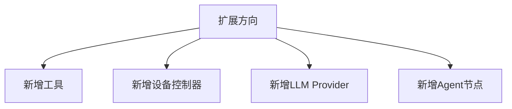

# 扩展开发指南

mobile-use 设计了四个明确的扩展方向：



## 扩展点1：新增自定义工具

这是最常见的扩展场景。

### 步骤1：创建 ToolWrapper

```python
# my_tools/take_screenshot_and_analyze.py
from minitap.mobile_use.tools.tool_wrapper import ToolWrapper
from PIL import Image
import io

async def analyze_screen(ctx, question: str) -> str:
    """截取当前屏幕并用多模态模型分析特定问题。
    
    当需要对当前屏幕内容进行复杂视觉理解（不仅仅依赖UI层级XML）时使用此工具。
    例如：识别图片内容、读取图表、分析颜色/布局、OCR手写文字等。
    """
    # 1. 通过ctx获取控制器截图
    controller = _get_controller_from_ctx(ctx)
    screenshot_bytes = await controller.screenshot()
    image = Image.open(io.BytesIO(screenshot_bytes))
    
    # 2. 使用多模态LLM分析
    from minitap.mobile_use.services.llm import get_google_llm
    from langchain_core.messages import HumanMessage
    
    llm = get_google_llm("gemini-2.0-flash")
    response = await llm.ainvoke([
        HumanMessage(content=[
            {"type": "text", "text": question},
            {"type": "image_url", "image_url": {
                "url": f"data:image/png;base64,{_image_to_base64(image)}"
            }}
        ])
    ])
    
    return response.content

analyze_screen_wrapper = ToolWrapper(
    name="analyze_screen",
    description="""截取当前屏幕并用视觉模型分析回答问题。
    使用场景：当UI层级树中缺少需要的信息（如图标颜色、图片内容、图表数据），
    或者需要理解非标准UI元素时使用。不要用此工具替代普通的tap/input操作。
    
    参数:
    - question: 要向视觉模型提问的具体问题，要明确描述你想知道什么。
    """,
    params_schema={
        "type": "object",
        "properties": {
            "question": {
                "type": "string",
                "description": "关于当前屏幕的具体问题，例如'这个按钮是什么颜色？'或'列表中有几个未读消息标记？'"
            }
        },
        "required": ["question"]
    },
    run=analyze_screen
)
```

### 步骤2：注册工具

```python
from minitap.mobile_use.tools.index import EXECUTOR_WRAPPERS_TOOLS
from my_tools.take_screenshot_and_analyze import analyze_screen_wrapper

# 注册到工具列表
EXECUTOR_WRAPPERS_TOOLS.append(analyze_screen_wrapper)
```

### 工具描述编写原则

工具的 `description` 是 Executor LLM 决定是否调用此工具的唯一依据，必须：

1. **明确说明使用场景**：什么时候该用，什么时候不该用
2. **解释参数含义**：每个参数的用途和示例值
3. **说明返回内容**：工具会返回什么信息
4. **避免模糊描述**："做一些操作" ❌ / "点击坐标(x,y)处的元素，返回点击结果" ✅

## 扩展点2：新增设备控制器

当需要支持新的移动平台（如 HarmonyOS）或新的云设备服务时使用。

### 步骤1：创建客户端（Client）

```python
# clients/harmony_client.py
class HarmonyClient:
    """HarmonyOS 设备通信客户端"""
    
    def __init__(self, device_id: str):
        self.device_id = device_id
    
    async def connect(self): ...
    async def tap(self, x: int, y: int): ...
    async def swipe(self, sx, sy, ex, ey, duration): ...
    async def screenshot(self) -> bytes: ...
    async def get_ui_tree(self) -> list[dict]: ...
    async def input_text(self, text: str): ...
    async def press_back(self): ...
    async def launch_app(self, bundle: str): ...
```

### 步骤2：实现控制器（Controller）

```python
# controllers/harmony_controller.py
from minitap.mobile_use.controllers.device_controller import MobileDeviceController

class HarmonyController(MobileDeviceController):
    def __init__(self, client: HarmonyClient, config):
        self.client = client
        self._screen_size = None
    
    async def tap(self, x: int, y: int):
        await self.client.tap(x, y)
    
    async def long_press(self, x: int, y: int, duration: float = 1.0):
        await self.client.long_press(x, y, duration)
    
    async def swipe(self, start_x, start_y, end_x, end_y, duration=0.5):
        await self.client.swipe(start_x, start_y, end_x, end_y, duration)
    
    async def screenshot(self):
        return await self.client.screenshot()
    
    async def get_ui_hierarchy(self):
        return await self.client.get_ui_tree()
    
    async def get_screen_size(self):
        if not self._screen_size:
            self._screen_size = await self.client.get_screen_size()
        return self._screen_size
    
    async def get_current_app(self):
        return await self.client.get_current_app()
    
    async def launch_app(self, package_name: str):
        await self.client.launch_app(package_name)
    
    # ... 实现其余抽象方法
```

### 步骤3：注册到工厂

在 `controllers/controller_factory.py` 中添加新平台的创建逻辑。

## 扩展点3：新增 LLM Provider

当需要接入未内置的 LLM 服务时使用。

### 方式一：OpenAI兼容接口（最简单）

如果新Provider兼容OpenAI API格式，无需写代码，只需在配置中：

```jsonc
{
  "cortex": {
    "provider": "openai",  // 复用openai provider
    "model": "your-model-name"
  }
}
```

```env
OPENAI_BASE_URL=https://your-provider.com/v1
OPENAI_API_KEY=your-key
```

### 方式二：原生 LangChain 集成

如果需要原生集成：

1. 在 `services/llm.py` 中添加新的工厂函数：

```python
from langchain_community.chat_models import YourChatModel  # 或自己实现

def get_your_provider_llm(model: str) -> BaseChatModel:
    return YourChatModel(
        model=model,
        api_key=settings.YOUR_API_KEY,
    )
```

2. 在 `get_llm()` 分发函数中添加新的provider分支：

```python
def get_llm(node_config: LLM | LLMWithFallback) -> BaseChatModel:
    provider = node_config.provider
    model = node_config.model
    
    if provider == "openai":
        llm = get_openai_llm(model)
    elif provider == "your_provider":
        llm = get_your_provider_llm(model)
    # ...
    else:
        raise ValueError(f"Unknown provider: {provider}")
    
    # fallback wrapping...
    return llm
```

3. 在 `.env` 和 `config.py` 的settings中添加对应的API Key配置项。

## 扩展点4：新增Agent节点（高级）

这是最复杂的扩展，需要修改LangGraph图结构。

### 适用场景

- 需要在现有循环中插入新的处理步骤
- 需要全新的专业化Agent（如专门处理验证码、专门处理表单填写）
- 需要修改执行流程（如加入人工审核节点）

### 步骤1：创建Agent Node类

```python
# agents/captcha_solver/captcha_solver.py
from langchain_core.messages import AIMessage
from minitap.mobile_use.context import MobileUseContext

class CaptchaSolverNode:
    def __init__(self, ctx: MobileUseContext):
        self.ctx = ctx
    
    async def __call__(self, state: State):
        # 1. 检查是否有验证码（从UI层级判断）
        if not self._has_captcha(state.latest_ui_hierarchy):
            return {}  # 无验证码，跳过
        
        # 2. 调用验证码解决服务
        solution = await self._solve_captcha(state.latest_screenshot)
        
        # 3. 返回状态更新
        return {
            "structured_decisions": f"输入验证码: {solution}",
            "agents_thoughts": f"[captcha_solver] 检测到验证码，解决方案: {solution}"
        }
    
    def _has_captcha(self, ui_hierarchy) -> bool: ...
    async def _solve_captcha(self, screenshot_b64) -> str: ...
```

### 步骤2：编写Agent提示词（.md文件）

在同目录创建 `captcha_solver.md`，使用Jinja2模板格式。

### 步骤3：将节点加入图

修改 `graph/graph.py` 的 `get_graph()` 函数：

```python
from minitap.mobile_use.agents.captcha_solver.captcha_solver import CaptchaSolverNode

async def get_graph(ctx: MobileUseContext) -> CompiledStateGraph:
    graph_builder = StateGraph(State)
    
    # ... 现有节点 ...
    graph_builder.add_node("captcha_solver", CaptchaSolverNode(ctx))
    
    # 修改边：在contextor之后加入验证码检测
    # 原: graph_builder.add_edge("contextor", "cortex")
    # 改为:
    graph_builder.add_edge("contextor", "captcha_solver")
    graph_builder.add_conditional_edges(
        "captcha_solver",
        lambda state: "solve" if state.structured_decisions else "continue",
        {"solve": "executor", "continue": "cortex"}
    )
    
    # ...
```

### 步骤4：在LLMConfig中添加配置

在 `config.py` 的 `LLMConfig` 中添加新节点的LLM配置项。

## 扩展原则与注意事项

### 开闭原则（OCP）

- 优先通过**新增**（新工具、新Controller、新Provider）扩展，而非修改现有代码
- ToolWrapper机制天然支持开闭——新增工具不需要修改图结构
- Controller层的抽象基类定义了稳定接口，新平台实现接口即可

### 上下文访问规范

自定义工具/Agent 访问设备时，必须通过 `ctx` 获取控制器：

```python
# ✅ 正确：通过ctx访问，自动适配平台
from minitap.mobile_use.controllers.controller_factory import get_controller_for_ctx
controller = get_controller_for_ctx(ctx)
await controller.tap(x, y)

# ❌ 错误：直接创建特定平台客户端，会破坏跨平台兼容性
from minitap.mobile_use.clients.ui_automator_client import UIAutomatorClient
client = UIAutomatorClient(...)  # 只支持Android！
```

### 状态更新规范

Agent节点更新State时，必须使用State的`asanitize_update()`方法：

```python
async def __call__(self, state: State):
    update = {
        "agents_thoughts": "my thought",
        # 其他字段更新
    }
    return await state.asanitize_update(self.ctx, update, agent="cortex")
```

### 异步规范

所有设备操作、LLM调用、网络请求必须使用 `async/await`，禁止阻塞事件循环：

```python
# ✅ 正确
await asyncio.to_thread(blocking_io_operation)
result = await llm.ainvoke(messages)

# ❌ 错误
result = llm.invoke(messages)  # 阻塞调用！
time.sleep(1)                  # 阻塞！用 await asyncio.sleep(1)
```

### 错误处理规范

工具执行失败时，返回错误信息字符串（而非抛出异常），让Executor LLM看到错误并决定如何重试：

```python
async def my_tool(ctx, ...):
    try:
        result = await do_something()
        return f"Success: {result}"
    except Exception as e:
        return f"Error: {str(e)}. Please check the parameters and try again."
```

> 但初始化阶段的错误（如连接失败、认证失败）应正常抛出异常。

## 常见扩展模式

| 模式 | 说明 | 扩展点 |
|---|---|---|
| **自定义数据抓取** | 从特定App抓取数据 | 新增工具（+ Pydantic输出模型） |
| **特定App自动化** | 针对某个App的专用操作流程 | 新增工具 + locked_app_package |
| **视觉理解增强** | 用多模态模型补充UI树信息不足 | 新增工具（调用Vision LLM） |
| **验证码/反爬处理** | 自动识别验证码 | 新增Agent节点（在Contextor后插入） |
| **企业内网部署** | 接入内部LLM服务 | 新增Provider（OpenAI兼容） |
| **私有云设备** | 接入内部云测平台 | 新增Client + Controller |
| **人工介入** | 不确定时请求人类确认 | 新增人工审核Agent节点 |

> **源码参考**:
> - [tools/tool_wrapper.py](file:///d:/AI/.chaos/libs/mobile-use/minitap/mobile_use/tools/tool_wrapper.py) - ToolWrapper基类
> - [controllers/device_controller.py](file:///d:/AI/.chaos/libs/mobile-use/minitap/mobile_use/controllers/device_controller.py) - 控制器抽象基类
> - [services/llm.py](file:///d:/AI/.chaos/libs/mobile-use/minitap/mobile_use/services/llm.py) - LLM工厂
> - [graph/graph.py](file:///d:/AI/.chaos/libs/mobile-use/minitap/mobile_use/graph/graph.py) - 图定义
