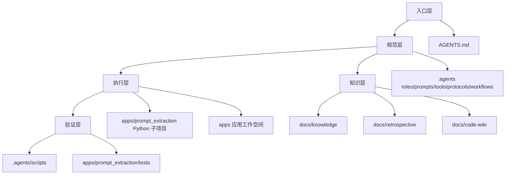

# 项目总览

## 项目定位

本项目是一套面向多智能体协作开发的开放规范体系，基于 AGENTS.md 开放标准组织项目级智能体上下文，让不同智能体能够按照统一入口、统一角色边界、统一协议和统一工作流协作交付。

项目同时包含一个独立的 Python 子项目 `apps/prompt_extraction/`，用于从对话或提示词文本中萃取结构化提示词模式、评估提示词质量并生成优化版本。

## 核心目标

| 目标 | 说明 |
|---|---|
| 单一入口路由 | 通过 `AGENTS.md` 提供统一上下文入口和任务路由表 |
| 多角色协作 | 通过 `.agents/roles/` 定义 orchestrator、architect、developer、reviewer、tester 等角色 |
| 协议化交付 | 通过 `.agents/protocols/` 和 `.agents/workflows/` 固化交接、通信、冲突解决、开发、审查、测试流程 |
| 自动化治理 | 通过 `.agents/scripts/` 提供 Git 忽略、链接、规格一致性、溯源、权限等验证能力 |
| 经验沉淀 | 通过 `docs/knowledge/` 与 `docs/retrospective/` 保存决策、排错经验、复盘报告和可复用模式 |
| 提示词工程实践 | 通过 `apps/prompt_extraction/` 实现提示词解析、清洗、特征提取、评分、优化和展示 |

## 顶层目录结构

```text
.
├── AGENTS.md
├── README.md
├── CONTRIBUTING.md
├── LICENSE
├── .agents/
├── .trae/
├── apps/
├── docs/
└── apps/prompt_extraction/
```

## 顶层目录职责

| 路径 | 职责 | 主要读者 |
|---|---|---|
| `AGENTS.md` | 智能体全局契约、角色索引、协议索引、上下文路由表 | AI 智能体 |
| `.agents/` | 机器可读规范容器，保存角色、模块、提示词、工具、协议、工作流、模板和脚本 | AI 智能体、维护者 |
| `.trae/specs/` | Spec-driven 开发规格，包括 `spec.md`、`tasks.md`、`checklist.md` | 开发者、AI 智能体 |
| `docs/` | 面向人类读者的项目文档、知识库、复盘体系、模板和 Code Wiki | 开发者、维护者 |
| `apps/` | 新应用开发工作空间，稳定应用可迁移至此 | 开发者 |
| `apps/prompt_extraction/` | 提示词萃取 Python 子项目，包含流水线、UI 和测试 | 开发者、数据/提示词工程使用者 |

## 项目资产分层



## 两条主线

### 规范体系主线

规范体系主线负责回答“智能体如何理解项目、如何分工、如何协作、如何验证”。其核心文件与目录包括：

- `AGENTS.md`：最高优先级入口。
- `.agents/roles/`：角色定义与能力边界。
- `.agents/prompts/`：按角色拆分的系统提示词与 few-shot 示例。
- `.agents/tools/`：文件操作、代码执行、搜索、通信等工具规范。
- `.agents/protocols/`：任务交接、消息传递、冲突解决、依赖管理、应用开发生命周期。
- `.agents/workflows/`：功能开发、代码审查、测试流程。
- `.agents/rules/`：硬编码治理规则体系。
- `.agents/scripts/`：自动化验证脚本。

### 提示词萃取主线

提示词萃取主线负责回答“如何从提示词中提取结构化信息、评估质量并生成优化结果”。其核心模块包括：

- `input/`：输入文件解析与 PromptRecord 构造。
- `preprocessing/`：文本清洗、Markdown 结构提取和元数据识别。
- `extraction/`：指令、约束、预期输出提取。
- `assessment/`：清晰度、完整性、可执行性评分。
- `optimization/`：低质量提示词优化。
- `ui/`：Streamlit 可视化界面。
- `tests/`：单元测试与集成测试。

## 设计原则

| 原则 | 体现 |
|---|---|
| 入口与容器分离 | `AGENTS.md` 负责路由，`.agents/` 负责详细规范 |
| 约定优于配置 | 目录、文件、角色、协议均按固定约定组织 |
| 按需加载 | 智能体根据任务类型读取相关规范，避免上下文膨胀 |
| 文档与规范分离 | `docs/` 面向人类读者，`.agents/` 面向智能体执行 |
| 治理自动化 | 脚本验证 Git 忽略、链接、规格一致性、权限、溯源等规则 |
| 知识可复用 | 通过复盘报告、模式库、决策框架沉淀项目经验 |
