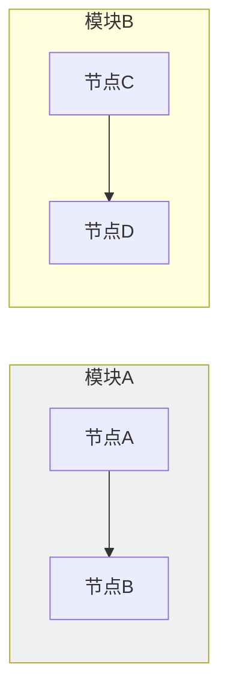
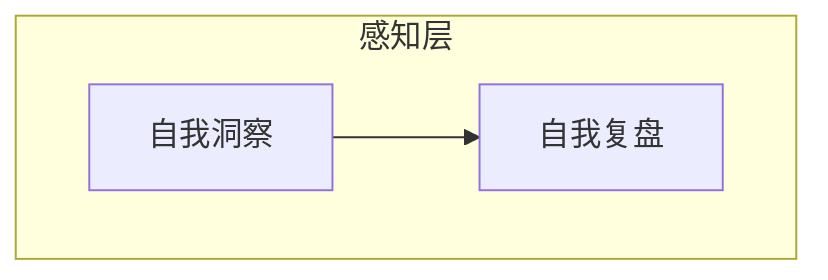
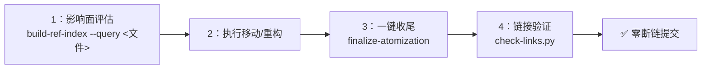

# 开发规范

> **来源**：从 `README.md` "开发规范"章节拆分

## 代码风格

- 遵循现有代码风格，不引入与项目不一致的新风格。
- 命名、缩进、注释、文件组织均以仓库内既有约定为准。
- 新增依赖前先评估必要性，优先复用现有工具链。

## 简约设计原则

> 来源：蒸馏自 Andrej Karpathy 对 LLM 编程陷阱的观察，补充现有工程规范

代码与设计遵循"简约至上"原则，避免过度设计：

1. **不做未被要求的功能**：只实现明确要求的功能，不"顺手添加"自以为有用的额外特性。
2. **不提前抽象**：只用一次的代码不建立抽象层（函数、类、模块等）；当代码第二次被复用时再考虑抽象。
3. **不添加未要求的灵活性**：没人要求的"可配置性""扩展性""灵活性"一律不加——YAGNI（You Aren't Gonna Need It）。
4. **不过度处理错误**：不可能发生的异常场景不做防御性错误处理；仅处理合理可预期的错误路径。
5. **复杂度检验标准**：写完代码后自问——"一个资深工程师看了会不会说'这太复杂了'？"如果答案是会，立即重构简化。
6. **目标驱动任务描述**：描述任务时优先给出验收标准（如"先写能复现bug的测试，然后让它通过"），而非具体实现步骤；复杂任务先列出分步计划并标注每步验证方式。

**核心思想**：能50行解决的问题不要写200行；明确的验收标准让AI能独立循环执行，减少不必要的人工介入。

## 认知升级与心智模型

> **来源**：SpecWeave 13天全生命周期复盘萃取的6条关键认知升级，经过793次提交验证。

以下认知升级是经过大规模实践验证的心智模型，用于指导日常开发决策，避免系统性认知偏差。

| # | 认知升级 | 核心表述 | 关联规范/模式 |
|---|---------|---------|-------------|
| 1 | **项目→有机体** | 方法论项目里程碑定义为"能力建立"而非"功能完成"；达到自举点后项目进入持续演化阶段，不存在传统意义上的"结项" | [bootstrap-driven-self-evolution.md](retrospective/patterns/methodology-patterns/governance-strategy/bootstrap-driven-self-evolution.md) |
| 2 | **治理需要元治理** | 建规则时必须同步建立规则的审计/废止机制，防止治理规则自身熵增、规则冲突、执行度下降 | [governance-three-stage-evolution.md](retrospective/patterns/methodology-patterns/governance-strategy/governance-three-stage-evolution.md) 阶段3闭环自证 |
| 3 | **并行有可靠性边界** | 文件编辑操作串行优先；并行仅适用于独立无依赖的任务（如多个不相关文件的独立创作），编辑同一文件或有依赖关系的任务必须串行 | [search-replace-fragility.md](retrospective/patterns/methodology-patterns/tools-automation/search-replace-fragility.md) |
| 4 | **点修复偏误是系统性偏差** | Bug修复必须包含预防措施（检查脚本/规则/测试/反模式清单），禁止纯点修复——"修好了以后注意"等于没修 | [fix-prevent-close-loop.md](../rules/fix-prevent-close-loop.md)（全局强制SOP） |
| 5 | **元文档ROI最高** | 资源有限时优先投资入口文档、索引、L1门面（元文档），而非深化L2深度内容；元文档<20%篇幅贡献>50%采纳率 | [meta-document-priority-principle.md](../rules/meta-document-priority-principle.md)、[meta-document-leverage.md](retrospective/patterns/methodology-patterns/document-architecture/meta-document-leverage.md)（L3量化验证） |
| 6 | **三阶段是普遍规律** | 治理（修复→预防→闭环）、知识库（生成→重组→精确化）、抽象（具体→通用→元方法）都遵循三阶段递进，**顺序不可颠倒**，跳过中间阶段必然导致返工或问题复发 | [three-stage-universal-principle.md](../rules/three-stage-universal-principle.md) |

**应用原则**：做决策前快速自检——当前任务是否违反了上述认知升级？例如：修复Bug时问自己"有没有预防措施？"，新增内容时问自己"要不要先更新索引？"，考虑并行操作时问自己"这些任务真的独立无依赖吗？"。

## 抽象决策标准化流程

当考虑对代码、文档或模式进行抽象时，必须遵循以下决策矩阵，避免过度抽象带来的维护成本：

| 判断维度  | 问题                | 建议                  |
| ----- | ----------------- | ------------------- |
| 消费者数量 | 是否有 ≥2 个消费者？      | 只有一个时，抽象收益为负        |
| 需求差异  | 消费者需求是否一致？        | 差异大时，通用模板可能无法满足任何一方 |
| 维护成本  | 抽象后的维护成本是否低于直接复制？ | 复杂模板维护成本可能很高        |
| 演进速度  | 模式是否还在快速演进？       | 不稳定的模式不应过早抽象        |

**决策流程**：

1. **识别重复**：发现代码或文档存在重复模式时，启动抽象评估
2. **矩阵评估**：对照上述四个维度逐一评估
3. **阈值判定**：消费者数量 < 2 时，优先选择复制而非抽象
4. **收益计算**：只有当抽象后的维护成本显著低于复制成本时，才进行抽象
5. **时机选择**：模式稳定后再抽象，避免频繁调整抽象层

**核心原则**：抽象的目的是降低复杂度，而非增加架构层次。当抽象带来的额外认知负担超过其减少的重复代码量时，应放弃抽象。

## Frontmatter 格式规范

所有 Markdown 文档统一使用 **YAML 格式** frontmatter（`---` 分隔），禁止在新文件中使用 `+++` 包裹的 TOML frontmatter 格式。完整规范详见 [.agents/rules/frontmatter-metadata-standard.md](../rules/frontmatter-metadata-standard.md)。

### 核心原则

1. **YAML 简洁扁平**：YAML frontmatter 仅保留核心标识字段（`id`、`source`、`x-toml-ref`），禁止多行缩进嵌套
2. **TOML 外部存储**：复杂元数据（`tags`、`changelog`、`category`、`date`、`version` 等）通过 `x-toml-ref` 引用 `.meta/toml/` 下的外部 TOML 文件
3. **简单标签内联**：简单短标签数组可直接使用 YAML 内联写法 `tags: ["a", "b"]`，但含中文长标签或 changelog 等描述性文字必须放入 TOML

### x-toml-ref 基本用法

```yaml
---
id: "document-id"
source: "README.md#章节"
x-toml-ref: "../../.meta/toml/docs/development-standards.toml"
---
```

**字段合并规则**：YAML frontmatter 中的字段优先于外部 TOML 文件的同名字段。核心标识字段保留在 YAML，完整元数据存储在外部 TOML。

## 脚本开发规范

`.agents/scripts/` 下的验证与自动化脚本遵循以下约定：

1. **先查共享库**：新增脚本前先查阅 [lib/README.md](../scripts/lib/README.md)，确认 `lib/` 下是否已有可复用的函数
2. **禁止重复实现**：如 `lib/` 中已有对应功能（路径解析、frontmatter 解析、CLI 输出、Markdown 处理、链接修复、模式扫描等），必须使用共享函数，不得自行重写
3. **新增共享函数**：如确需新功能且具有跨脚本复用价值，应先提取到 `lib/` 对应模块中再引用
4. **通用参数**：使用 `lib.cli.add_common_args(parser)` 注册通用参数（`--path`、`--json`），不要重复定义
5. **输出规范**：使用 `lib.cli` 的 `print_pass`/`print_warn`/`print_error`/`print_summary` 输出检查结果，禁止使用 Unicode 特殊符号（✓⚠✗）避免 Windows GBK 编码问题
6. **脚本头部**：脚本开头需添加 sys.path 设置以确保 `lib/` 可导入：
   ```python
   import sys
   from pathlib import Path
   SCRIPTS_DIR = Path(__file__).resolve().parent
   if str(SCRIPTS_DIR) not in sys.path:
       sys.path.insert(0, str(SCRIPTS_DIR))
   ```
7. **重复检测**：脚本开发完成后运行 `python check-duplication.py`，确保未引入新的跨文件重复代码
8. **Linter 自生验证**：新开发检查类脚本（linter/checker/validator）提交前必须通过 [tool-self-validation 检查清单](retrospective/patterns/methodology-patterns/tools-automation/tool-self-validation.md)的7项验证（自扫描→真阳性修复→误报过滤→信噪比≥30%→输出可用→CI兼容→边界场景）
9. **PowerShell脚本编码**：生成或修改 `.ps1` 文件时必须使用 `lib/powershell.py` 中的 `write_ps1_script()` 函数（自动写入UTF-8 BOM + CRLF换行），禁止直接用 `open(..., 'w')` 写入.ps1文件，避免PowerShell 5.x下的编码解析错误

## 提交规范

遵循 [Conventional Commits](https://conventionalcommits.org) 规范，格式为 `type(scope): subject`：

| 类型         | 用途          |
| ---------- | ----------- |
| `feat`     | 新功能         |
| `fix`      | 缺陷修复        |
| `refactor` | 代码重构（不改变行为） |
| `test`     | 测试相关        |
| `docs`     | 文档变更        |
| `chore`    | 构建、工具、依赖等杂项 |
| `perf`     | 性能优化        |

提交信息主体使用中文描述，简明扼要说明"为什么"而非仅"做了什么"。

### 双层原子提交模式

当任务同时包含"内容创作/新增"和"结构重构/移动"两种不同性质的变更时，必须拆分为两次独立提交，保持单一职责：

| 提交顺序 | 提交内容                  | commit message示例                   | 说明                                         |
| ---- | --------------------- | ---------------------------------- | ------------------------------------------ |
| 第一次  | 内容创作（新增内容、填充文档、功能实现）  | `docs(knowledge): 创建xxx Wiki教程`    | 聚焦"写了什么内容"，diff主要是新增行                      |
| 第二次  | 结构重构（原子化拆分、文件移动、目录重组） | `docs(knowledge): 原子化拆分xxx Wiki教程` | 聚焦"怎么组织这些内容"，diff包含大量删除（从单文件移出）和新增（原子文件创建） |

**适用场景**：

- Wiki教程生产（内容创作 + 原子化拆分）
- 功能开发 + 代码重构整理
- 文档新增 + 文档目录重组
- 任何包含"新增内容"和"移动/重构内容"的大任务

**价值**：两次提交职责清晰，diff可读；如果原子化/重构方案不理想，可单独revert第二次提交而不丢失内容；版本历史能清楚区分"什么时候写的内容"和"什么时候调整的结构"。

### 模式提炼自验证检验

从任务中提炼出的新模式/规范/流程，必须用"**能否应用于改进过程本身**"作为有效性检验标准之一。一个模式若只适用于原始场景而不能反过来应用于"做改进"这件事本身，说明它可能只是特定场景的技巧，不够通用。

| 检验维度       | 检验问题                    | 通过标准           |
| ---------- | ----------------------- | -------------- |
| **自指性**    | 模式能否反过来应用于"做改进"这件事本身？   | 模式在改进过程中同样有效   |
| **跨场景适用性** | 模式是否只在原始场景下生效？          | 至少在2个不同场景下验证有效 |
| **回滚价值**   | 应用模式后若方案不理想，能否独立revert？ | 模式应用产生的变更可独立回滚 |

**案例验证**：双层原子提交模式（见上节）从MopMonk Wiki任务中提炼后，立即应用于推进其自身落地的改进过程——第一次提交(`40203c8e`)聚焦高优核心机制（子代理验收清单+DoD完成定义），第二次提交(`caaf6ae7`)聚焦中优扩展完善（原子化模板+双次提交规范+质量保障机制），验证了该模式作为"通用大变更拆分策略"的有效性。

**应用时机**：每次提炼新模式时，在写入模式库前进行自验证检验；若模式无法通过自指性检验，应降级为"场景技巧"而非通用模式。

**关联模式**：[self-referential-spec-system.md](retrospective/patterns/methodology-patterns/governance-strategy/self-referential-spec-system.md)（自指性规范系统，聚焦规范体系层面的自验证；本节是其向"任何提炼模式"层面的扩展）

## 测试要求

- 每个模块必须有对应的单元测试，覆盖核心逻辑与边界条件。
- 整体测试覆盖率不低于 **80%**，关键模块不低于 **90%**。
- 所有测试用例通过，无新增失败用例与回归问题。

## 文档边界

- `README.md` 面向**人类读者**，介绍项目用途、安装、使用与贡献方式。
- `AGENTS.md` 与 `.agents/` 面向 **AI 智能体**，存放机器可读规范。
- 两者职责分离，不相互混用。

## Markdown 表格修改

- **整表替换优先**：涉及表格行数或列数变化时，必须替换整张表格（从表头到表尾），禁止局部插入或删除行。
- **局部替换仅限文本修改**：仅修改单元格文本内容（不改变表格结构）时，可使用局部替换匹配目标行。
- **分隔符同步原则**：表格列分隔符 `|---|---|` 的列数必须与表头一致，任何列数变化都须同步更新分隔符行。

## Mermaid 编码规范

所有 Mermaid 图表须遵循以下安全编码规则，避免渲染失败：

### 禁止空行

Mermaid 代码块内**禁止使用空行**。`subgraph` 块之间、边定义与 `style` 语句之间的空行会导致解析器误判图表结束，引发渲染失败。



### 文本引号原则

非纯英文单词的节点标签、边标签一律用**双引号**包裹：

| 场景          | 错误写法       | 正确写法              | <br /> | <br /> | <br />  | <br /> |
| ----------- | ---------- | ----------------- | :----- | :----- | :------ | :----- |
| 含中文         | `A[启动协议]`  | `A["启动协议"]`       | <br /> | <br /> | <br />  | <br /> |
| 含特殊字符（@、#等） | \`-->      | @role             | B\`    | \`-->  | "@role" | B\`    |
| 中文边标签       | \`-->      | 数据流向              | B\`    | \`-->  | "数据流向"  | B\`    |
| 纯英文标识符      | `A[start]` | `A[start]`（可省略引号） | <br /> | <br /> | <br />  | <br /> |

### 禁止 Markdown 列表触发格式

Mermaid 节点/边标签内置 Markdown 解析器，双引号**不能阻止**内部 Markdown 解析。以下格式会被误识别为列表，导致 "Unsupported markdown: list" 错误：

| 触发模式         | 错误示例           | 正确写法                           | 说明          |
| ------------ | -------------- | ------------------------------ | ----------- |
| 数字+英文句点+空格   | `A["1. 启动协议"]` | `A["1：启动协议"]`                  | 改为中文冒号      |
| 短横线+空格（无序列表） | `A["- 列表项"]`   | `A["-列表项"]`（去掉空格）或 `A["·列表项"]` | 避免 `- `  开头 |

> **关键认知**：`["1. 启动协议"]` 中的双引号仅保证 Mermaid 语法层解析正确，引号内的文本仍会经过 Markdown 渲染器处理。必须从内容层面避免 Markdown 列表语法。

### 节点换行使用 `<br/>`

Mermaid 节点文本内的换行统一使用 HTML 的 `<br/>` 标签，**禁止使用** **`\n`** **转义字符**。`\n` 在 flowchart/stateDiagram 节点中不会被解释为换行（部分渲染器显示为字面文本，部分压缩为单行）；虽然 `\n` 在 sequenceDiagram 的 Note 和消息文本中可以换行，但统一使用 `<br/>` 可避免记忆上下文差异。

**错误示例**：`A["第一行\n第二行"]`
**正确示例**：`A["第一行<br/>第二行"]`

自动化检查：`python .agents/scripts/check-mermaid.py` 可自动检测并修复 `\n`→`<br/>` 问题。

### Subgraph 格式

Subgraph 统一使用 `subgraph ID ["标题文本"]` 格式：

- ID 必须为英文标识符（字母开头，不含中文/全角字符/全角冒号）
- 中文/含特殊字符的标题放在双引号内
- ID 与方括号之间有一个空格



### 边标签格式

带标签的边使用 `-->|"标签"|目标节点` 格式：

- 标签放在 `||` 内，与箭头之间无空格
- 含中文/特殊字符的标签必须双引号包裹
- 纯英文标识符标签可省略引号

### 错误排查分层法

修复 Mermaid 渲染错误按以下顺序逐层排查：

1. **语法结构层**：检查括号/引号是否闭合、有无空行
2. **Subgraph 层**：检查 ID 是否合法、标题格式是否正确
3. **节点文本层**：检查是否触发 Markdown 解析（`数字. ` 、`- ` 、`**` 等）
4. **边标签层**：检查特殊字符是否加引号
5. **Style 层**：检查颜色值、样式语法是否正确

> **经验教训**：Mermaid 渲染错误存在分层屏蔽效应——结构层错误会阻止解析器到达内容层，修复结构错误后内容层错误才会暴露，因此修复可能需要多轮迭代。不同渲染器（GitHub/飞书/VS Code）对 Mermaid 容错度不同，应遵循最严格的语法规范。

## 派生产物溯源约定

从其他文档（如 `README.md`、spec 文档）派生出的结构化产物，须在 YAML frontmatter 携带 `source` 字段标注信息来源，完整元数据通过 `x-toml-ref` 引用外部 TOML 文件，建立"提取物→源头"的可追溯链路。

### 路径字段规则

frontmatter 中所有包含文件路径的字段（`source`、`x-toml-ref`、`related_*` 前缀字段）必须遵循以下路径规范：

| 规则 | 说明 |
|------|------|
| **必须使用相对路径** | 所有路径值必须是相对于当前文件的相对路径，禁止使用 `docs/` 开头的项目根绝对路径，禁止使用 `file:///` 本地绝对路径 |
| **source 字段格式** | `source: "<文件路径>#<章节锚点>"`，路径与锚点用 `#` 分隔（如 `source: "README.md#自我迭代机制"`） |
| **x-toml-ref 字段格式** | `x-toml-ref: "<相对路径>/<文件名>.toml"`，指向 `.meta/toml/` 镜像目录下的元数据文件 |
| **related_* 字段** | 支持单路径字符串、路径列表、路径+描述混合格式（多路径用 `+`、`\|`、`,`、`;` 分隔） |
| **原子化拆分文件** | 新文件 frontmatter 的 `source` 字段使用 `"原文件名#锚点"` 格式（如 `source: "README.md#一事实数据"`），用于追溯内容来源 |

**适用范围**：一切从源文档提取并独立归档的结构化定义文件（如 `.agents/modules/` 下的自我演进模块定义）、原子化拆分后的子文件、知识萃取文档、带 `source` 溯源字段的所有 Markdown 文档。

**价值**：源头文档变更时，可程序化定位受影响的派生产物，避免信息失同步；同时确保知识图谱的反向指针完整，内容的历史脉络可追溯。

### 常见错误与修正

| 错误写法 | 正确写法 | 问题 |
|---------|---------|------|
| `source: "external: 不存在-docs/retrospective/reports/xxx.md"` | `source: "external: 不存在-../../retrospective/reports/xxx.md"` | ❌ 使用了 `docs/` 根绝对路径前缀 |
| `source: "external: 不存在-../retrospective/xxx.md"`（深度不够） | `source: "external: 不存在-../../retrospective/xxx.md"` | ❌ `../` 层级计算错误（在 knowledge/operations/ 下需两级回退） |
| `x-toml-ref: ".meta/toml/xxx.toml"` | `x-toml-ref: "../../../../.meta/toml/xxx.toml"` | ❌ 缺少正确层级的 `../` 回退 |
| `source: "path.md#section"` （锚点后路径） | `source: "path.md#section"` | ✅ 正确（锚点由检查器自动分割，不影响文件存在性验证） |

> **经验教训**：手动计算相对路径层级的错误率约40%，原子化拆分或文件移动后务必运行 `finalize-atomization.py` 自动校正路径，再运行 `check-links.py --check-frontmatter-paths` 验证。

### frontmatter 路径验证

提交前除验证正文链接外，还须验证 frontmatter 路径字段有效性：

```bash
python .agents/scripts/check-links.py --path <目标目录> --check-frontmatter-paths
```

该参数会自动检查所有 frontmatter 路径字段：
- 验证 `source`、`x-toml-ref`、`related_*` 字段指向的文件是否存在
- 智能提取多路径值（支持 `+`、`|`、`,`、`;` 分隔符和路径+描述混合格式）
- 自动过滤非路径值（URL、`session:` 引用、占位符、枚举ID、纯中文描述）
- 报告 `docs/` 前缀不规范写法
- 正确处理带 `#` 锚点的路径（只验证文件存在性，不验证锚点）

## Spec 文档路径引用规范

spec 文档位于 `.trae/specs/<change-id>/` 三级嵌套目录下，路径引用存在两类系统性风险："层级陷阱"（相对路径层级计算错误）与"前缀缺失"（未添加项目根目录前缀）。为消除这两类风险，所有 spec 文档的路径引用须遵循以下规范：

### 规则 1：引用项目根目录文件使用三级回退

spec 文档位于 `.trae/specs/<change-id>/spec.md`，引用项目根目录下的文件时，必须使用三级 `../../../` 回退至项目根目录。

| 错误写法                                            | 正确写法                                               | 说明                      |
| ----------------------------------------------- | -------------------------------------------------- | ----------------------- |
| `AGENTS.md` → `../../AGENTS.md`                 | `AGENTS.md` → `../../../AGENTS.md`                 | 两级回退仅到 `.trae/`，无法到达项目根 |
| `README.md` → `../../README.md`                 | `README.md` → `../../../README.md`                 | 同上                      |
| `.agents/README.md` → `../../.agents/README.md` | `.agents/README.md` → `../../../.agents/README.md` | 同上                      |

### 规则 2：引用 `.agents/` 下文件使用完整前缀

在 spec 文档的描述性文本中引用 `.agents/` 目录下的文件时，必须使用完整路径前缀 `.agents/`，确保 `check-spec-consistency.py` 的 `resolve_path` 函数能正确按项目根目录解析。

| 错误写法                                     | 正确写法                                             | 说明                                 |
| ---------------------------------------- | ------------------------------------------------ | ---------------------------------- |
| `` `worlds/README.md` ``                 | `` `.agents/worlds/README.md` ``                 | 缺少 `.agents/` 前缀，被误解析为 spec 目录相对路径 |
| `` `teams/permission-system.md` ``       | `` `.agents/teams/permission-system.md` ``       | 同上                                 |
| `` `protocols/conflict-resolution.md` `` | `` `.agents/protocols/conflict-resolution.md` `` | 同上                                 |

### 规则 3：引用同目录 spec 使用单级回退

引用 `.trae/specs/` 下其他 spec 文档时，使用单级 `../` 回退至 `specs/` 目录。

| 正确写法                                                                     | 说明                           |
| ------------------------------------------------------------------------ | ---------------------------- |
| `create-agents-md-and-config` → `../create-agents-md-and-config/spec.md` | 单级回退至 `specs/`，再进入目标 spec 目录 |

### 验证方式

- **链接有效性**：运行 `python .agents/scripts/check-links.py`，退出码为 0 表示所有本地链接有效
- **spec 一致性**：运行 `python .agents/scripts/check-spec-consistency.py`，交叉引用有效性错误数为 0 表示路径前缀正确

## Markdown 文档交叉引用规范

所有 Markdown 文档中的跨文件链接**必须使用相对路径**，禁止使用 `file:///` 开头的本地绝对路径。绝对路径在不同机器、不同克隆位置会立即失效，导致文档断链。

### 链接格式

```markdown
[可读名称]({相对路径}#L{起始行}-L{结束行})
```

### 路径规则

| 引用场景    | 路径写法                 | 示例路径                         |
| ------- | -------------------- | ---------------------------- |
| 同文件内引用  | 省略文件名，锚点以 `#L` 开头    | `#L1364-L1487`               |
| 同目录文件互引 | 直接写文件名               | `spec.md#L245-L263`          |
| 上级目录文件  | 用 `../` 逐级回退（每级回退一层） | `../../index.html#L710-L751` |
| 子目录文件   | 写出子目录路径              | `.agents/roles/architect.md` |

**链接文本**应使用描述性短语（如"洞察53""spec §5.2""HTML 原型"），便于读者理解引用内容。

### 禁止事项

- ❌ **禁止**使用 `file:///d:/...` 等本地绝对路径（在不同机器/克隆位置会立即断链）
- ❌ **禁止**在 frontmatter 路径字段中使用 `docs/` 开头的项目根绝对路径（必须使用相对路径）
- ❌ **禁止**在代码示例模板中使用真实文件路径（使用 `{占位符}` 语法，避免链接检查器误判）
- ✅ **建议**行号引用精确到行范围（`#L起始-L结束`），便于定位上下文

### 验证方式

提交前运行链接校验脚本，确保正文链接和 frontmatter 路径均有效：

```bash
# 仅验证正文链接
python .agents/scripts/check-links.py --path <目标目录>

# 同时验证正文链接 + frontmatter 路径字段（推荐）
python .agents/scripts/check-links.py --path <目标目录> --check-frontmatter-paths
```

退出码为 0 表示所有本地引用均有效。`--check-frontmatter-paths` 参数会额外扫描 frontmatter 中的 `source`、`x-toml-ref`、`related_*` 字段，验证路径有效性并报告 `docs/` 前缀等格式问题。

> **经验教训**：从其他环境迁移文档时，务必全局搜索 `file:///` 前缀将所有绝对路径替换为相对路径。详见竹简悟道归档复盘报告中"旧路径断链修复"相关记录。

## 文档重构与原子化操作规范

> **来源**：从链接修复深度调整复盘萃取的治理原则，对应模式库 [toolchain-maturity.md](retrospective/patterns/methodology-patterns/tools-automation/toolchain-maturity.md)、[dry-run-first.md](retrospective/patterns/methodology-patterns/tools-automation/dry-run-first.md)

### 链接衰变四条规律

目录重构时，Markdown 相对链接的稳定性遵循以下可预测规律，用于事前风险评估：

| 规律     | 描述                                                           | 风险等级 |
| ------ | ------------------------------------------------------------ | ---- |
| 下移断链多  | 文件向更深目录移动（如 `a.md` → `sub/a.md`），所有引用该文件的链接`../`层数不足，断链率最高   | 🔴 高 |
| 上移影响小  | 文件向更浅目录移动（如 `sub/a.md` → `a.md`），原有相对路径多走一级`..`仍可能到达目标，断链率较低 | 🟡 中 |
| 跨目录最脆弱 | 跨目录移动（如 `dir1/a.md` → `dir2/a.md`），相对路径方向完全改变，断链率接近100%      | 🔴 高 |
| 同目录最稳定 | 同目录内文件互引（直接写文件名），不涉及`../`层级变化，不受文件移动影响                       | 🟢 低 |

> **行动指南**：下移和跨目录移动前必须使用 `build-ref-index.py` 评估影响面；上移操作后仍需运行 `check-links.py` 验证。

### 文档移动标准工作流

任何文件移动/重命名/目录重构操作必须遵循四步闭环工作流，禁止裸操作：



1. **操作前**：运行 `python .agents/scripts/build-ref-index.py --query <目标文件或目录>`，查询所有引用方，评估影响范围
2. **执行操作**：使用 `Move-Item` 或 Git 命令执行文件移动，不要手动修改链接
3. **操作后**：运行 `python .agents/scripts/finalize-atomization.py`，自动完成断链修复、导航更新、看板刷新
4. **最终验证**：运行 `python .agents/scripts/check-links.py`，确认零断链后方可提交

### 重命名与配置重构三步法

涉及镜像名、容器名、目录名、环境变量名、脚本入口名等“标识符级重构”时，统一遵循“搜索 → 替换 → 验证”三步法，禁止只改单点文件后直接结束：

1. **搜索阶段**：先全局搜索所有引用点，确认影响面，避免遗漏文档、脚本、提示文案、配置项等隐性依赖
2. **替换阶段**：按文件分批替换，优先修改源码与配置，再修改 README / guide / retrospective 等说明文档
3. **验证阶段**：至少完成一次真实运行验证（如构建、启动、连接、导入、脚本执行），确认重构后的名称链路完全闭合

> **适用场景**：`llvm21-dev` → `llvm-dev` 这类去版本号重命名、脚本入口名变更、环境变量默认值切换、目录迁移等。

### Dry-Run 安全修改原则

所有支持自动修改的工具脚本（`check-links --fix`、`finalize-atomization`、`check-move` 等）必须遵循 dry-run 优先原则：

- **首次运行必须加** **`--dry-run`**：预览将要执行的所有修改，确认无误后再去掉参数执行真实修改
- **零误报验证**：在确认所有链接正确的状态下运行 `--fix --dry-run`，应输出"无需要修改"，证明工具不会误改正确内容
- **禁止跳过预览**：任何自动化批量修改禁止直接执行不带 dry-run 的修复命令

### 原子化操作收尾

文档原子化拆分或文件移动完成后，必须执行以下收尾步骤（`finalize-atomization.py` 自动完成）：

1. **断链修复**：自动调整相对路径`../`层级，修复因目录变化导致的断链
2. **导航更新**：重新生成 `.agents/` 各目录 README 导航表
3. **看板刷新**：更新 `.trae/specs/README.md` 执行进度看板
4. **溯源验证**：运行 `check-source-traceability.py` 确保派生产物 source 字段有效

### 外部链接缓存策略

定期检查类工具访问外部资源时，必须内置缓存机制：

- 默认缓存有效期：7天（外部链接检查结果）
- 支持 `--no-cache` 强制重新检查
- 支持 `--cache-ttl <天数>` 自定义缓存时长
- 支持 `--clear-cache` 手动清除缓存
- 二次运行耗时应从 10-20 秒降至 <1 秒

> **关联模块**：
>
> - `../README.md`
> - `../AGENTS.md`
> - `../CONTRIBUTING.md`

## Wiki/学习文档制作规范

本规范适用于外部资源学习类wiki教程的制作，采用四层信息加工漏斗模型确保内容质量。

### 四层信息加工漏斗模型

制作wiki教程时，必须严格按照以下四层漏斗流程逐级加工，禁止跳步：

| 层级     | 名称      | 目标         | 工具/方法        | 产出物                               |
| ------ | ------- | ---------- | ------------ | --------------------------------- |
| **L1** | 原始网页层   | 提取干净内容，去噪  | defuddle CLI | 干净的markdown文本                     |
| **L2** | 干净文本层   | 验证完整性，识别核心 | 人工阅读+标记      | 核心观点/概念/结构笔记                      |
| **L3** | 结构化大纲层  | 设计信息架构     | Spec Mode流程  | spec.md + tasks.md + checklist.md |
| **L4** | wiki成品层 | 生成完整文档     | 按骨架填充内容      | 带frontmatter的完整wiki               |

#### L1 原始网页层：内容提取

- 使用 `defuddle` 工具提取网页干净Markdown内容，去除导航栏、广告、评论区、相关推荐、侧边栏等噪音
- 提取后必须验证内容完整性：正文标题、段落、列表、代码块、图片链接是否完整保留
- 如果defuddle效果不佳，可改用web-to-markdown技能作为备选

#### L2 干净文本层：内容分析

- 通读提取的干净文本，标记核心观点、关键概念、结构布局、专业知识点
- 标记内容分类：
  - 🔴 核心观点（必须保留）
  - 🟡 支撑论据/案例（选择性保留）
  - 🟢 扩展阅读/背景信息（可简化/链接）
  - ⚫ 广告/无关内容（直接删除）
- 验证内容完整性，确认没有遗漏关键论点、数据、步骤

#### L3 结构化大纲层：信息架构设计

- 按照 `wiki-spec-template.md` 模板设计信息架构
- 通过Spec Mode流程创建三个规划文件：
  - `spec.md`：需求与范围说明
  - `tasks.md`：任务拆解清单
  - `checklist.md`：质量检查点
- 设计章节间的逻辑关系，确保读者可以按顺序学习，也可以按需跳转
- 设计目录导航，在overview页提供清晰的章节索引

#### L4 wiki成品层：文档生成

- 生成带YAML frontmatter的完整wiki文档（使用`---`分隔，key: value语法）
- 统一使用YAML格式frontmatter，禁止TOML格式（`+++`）
- 添加目录导航表（在00-overview\.md中）
- 添加内部链接（使用相对路径）
- 更新上级索引（如需要）

### 强制前置检查规则

创建新文档前，必须执行以下检查：

1. **读取现有文档验证格式**：创建新文档前，必须读取同目录1-2个现有文档确认实际格式
2. **frontmatter格式强制**：统一使用YAML格式（`---`分隔），禁止TOML格式（`+++`）
3. **实际做法优先原则**：不要仅凭project\_memory或抽象规范做格式决策，以现有同类文档的实际做法为准

### 模板引用

Wiki教程制作统一使用 `.agents/templates/wiki-spec-template.md` 作为标准模板，复制后替换占位符使用。模板包含完整的四层漏斗工作流、8章节标准结构骨架、质量检查清单和路径引用说明。

原子化结构模板使用 `.agents/templates/wiki-atom-template/`，预置索引页+5个标准原子文件骨架。

### 原子化拆分判断标准

不是所有wiki都需要原子化拆分，满足以下任一条件建议拆分：

| 判断维度  | 拆分阈值          | 不拆分场景        |
| ----- | ------------- | ------------ |
| 文件长度  | >300行建议拆分     | <200行可保持单文件  |
| 章节独立性 | 各章节可单独阅读引用    | 内容紧密耦合不可分割   |
| 未来扩展  | 预期会持续新增章节     | 内容已稳定不会扩展    |
| 复用需求  | 单个章节需要被其他文档引用 | 整体作为一个完整文档使用 |

原子化三原则：①单一职责（每个文件只讲一个主题）②可独立引用（每个原子文件有完整frontmatter和TOML）③内部链接完整（文件间相对链接正确）。

### 完成定义（DoD）

Wiki教程任务完成必须满足以下全部条件，详见wiki-spec-template.md中的DoD表格：

1. 内容完整性：六大要素齐全（概述/核心概念/操作指南/FAQ/资源链接/学习目标）
2. 格式规范：frontmatter使用YAML（---），id/title/source/x-toml-ref四字段完整
3. 元数据配套：.meta/toml/镜像路径下有对应TOML文件
4. 原子化结构：符合原子化标准（需要拆分的已拆分，不需要拆分的有判断依据）
5. 链接有效：所有内部相对路径可到达，无断链
6. 原子提交：内容创作和原子化拆分为两次独立提交（如适用）
7. 命名规范：文件名kebab-case、纯英文、两位数字前缀

## 质量保障与问题升级机制

### 重复问题立即升级机制

同类格式/流程问题**第二次出现**时，必须立即更新模板/工具/检查清单，而不是等下次复盘：

1. **识别重复**：当发现一个问题之前出现过（如frontmatter格式错误、路径计算错误、文件命名错误），标记为重复问题
2. **根因分析**：不仅修复当前问题，还要分析"为什么现有机制没有拦截住这个问题"
3. **立即加固**：在当前任务中直接更新对应模板、检查清单或添加自动化检查，不等待下次任务
4. **验证加固效果**：加固后确认同类问题未来会被新机制拦截

> **来源**：MopMonk Wiki复盘中frontmatter格式错误在同一天重复出现的教训——仅仅写进复盘是不够的，必须转化为强制检查点。

### 改进不扩散原则（先搜索后创建）

推进行动项或做流程改进时，遵循"不扩散"原则——优先补充现有文件，避免创建不必要的新文件：

**第一步：资产搜索（强制）**：

- 任何改进落地前，先用Glob/Grep搜索`.agents/rules/`、`.agents/templates/`、`docs/`目录，确认是否已有相关规范/模板/检查清单
- 搜索关键词应覆盖核心概念（如"frontmatter"、"原子化"、"验收"、"检查清单"等）
- 如果已有规范存在，判断是"规范缺失"还是"规范存在但未执行"：
  - 规范缺失→创建新规范/模板
  - 规范存在但未执行→添加检查点/模板预置/验收清单，而非重复创建

**文件创建判断标准**：

| 场景             | 处理方式                |
| -------------- | ------------------- |
| 内容<50行，属于同一主题域 | 追加到现有相关文件的子章节       |
| 内容50-100行，主题相关 | 优先追加，如现有文件已过长再考虑拆分  |
| 内容>100行或形成独立体系 | 创建新文件，同时更新索引/README |
| 检查清单/验收标准/流程规则 | 追加到现有规范的对应章节或模板中    |

**禁止重复建设检查项**：

- [ ] 是否已Glob搜索现有文件中是否有相同/相似内容？
- [ ] 现有模板/规范是否只需要添加一个检查点就能解决问题？
- [ ] 创建新文件后是否需要更新3个以上的索引/README链接？（如果是，优先追加）

> **来源**：MopMonk Wiki复盘洞察9——不是每个改进都需要新文件，创建新文件有索引维护、一致性维护、读者查找成本等隐形成本。

### 用户反馈系统性响应流程

用户指出问题时，遵循以下五步响应流程，避免"头痛医头脚痛医脚"：

| 步骤 | 动作       | 说明                        |
| -- | -------- | ------------------------- |
| 1  | 确认收到     | 简要回应表示已知晓问题               |
| 2  | 快速修复表面问题 | 立即修复用户指出的具体错误             |
| 3  | 分析根因     | 问自己"这个问题背后是否反映了机制缺陷？"     |
| 4  | 系统性改进    | 一次性解决同类问题（更新模板/添加检查/完善规范） |
| 5  | 反馈结果     | 告诉用户不仅修复了问题，还完善了机制防止重复发生  |

**核心原则**：把每次用户反馈都当成改进流程/机制的机会，而不仅仅是修复一个bug。简单修复是最低标准，系统性改进才是目标。

#### 反馈记录与高频点识别

每次用户反馈处理完成后，在复盘报告的"问题与修复"章节记录以下信息：

| 记录项    | 说明                              |
| ------ | ------------------------------- |
| 反馈时间   | 日期+任务名称                         |
| 问题类型   | frontmatter格式/链接错误/内容缺失/结构问题/其他 |
| 根因分类   | 规范缺失/规范存在但未执行/子代理未遵循前置检查/工具缺陷   |
| 改进措施   | 更新了哪个模板/规范/检查清单                 |
| 是否首次出现 | □首次 □重复（第\_\_次）                 |

**高频点主动识别**：

- 复盘时检查"问题与修复"记录，同一类型问题出现≥2次即为高频点
- 高频点必须升级为强制检查点（写入checklist或验收清单），而非仅写入复盘
- 同一类型问题出现≥3次，升级为自动化脚本检查（工具改进类低优行动项提升为中优）
- 每完成3-5个同类任务后，主动回顾反馈记录，识别尚未被用户指出但可能存在的潜在问题

