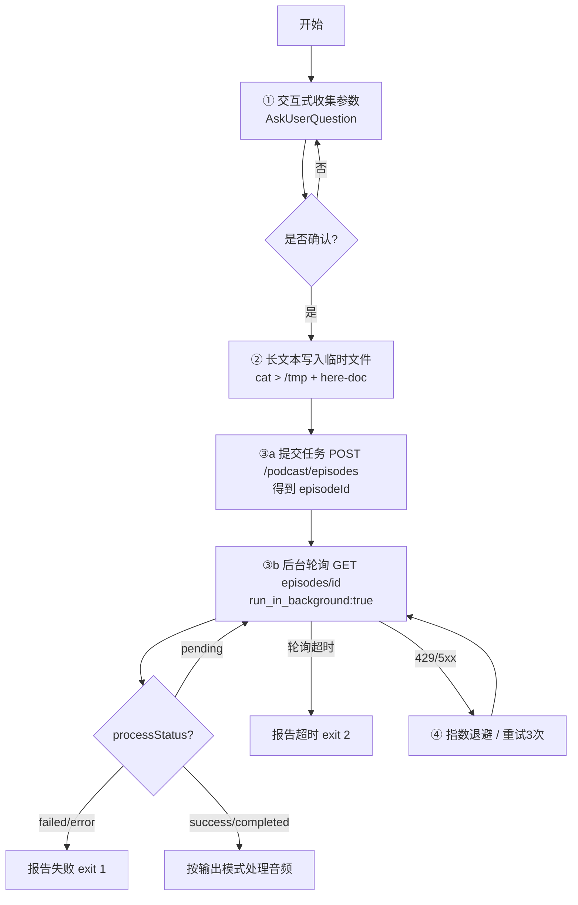

# API 集成模式组合实战示例：AI 播客自动生成

> 本文演示如何在**一个具体业务场景**中组合应用四项通用 API 集成模式，而非单个模式的孤立用法。所有可复用能力均有对应沉淀条目，文末给出「模式 → 业务环节」映射表。

**依赖的沉淀条目**：
- [api-interactive-parameter-collection.md](api-interactive-parameter-collection.md)
- [api-long-text-file-parameter.md](api-long-text-file-parameter.md)
- [api-async-polling-pattern.md](api-async-polling-pattern.md)
- [api-error-handling-retry-strategy.md](api-error-handling-retry-strategy.md)

---

## 一、业务场景

用户提供一篇长文章（几 KB 甚至更长的英文播报稿），系统自动把它制作成一档带主播配音的 AI 播客。整个交互从"问用户要什么"到"拿到成品音频"，涉及四个环节，正好对应四个通用模式：

```
业务环节                            通用模式
─────────────────────────────────────────────────────────
① 问用户：语言 / 主播 / 时长         交互式参数收集（AskUserQuestion）
② 提交长文章                          @file 传长文本请求体
③ 等待播客生成完成                    异步接口两段式轮询
④ 处理限流 / 服务端波动              错误处理与重试
```

---

## 二、全流程编排图



---

## 三、阶段一：交互式收集参数（模式：AskUserQuestion 分步）

> 遵循"一次一问、等回答、执行前确认、可回退"。**language 决定后续 speaker 列表**，属依赖参数，必须串行：先问语言，再根据语言动态展示主播。

**Step 1 — 问语言（AskUserQuestion 多选）：**

| question | options |
|---|---|
| "播客使用哪种语言？" | Chinese (zh) / English (en) |

**Step 2 — 根据语言动态拉取并展示主播（AskUserQuestion 多选）：**
先调 `GET /speakers/list?language=en`，再把返回的主播作为 options，仅允许从列表中选择（禁止硬编码 speakerId）。

**Step 3 — 问时长/模式（自由文本或与语言无依赖的独立项可并入一次调用）：**
模式（info 科普 / story 讲故事）与语言、主播相互独立，可在一次 AskUserQuestion 中同时询问。

**Step 4 — 执行前确认：** 汇总「语言=English、主播=cozy-man-english、模式=story」，请用户确认后再调 API。这是最后一道闸门，用户可回退修改。

> 关键约束：可枚举参数（语言/主播/模式）一律用 AskUserQuestion 交互选择器；自由文本（如额外指令）用普通消息提问。

---

## 四、阶段二：长文本用 `@file` 提交（模式：@file 传长文本）

用户原文可能几 KB 甚至更长，直接内联在 `-d '{...}'` 会撞 shell 参数长度限制，因此写入临时文件并用 `@` 引用：

```bash
# 将请求 JSON 写入临时文件（带引号的 ENDJSON 不做变量展开）
cat > /tmp/lh-request.json << 'ENDJSON'
{
  "speakers": [{"speakerId": "cozy-man-english"}],
  "language": "en",
  "mode": "story",
  "sources": [{"type": "text", "content": "The full long article text goes here, spanning multiple KB..."}]
}
ENDJSON
```

> 触发点：正文超过几 KB 始终用 `@file`；若只是短 `query` 可直接内联 `-d '{...}'`，不必建临时文件。

---

## 五、阶段三：异步两段式提交 + 轮询（模式：异步接口两段式）

**5a. 提交（前台）** — 快速，拿到 `episodeId`：

```bash
RESPONSE=$(curl -sS -X POST "https://api.example.com/openapi/v1/podcast/episodes" \
  -H "Authorization: Bearer $LISTENHUB_API_KEY" \
  -H "Content-Type: application/json" \
  -H "X-Source: skills" \
  -d @/tmp/lh-request.json)

EPISODE_ID=$(echo "$RESPONSE" | jq -r '.data.episodeId')
echo "Submitted: $EPISODE_ID"

# 用后清理临时文件
rm /tmp/lh-request.json
```

**5b. 轮询（后台）** — 以 `run_in_background: true` 独立运行，不阻塞交互，完成后自动通知：

```bash
# 后台运行，Bash 调用设 timeout: 600000
EPISODE_ID="<id-from-step-5a>"
for i in $(seq 1 30); do
  RESULT=$(curl -sS "https://api.example.com/openapi/v1/podcast/episodes/$EPISODE_ID" \
    -H "Authorization: Bearer $LISTENHUB_API_KEY" \
    -H "X-Source: skills" 2>/dev/null)

  STATUS=$(echo "$RESULT" | tr -d '\000-\037\177' | jq -r '.data.processStatus // "pending"')

  case "$STATUS" in
    success|completed) echo "$RESULT"; exit 0 ;;   # 成功
    failed|error)     echo "FAILED: $RESULT" >&2; exit 1 ;;  # 失败
    *) sleep 10 ;;                                 # 继续轮询
  esac
done
echo "TIMEOUT" >&2; exit 2                          # 超时
```

**轮询参数联动**：间隔 10s × 最大 30 次 ≈ 300s 超时；后台 Bash 调用 `timeout: 600000` 放宽，避免轮询被工具超时打断。
完成后按各自**输出模式**处理（inline / download / both）——音频 URL 不能直接当本地文件用。

---

## 六、阶段四：错误处理与重试（模式：错误处理与重试）

先检查响应体 `code`（非零即业务错误），再结合 HTTP 状态码分级处理，对可重试错误分层退避：

| 观测 | 含义 | 本场景处理 |
|------|------|-----------|
| `code: 0` + HTTP 200 | 成功 | 解析 `data` |
| HTTP 401 / code 21007 | API Key 无效 | 提示检查 `LISTENHUB_API_KEY`，**不重试** |
| HTTP 402 | 余额不足 | 告知用户充值，**不重试** |
| HTTP 429 / code 25429 | 限流 | **指数退避**：等待 15s 后重试，可随次数递增 |
| HTTP 500/502/503/504 | 服务端错误 | 最多重试 3 次，间隔 5s |
| 网络错误（连接失败/超时） | 临时故障 | 最多重试 3 次 |

**重试要点：**
- 幂等性：轮询是 `GET`，天然幂等，可放心重试；提交是 `POST`，重试前确认服务端有去重/幂等机制，避免重复创建 episode。
- 分层：429 与 5xx 用不同间隔与次数，避免对不可恢复故障无限重试。

---

## 七、完整可运行脚本（整合四模式）

把四个模式串成一个可运行示例（提交 + 轮询 + 重试，参数收集交互在脚本外由 AskUserQuestion 完成）：

```bash
#!/usr/bin/env bash
set -euo pipefail

# ===== 模式① 参数由 AskUserQuestion 收集后传入 =====
LANGUAGE="${1:?need language}"
SPEAKER_ID="${2:?need speaker}"
MODE="${3:?need mode}"
ARTICLE_FILE="${4:?need article file}"

# ===== 模式② 长文本 @file =====
REQ=/tmp/lh-podcast-request.json
{
  echo '{"speakers":[{"speakerId":"'"$SPEAKER_ID"'"}],"language":"'"$LANGUAGE"'","mode":"'"$MODE"'",'
  echo '"sources":[{"type":"text","content":'
  jq -Rs . < "$ARTICLE_FILE"
  echo '}]}'
} > "$REQ"

# ===== 模式③a 提交（前台）=====
RESP=$(curl -sS -X POST "https://api.example.com/openapi/v1/podcast/episodes" \
  -H "Authorization: Bearer $LISTENHUB_API_KEY" \
  -H "Content-Type: application/json" -H "X-Source: skills" -d @"$REQ")
EP_ID=$(echo "$RESP" | jq -r '.data.episodeId')
rm -f "$REQ"
echo "Submitted: $EP_ID"

# ===== 模式③b + 模式④ 轮询 + 重试（后台）=====
for attempt in 1 2 3; do
  code=$(curl -sS -o /tmp/lh-poll.json -w '%{http_code}' \
    "https://api.example.com/openapi/v1/podcast/episodes/$EP_ID" \
    -H "Authorization: Bearer $LISTENHUB_API_KEY" -H "X-Source: skills" || true)
  if [ "$code" = "429" ]; then echo "限流，退避 15s"; sleep 15; continue; fi
  if [ "${code:0:1}" = "5" ]; then echo "5xx，5s 后重试"; sleep 5; continue; fi
  if [ "$code" != "200" ]; then echo "HTTP $code"; exit 1; fi
  status=$(tr -d '\000-\037\177' < /tmp/lh-poll.json | jq -r '.data.processStatus // "pending"')
  case "$status" in
    success|completed) cat /tmp/lh-poll.json; rm -f /tmp/lh-poll.json; exit 0 ;;
    failed|error)     cat /tmp/lh-poll.json >&2; exit 1 ;;
    *) sleep 10 ;;
  esac
done
echo "TIMEOUT / 重试耗尽" >&2; exit 2
```

> **可运行测试脚本**：上述 Bash 逻辑已整理为一个可独立运行、零外部依赖的 Python 测试脚本
> [demo_async_polling_podcast.py](../../../scripts/tests/demo_async_polling_podcast.py)。
> 它内置一个模拟异步播客 API 的 mock server，对「成功 / 失败 / 超时 / 429 限流退避 / 5xx 重试 / 无效 Key 不重试」六个场景做断言，
> 可直接运行 `python demo_async_polling_podcast.py` 验证四模式组合逻辑，无需真实 API Key。

---

## 八、模式 → 业务环节映射表

| 业务环节 | 复用模式条目 | 关键动作 |
|----------|--------------|----------|
| 问用户语言/主播/模式 | [api-interactive-parameter-collection.md](api-interactive-parameter-collection.md) | AskUserQuestion 分步、依赖参数串行、执行前确认 |
| 提交长文章 | [api-long-text-file-parameter.md](api-long-text-file-parameter.md) | `cat > /tmp` here-doc + `-d @file` + `rm` 清理 |
| 等待生成完成 | [api-async-polling-pattern.md](api-async-polling-pattern.md) | 前台提交取 id，后台 `run_in_background` 轮询 |
| 限流/服务端波动 | [api-error-handling-retry-strategy.md](api-error-handling-retry-strategy.md) | 先查 `code` 再查 HTTP；429 退避、5xx/网络重试 3 次 |

---

## 九、变更历史

| 版本 | 日期 | 变更内容 |
|------|------|----------|
| v1.0 | 2026-08-07 | 初始版本：以 AI 播客自动生成场景演示四项通用 API 集成模式的组合应用（编排图、端到端脚本、模式映射表） |
| v1.1 | 2026-08-07 | 补充可运行测试脚本引用：脚本移植为 [demo_async_polling_podcast.py](../../../scripts/tests/demo_async_polling_podcast.py)，内置 mock server 覆盖五类场景 |
| v1.2 | 2026-08-07 | 同步脚本优化：重试改为独立预算、mock 校验鉴权并新增「无效 Key 不重试」场景，脚本共覆盖六类场景 |
