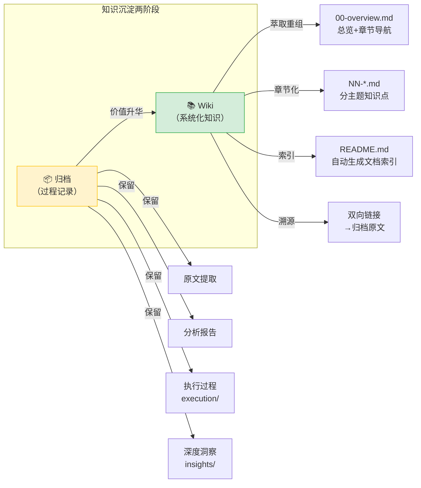
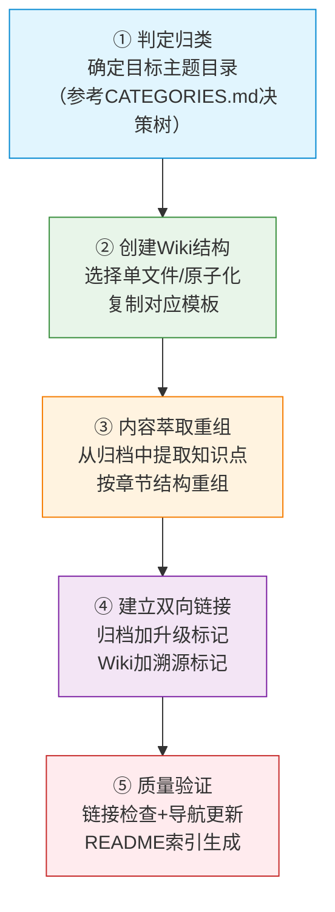

# 归档搭配Wiki联动机制指南

> 本指南定义外部学习资料从「归档（过程记录）」到「Wiki（系统化知识库）」的升级路径与双向关联规范，确保知识沉淀既有完整的过程审计能力，又有面向复用的系统化导航结构。

## 一、核心定位：归档与Wiki的本质区别

归档与Wiki是知识沉淀的两个不同阶段，各司其职、互为补充：

| 维度 | 归档（Archive） | Wiki（系统化知识库） |
|------|----------------|---------------------|
| **定位** | 单任务过程记录与原始资料仓库 | 面向复用的主题化知识体系 |
| **目录位置** | `.agents/docs/retrospective/reports/insight-extraction/external-learning/retrospective-<topic>-<YYYYMMDD>/` | `.agents/docs/knowledge/learning/NN-<theme>/<topic>-wiki/`（原子化）或 `.agents/docs/knowledge/learning/NN-<theme>/<topic>-wiki.md`（单文件） |
| **命名规则** | `retrospective-<topic>-<YYYYMMDD>/`（带日期后缀，体现任务时效性） | `<topic>-wiki/` 或 `<topic>-wiki.md`（无日期，主题持久化） |
| **核心读者** | 复盘审计者、未来执行类似任务的智能体 | 系统学习者、知识检索者 |
| **内容结构** | 保留执行上下文：原文→分析报告→执行过程→深度洞察 | 面向认知的章节结构：总览→核心概念→分主题讲解→对比→术语→资源 |
| **导航方式** | README.md为任务入口，按执行阶段组织文件 | 00-overview.md为总入口，含章节导航表和阅读路径建议 |
| **更新频率** | 归档后基本不再更新（静态历史记录） | 可随认知深化持续迭代（动态知识资产） |
| **关联关系** | 标注"升级为Wiki"链接 | 标注"原始归档"溯源链接 |



---

## 二、升级判定标准：何时从归档升级为Wiki

并非所有归档都需要升级为Wiki。当满足以下**任一主要标准**或**两条以上次要标准**时，应触发Wiki化升级：

### 主要标准（满足任一即升级）

| 标准 | 判定方法 | 示例 |
|------|---------|------|
| **主题具有长期复用价值** | 内容是基础性概念、方法论框架、工具系统教程，而非单次事件评论 | FFI教程、IDL教程、Harness工程方法论 → 应升级为Wiki |
| **内容体量达到系统化阈值** | 分析报告≥500行，或包含≥5个可独立成节的核心概念，或可组织为≥3个逻辑章节 | FFI 7章、MCP协议12章 → 应升级为原子化Wiki |
| **属于8大学习主题范畴** | 主题匹配Learning Wiki八大分类（01-08）之一，且具有知识体系补全价值 | 新的Agent协议分析、新的工程方法论、主流厂商产品深度拆解 |

### 次要标准（满足两条即升级）

| 标准 | 判定方法 |
|------|---------|
| **有后续关联任务** | 已有或预期会有同主题的后续分析任务，需要知识索引 |
| **跨归档主题关联** | 与现有≥2个Wiki存在交叉引用关系，可作为知识网络节点 |
| **含可操作方法论** | 沉淀了SOP、最佳实践、决策框架等可直接复用的程序性知识 |
| **用户明确要求** | 用户显式要求"做成Wiki"或"系统化整理" |

### 不建议升级的场景

| 场景 | 处理方式 |
|------|---------|
| 单次新闻事件评论、无长期参考价值 | 保持归档状态，仅在README中做好摘要 |
| 内容体量过小（<200行且无结构化分节可能） | 保持单文件归档，如有价值可作为其他Wiki的参考链接 |
| 时效性极强的版本发布信息 | 归档保留，待多个版本积累后可考虑做版本对比Wiki |

---

## 三、双向关联机制

### 3.1 归档→Wiki的升级标记

在归档目录的`README.md`中添加**升级标记区块**：

```markdown
## 🔄 知识升级

本归档内容已系统化升级为Learning Wiki：

- **Wiki入口**：[<Wiki名称>](../../../../knowledge/learning/NN-<theme>/<topic>-wiki/00-overview.md)
- **升级日期**：YYYY-MM-DD
- **升级说明**：简要说明Wiki在归档基础上做了哪些结构化重组（如"拆分为7章系统化教程，新增术语表和交叉引用"）

> 💡 **查阅建议**：如需系统学习该主题请访问Wiki；如需审计本次分析的完整执行过程、原始上下文或中间产物，请查阅本归档。
```

### 3.2 Wiki→归档的溯源标记

在Wiki的`00-overview.md`（原子化Wiki）或Wiki单文件末尾添加**溯源区块**：

```markdown
## 📦 原始来源与延伸阅读

本Wiki基于以下外部学习归档萃取重组而成：

| 归档 | 说明 | 链接 |
|------|------|------|
| <归档标题> | 原文提取、完整分析报告、执行过程复盘与深度洞察 | [retrospective-<topic>-<YYYYMMDD>/](../../retrospective/reports/insight-extraction/external-learning/retrospective-<topic>-<YYYYMMDD>/README.md) |

如需查阅分析执行过程、原始上下文、中间推导步骤，请访问上述归档。
```

### 3.3 链接路径规范

- 归档位于：`.agents/docs/retrospective/reports/insight-extraction/external-learning/retrospective-<topic>-<YYYYMMDD>/`
- Wiki位于：`.agents/docs/knowledge/learning/NN-<theme>/<topic>-wiki/`
- 归档→Wiki相对路径：从归档README出发，需向上6级再进入knowledge/learning/
  - 路径示例：`../../../../knowledge/learning/NN-<theme>/<topic>-wiki/00-overview.md`
- Wiki→归档相对路径：从Wiki 00-overview.md出发，需向上4级再进入retrospective/
  - 路径示例：`../../../retrospective/reports/insight-extraction/external-learning/retrospective-<topic>-<YYYYMMDD>/README.md`

> ⚠️ **重要**：路径计算完成后必须运行链接检查验证：`python .agents/scripts/check-links.py --fix`

---

## 四、Wiki化标准操作流程（SOP）

当判定一个归档需要升级为Wiki时，按以下5步执行：



### 第1步：判定归类

1. 阅读 [CATEGORIES.md](../learning/CATEGORIES.md) 的「新增Wiki归类决策树」
2. 确定目标主题目录（01-08或跨领域专题）
3. 确定Wiki形式：
   - **单文件Wiki**：内容<300行、结构相对简单、无需多章节导航 → 使用单文件模板
   - **原子化Wiki**：内容≥300行、可拆分为≥3个独立章节、需要分节导航 → 使用原子化目录模板

### 第2步：创建Wiki结构

根据选择的形式创建结构：

**原子化Wiki结构**（推荐用于系统性教程）：
```
<topic>-wiki/
├── README.md          # 自动生成的文档索引（由generate-readme.py生成）
├── 00-overview.md     # 总览页：教程简介、章节导航、阅读路径、目标读者（必须手工创建）
├── 01-*.md            # 第1章
├── 02-*.md            # 第2章
├── ...
└── NN-resources.md    # 最后一章：术语表+参考资料（建议固定为最后一章）
```

**单文件Wiki结构**：
```
<topic>-wiki.md      # 单个文件，内部用二级/三级标题分节
```

> 📌 **命名规范**：目录名/文件名使用kebab-case纯英文，禁止中文。验证命令：`python .agents/scripts/check-filename-convention.py`

### 第3步：内容萃取重组

**核心原则**：Wiki不是归档的简单复制，而是面向学习认知的**重组与升华**。

从归档中萃取内容时遵循以下映射：

| 归档内容 | Wiki处理方式 |
|---------|-------------|
| `article-content.md`（原文） | 不直接复制，理解后用自己的语言重述核心知识点，引用时标注来源 |
| `analysis-report.md`（分析报告） | 作为主要素材来源，拆分到对应章节；执行摘要放在00-overview |
| `execution/*.md`（中间产物） | 结论性内容吸收到对应章节，过程性推导一般不放入Wiki（保留在归档供溯源） |
| `insights/*.md`（深度洞察） | 核心洞察融入对应章节，方法论级别的洞察可考虑在00-overview中突出 |
| 关键数据点 | 用表格或列表结构化呈现，保留数字准确性 |
| 核心概念 | 单独成节，给出明确定义，必要时配Mermaid图 |
| 可操作建议 | 整理为清单或最佳实践章节 |

**原子化Wiki的00-overview.md必须包含**：
1. 教程简介（1-3段话说明Wiki是什么、解决什么问题）
2. 定位图（如有必要，用Mermaid说明该主题在知识体系中的位置）
3. 章节导航表（章节编号、标题、内容概要、对应文件链接）
4. 目标读者与前置知识要求
5. 阅读路径建议（线性阅读/按需查阅）
6. 与项目内其他Wiki的交叉引用（延伸阅读）

### 第4步：建立双向链接

按第三节"双向关联机制"要求：
1. 在归档README.md中添加上升级标记区块
2. 在Wiki 00-overview.md（或单文件Wiki末尾）添加溯源区块
3. 计算相对路径时仔细核对层级（建议参考同目录下已有Wiki的链接写法）

### 第5步：质量验证

执行以下验证步骤：

```powershell
# 1. 文件名规范检查
python .agents/scripts/check-filename-convention.py

# 2. 链接有效性检查（含自动修复）
python .agents/scripts/check-links.py --fix

# 3. 原子化Wiki：生成README索引（在Wiki目录下执行）
# 参考：.agents/scripts/generate-readme.py 的使用方式
# 或手动编写README.md确保索引完整

# 4. 确认Wiki在主题目录中可被发现
# 检查主题目录的README.md是否需要添加入口（如learning/03-*/README.md）
```

---

## 五、模板参考

### 5.1 原子化Wiki 00-overview.md 模板

```markdown
---
id: "<topic>-wiki-overview"
title: "<主题中文名称>教程总览"
x-toml-ref: "<相对路径到.toml元数据文件>"
source: "archive:retrospective-<topic>-<YYYYMMDD>"
category: "learning"
tags: ["<tag1>", "<tag2>", "<tag3>", "overview", "tutorial"]
date: "<YYYY-MM-DD>"
status: "stable"
author: "SpecWeave"
summary: "<一句话摘要，概括本Wiki的核心内容与覆盖范围>"
---
# <主题中文名称>（<英文/缩写>）教程

## 教程简介

<1-3段话介绍：这是什么、解决什么问题、为什么重要、读者能学到什么>

## <主题>在知识体系中的定位

（可选，用Mermaid图或文字说明该主题与相关概念的关系）

## 章节导航

| 章节 | 标题 | 内容概要 | 文件 |
|---|---|---|---|
| 1 | <第1章标题> | <一句话概要> | [01-*.md](01-*.md) |
| 2 | <第2章标题> | <一句话概要> | [02-*.md](02-*.md) |
| ... | ... | ... | ... |
| N | 术语表与参考资料 | 术语定义、权威参考、扩展阅读、交叉引用 | [NN-resources.md](NN-resources.md) |

## 目标读者

本教程适合以下读者：

- **<读者类型1>**：<说明>
- **<读者类型2>**：<说明>

**前置知识要求**：<说明需要什么基础，或链接到前置Wiki>

## 阅读路径建议

### 线性阅读（推荐新手）

按章节顺序从1到N完整阅读。

### 按需查阅（推荐有经验者）

- <场景1> → 直接跳转第X章
- <场景2> → 阅读第Y章和第Z章
- 查找术语 → 查阅最后一章术语表

## 延伸阅读

本Wiki与项目内其他Wiki形成知识网络：

- [<相关Wiki1>](../<other-wiki>/00-overview.md) — <说明关联关系>
- [<相关Wiki2>](../<other-wiki2>/README.md) — <说明关联关系>

## 📦 原始来源

本Wiki基于外部学习归档萃取重组：
- 原始归档：[retrospective-<topic>-<YYYYMMDD>](../../retrospective/reports/insight-extraction/external-learning/retrospective-<topic>-<YYYYMMDD>/README.md)

---

> **开始阅读**：[第1章 — <标题> →](01-*.md)
```

### 5.2 单文件Wiki 模板

```markdown
---
id: "<topic>-wiki"
title: "<主题中文名称>学习笔记"
x-toml-ref: "<相对路径到.toml元数据文件>"
source: "archive:retrospective-<topic>-<YYYYMMDD>"
category: "learning"
tags: ["<tag1>", "<tag2>", "<tag3>"]
date: "<YYYY-MM-DD>"
status: "stable"
author: "SpecWeave"
summary: "<一句话摘要>"
---
# <主题中文名称>

> 一句话摘要：<用一句话描述本文档的核心内容>

---

## 核心概览

<正文内容开始，用##分节组织>

## <第一节标题>

<内容>

## <第二节标题>

<内容>

---

## 📦 原始来源与延伸阅读

本Wiki基于以下归档萃取：
- [retrospective-<topic>-<YYYYMMDD>](../../retrospective/reports/insight-extraction/external-learning/retrospective-<topic>-<YYYYMMDD>/README.md)
```

---

## 六、质量检查清单

Wiki化完成后，逐项检查：

| 检查项 | 状态 |
|--------|------|
| ▢ 目标主题目录（01-08或跨领域）选择正确 | ☐ |
| ▢ Wiki形式（单文件/原子化）选择合理 | ☐ |
| ▢ 文件/目录命名符合kebab-case纯英文规范 | ☐ |
| ▢ frontmatter字段完整（id/title/source/category/tags/date/status/summary） | ☐ |
| ▢ source字段正确指向原始归档ID | ☐ |
| ▢ 原子化Wiki的00-overview.md包含必备6要素 | ☐ |
| ▢ 章节编号连续（00→01→02→...→NN） | ☐ |
| ▢ 术语表/参考资料作为最后一章 | ☐ |
| ▢ 归档README.md已添加上升级标记区块 | ☐ |
| ▢ Wiki已添加溯源标记区块 | ☐ |
| ▢ 双向链接相对路径层级正确 | ☐ |
| ▢ 同主题目录下已有Wiki的交叉引用已添加 | ☐ |
| ▢ 运行`check-links.py --fix`无错误 | ☐ |
| ▢ 运行`check-filename-convention.py`无错误 | ☐ |
| ▢ 主题目录README.md（如learning/03-*/README.md）已添加入口链接 | ☐ |

---

## 七、实例参考

### 已有的"归档→Wiki"升级路径

| 主题 | 归档 | Wiki |
|------|------|------|
| （待补充实际案例） | - | - |

### 标准Wiki范例

以下原子化Wiki可作为结构参考：
- [FFI外部函数接口Wiki](../learning/01-agent-protocols-interfaces/ffi-wiki/00-overview.md) — 7章标准原子化结构
- [IDL接口定义语言Wiki](../learning/01-agent-protocols-interfaces/idl-wiki/00-overview.md) — 9章教程结构
- [Harness Engineering Wiki](../learning/02-agent-engineering-methodology/harness-engineering-wiki/00-overview.md) — 方法论类Wiki范例
- [向日葵无网远控硬件Wiki](../learning/07-vendor-product-learning/sunlogin/sunlogin-offline-hardware-wiki/00-overview.md) — 厂商产品类Wiki范例

---

## 八、常见问题

**Q: 归档升级为Wiki后，归档目录可以删除吗？**
A: 不可以。归档保留完整执行上下文（原文提取、中间产物、执行复盘），是知识溯源和审计的依据。Wiki是重组后的面向阅读版本，两者互为补充，不可替代。

**Q: 一个归档可以升级出多个Wiki吗？**
A: 可以。如果归档内容跨多个主题，可以拆分到不同主题目录下的多个Wiki，每个Wiki在溯源区块中都引用同一个归档。

**Q: 多个归档可以合并为一个Wiki吗？**
A: 可以。当多个同主题归档积累到一定程度，可以萃取合并为一个更完整的Wiki。此时Wiki的溯源区块列出所有源归档。

**Q: Wiki创建后发现需要更新内容怎么办？**
A: Wiki是动态知识资产，可以直接更新。如果更新源自新的同主题归档，在溯源区块追加新的归档链接即可。

**Q: 单文件Wiki后来内容膨胀，可以转为原子化Wiki吗？**
A: 可以。这是正常演进。将单文件按章节拆分为NN-*.md文件，创建00-overview.md和README.md，更新所有指向该Wiki的链接，然后运行链接检查修复。
