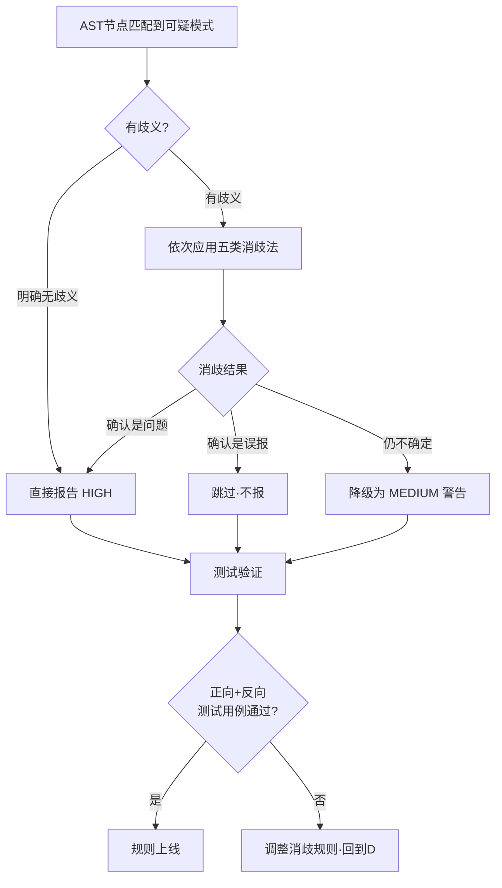

# Python AST静态分析实践：五类消歧法降低误报

> **验证状态**：在并发安全检查器开发中验证（534行测试代码，33个测试用例）
> **适用场景**：开发Python代码规范检查器、安全扫描器、性能反模式检测器、复杂度分析工具等基于AST的静态分析工具

---

## 为什么误报是静态分析的致命敌人？

Python是动态类型语言，AST（抽象语法树）只包含语法信息，不包含运行时类型信息。这导致一个根本问题：**同名方法在不同上下文中语义完全不同**。

### 典型的误报场景

```python
# ✗ 误报案例1：str.join() 被误认为 Thread.join()
result = ",".join(items)  # 字符串join，不是线程join！

# ✗ 误报案例2：list查找被误认为循环内O(n)性能问题
valid_ids = {1, 2, 3}
if user_id in valid_ids:  # 在集合里查找，O(1)，不是问题！
    ...

# ✗ 误报案例3：测试代码中的故意反例被检测
def test_lock_without_timeout():
    lock = threading.Lock()
    lock.acquire()  # 测试故意写的反例，不应被工具报错
```

### 误报的代价链条


> **核心原则：Precision over Recall（宁可漏报，不可误报）**
> - 误报代价：开发者跳过所有检查 → 防线全面崩溃
> - 漏报代价：个别问题未检测到 → Code Review和CI兜底
> - **消歧不确定时：降级为警告（MEDIUM），而非报错（HIGH）**

---

## 五类消歧策略

### 策略一：同名消歧法（Name-based Disambiguation）

**问题**：同名方法在不同接收者类型上语义完全不同。

**方法**：结合变量名命名约定 + 构造函数类型追踪。

```python
# 判定规则：
# - 变量名含 thread/worker/lock/rwlock → 并发原语
# - 追踪赋值语句：x = threading.Lock() → x是锁
# - 变量名后缀 _set/_dict/_map → 集合类型

# ✓ 不应报：变量名不含thread/worker
result = ",".join(items)  # 字符串join

# ✓ 应该报：变量名含thread
worker_thread.join()  # 线程join无timeout → 超时风险

# ✓ 不应报：变量名含_set
if item in allowed_set:  # 集合查找O(1)，不是问题

# ✓ 应该报：变量名含_list且在循环内
for user in users:
    if user.id in pending_list:  # 列表查找O(n)在循环内→边界风险
```

### 策略二：类型推断法（Type Inference via Naming）

**问题**：AST无法推断运行时类型（`items = []` 是list还是deque？）。

**方法**：利用团队命名约定做启发式类型推断。

| 命名后缀 | 推断类型 | 检查策略 |
|---------|---------|---------|
| `*_list` / `*_items` | list | 循环内`x in` → O(n)风险 |
| `*_set` | set | `x in` → 安全O(1) |
| `*_dict` / `*_map` | dict | 键查找 → 安全O(1) |
| `*_lock` / `*_mutex` | Lock | acquire无timeout → 超时风险 |
| `*_thread` / `*_worker` | Thread | join无timeout → 超时风险 |

**局限性处理**：
- 对不遵循命名约定的代码 → **保守处理**（不报或降为MEDIUM）
- 不要因为变量名不规范就误报，那是代码风格问题，不是并发安全问题

### 策略三：上下文覆盖法（Context Coverage）

**问题**：相同代码模式在不同上下文中风险等级完全不同。

**方法**：遍历AST时维护上下文状态（循环深度、函数名、类名等）。

```python
# AST Visitor 中维护上下文
class SafetyVisitor(ast.NodeVisitor):
    def __init__(self):
        self.loop_depth = 0       # 当前循环嵌套深度
        self.function_name = ""   # 当前函数名
        self.class_name = ""      # 当前类名

    def visit_For(self, node):
        self.loop_depth += 1
        self.generic_visit(node)   # 访问子节点时loop_depth+1
        self.loop_depth -= 1

    def visit_While(self, node):
        self.loop_depth += 1
        self.generic_visit(node)
        self.loop_depth -= 1

    def visit_Compare(self, node):
        # 检查 x in y 模式
        if isinstance(node.ops[0], ast.In):
            comparator = node.comparators[0]
            if self._is_list_type(comparator) and self.loop_depth > 0:
                self._report_issue(node, "BOUNDARY", "循环内O(n)线性查找")
```

**⚠️ 容易遗漏的AST节点类型**：

| 节点类型 | 说明 |
|---------|------|
| `ast.AsyncFor` | 异步for循环——和普通For一样影响loop_depth |
| `ast.While` | while循环——别忘了！ |
| `ast.IfExp` | 三元表达式 `a if cond else b`——内部可能包含循环 |
| `ast.comprehension` | 列表/集合/字典推导式——隐含循环 |
| `ast.Try`/`ast.ExceptHandler` | 异常处理——内部代码的上下文 |

### 策略四：作用域限制法（Scope Limitation）

**问题**：跨函数/跨文件的数据流分析复杂度极高（NP难问题）。

**方法**：将分析范围限制在**单个函数/方法内部**，不做跨过程分析。

```python
# ✗ 不做的事：跨过程类型追踪
def process(items):
    # items是什么类型？调用者可能传list也可能传set
    for x in large_dataset:
        if x in items:  # 无法确定items类型 → 不报
            ...

# ✓ 做的事：函数内局部推断
def process():
    pending_list = []  # 本函数内赋值 → 确定是list
    for x in large_dataset:
        if x in pending_list:  # 确定是list在循环内 → 报告
            ...
```

**原则**：局部分析足够捕获80%的问题，跨过程分析的复杂度不值得边际收益。

| 分析范围 | 覆盖率 | 实现复杂度 |
|---------|-------|----------|
| 单函数内局部分析 | ~80% | 低 |
| 类内方法间追踪 | ~10% | 中 |
| 跨模块/文件追踪 | ~5% | 极高 |
| 全程序数据流分析 | ~5% | 几乎不可能 |

### 策略五：测试跳过法（Test Code Exclusion）

**问题**：测试代码中故意写的反例会被误报。

**方法**：自动识别并跳过测试代码。

```python
def should_skip_file(self, filepath: Path) -> bool:
    """判断是否应该跳过此文件。"""
    path_str = str(filepath)
    # 测试目录
    if "/tests/" in path_str or "\\tests\\" in path_str:
        return True
    # 测试文件前缀
    if filepath.name.startswith("test_"):
        return True
    return False

def should_skip_function(self, func_name: str, class_name: str) -> bool:
    """判断是否应该跳过此函数/方法。"""
    # 测试函数
    if func_name.startswith("test_"):
        return True
    # 测试类
    if class_name.startswith("Test"):
        return True
    return False
```

**注意**：检查器本身的测试文件需要特殊处理——测试文件里故意写有问题的代码来验证检查器能检测到，这些文件应该用特殊标注或独立测试目录来排除。

---

## 消歧决策流程



## 每个规则必须有两类测试

```python
# 并发安全检查器的测试结构示例

class TestJoinTimeout:
    """join()超时检查的测试。"""

    def test_thread_join_without_timeout_positive(self):
        """✓ 正向测试：Thread.join()无timeout → 必须报"""
        code = """
import threading
def worker():
    t = threading.Thread(target=task)
    t.start()
    t.join()  # 无timeout！
"""
        issues = scan_code(code)
        assert len(issues) == 1
        assert issues[0].dimension == "TIMEOUT"

    def test_string_join_negative(self):
        """✓ 反向测试：str.join() → 不能误报"""
        code = """
result = ",".join(["a", "b", "c"])
"""
        issues = scan_code(code)
        assert len(issues) == 0  # 零误报！

    def test_thread_join_with_timeout_negative(self):
        """✓ 反向测试：Thread.join(timeout=5) → 不能误报"""
        code = """
worker_thread.join(timeout=5)
"""
        issues = scan_code(code)
        assert len(issues) == 0
```

> **测试铁律**：每个检查规则至少1个正向测试（应报）+ 1个反向测试（不应报）。

---

## 常见误区

| 误区 | 正确做法 |
|------|---------|
| 用正则表达式做代码分析 | 使用Python `ast`模块——正则无法处理嵌套结构和上下文 |
| 追求100%检测率 | 接受静态分析有理论极限（Rice定理），专注降低误报 |
| 所有问题都报HIGH | 确定的报HIGH，不确定的报MEDIUM，给开发者判断空间 |
| 忘记覆盖AsyncFor/While | AST访问器必须覆盖所有循环节点类型 |
| 不写反向测试 | 反向测试（不应报）比正向测试更重要——防止误报回归 |
| 做跨过程分析 | 局部分析足够，边际收益不值得复杂度 |

---

## 快速检查清单

开发新的AST检查规则时，逐项确认：

- [ ] 是否使用 `ast` 模块而非正则？
- [ ] 同名方法/函数是否做了消歧？
- [ ] 是否利用了命名约定做类型推断？
- [ ] 是否考虑了上下文（循环深度、函数名等）？
- [ ] 分析范围是否限制在单个函数内？
- [ ] 是否自动跳过了测试代码？
- [ ] 是否有至少1个正向测试用例？
- [ ] 是否有至少1个反向（防误报）测试用例？
- [ ] 不确定的情况是否降级为MEDIUM而非HIGH？
- [ ] 检查速度是否满足增量扫描要求（单文件<100ms）？

## 相关指南

- [链式pre-commit钩子架构实践指南](git-hook-chain-architecture.md) — 将AST检查工具集成到pre-commit钩子
- [并发代码安全审查六维检查法](concurrent-code-safety-review.md) — 六维检查法的人工审查版（方法论来源）
- [多文件编辑可靠性指南](multi-file-edit-reliability.md) — 代码修改时的可靠性保障
