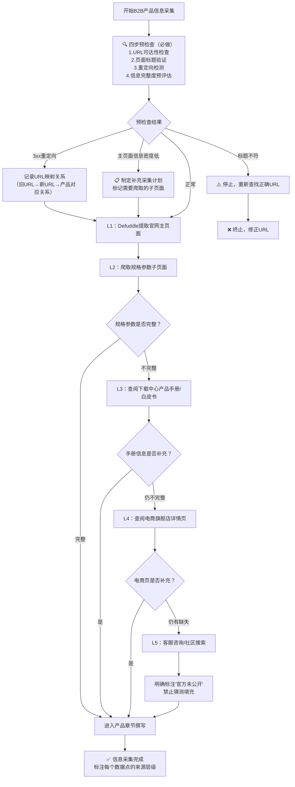

# B2B/旗舰产品信息源分层采集规范

## 背景

在对B2B（企业级）产品、旗舰产品、老产品进行网页信息提取时，发现以下问题：

1. **主页面信息密度低**：B2B产品官网首页通常以营销文案为主，核心技术参数藏在"规格参数""下载中心"等子页面
2. **参数标注"官方未公开"**：部分老产品/旗舰产品的关键参数（如处理器型号、延迟数据）在主页面未公开
3. **URL重定向风险**：产品迭代时旧SKU页面可能3xx重定向到新产品页面，导致产品混淆
4. **Defuddle提取不完整**：defuddle默认提取主内容区，可能过滤掉规格表格、下载链接等关键信息

## 信息源五层优先级

采集B2B/旗舰产品信息时，按以下优先级逐层采集，每层信息标注来源可信度：

| 优先级 | 信息源 | 可信度 | 采集内容 | 获取方式 |
|--------|--------|--------|---------|---------|
| L1（官方产品页） | 官网产品主页面 | ★★★★☆ | 产品定位、核心卖点、外观设计、主要功能列表 | Defuddle优先提取 |
| L2（规格参数子页） | 官网"规格参数""技术规格"子页面 | ★★★★★ | 完整技术参数表、接口规格、电气性能 | 从产品页找规格链接，Defuddle/WebFetch |
| L3（下载中心） | 官网"下载中心""支持"页面的产品手册、技术白皮书、Datasheet | ★★★★★ | 详细参数、安装指南、协议说明、尺寸图 | WebFetch提取，必要时下载PDF |
| L4（电商旗舰店） | 京东/天猫官方旗舰店商品详情页 | ★★★☆☆ | 实际售价、促销信息、用户评价中的真实使用反馈、产品实拍图 | agent-browser访问（需登录）或WebFetch |
| L5（客服/社区） | 官方客服咨询、用户论坛、技术社区 | ★★☆☆☆ | 未公开参数的官方回复、实际使用问题、解决方案 | agent-browser交互，记录对话摘要 |

## 标准采集流程

## 各层采集详细规范

### L1：官网产品主页面

- **工具**：Defuddle（优先），WebFetch兜底
- **采集内容**：
  - 产品名称、定位描述、一句话卖点
  - 外观图片描述
  - 核心功能列表（3-5个）
  - 应用场景概述
- **注意事项**：
  - 注意营销文案的夸张表述，与L2-L3参数交叉验证
  - 提取后检查是否有"了解更多""查看规格"等链接，这些指向L2子页面

### L2：规格参数子页面

- **工具**：WebFetch（规格表格常被defuddle过滤）
- **采集内容**：
  - 完整技术参数表（处理器、内存、接口、分辨率、功耗、尺寸重量等）
  - 电气规格、工作温度、认证信息
  - 接口定义图、尺寸图
- **注意事项**：
  - 规格表格优先保留原始表格格式
  - 注意参数的条件说明（如"最大分辨率@30Hz"中的帧率条件）

### L3：下载中心（产品手册/技术白皮书/Datasheet）

- **工具**：WebFetch提取下载页链接；PDF文档需用pdf Skill处理
- **采集内容**：
  - 详细功能说明
  - 通信协议描述
  - 安装部署指南
  - 故障排查表
  - 尺寸安装图
- **注意事项**：
  - 产品手册是最权威的参数来源，与L1/L2矛盾时以手册为准
  - 注意手册版本号，优先使用最新版本

### L4：电商旗舰店详情页

- **工具**：agent-browser（电商页面常需JS渲染，且有反爬机制）
- **采集内容**：
  - 实际售价（标注采集日期）
  - 促销/套装信息
  - 用户评价中的高频问题和好评关键词
  - 产品实拍图、场景图
  - 客服FAQ中的补充信息
- **注意事项**：
  - 电商页价格波动大，必须标注采集日期
  - 用户评价作为使用体验参考，不作为技术参数依据
  - 区分官方旗舰店和第三方经销商

### L5：客服咨询/技术社区

- **工具**：agent-browser交互
- **采集内容**：
  - L1-L4中未找到的参数（客服回复）
  - 常见问题解决方案（社区帖子）
  - 实际部署案例
- **注意事项**：
  - 客服回复可信度中等，需与已有信息交叉验证
  - 社区帖子区分官方回复和用户经验
  - 信息冲突时标注"客服回复：XXX，待验证"

## 信息缺失处理原则

1. **禁止猜测填充**：当L1-L5都无法确认某参数时，明确标注"官方未公开"或"待验证"
2. **标注来源层级**：正文中引用参数时，优先标注L2/L3来源的数据；使用L4/L5数据时需注明"据电商页面/客服回复"
3. **价格标注日期**：所有价格必须标注采集日期，格式："XXX元（YYYY-MM-DD采集，来源：XXX旗舰店/官网）"
4. **重定向记录**：发现URL重定向时，在文档开头增加"URL映射记录"章节，明确标注旧URL→新URL→产品对应关系

## 信息可信度标注规范

在Wiki文档中引用不同来源的信息时，按以下方式标注可信度：

| 标注方式 | 含义 | 使用场景 |
|---------|------|---------|
| 无特殊标注 | 来自L1-L3官方信息源 | 常规参数描述 |
| "（据官方旗舰店）" | 来自L4电商页面 | 价格、促销信息 |
| "（据客服回复）" | 来自L5客服咨询 | 未公开参数的间接获取 |
| "（据用户反馈）" | 来自L5社区/评价 | 使用体验、兼容性问题 |
| "**官方未公开**" | L1-L5均无法确认 | 参数缺失，禁止猜测 |

## 与defuddle-web-extraction-preferred模式的配合

本SOP是 [defuddle-web-extraction-preferred.md](../../retrospective/patterns/methodology-patterns/tools-automation/defuddle-web-extraction-preferred.md) 模式在B2B/旗舰产品场景下的补充规范：

1. 四步预检查（URL可达性→标题验证→重定向检测→信息完整度评估）是采集前的必做步骤
2. L1层使用defuddle作为主提取工具
3. L2-L5层根据页面特性选择defuddle或WebFetch
4. 提取后执行完整性检查，发现缺失按L2→L3→L4→L5顺序补全

## 验证案例

- **向日葵控控2（B2B老产品）**：主页面参数不完整，通过L2规格子页面+L3下载中心产品手册补充了大部分参数，处理器型号等仍未公开则标注"官方未公开"
- **向日葵Q2Pro-BLE**：预检查阶段发现URL 3xx重定向到Q2Pro工业4G版本，记录映射关系后分别处理两个产品页面