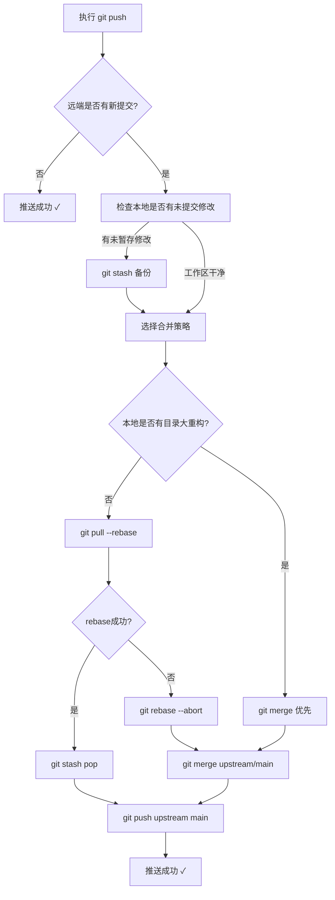

# Git推送被拒绝（fetch first）问题解决指南

> **验证状态**：已在SpecWeave项目2026-08-14推送冲突场景中验证（upstream有1个自动提交+本地apps目录分组重构）
> **适用场景**：`git push`报错`[rejected] ... (fetch first)`、远端包含本地没有的提交、特别是本地有目录结构大重构的场景

---

## 问题现象

执行 `git push upstream main` 时出现以下错误：

```
$ git push upstream main
To github.com:xinetzone/SpecWeave.git
 ! [rejected]          main -> main (fetch first)
error: failed to push some refs to 'github.com:xinetzone/SpecWeave.git'
hint: Updates were rejected because the remote contains work that you do
hint: have locally. This is usually caused by another repository pushing to
hint: the same ref. If you want to integrate the remote changes, use
hint: 'git pull' before pushing again.
hint: See the 'Note about fast-forwards' in 'git push --help' for details.
```

## 根因分析

| 原因 | 说明 | 本次案例 |
|------|------|---------|
| 远端有新提交 | 其他人/CI机器人向同一分支推送了提交，本地历史落后 | GitHub Actions自动更新了README.md统计徽章 |
| 本地有大重构 | 本地包含目录移动/重命名等大变更 | apps/目录分组重构（507个文件重命名） |
| 非fast-forward | Git无法自动快进合并，需要人工整合 | ✓ |



## 标准解决流程（五步法）

### Step 1：诊断现状

```bash
# 1.1 检查工作区状态
git status

# 1.2 查看本地最近提交
git log --oneline -10

# 1.3 查看远端配置
git remote -v

# 1.4 获取远端最新信息（不合并）
git fetch upstream
```

**关键检查点**：
- □ 是否有未暂存/未提交的修改？
- □ 远端比本地多了哪些提交？（`git log --oneline main..upstream/main`）
- □ 本地是否包含目录重命名/移动等大重构？

### Step 2：安全备份工作区

**重要**：在任何合并/变基操作前，先备份本地修改：

```bash
# 如果有未提交修改，先stash
git stash

# 验证stash成功
git stash list
```

**常见问题处理**：如果遇到 `index.lock exists` 错误：

```powershell
# Windows PowerShell
Remove-Item -Path ".git/index.lock" -Force -ErrorAction SilentlyContinue

# Linux/macOS
rm -f .git/index.lock
```

### Step 3：选择合并策略

| 策略 | 适用场景 | 优点 | 风险 |
|------|---------|------|------|
| `git pull --rebase upstream main` | 无目录大重构、提交历史线性 | 历史整洁，无多余merge commit | 目录重构时可能大量冲突 |
| `git merge upstream/main` | **有目录大重构、冲突风险高** | 冲突少、自动处理好、安全 | 会产生一个merge commit |

> **经验法则**：如果本地有超过50个文件的重命名/移动，**优先使用merge**，不要用rebase。

### Step 4：执行合并

#### 方案A：rebase（无大重构时）

```bash
git pull --rebase upstream main
```

如果rebase失败：
```bash
# 立即中止rebase，不要尝试解决冲突（目录重构场景下冲突太多）
git rebase --abort

# 然后改用merge方案
```

**rebase失败典型症状**（目录重构场景）：
```
error: unable to unlink old 'apps/old-dir/file': Invalid argument
hint: Could not execute the todo command
```

#### 方案B：merge（推荐，大重构场景必选）

```bash
git merge upstream/main -m "merge: 整合 upstream/main 自动更新"
```

merge成功后，清理可能残留的旧目录文件：
```powershell
# Windows: 检查并删除未跟踪的旧目录（rebase失败残留）
git status
# 如果有Untracked files是旧目录结构，删除它们
# Remove-Item -Path "apps/old-dir" -Recurse -Force
```

### Step 5：恢复修改并推送

```bash
# 5.1 恢复之前stash的修改
git stash pop

# 5.2 验证状态
git status
git log --oneline -5

# 5.3 推送到远端
git push upstream main
```

## 本次实战案例详解

### 问题背景

- **upstream新增提交**：`09133736 chore(docs): 自动更新核心数据统计`（仅修改README.md中Skills徽章数字22→21）
- **本地包含大重构**：提交`05c2d362 refactor(apps): 按应用类型分组重构 apps/ 目录`（507个文件重命名）
- **本地有未提交修改**：3个Dockerfile模板文件的修改

### 执行轨迹

| 步骤 | 命令 | 结果 |
|------|------|------|
| 1 | `git fetch upstream` | 获取到1个新提交 |
| 2 | `git stash` | 备份3个文件的未提交修改（遇到index.lock，删除后成功） |
| 3 | `git pull --rebase upstream main` | ❌ 失败，unlink旧目录错误 |
| 4 | `git rebase --abort` | 中止rebase，清理旧目录残留 |
| 5 | `git merge upstream/main -m "merge: ..."` | ✅ 成功，仅修改README.md |
| 6 | `git stash pop` | ✅ 发现修改已在之前的提交中，工作区干净 |
| 7 | `git push upstream main` | ✅ 成功推送 |

### 关键经验

1. **stash的修改可能已经被提交了**：stash pop后显示"nothing to commit"是正常的，说明修改已经在本地提交中了
2. **rebase在目录重构时不要硬扛**：出现unlink错误立即abort，改用merge，省时省力
3. **index.lock是常见问题**：遇到它先删除，一般是之前git操作异常中断导致的
4. **merge commit不可怕**：在有大重构的场景下，一个merge commit比解决几百个冲突要划算得多

## 快速速查表

| 场景 | 推荐命令 |
|------|---------|
| 日常更新，无重构 | `git pull --rebase upstream main` |
| 本地有目录大重构 | `git fetch upstream && git merge upstream/main` |
| 有未提交修改 | 先`git stash`，合并后`git stash pop` |
| rebase失败 | `git rebase --abort`，然后改用merge |
| 出现index.lock | 删除`.git/index.lock`文件 |
| 推送前最后检查 | `git status && git log --oneline -5` |

## 预防措施

1. **定期拉取**：开始工作前先`git pull --rebase upstream main`，减少冲突概率
2. **小步提交**：大重构拆分成多个小提交，便于冲突解决
3. **推送前先fetch**：`git fetch upstream && git log --oneline ..upstream/main` 提前知道是否有新提交
4. **CI自动提交须知**：如果仓库有GitHub Actions等自动提交机制（如自动更新统计、徽章），推送前一定要先fetch

## 相关指南

- [链式pre-commit钩子架构实践指南](git-hook-chain-architecture.md) — Git hooks配置最佳实践
- [目录迁移检查清单](directory-migration-checklist.md) — 目录重构时的检查清单
- [Windows平台零摩擦开发指南](windows-zero-friction-development-guide.md) — Windows Git常见问题
