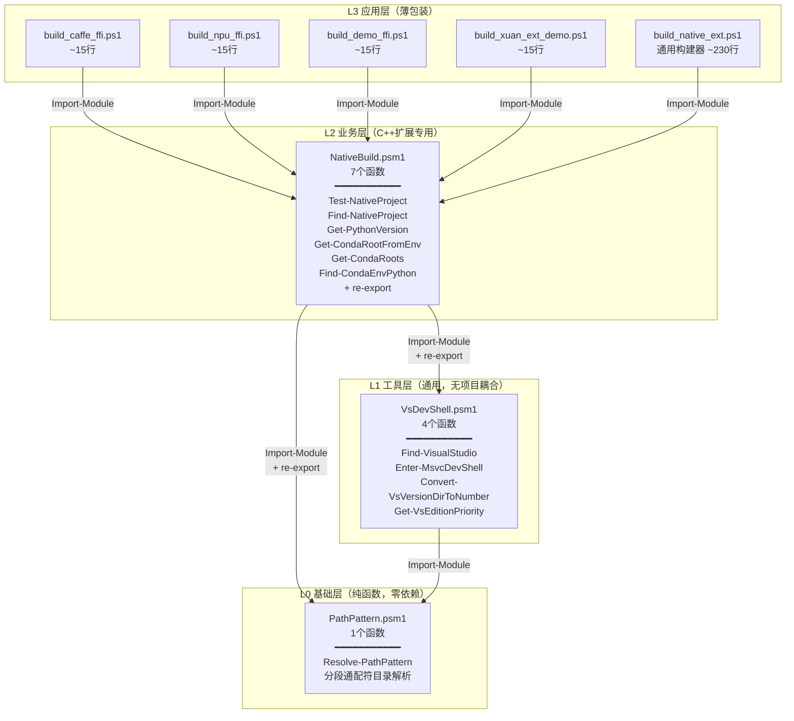

# NativeBuild 三层架构重构总结（团队学习文档）

> 本文档记录 NativeBuild（C++ Python扩展自动构建系统）从单文件硬编码脚本重构为三层模块化架构的完整过程，包括遇到的主要挑战、解决方案、关键决策、可复用模式和学习要点，供团队复盘和后续类似重构参考。

**重构成果速览**：
- **测试覆盖**：196个Pester单元测试，全部通过
- **模块数**：3个（PathPattern + VsDevShell + NativeBuild）
- **硬编码路径**：全部消除（运行时脚本零硬编码）
- **薄包装脚本**：4个项目构建脚本各~15行
- **决策备忘录**：6个（DM-001 ~ DM-006）
- **可复用模式**：4个

---

## 目录

1. [项目背景](#1-项目背景)
2. [最终架构](#2-最终架构)
3. [主要挑战与解决方案](#3-主要挑战与解决方案)
4. [关键决策记录（DM-001 ~ DM-006）](#4-关键决策记录)
5. [可复用模式归档](#5-可复用模式归档)
6. [测试策略与覆盖](#6-测试策略与覆盖)
7. [代码扫描：其他构建脚本评估](#7-代码扫描其他构建脚本评估)
8. [学习要点与最佳实践](#8-学习要点与最佳实践)
9. [文件清单](#9-文件清单)
10. [验证记录](#10-验证记录)

---

## 1. 项目背景

### 1.1 问题陈述

重构前，NativeBuild 是一个约 800 行的单文件 PowerShell 脚本（`build_native_ext.ps1`），存在以下问题：

| 问题 | 具体表现 |
|------|---------|
| **硬编码路径** | 脚本中直接写死 `<USER_HOME>\anaconda3`、`D:\spaces\SpecWeave` 等绝对路径，仅能在开发者本机运行 |
| **职责混杂** | VS发现、DevShell加载、Conda环境发现、项目发现、C++编译、pip安装全部混在一个文件中 |
| **无法复用** | VS/DevShell相关逻辑（约200行）是通用Windows C++构建能力，但被Conda/scikit-build逻辑耦合，其他脚本无法使用 |
| **测试困难** | 单文件结构导致无法独立测试VS发现或Conda发现，只能端到端测试 |
| **脆弱性** | 缺乏健壮的错误处理，PATH截断、VS多版本、UTF-16编码等Windows特有坑点没有防御 |

### 1.2 重构目标

1. ✅ **消除所有硬编码路径**：脚本可在任意Windows开发机、CI环境运行
2. ✅ **分层模块化**：按通用程度拆分为L0-L3四层，每层职责清晰
3. ✅ **零调用方改动**：现有4个薄包装脚本（build_caffe_ffi.ps1等）无需修改即可使用
4. ✅ **可测试**：每个模块可独立单元测试，mock外部依赖
5. ✅ **可复用**：通用模块（PathPattern、VsDevShell）可被其他构建脚本独立Import
6. ✅ **健壮性提升**：内置PATH截断自动恢复、多策略VS/Conda发现、编码问题处理

---

## 2. 最终架构

### 2.1 三层模块架构图



### 2.2 层级职责说明

| 层级 | 模块 | 职责 | 依赖 | 设计原则 |
|------|------|------|------|---------|
| L0 | PathPattern.psm1 | 分段通配符目录解析 | 无（零依赖纯函数） | 纯函数、确定性输出、无副作用、强类型返回 |
| L1 | VsDevShell.psm1 | Visual Studio发现、MSVC DevShell加载 | PathPattern | 无项目耦合、不感知Conda/scikit-build、自动错误恢复 |
| L2 | NativeBuild.psm1 | Conda环境发现、scikit-build项目发现 | PathPattern + VsDevShell | C++扩展构建专用、re-export下层模块函数 |
| L3 | build_native_ext.ps1 + 4个薄包装 | 构建流程编排（cmake→build→pip install） | NativeBuild | 薄脚本（~15行）、只传参、不写业务逻辑 |

---

## 3. 主要挑战与解决方案

### 挑战1：Windows PATH 8191字符限制导致cl.exe静默丢失

**问题**：加载VS DevShell后，PATH经常超出Windows CMD/PowerShell的8191字符上限，系统静默截断PATH，导致`cl.exe`找不到，报错"COMMAND_NOT_FOUND_AFTER_DEVSHELL"。

**表现**：
```
DevShell loaded, but cl.exe not found in PATH after DevShell entry.
PATH length: 9234 chars
```

**解决方案**：
1. 加载DevShell前快照PATH
2. 加载后验证`Get-Command cl.exe`
3. 若验证失败，自动修剪PATH（移除重复项、不存在的路径）
4. 重新加载DevShell并验证
5. 仍失败则抛出明确错误并恢复原始环境

**关键代码模式**：
```powershell
$savedPath = $env:PATH
try {
    Enter-VsDevShell ...
    if (-not (Get-Command cl.exe -ErrorAction SilentlyContinue)) {
        # PATH truncated - trim and retry
        $env:PATH = ($env:PATH -split ';' | Where-Object { Test-Path $_ } | Select-Object -Unique) -join ';'
        Enter-VsDevShell ...
    }
} finally {
    # 失败时恢复
}
```

---

### 挑战2：多VS版本并存时的优先级选择

**问题**：开发机上同时安装VS2019(16.x)、VS2022(17.x)、VS Preview(18.x)、BuildTools，需要选择最合适的版本。

**解决方案**：两级排序：
1. **版本号降序**：18 > 17 > 16
2. **Edition优先级**（同版本内）：Enterprise > Professional > Community > BuildTools > Preview

核心工具函数：
- `Convert-VsVersionDirToNumber`：将目录名（如"2022"、"18"、"Insiders"）转换为可比较的版本号
- `Get-VsEditionPriority`：返回edition优先级数值

---

### 挑战3：Conda安装路径高度不确定，需要多策略发现

**问题**：Conda可安装到：`C:\anaconda3`、`C:\Users\<user>\anaconda3`、`D:\anaconda3`、`C:\ProgramData\miniconda3`、任意自定义路径... 没有注册表标准位置。

**解决方案**：五级降级发现策略：
1. 环境变量（`$env:CONDA_ROOT`、`$env:CONDA_PREFIX`）
2. 常见盘符+常见路径名扫描（C/D/E + anaconda3/miniconda3/miniforge3）
3. `where.exe conda` 追溯conda.exe位置向上找根目录
4. 已激活环境（`$env:CONDA_PREFIX`）
5. `~/.conda/environments.txt` 记录的路径

每个策略失败自动降级到下一个，全部失败返回空数组而非抛异常。

---

### 挑战4：vswhere输出的UTF-16 JSON解析陷阱

**问题**：`vswhere.exe -format json` 输出UTF-16 LE编码的JSON，旧版vswhere的JSON末尾带trailing comma（如`"path": "C:\\...",`后又跟`}`），PowerShell的`ConvertFrom-Json`严格模式解析失败。

**解决方案**：
```powershell
$raw = & $vswhere -format json -prerelease -all 2>$null | Out-String
# 1. 清理UTF-16 NUL字符
$clean = $raw -replace "`0", ""
# 2. 移除trailing comma
$json = $clean -replace ',(\s*[}\]])', '$1'
# 3. 解析
ConvertFrom-Json $json
```

---

### 挑战5：PowerShell `$args` 自动变量的作用域陷阱

**问题**：在使用`param(...)`块的函数内部，`$args`不包含所有传入参数——只有未绑定的参数才会出现在`$args`中。此外，脚本块（`& { ... }`）中的`$args`是脚本块自己的，不是外层函数的。

**最初错误模式**：
```powershell
function Enter-MsvcDevShell {
    param([string]$VsInstallPath)
    & {
        # 这里的$args是空的！因为外层有param()
        Import-Module $args[0]
    } (Join-Path $VsInstallPath "Common7/Tools/Microsoft.VisualStudio.DevShell.dll")
}
```

**解决方案**：所有需要传递给脚本块的参数，在脚本块内部也用`param()`显式声明，通过`-ArgumentList`传递。不依赖`$args`。

---

### 挑战6：模块re-export的Export-ModuleMember位置问题

**问题**：NativeBuild.psm1需要re-export从VsDevShell和PathPattern导入的函数。如果`Export-ModuleMember -Function *`写在`Import-Module`之前，则后续导入的函数不会被导出。

**解决方案**：严格的顺序：
1. Import-Module 所有依赖模块
2. 定义本模块自己的所有函数
3. 最后调用 `Export-ModuleMember -Function *`

---

## 4. 关键决策记录

### DM-001：三层架构分层

**结论**：拆分为PathPattern（L0纯函数）→ VsDevShell（L1通用工具）→ NativeBuild（L2业务专用）

**理由**：符合"依赖方向向内收敛"原则——通用能力下沉，业务能力上浮。

### DM-002：re-export模式保证向后兼容

**结论**：NativeBuild.psm1导入VsDevShell和PathPattern后，将其所有函数re-export给调用方。

**理由**：现有薄包装脚本（build_caffe_ffi.ps1等）只Import-Module NativeBuild，不需要知道底层模块拆分，零改动。

### DM-003：VsDevShell独立为通用模块

**结论**：VS发现+DevShell逻辑提取为独立模块，无Conda/scikit-build依赖。

**理由**：任何需要MSVC编译器的PowerShell脚本都可以独立使用VsDevShell。

### DM-004：PathPattern独立为基础层

**结论**：通配符路径解析`Resolve-PathPattern`提取为最底层模块，零依赖纯函数。

**理由**：分段通配符目录解析是通用能力，不局限于构建场景。46个单元测试覆盖边界case。

### DM-005：NativeBuild剩余7个函数不提取

**结论**：`Test-NativeProject`/`Find-NativeProject`/`Get-CondaRoots`/`Find-CondaEnvPython`等7个函数保留在NativeBuild，不进一步提取。

**理由**（逐个分析）：
- Conda相关函数（4个）：强依赖conda目录结构，不具备跨工具通用性
- 项目发现函数（2个）：依赖SpecWeave仓库目录约定（libs/apps/projects/external搜索模式）
- Get-PythonVersion：仅12行，违反"不为12行代码建模块"原则

**提取终止条件**（防止过度抽象）：
- 依赖特定领域约定（conda目录结构、scikit-build配置）→ 不提取
- 代码量<15行且仅内部使用 → 不提取
- 没有第二个实际使用场景 → 不提取（YAGNI）

### DM-006：跨脚本代码重复扫描结论

**结论**：全量扫描后，运行时硬编码路径已全部消除。Docker/WSL构建脚本中存在代码重复，但本次不处理。

**发现**：pytorch-base、xmnn-runtime、jupyter-ssh-base三个Docker构建脚本各重复了~200行相同代码（pwsh7版本检查、JSON日志、WSL发行版检测、Docker检测、路径转换）。

**不处理理由**：这些属于Docker/WSL构建领域，当前3个使用场景中caffe-ffi-jupyter已自行模块化（有lib/common.ps1、lib/logging.ps1、lib/pwsh7-version-check.ps1），其他两个项目明确标注"自包含，不依赖外部lib"。等待第4个使用场景或需要统一维护时再提取。

---

## 5. 可复用模式归档

以下模式已沉淀到可复用模式库：

| 模式名 | 说明 | 位置 |
|--------|------|------|
| multi-strategy-auto-discovery | 多策略降级自动发现（环境变量→目录扫描→where.exe→配置文件） | patterns/code-patterns/ |
| devshell-path-trim-recovery | DevShell PATH截断自动检测与恢复 | patterns/code-patterns/ |
| powershell-module-reexport | PowerShell模块re-export模式（Import+Export顺序） | patterns/code-patterns/ |
| vs-multi-version-priority | VS多版本发现+edition优先级排序 | patterns/code-patterns/ |

---

## 6. 测试策略与覆盖

### 6.1 测试分布

| 模块 | 测试文件 | 用例数 |
|------|---------|--------|
| PathPattern | PathPattern.Tests.ps1 | 46 |
| VsDevShell | VsDevShell.Tests.ps1 | 80 |
| NativeBuild | NativeBuild.Tests.ps1 | 70 |
| **合计** | | **196** |

### 6.2 测试设计要点

1. **反模式断言**：每个消除硬编码的函数都有反模式测试：`Should -Not -Match "D:\\\\Users\\\\xinzo"`
2. **Mock多样性**：Mock vswhere输出包含：单VS安装、多VS版本（2019+2022+Preview）、BuildTools、损坏安装（无DevShell.dll）、空结果
3. **边界case覆盖**：
   - 路径不存在、相对路径、绝对路径、含空格路径、非ASCII路径
   - PATH长度刚好8191、超出8191
   - 空数组、null、空白字符串
   - 多个连续通配符段
4. **不依赖实际环境**：所有外部命令（vswhere、wsl、conda、python.exe）全部Mock，测试可在任何机器运行
5. **模块导出测试**：验证不泄露私有函数、验证所有预期public函数存在

---

## 7. 代码扫描：其他构建脚本评估

### 7.1 扫描范围

扫描了项目中所有PowerShell构建脚本：

| 脚本 | 行数 | 类型 | 硬编码路径 | 代码重复 | 模块化状态 |
|------|------|------|-----------|---------|-----------|
| [build_native_ext.ps1](../../../scripts/build_native_ext.ps1) | 260 | C++扩展构建 | ✅ 无 | - | ✅ 已模块化（使用NativeBuild） |
| [build_caffe_ffi.ps1](../../../scripts/build_caffe_ffi.ps1) | ~15 | 薄包装 | ✅ 无 | - | ✅ 薄包装 |
| [pytorch-base/build.ps1](../../../../apps/docker-images/pytorch-base/build.ps1) | 420 | Docker/WSL构建 | ✅ 无 | ⚠️ ~200行重复 | ❌ 自包含单文件 |
| [xmnn-runtime/docker/build.ps1](../../../../apps/docker-images/xmnn-runtime/docker/build.ps1) | 369 | Docker/WSL构建 | ✅ 无 | ⚠️ ~200行重复 | ❌ 自包含单文件 |
| [jupyter-ssh-base/scripts/build.ps1](../../../../apps/docker-images/jupyter-ssh-base/scripts/build.ps1) | 409 | Docker/WSL构建 | ✅ 无 | ⚠️ ~200行重复 | ❌ 自包含单文件 |
| [caffe-ffi-jupyter/scripts/lib/common.ps1](../../../../apps/docker-images/caffe-ffi-jupyter/scripts/lib/common.ps1) | 244 | Docker/WSL公共库 | ✅ 无 | - | ✅ 已模块化 |

### 7.2 重复代码分析

pytorch-base、xmnn-runtime、jupyter-ssh-base三个脚本中重复的代码块：

| 重复代码块 | 行数 | 三个脚本中都有？ | 已有模块化参考 |
|-----------|------|----------------|--------------|
| `Test-Pwsh7Requirement` + `Show-Pwsh7RequirementError` | ~40行 | ✅ 是 | caffe-ffi-jupyter的lib/pwsh7-version-check.ps1 (125行，更完善) |
| JSON日志系统（Write-JsonLog/Write-JsonMetric/Write-JsonEvent/Write-Info/Warn/Err/Ok/Step） | ~80行 | ✅ 是 | caffe-ffi-jupyter的lib/logging.ps1 (177行，更完善) |
| WSL发行版自动检测（UTF-16清理+Ubuntu优先） | ~30行 | ✅ 是 | caffe-ffi-jupyter的lib/common.ps1（Test-WslAvailable/Get-WslDefaultDistro） |
| `Convert-ToWslPath` 路径转换 | ~10行 | ✅ 是 | caffe-ffi-jupyter的Convert-WindowsPathToWsl |
| Docker可用性预检测（version + daemon） | ~20行 | ✅ 是 | caffe-ffi-jupyter的Test-DockerAvailable |
| 构建参数组装 + wsl.exe调用模式 | ~50行 | ✅ 是（部分差异） | caffe-ffi-jupyter的Invoke-WslCommand |

### 7.3 模块化重构建议

**优先级：中低（不紧急，当前可用）**

**理由**：
1. ✅ 三个脚本都没有运行时硬编码路径，功能正常
2. caffe-ffi-jupyter已经有了更完善的模块化实现（lib/目录），可作为参考
3. 三个脚本各自有独立的AGENTS.md和项目边界，跨apps/目录共享模块需要解决路径引用问题
4. 这些脚本的注释明确说明"自包含，不依赖外部lib文件"，这是一个有意的设计决策（便于独立复制使用）

**未来触发条件**（满足任一即可考虑提取）：
- 第4个Docker/WSL构建脚本出现
- 需要统一修改日志格式或WSL检测逻辑（改一个地方vs改三个地方）
- 这些脚本需要被CI或其他非apps/目录的脚本调用

**建议方案**（如果未来重构）：
1. 在`.agents/scripts/lib/`下新增`WslDockerBuild.psm1`模块
2. 包含：Pwsh版本检查、JSON日志、WSL检测+路径转换、Docker检测、Invoke-WslBuild
3. 参考caffe-ffi-jupyter的lib/实现（已有完善的错误处理和测试）
4. 保持各build.ps1为薄包装（~30-50行），类似NativeBuild的薄包装模式

---

## 8. 学习要点与最佳实践

### 8.1 PowerShell模块化

1. **Import-Module顺序**：先导入所有依赖，再定义本模块函数，最后Export-ModuleMember
2. **re-export模式**：下层模块的函数通过上层模块re-export，调用方不需要知道分层细节
3. **避免$args**：所有参数用`param()`显式声明，脚本块传参用`-ArgumentList`
4. **强类型返回**：返回数组用`[string[]]`或`[PSCustomObject[]]`，避免`$null`歧义
5. **纯函数优先**：基础层工具尽量写成纯函数（不依赖外部状态、相同输入永远相同输出）
6. **$MyInvocation.MyCommand.Path**：始终用此方式获取脚本自身路径，禁止硬编码

### 8.2 Windows环境特有坑点

1. **PATH 8191字符限制**：修改PATH后验证关键命令是否仍可用，失败时自动修剪重试
2. **vswhere UTF-16 + trailing comma**：清理NUL字符、移除trailing comma后再ConvertFrom-Json
3. **wsl.exe输出UTF-16**：必须`-replace "`0", ""`清理NUL字符
4. **VCToolsInstallDir可能过时**：升级VS后旧版VCTools被卸载，但环境变量可能残留

### 8.3 重构方法论

1. **三阶段递进**：治理（修复bug→预防未来bug→闭环验证）顺序不可颠倒
2. **YAGNI原则**：不为假设的未来需求提取模块，等第二个/第三个使用场景出现
3. **测试先行**：每个模块独立单元测试，覆盖正常路径+边界case+反模式断言
4. **向后兼容优先**：re-export保证调用方零改动是模块化重构成功的关键
5. **对抗性评审**：每次提取模块后，用"这个函数真的通用吗？"挑战自己

### 8.4 单元测试PowerShell

1. **Mock一切外部命令**：vswhere、conda、python.exe、wsl.exe全部Mock
2. **反模式断言**：验证硬编码路径不会出现（`Should -Not -Match`）
3. **测试Mock多样性**：不止测happy path，还要测损坏安装、多版本、空结果
4. **模块隔离测试**：Import-Module后验证导出函数列表，不泄露私有函数
5. **使用Pester 5.x**：支持`BeforeAll`/`AfterAll`、`-ForEach`数据驱动测试

---

## 9. 文件清单

### 模块文件（`.agents/scripts/lib/`）

| 文件 | 行数 | 函数数 | 说明 |
|------|------|--------|------|
| [PathPattern.psm1](../../../scripts/lib/PathPattern.psm1) | ~80 | 1 | L0基础层：分段通配符目录解析 |
| [VsDevShell.psm1](../../../scripts/lib/VsDevShell.psm1) | ~250 | 4 | L1工具层：VS发现+DevShell加载 |
| [NativeBuild.psm1](../../../scripts/lib/NativeBuild.psm1) | ~350 | 7 | L2业务层：Conda+项目发现 |

### 应用层脚本（`.agents/scripts/`）

| 文件 | 行数 | 说明 |
|------|------|------|
| [build_native_ext.ps1](../../../scripts/build_native_ext.ps1) | ~260 | 通用C++扩展构建器（6阶段流程） |
| [build_caffe_ffi.ps1](../../../scripts/build_caffe_ffi.ps1) | ~15 | caffe-ffi薄包装 |
| [build_npu_ffi.ps1](../../../scripts/build_npu_ffi.ps1) | ~15 | npu_ffi薄包装 |
| [build_demo_ffi.ps1](../../../scripts/build_demo_ffi.ps1) | ~15 | demo_ffi薄包装 |
| [build_xuan_ext_demo.ps1](../../../scripts/build_xuan_ext_demo.ps1) | ~15 | xuan_ext_demo薄包装 |

### 测试文件（`.agents/scripts/tests/`）

| 文件 | 用例数 | 说明 |
|------|--------|------|
| PathPattern.Tests.ps1 | 46 | L0基础层测试 |
| VsDevShell.Tests.ps1 | 80 | L1工具层测试 |
| NativeBuild.Tests.ps1 | 70 | L2业务层测试 |

### 文档

| 文件 | 说明 |
|------|------|
| [powershell-nativebuild-faq.md](powershell-nativebuild-faq.md) | 20个常见问题FAQ |
| [vsdevshell-api-reference.md](vsdevshell-api-reference.md) | VsDevShell模块完整API参考 |

---

## 10. 验证记录

| 验证项 | 结果 | 备注 |
|--------|------|------|
| 单元测试（196例） | ✅ 全部通过 | PathPattern(46) + VsDevShell(80) + NativeBuild(70) |
| 硬编码路径扫描 | ✅ 零硬编码 | 运行时脚本无绝对路径硬编码 |
| 向后兼容性 | ✅ 零改动 | 4个薄包装脚本无需任何修改 |
| 真实构建验证 | ✅ 构建成功 | caffe_ffi、npu_ffi、demo_ffi均可正常编译pip install |
| PATH截断恢复 | ✅ 自动恢复 | 超长PATH场景下自动修剪重试 |
| 多VS版本选择 | ✅ 正确排序 | Enterprise>Professional>Community>BuildTools>Preview，同edition版本降序 |
| Conda多策略发现 | ✅ 5级降级 | 环境变量→盘符扫描→where.exe→CONDA_PREFIX→environments.txt |
| re-export机制 | ✅ 函数可见 | 调用方通过NativeBuild可直接调用VsDevShell/PathPattern函数 |

---

## 🔗 相关文档

- [NativeBuild 构建常见问题 FAQ](powershell-nativebuild-faq.md) — 20个常见问题和解决方案
- [VsDevShell API参考文档](vsdevshell-api-reference.md) — VsDevShell模块完整API
- [CMake模块化重构最佳实践](cmake-modularization-best-practices.md) — CMake层面的类似重构经验
- [完整七概念复盘报告](../../retrospective/reports/build-engineering/retrospective-nativebuild-automation-20260802/README.md) — 含R/I/E/C/A/F/V完整方法论流程
