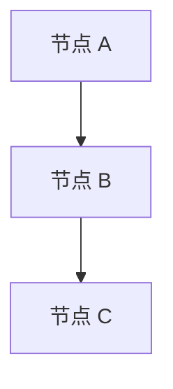

# [文档标题]

> [核心命题或引言]

## 1. [章节标题]

[章节内容]

### 1.1 [子章节标题]

[子章节内容]

#### 1.1.1 [三级子章节标题]

[三级子章节内容]

## 2. [章节标题]

[章节内容]

### 表格示例

| 列 1 | 列 2 | 列 3 |
|---|---|---|
| 内容 1 | 内容 2 | 内容 3 |
| 内容 4 | 内容 5 | 内容 6 |

### 代码块示例

```python
# 代码示例
def example():
    return True
```

### 图表示例



## 3. [验证标准或总结]

[验证标准或总结内容]

## 延伸阅读

- [相关文档 1](path/to/doc1.md)
- [相关文档 2](path/to/doc2.md)