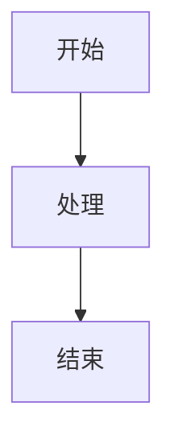

# 格式规范指南

## 1. Frontmatter

所有文档必须包含 YAML frontmatter：

```yaml
---
title: [文档标题]
description: [文档描述，不超过 150 字]
last_updated: YYYY-MM-DD
---
```

### 必填字段

| 字段 | 说明 | 格式 |
|---|---|---|
| title | 文档标题 | 纯文本 |
| description | 文档描述 | 不超过 150 字 |
| last_updated | 最后更新日期 | YYYY-MM-DD |

### 可选字段

| 字段 | 说明 | 格式 |
|---|---|---|
| version | 文档版本 | X.Y.Z |
| author | 作者 | 姓名 |
| source | 来源 | 引用路径 |

## 2. 标题层级

### 层级规范

| 层级 | Markdown | 用途 |
|---|---|---|
| H1 | `#` | 文档标题（每篇文档一个） |
| H2 | `##` | 主要章节 |
| H3 | `###` | 子章节 |
| H4 | `####` | 三级子章节（慎用） |

### 命名规范

- 使用数字序号：`## 1. 概述`、`## 2. 核心内容`
- 标题简洁明了，不超过 20 字
- 避免使用特殊字符

## 3. 正文格式

### 段落

- 段落之间空一行
- 每行不超过 100 字符
- 使用中文标点符号

### 引用

```markdown
> 引用内容
```

### 列表

```markdown
- 无序列表项 1
- 无序列表项 2
  - 嵌套列表项

1. 有序列表项 1
2. 有序列表项 2
```

### 粗体与斜体

- **粗体**：用于强调关键词
- *斜体*：用于引用或说明

## 4. 代码块

### 格式规范

```markdown
```python
# 代码内容
```
```

### 语言标识

| 语言 | 标识 |
|---|---|
| Python | python |
| JavaScript | javascript |
| Bash | bash |
| YAML | yaml |
| JSON | json |
| Markdown | markdown |

### 注释

代码块内添加必要的注释说明。

## 5. 表格

### 格式规范

```markdown
| 列 1 | 列 2 | 列 3 |
|---|---|---|
| 内容 1 | 内容 2 | 内容 3 |
```

### 对齐方式

```markdown
| 左对齐 | 居中 | 右对齐 |
|:---|:---:|---:|
| 内容 | 内容 | 内容 |
```

## 6. 图表（Mermaid）

### 支持类型

- flowchart：流程图
- sequenceDiagram：时序图
- classDiagram：类图
- stateDiagram：状态图
- ERDiagram：ER图
- pie：饼图

### 示例

```markdown

```

## 7. 链接

### 内部链接

```markdown
[链接文本](relative/path/to/file.md)
```

### 外部链接

```markdown
[链接文本](https://example.com)
```

### 锚点链接

```markdown
[跳转到章节](#章节标题)
```

## 8. 图片

```markdown

```

## 9. 特殊标记

### 提示框

```markdown
```{note}
提示内容
```

```{warning}
警告内容
```

```{tip}
技巧内容
```
```

## 10. 版本标注

```markdown
[v4.0+] 该特性从 v4.0 起可用
```

## 11. 最佳实践

- 保持文档简洁，避免冗长
- 使用表格整理复杂信息
- 使用图表可视化关系和流程
- 添加延伸阅读链接
- 定期更新 `last_updated` 字段