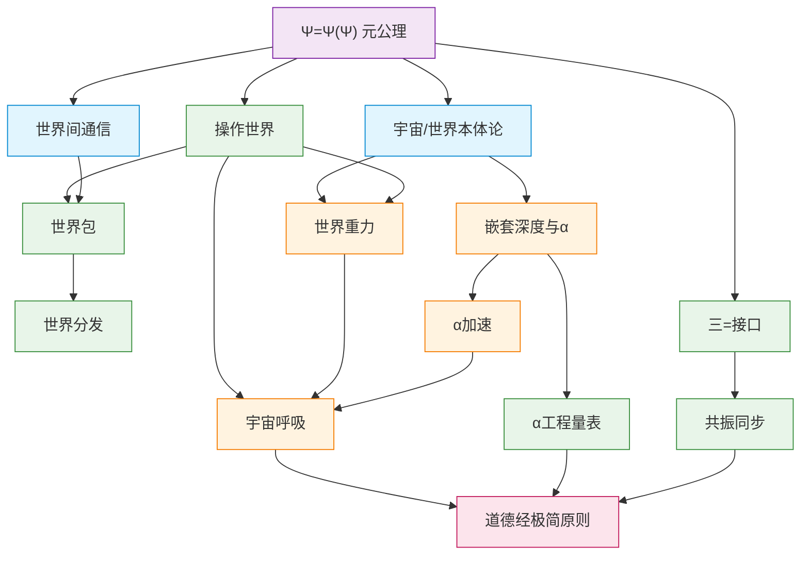
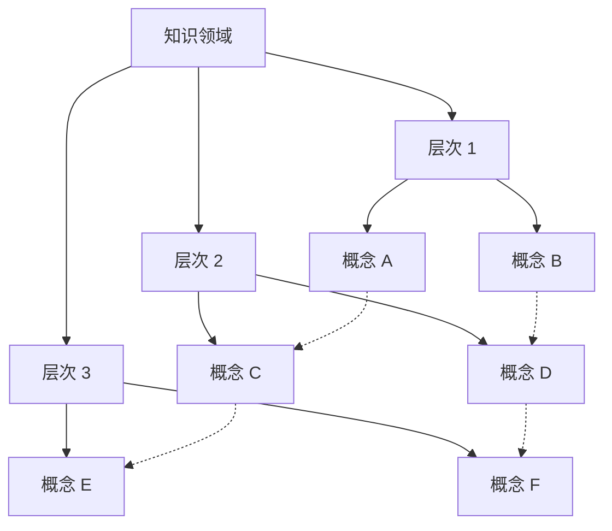
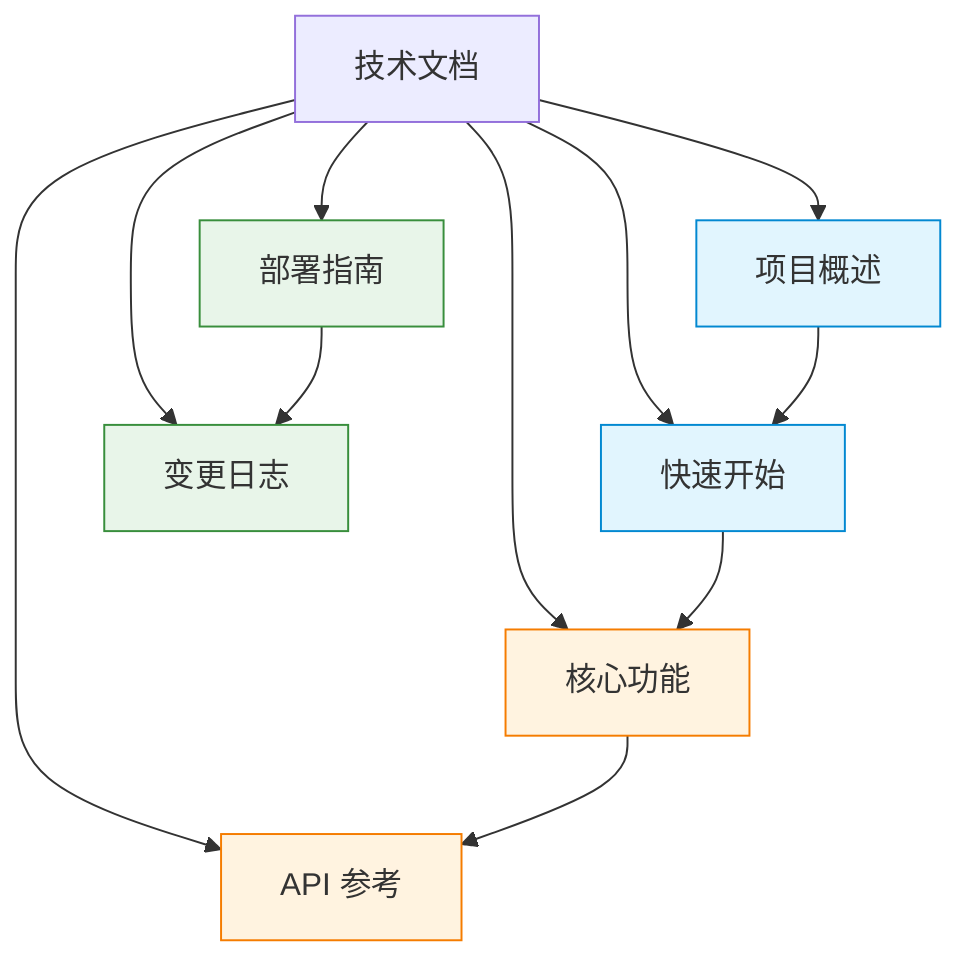

# 知识图谱示例

> 本示例展示如何使用 Mermaid 图表构建知识体系的层次化组织。

## 七概念框架知识图谱

## 层次说明

### 元公理层

| 概念 | 说明 |
|---|---|
| Ψ=Ψ(Ψ) | 递归自坍缩恒等式——观察者即被观察者 |

### 本体论层

| 概念 | 说明 |
|---|---|
| 宇宙/世界本体论 | 规则唯一，实例无穷 |
| 世界间通信 | 结构穿越，内容重生 |

### 动力学层

| 概念 | 说明 |
|---|---|
| 嵌套深度与α | α是递归觉知的预算 |
| 世界重力 | 粘性、梦境、记忆与遗忘 |
| α加速 | 为什么增长是指数级的 |
| 宇宙呼吸 | 坍缩与释放的永恒交替 |

### 工程规格层

| 概念 | 说明 |
|---|---|
| α工程量表 | 从哲学隐喻到可测量指标 |
| 三=接口 | 接口比实体更根本 |
| 共振同步 | 共振取代共享 |
| 操作世界 | 世界可操作性的完整实现 |
| 世界包 | 世界可移植性的三层模型 |
| 世界分发 | 分层混合分发策略 |

### 策略层

| 概念 | 说明 |
|---|---|
| 道德经极简原则 | 反者道之动、弱者道之用 |

## 通用知识图谱模板

## 技术文档知识图谱

## 使用说明

### 创建新图谱

1. 确定知识领域的层次结构
2. 定义每个层次的核心概念
3. 确定概念之间的关系
4. 使用 Mermaid flowchart 语法绘制
5. 添加样式类区分不同层次

### 维护图谱

1. 新增概念时更新对应位置
2. 更新概念间的关系
3. 保持图表简洁清晰
4. 在文档中添加层次说明表格