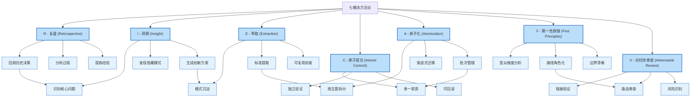
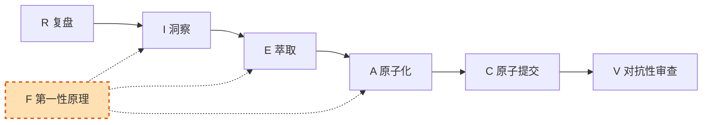

# 七概念方法论

七概念方法论（R-I-E-C-A-F-V）是 SpecWeave 的核心工作框架，在文档分离方案中应用于迁移规划、执行和验证的全流程。

## 七概念知识图谱

## 七概念详解

### R - 复盘 (Retrospective)

回顾历史决策，分析过程，提炼经验教训。

| 应用场景 | 具体操作 | 产出物 |
|---|---|---|
| 文档现状分析 | 盘点 `.agents/docs/` 目录结构 | 文件清单、统计数据 |
| 历史决策回顾 | 分析之前将人类文档迁移到 `.agents/docs/` 的原因 | 复盘报告 |
| 问题根因分析 | 识别路径歧义、认知开销等核心问题 | 根因清单 |

### I - 洞察 (Insight)

从复盘中识别核心问题，发现隐藏模式，生成创新方案。

| 洞察点 | 发现 | 影响 |
|---|---|---|
| 受众而非来源 | 文档的本质区分维度是"受众"而非"来源" | 路径角色化原则 |
| 信号混乱 | 空的根 `docs/` + 矛盾声明 = Agent困惑 | 明确路径解析规则 |
| 认知开销 | Agent需要执行5条归类规则判断文件类型 | 减少识别压力 |

### E - 萃取 (Extraction)

将洞察沉淀为可复用模式，提取标准流程，封装为方法论。

| 萃取物 | 说明 | 复用方式 |
|---|---|---|
| 分类矩阵 | 文件分类判定标准 | 迁移前自动分类 |
| 迁移流程 | 标准化操作步骤 | 每批迁移遵循 |
| 验证清单 | 迁移后检查点 | 自动验证脚本 |

### C - 原子提交 (Atomic Commit)

每批次迁移独立提交，确保单一职责、独立验证、可回滚。

| 原则 | 实践 |
|---|---|
| 单一职责 | 每批只迁移一类主题的文件 |
| 独立验证 | 每批迁移后运行 `check-links.py` |
| 可回滚 | 每批单独提交，可单独回滚 |

### A - 原子化 (Atomization)

按主题拆分迁移任务，渐进式执行，批次管理。

| 批次策略 | 说明 |
|---|---|
| 先无依赖 | 优先迁移无路由引用的文件 |
| 后核心 | 路由表引用文件放在最后批次 |
| 每批≤100 | 控制每批文件数量，降低风险 |

### F - 第一性原理 (First Principles)

从受众维度出发，实现路径角色化，确保边界清晰。

| 原则 | 落地 |
|---|---|
| 受众维度 | `docs/` → 人类文档，`.agents/docs/` → Agent必读 |
| 路径角色化 | 路径名直接反映受众 |
| 边界清晰 | 两类文档物理隔离 |

### V - 对抗性审查 (Adversarial Review)

在迁移前后进行严格验证，识别潜在风险。

| 审查项 | 方法 |
|---|---|
| 链接验证 | 运行 `check-links.py` |
| 路由审查 | 确认 Agent 启动协议不受影响 |
| 风险识别 | 模拟极端场景测试 |

## 七概念应用流程

## 延伸阅读

- [第一性原理](../philosophy/index.md)
- `methodology/index.md`