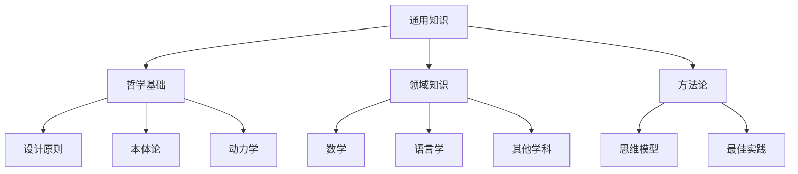

# 🌐 通用知识

本目录汇集与本项目无直接耦合，但对知识体系有滋养价值的**通用知识**，与同级 [技术文档](../tech/index.md) 形成双轨隔离。

## 知识领域



## 目录清单

| 领域 | 说明 |
|---|---|
| [哲学基础](philosophy/index.md) | 理论基础与设计原则的哲学映射 |
| [领域知识](domain/index.md) | 跨学科常识与领域参考 |
| `methodology/index.md` | 可复用的思维模型与方法论 |

## 计划承载内容

- **哲学基础**：设计原则、本体论、动力学等理论框架
- **领域知识**：数学、语言学、跨学科常识等基础学科笔记
- **方法论**：可复用的思维模型、最佳实践、工作流程

## 边界

不放置：本项目源码、配置、API、构建与发布流程等技术资产，请见同级目录 [`../tech/`](../tech/index.md)。

## 接入约定

> 新增正式文档时：
>
> 1. 按领域放入子目录（如 `philosophy/`、`domain/`）；
> 2. 在本 `index.md` 的 `toctree` 中追加对应路径；
> 3. 如需与 `../tech/` 中的技术文档互链，使用相对路径。

```{toctree}
:maxdepth: 2
:caption: 知识领域

philosophy/index
domain/index
methodology/index
```