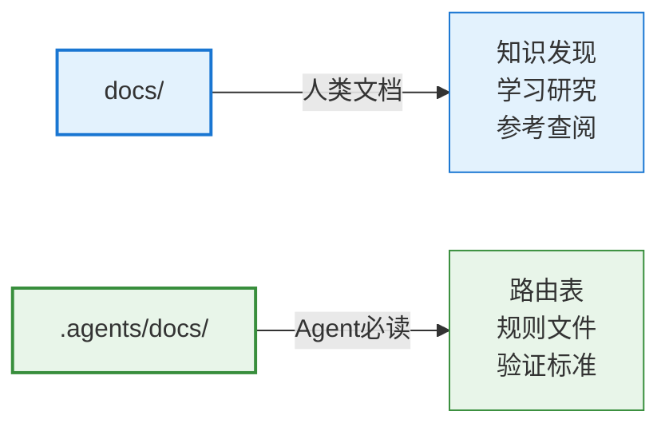

# 第一性原理

从第一性原理出发，文档的本质区分维度是"受众"（人类 vs Agent），而非"来源"（原 docs/ vs .agents/）。路径名本身应承担"谁该读"的信号。

## 第一性原理知识图谱

```mermaid
flowchart TD
    Root["文档分离第一性原理"] --> Audience["受众维度"]
    Root --> Trigger["触发机制"]
    Root --> Lifecycle["生命周期"]
    Audience --> Human["人类读者"]
    Audience --> Agent["AI Agent"]
    Human --> Discovery["知识发现"]
    Human --> Learning["学习研究"]
    Human --> Reference["参考查阅"]
    Agent --> Routing["路由必读"]
    Agent --> Execution["执行依据"]
    Agent --> Verification["验证标准"]
    Trigger --> Manual["手动触发"]
    Trigger --> Auto["自动触发"]
    Manual --> Search["搜索/导航"]
    Manual --> Link["链接跳转"]
    Auto --> Protocol["协议启动"]
    Auto --> Context["上下文路由"]
    Lifecycle --> Creation["创建"]
    Lifecycle --> Maintenance["维护"]
    Lifecycle --> Archive["归档"]
    Creation --> HumanWrite["人类编写"]
    Creation --> AgentGenerate["Agent生成"]
    Maintenance --> HumanEdit["人类编辑"]
    Maintenance --> AutoUpdate["自动更新"]
    Archive --> Deprecate["标记废弃"]
    Archive --> Migrate["迁移重组"]
    Audience --> PathSemantics["路径角色化"]
    PathSemantics --> DocsPath["docs/ → 人类文档"]
    PathSemantics --> AgentsDocsPath[".agents/docs/ → Agent必读"]
    classDef human fill:#E3F2FD,stroke:#1976D2,stroke-width:2px
    classDef agent fill:#E8F5E9,stroke:#388E3C,stroke-width:2px
    classDef principle fill:#FFF3E0,stroke:#FF9800,stroke-width:2px
    class Human,Discovery,Learning,Reference,Manual,Search,Link,HumanWrite,HumanEdit human
    class Agent,Routing,Execution,Verification,Auto,Protocol,Context,AgentGenerate,AutoUpdate agent
    class Root,Audience,Trigger,Lifecycle,PathSemantics,DocsPath,AgentsDocsPath principle
```

## 核心命题

> 文档的价值由受众和触发机制决定，而非存储位置。路径名应直接反映受众，实现"路径角色化"。

## 三大维度解析

### 1. 受众维度（最核心）

| 受众 | 需求特征 | 触发方式 | 路径语义 |
|---|---|---|---|
| 人类读者 | 知识发现、学习研究、参考查阅 | 搜索/导航、链接跳转 | `docs/` |
| AI Agent | 路由必读、执行依据、验证标准 | 协议启动、上下文路由 | `.agents/docs/` |

### 2. 触发机制

| 类型 | 场景 | 特征 |
|---|---|---|
| 手动触发 | 人类主动搜索、点击链接 | 按需获取，深度阅读 |
| 自动触发 | Agent启动协议、上下文路由 | 必选加载，快速扫描 |

### 3. 生命周期

| 阶段 | 人类文档 | Agent文档 |
|---|---|---|
| 创建 | 人类编写为主 | Agent生成为主 |
| 维护 | 人类编辑更新 | 自动更新/规则驱动 |
| 归档 | 标记废弃/迁移 | 路由表更新/版本控制 |

## 路径角色化原则

## 验证标准

任何新文档归类决策必须回答以下问题：

1. **受众是谁？**：人类读者还是AI Agent？
2. **触发方式是什么？**：手动触发（搜索/链接）还是自动触发（协议/路由）？
3. **生命周期特征是什么？**：创建和维护方式如何？

## 延伸阅读

- [七概念方法论](../domain/index.md)
- [分类矩阵](../methodology/index.md)