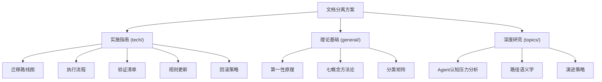

# 📚 文档分离方案知识库

> 从第一性原理出发，区分受众而非来源——文档的价值由受众和触发机制决定，而非存储位置。实现"路径角色化"，让路径名本身承担"谁该读"的信号。

## 知识体系架构



## 三大知识模块

### 🔧 实施指南（tech/）

承载文档分离方案的具体实施步骤，包括迁移路线图、执行流程、验证清单、规则更新和回滚策略。

| 文档 | 说明 |
|---|---|
| [方案概述](tech/intro.md) | 方案定位、核心目标与实施策略 |
| [迁移路线图](tech/quickstart.md) | 分批次迁移计划与依赖关系 |
| [执行流程](tech/features.md) | 标准化迁移操作步骤 |
| [验证清单](tech/api/index.md) | 迁移后验证检查点 |
| [规则更新](tech/deploy.md) | 路径解析规则与文档边界更新 |
| [变更日志](tech/changelog.md) | 方案演进记录 |

### 🌐 理论基础（general/）

汇集文档分离方案的理论支撑，包括第一性原理分析、七概念方法论应用和分类矩阵设计。

| 领域 | 说明 |
|---|---|
| [第一性原理](general/philosophy/index.md) | 从受众而非来源出发的核心洞察 |
| [七概念方法论](general/domain/index.md) | R-I-E-C-A-F-V 在迁移中的应用 |
| [分类矩阵](general/methodology/index.md) | 文档分类判定标准与优先级 |

### 🔬 深度研究（topics/）

承载方案设计背后的深层思考，包括 Agent 认知压力分析、路径语义学原理和长期演进策略。

| 文档 | 面向读者 |
|---|---|
| [Agent认知压力](topics/design-philosophy.md) | 架构师、Agent开发者 |
| [路径语义学](topics/industry-analysis.md) | 知识管理者、文档架构师 |
| [演进策略](topics/research-notes.md) | 项目负责人、战略规划者 |

## 重点阅读推荐

- 想了解项目的核心设计哲学，请阅读 [设计原则](general/philosophy/design-principles.md)
- 想快速上手使用，请阅读 [快速开始](tech/quickstart.md)
- 想查看项目演进记录，请阅读 [变更日志](tech/changelog.md)

## 目录导航

```{toctree}
:maxdepth: 2
:caption: 目录
:hidden:

tech/index
general/index
topics/index
```

* {ref}`genindex`
* {ref}`modindex`
* {ref}`search`