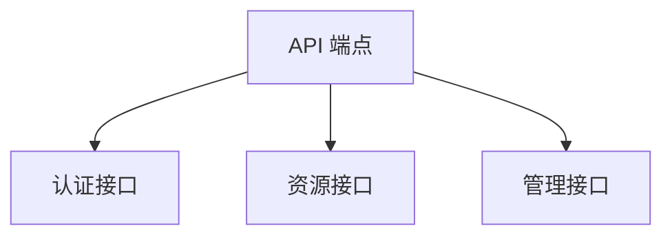

# API 参考

## API 概览



## 认证

### 认证方式

[认证方式说明]

### 认证示例

```bash
# 认证命令示例
```

## 端点列表

### [资源名称]

| 方法 | 端点 | 说明 |
|---|---|---|
| GET | `/api/resource` | 获取资源列表 |
| POST | `/api/resource` | 创建资源 |
| GET | `/api/resource/{id}` | 获取单个资源 |
| PUT | `/api/resource/{id}` | 更新资源 |
| DELETE | `/api/resource/{id}` | 删除资源 |

#### 请求示例

```bash
# 请求示例
```

#### 响应示例

```json
{
  "data": []
}
```

## 错误处理

### 错误码

| 错误码 | 说明 | 解决方案 |
|---|---|---|
| [代码] | [说明] | [解决方案] |

## 版本控制

[API 版本控制策略]

## 延伸阅读

- [核心功能](../features.md)
- `integration-guide.md`