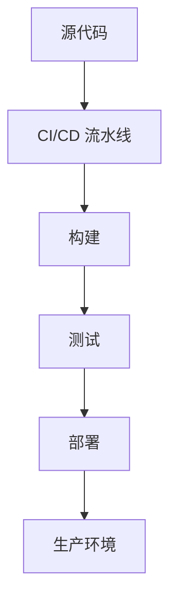

# 部署指南

## 部署架构



## 环境要求

| 环境 | 要求 |
|---|---|
| 操作系统 | [操作系统] |
| 内存 | [内存要求] |
| 存储 | [存储要求] |

## 部署步骤

### 步骤 1：配置 CI/CD

```yaml
# CI/CD 配置示例
```

### 步骤 2：构建项目

```bash
# 构建命令
```

### 步骤 3：部署到生产环境

```bash
# 部署命令
```

## 配置管理

### 配置文件清单

| 文件 | 说明 |
|---|---|
| [文件 1] | [说明] |
| [文件 2] | [说明] |

### 环境变量

| 变量名 | 说明 | 生产环境要求 |
|---|---|---|
| [变量] | [说明] | [要求] |

## 监控与日志

### 监控指标

- [指标 1]
- [指标 2]
- [指标 3]

### 日志收集

```bash
# 日志命令
```

## 回滚策略

```bash
# 回滚命令
```

## 延伸阅读

- `build-conventions.md`
- `integration-guide.md`