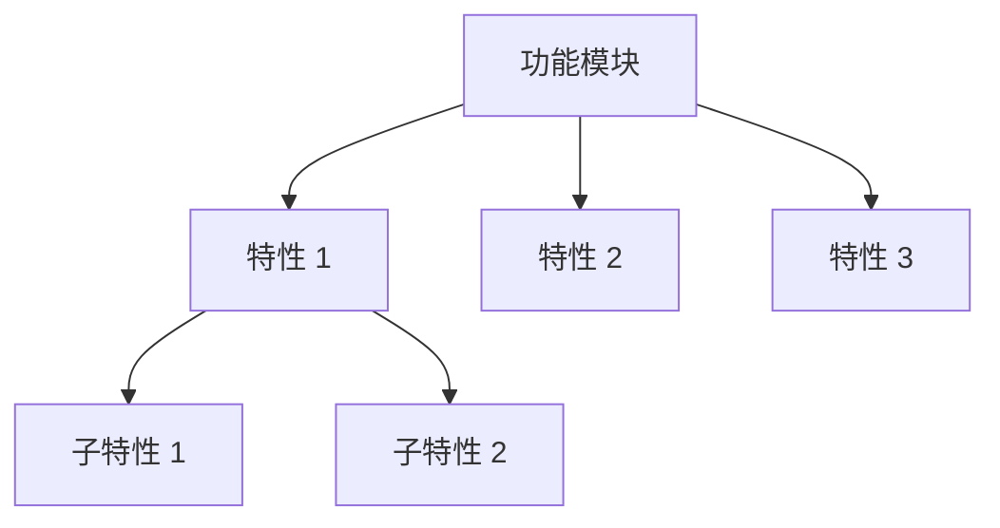

# 核心功能

## 功能总览



## 特性详解

### 特性 1：[特性名称]

**描述**: [特性描述]

**使用场景**: [适用场景]

**使用方法**:

```bash
# 命令示例
```

**配置选项**:

| 选项 | 类型 | 默认值 | 说明 |
|---|---|---|---|
| [选项] | [类型] | [默认值] | [说明] |

### 特性 2：[特性名称]

**描述**: [特性描述]

**使用场景**: [适用场景]

**使用方法**:

```bash
# 命令示例
```

## 功能矩阵

| 功能 | 状态 | 文档 |
|---|---|---|
| [功能 1] | ✅ 稳定 | [链接] |
| [功能 2] | ⚠️ 实验性 | [链接] |
| [功能 3] | 📋 规划中 | - |

## 延伸阅读

- [API 参考](api/index.md)
- [集成指南](integration-guide.md)