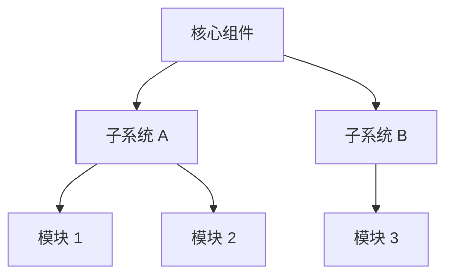

# 项目概述

## 项目定位

> [一句话描述项目的核心价值]

## 核心目标

- [目标 1]
- [目标 2]
- [目标 3]

## 架构概览

## 技术栈

| 领域 | 技术 | 版本 |
|---|---|---|
| 语言 | [语言] | [版本] |
| 框架 | [框架] | [版本] |
| 数据库 | [数据库] | [版本] |
| 部署 | [部署方式] | - |

## 适用场景

- [场景 1]
- [场景 2]
- [场景 3]

## 边界声明

本项目不负责：
- [非职责范围 1]
- [非职责范围 2]

## 延伸阅读

- [快速开始](quickstart.md)
- [核心功能](features.md)