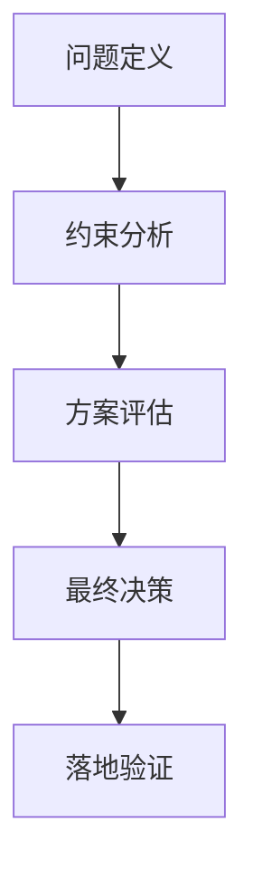

# 设计哲学

## 核心论点

> [一句话概括核心论点]

## 设计决策溯源

### 决策背景

[决策背景说明]

### 核心约束

| 约束 | 说明 | 影响 |
|---|---|---|
| [约束 1] | [说明] | [影响] |
| [约束 2] | [说明] | [影响] |

### 设计路径

## 工程化落地

### 原则映射

| 哲学原则 | 工程原则 | 技术落点 |
|---|---|---|
| [原则 1] | [工程化表述] | [具体实现] |
| [原则 2] | [工程化表述] | [具体实现] |

### 约束即代码

[如何将设计约束转化为可执行的规则或代码]

## 反例对照

| 维度 | 反模式 | 推荐模式 |
|---|---|---|
| [维度 1] | [反模式描述] | [推荐模式描述] |
| [维度 2] | [反模式描述] | [推荐模式描述] |

## 对知识体系的启示

- [启示 1]
- [启示 2]
- [启示 3]

## 延伸阅读

- [相关文档 1]
- [相关文档 2]