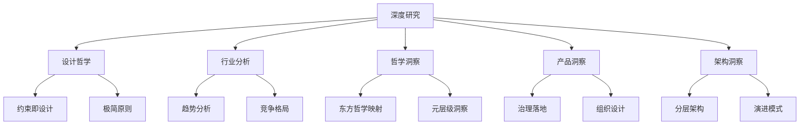

# 🔬 深度研究

本专栏承载知识体系在演进过程中沉淀的**设计哲学、行业分析与深层思考**。不同于 [技术文档](../tech/index.md) 聚焦工程实现、[通用知识](../general/index.md) 关注跨学科滋养，本专栏着眼于"为什么这样设计"以及"未来往哪里走"——帮助读者建立对知识体系决策逻辑与战略视野的深度理解。

面向有志于理解知识体系底层逻辑的架构师、研究者与深度贡献者。

## 内容概览

| 文档 | 面向读者 | 关键问题 |
|---|---|---|
| [设计哲学](design-philosophy.md) | 架构师、核心贡献者 | 设计决策从何而来？约束如何落地？ |
| [行业分析](industry-analysis.md) | 研究者、战略决策者 | 行业格局与演进趋势如何？ |
| [哲学洞察](philosophical-insights.md) | 深度贡献者、跨学科探索者 | 哲学如何映射为工程设计模式？ |
| [产品洞察](product-insights.md) | 产品经理、组织设计者 | 上下文治理如何从产品视角落地？ |
| [架构洞察](architecture-insights.md) | 架构师、核心贡献者 | 架构如何指导代码层落地？ |

## 知识图谱



## 边界

不放置：具体 API 规格、构建配置与部署流程等工程实操内容，请见 [`../tech/`](../tech/index.md)；纯学科知识笔记请见 [`../general/`](../general/index.md)。

## 接入约定

> 新增专栏文档时：
>
> 1. 将文件放入本目录；
> 2. 在本 `index.md` 的 `toctree` 中追加对应文档名（无需 `topics/` 前缀）；
> 3. 专栏文章应包含明确的"核心论点"与"对知识体系的启示"章节。

```{toctree}
:maxdepth: 2
:caption: 深度研究

design-philosophy
industry-analysis
philosophical-insights
product-insights
architecture-insights
```