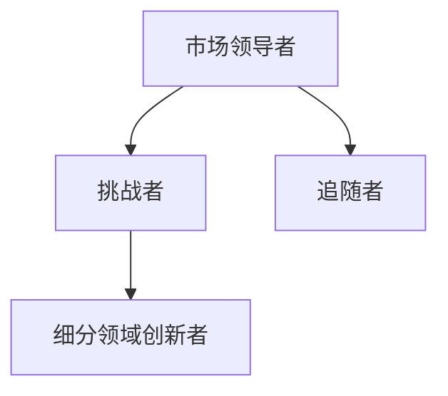

# 行业分析

## 核心论点

> [一句话概括核心论点]

## 行业格局

### 主要玩家

| 玩家 | 定位 | 核心优势 |
|---|---|---|
| [玩家 1] | [定位] | [优势] |
| [玩家 2] | [定位] | [优势] |

### 竞争态势

## 演进趋势

### 趋势 1：[趋势名称]

**描述**: [趋势描述]

**驱动因素**:
- [因素 1]
- [因素 2]

**影响**: [对知识体系的影响]

### 趋势 2：[趋势名称]

**描述**: [趋势描述]

**驱动因素**:
- [因素 1]
- [因素 2]

**影响**: [对知识体系的影响]

## 关键洞察

### 洞察 1：[洞察名称]

**描述**: [洞察描述]

**验证**: [验证依据]

### 洞察 2：[洞察名称]

**描述**: [洞察描述]

**验证**: [验证依据]

## 战略建议

- [建议 1]
- [建议 2]
- [建议 3]

## 延伸阅读

- [相关文档 1]
- [相关文档 2]