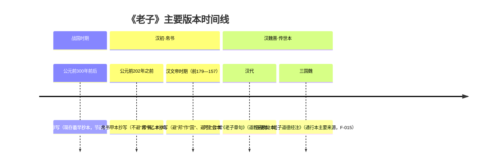

# 历史背景与出土

《老子》（《道德经》）作为先秦道家核心典籍，其流传版本经历了漫长而复杂的演变。1973 年长沙马王堆三号汉墓出土的帛书《老子》甲乙本，将我们所能直接接触到的《老子》抄本年代推进到西汉初年，比所有传世本早数百年，为研究《老子》的版本源流、文字演变与思想原貌提供了第一手材料。本章围绕发现史、抄写时代判定与历史意义三方面展开，并在文末以时间线图总览《老子》各主要版本的年代关系。

## 马王堆三号汉墓发现史

马王堆汉墓位于今湖南省长沙市，是西汉初年长沙国丞相家族的墓葬群。1972—1974 年间，考古工作者对马王堆汉墓进行了系统发掘，其中三号墓出土了大量珍贵的帛书文献，是本次考古发掘最重要的发现之一（F-020）。

1973 年，长沙马王堆三号汉墓出土大量帛书，其中包括《老子》甲、乙两种抄本（F-001）。这批帛书的出土，使《老子》的研究首次建立在"出土文本"而非仅"传世文本"的基础上，是二十世纪《老子》版本研究史的标志性事件。

三号墓的墓主为**利豨**，是汉初长沙国丞相**利苍**之子（F-020）。墓中随葬的帛书抄写于西汉初年，三号墓下葬时间依考古界主流判断约在汉文帝十二年（公元前 168 年），正处于汉文帝在位期间（F-020），属于西汉早期遗物。

| 项目 | 内容 | 事实来源 |
|---|---|---|
| 发掘范围 | 长沙马王堆汉墓考古发掘（1972—1974 年） | F-020 |
| 帛书出土时间 | 1973 年（马王堆三号汉墓） | F-001 |
| 墓主 | 利豨（汉初长沙国丞相利苍之子） | F-020 |
| 出土帛书内容 | 大量帛书文献，含《老子》甲、乙两种抄本 | F-001 |
| 帛书抄写年代 | 西汉初年（约公元前 2 世纪） | F-002、F-003 |

## 甲乙本抄写时代判定

判定帛书《老子》甲乙本抄写年代的关键证据来自**避讳学**。避讳是中国古代文献中回避帝王名讳（尤其是同字必讳）的书写制度，通过观察文本中是否避讳、避哪些讳，可以推断抄写时代的上限与下限。需要说明的是，避讳断代属于**推断性证据**而非绝对定论——它依赖于"避讳制度被严格执行"这一前提，学界对个别讳字的判定仍有讨论余地。

### 甲本：不避"邦"讳 → 刘邦称帝之前

帛书《老子》**甲本**不避汉高祖刘邦的名讳，仍然使用"邦"字（F-002）。由于避讳制度在帝王即位后普遍施行，甲本中"邦"字未作回避，依避讳学主流推断，其抄写年代应早于刘邦称帝。刘邦于公元前 202 年称帝，故甲本抄写于公元前 202 年之前（F-002）。

### 乙本：避"邦"作"国"、避"恒"作"常" → 汉文帝及其后

帛书《老子》**乙本**则同时避汉高祖刘邦之讳与汉文帝刘恒之讳：凡"邦"字改作"国"，凡"恒"字改作"常"（F-003）。其中"恒"避作"常"，是避汉文帝刘恒（公元前 179—157 年在位）名讳的直接证据。因此，乙本的抄写年代判定为汉文帝在位时期及其后（F-003）。

| 特征 | 甲本 | 乙本 | 事实来源 |
|---|---|---|---|
| "邦"字处理 | 不避讳，保留"邦" | 避讳，改作"国" | F-002、F-003 |
| "恒"字处理 | 保留（未见避讳迹象） | 避汉文帝刘恒讳，改作"常" | F-003 |
| 抄写时代判定 | 刘邦称帝（前 202 年）之前 | 汉文帝（前 179—157 年）在位及其后 | F-002、F-003 |

> 避讳不仅是判定抄写年代的工具，也解释了帛书与传世本之间的许多文字差异：帛书用"恒"处，传世本多作"常"（F-008）；帛书用"邦"处，传世本多作"国"（F-009）。正是避讳制度，使得后世读者熟悉的"道可道，非常道"在帛书中呈现出"非恒道也"的面貌。

需要说明的是，甲乙本虽然抄写年代略有先后，但在内容结构上高度一致：二者均以《德经》在前、《道经》在后的顺序编排（F-004），与传世王弼本"道经在前、德经在后"相反。这一共同特征说明，"德经在前"的结构早在汉初就已定型。

## 帛书老子的历史意义

帛书《老子》最大的价值，可以概括为**"近古必存真"**——在文献学上，距离原作者时代越近的抄本，越可能保留文献的原始面貌。帛书《老子》抄写于西汉初年（F-002、F-003），比现存所有传世本早数百年，因而在文字、句式与结构上更接近《老子》成书时代的原貌。

这种"近古"价值体现在多个层面：

- **文字更古**：帛书保留了更多战国至汉初的书面语特征，虚词（"也""者""矣"等）较传世本丰富，如"道可道也，非恒道也"（F-010），展示了更接近上古汉语的表达形态。
- **结构更原**：帛书"德经在前、道经在后"的编排（F-004），提示《老子》在汉初是以"德"开篇的形式流传的，与后世通行结构不同。
- **无章名原貌**：帛书甲乙本皆无篇名、无章名，仅以分章符（黑点）标示段落（F-017），反映了早期文本不以章名组织的原始面貌。
- **断代价值**：甲本不避"邦"讳（F-002）为《老子》在刘邦称帝前已定型提供了重要的断代证据（依避讳学主流推断）。

> **近古必存真**：帛书《老子》比所有传世本早数百年，是现存最早的完整《老子》抄本之一，为我们窥见《老子》在汉初的真实面貌提供了无可替代的第一手材料。

当然，"近古"意味着"更早"，但并不意味着"绝对正确"——版本之间的差异本身即是历史信息（如避讳痕迹），这一点将在后续章节（版本体系对照、核心洞察）中进一步展开。

## 版本时间线

将《老子》各主要版本按时间排列，可以清晰看到一条从战国简牍、经汉初帛书、到汉魏晋传世注本的发展脉络。其中，郭店楚简《老子》是目前已知现存最早的抄本（F-013），早于马王堆帛书约百年，为节选本（F-014）；马王堆帛书甲乙本为汉初抄本；王弼本（三国魏，F-015）与河上公本（汉代道教系统，F-016）则是后世传世本的两大主要来源。

这张时间线图清晰地呈现了《老子》版本的"金字塔"结构：越古老的抄本数量越少、越接近原貌；越晚近的传世本流传越广、但距原貌越远。帛书甲乙本正处在"郭店楚简"与"传世注本"之间的关键节点上，是连接"最古抄本"与"通行文本"的桥梁。
