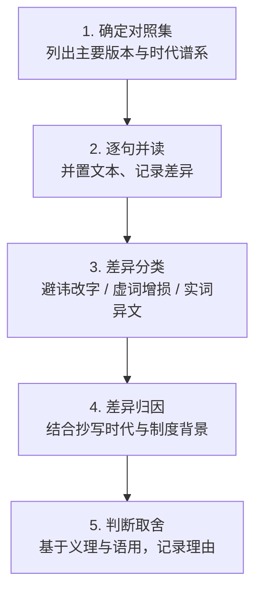

# 可复用模式

帛书《老子》的研究方法并不仅适用于古籍考据。本章从帛书甲乙本与传世本的多版本对照经验中，萃取两个可迁移到其他领域的思维模式：**P-001 版本对照阅读法**（操作层）与 **P-002 出土文献认知框架**（认知层）。前者解决"如何读多版本文本"，后者解决"如何看待新出现的更早版本"。两者一表一里、一术一道，可独立使用，更可组合成完整的方法链。

## P-001 版本对照阅读法（多版本并读 → 差异定位 → 差异归因 → 判断取舍）

**一句话**：不盲信任何单一版本，通过多版本并置阅读，把"文字差异"转化为"历史与义理信息"。

帛书甲乙本与传世王弼本、河上公本之间的大量文字出入（F-007/008/009/010），正是"版本对照"的天然演练场（F-011 高明《帛书老子校注》即以帛书为底本、以王弼本为主校本进行比勘）。这一模式告诉我们：**版本差异不是需要消除的噪声，而是可以解读的信号。**

### 触发场景

- **适用**：任何存在多版本/多传本的文本研究——古籍版本、经典文献、翻译文本的多个译本、开源代码的多个发行版
- **不适用**：仅有单一来源的文本（无差异可对照）；需要快速通读理解大意的场景（版本对照是精读工具，非速读工具）

### 核心步骤（5 步）

1. **确定对照集**：列出该文本的主要版本，如帛书甲本、帛书乙本、王弼本、河上公本，并确认各版本的时代谱系（F-011、F-015、F-016）
2. **逐句并读**：将各版本同段文字并置，用差异标记工具或对照表记录文字出入（如"大器免成"与"大器晚成"之异，F-007）
3. **差异分类**：将差异归入三类——①避讳改字（如"恒"作"常"、"邦"作"国"，F-008、F-009）；②虚词增损（如"也/者/矣"等语气词，F-010）；③实词异文（如"免"与"晚"，F-007）
4. **差异归因**：结合抄写时代（F-002、F-003）与制度背景判断差异成因，而非简单判定"哪个对"——"恒"作"常"是避汉文帝刘恒讳的产物，不是笔误（F-008）
5. **判断取舍**：基于义理与语用（上下文一致性）决定理解取向，并记录取舍理由，让结论可追溯

五步流程可图示如下：

### 反模式（≥3）

- **反模式 1：单一版本崇拜**——只读一个版本并断言"原文如此"，忽略其他传本（违背"版本批判"思维，I-003）
- **反模式 2：出土即真理**——凡是帛书用字就认为"更正确"（I-001 明确指出"更早≠更正确"）
- **反模式 3：差异即错误**——看到版本差异就断定某一方抄错，而不归因于避讳或语言演进（"恒→常"是制度而非笔误，F-008）
- **反模式 4：以校代读**——只罗列异文而不判断义理，让版本对照停留在文献学层面，未能产出理解价值

### 迁移示例

| 领域 | 场景 | 迁移要点 |
|---|---|---|
| 古籍 | 读《论语》时对照定州汉简、敦煌写本与通行本 | 同一套"并置→分类→归因→取舍"流程，识别避讳与抄写痕迹 |
| 翻译 | 读《道德经》英译本时对照多个译者版本（如林语堂、辜正坤） | 观察"道/无为"等关键词的译法分歧，把译法差异归因于译者取向而非"谁译错了" |
| 工程 | 审查第三方库多个 release 版本的 API 变更 | 用对照表定位 breaking change，把差异归因到"版本演进"而非"谁错了" |

## P-002 出土文献认知框架（近古存真 → 版本批判 → 价值重估）

**一句话**：面对出土文献时，先承认"近古必存真"的历史价值，再用版本批判校正"越早越对"的直觉，最后完成对既有认知的价值重估。

帛书《老子》抄写于汉初（F-002、F-003），比所有传世本更接近《老子》早期面貌，这是其"近古"价值所在；但更早的郭店楚简（F-013）与帛书、传世本各不相同（F-014），证明并不存在单一"原始本"（I-001）。这一框架正是为应对"新版本出现"时"是否该推翻旧认知"的抉择而设。

### 触发场景

- **适用**：接触到新出土/新发现的"更早版本"时——考古文献、档案解密、开源项目早期 commit、AI 模型的早期 checkpoint
- **不适用**：无"更早版本"出现的常规阅读场景

### 核心步骤（5 步）

1. **确认近古性**：核实新版本确实更早（帛书 vs 传世本，F-001；郭店楚简比帛书更早约百年，F-013）
2. **识别差异**：找出新版本与既有认知的结构性/文字性差异（德经在前 vs 道经在前，F-004；"大器免成" vs "大器晚成"，F-007）
3. **版本批判**：追问差异成因——是避讳（F-008、F-009）、抄写增损（F-010）还是内容演进（郭店楚简为节选本，F-014）
4. **价值重估**：评估新证据对既有认知的冲击——是推翻、修正还是补充（"德经在前"并不推翻老子思想，只补充了阅读顺序的另一种可能，I-002）
5. **审慎整合**：将新证据纳入既有框架，保留"未决"空间（郭店、帛书、传世本之间的差异尚未完全定论，F-013、F-014）

### 反模式（≥3）

- **反模式 1：近古即真理**——认为"最早版本=最正确版本"（I-001 明确反对：帛书甲乙本本身即互有差异，F-002 vs F-003）
- **反模式 2：文献拜物教**——把所有判断都押在出土文献上，忽视传世本千年的注疏传统（王弼本、河上公本的价值，F-015、F-016）
- **反模式 3：保守固守**——拒绝承认新证据，坚持传世本为唯一权威（I-003 指出必须进行版本批判）
- **反模式 4：全盘推翻**——发现帛书与传世本不同就宣称"传世本全错了"，忽视多数差异只是避讳与虚词增损（F-008、F-010）

### 迁移示例

| 领域 | 场景 | 迁移要点 |
|---|---|---|
| 考古 | 三星堆新出土器物 vs 既有商周青铜器认知 | "近古存真"但需以版本批判式思维重新评估年代与功能，而非直接改写既有谱系 |
| 工程 | 发现仓库历史中的"早期架构 commit"比当前实现更简洁 | 先承认其"早期价值"，再用差异归因判断是演进还是退化，而非盲目回滚 |
| AI | 拿到模型早期 checkpoint 与最新版本对比 | 早期版本可能更"纯净"但能力较弱，用版本对照判断取舍，而非"旧版即真理" |

## 两种模式的关系

P-001 与 P-002 是同一方法论的两层：

| 维度 | P-001 版本对照阅读法 | P-002 出土文献认知框架 |
|---|---|---|
| 定位 | **操作层**（术） | **认知层**（道） |
| 面向问题 | "如何读多个版本" | "如何看待新出现的更早版本" |
| 核心动作 | 并读→定位→分类→归因→取舍 | 近古→差异→批判→重估→整合 |
| 对应洞察 | 落实 I-003 的"版本批判"三步法 | 校正 I-001 的"更早≠更正确"，呼应 I-002 的价值重估 |

二者**可组合使用**：当一个新的早期版本出现时，先以 P-002 确立正确的认知姿态（不神化、不固守），再以 P-001 展开具体的逐句对照与归因。在帛书《老子》的案例中，先确认帛书"更早但不更正确"的定位（P-002 第 1、3 步），再对"大器免成/晚成""恒/常"等具体异文做版本对照（P-001 全流程），即是一次完整的组合应用。反过来，P-001 的逐句对照所积累的差异证据，也会反过来支撑 P-002 的价值重估判断——两者构成**方法闭环**。

## G3 质量门自检

- [x] 模式条数：2 个（P-001、P-002，≥2 个要求）
- [x] 结构完整：每个模式含 触发场景（适用/不适用）/核心步骤/反模式/迁移示例
- [x] 核心步骤 3-7 步：均为 5 步
- [x] 反模式 ≥3：P-001 有 4 个、P-002 有 4 个
- [x] 跨场景迁移示例：古籍/翻译/工程（P-001）；考古/工程/AI（P-002），均以表格呈现
- [x] 关系说明：明确 P-001 为操作层、P-002 为认知层，可组合使用
- [x] 图示：含 1 个 mermaid 流程图展示 P-001 五步流程
- [x] 可溯源：模式均引用 F 编号（F-001~F-016）与 I 编号（I-001~I-003），源自 [facts.md](../../../../../../.trae/specs/boshu-laozi-wiki/facts.md) 与 [insights.md](../../../../../../.trae/specs/boshu-laozi-wiki/insights.md)
