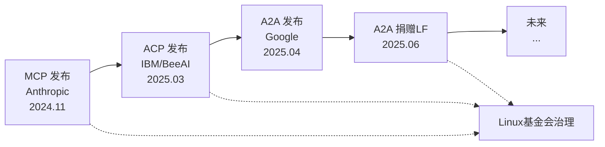
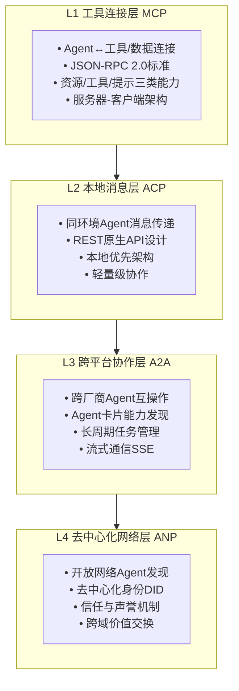

# 00、概述与背景

## 0.1 多Agent系统发展现状

2024-2025年是AI Agent生态爆发式增长的时期。从Anthropic Claude、OpenAI GPT、Google Gemini等大模型厂商，到LangChain、AutoGen、CrewAI等应用框架，再到各类垂直领域Agent应用，Agent技术正从单点能力向多Agent协作系统演进。

### 多Agent协作的典型场景

- **企业级工作流**：多个专业Agent协同完成复杂业务（如法务审查Agent+财务审核Agent+项目管理Agent）
- **工具生态整合**：Agent需要连接数据库、API、文件系统、第三方服务等外部工具
- **跨平台协作**：不同厂商开发的Agent需要互相发现、通信、协作完成任务
- **去中心化网络**：开放网络中互不信任的Agent需要安全地进行价值交换和服务调用

然而，生态繁荣的背后存在严重的**互操作性问题**。

## 0.2 为什么需要标准化协议：N×M集成问题

在没有标准化协议的情况下，每新增一种Agent框架或工具，都需要与现有N种系统进行点对点集成，导致集成复杂度呈N×M增长。

### 无协议 vs 有协议对比

| 维度 | 无标准化协议（点对点集成） | 有标准化协议（通用接口） |
|------|--------------------------|------------------------|
| **集成复杂度** | O(N×M)，每对系统需要定制适配 | O(N+M)，每个系统只需实现一次协议 |
| **开发成本** | 高，每个集成都需要重复开发 | 低，一次实现，全生态互通 |
| **维护成本** | 极高，任何一方升级都可能破坏集成 | 低，协议版本化管理，向后兼容 |
| **生态开放性** | 封闭，形成厂商锁定 | 开放，新参与者可快速加入 |
| **创新速度** | 慢，大量资源消耗在集成上 | 快，专注于能力创新而非适配 |
| **典型示例** | 早期打印机驱动（每个打印机需要专用驱动） | USB标准（一个接口连接所有设备） |

### N×M问题直观示意

```mermaid
flowchart LR
    subgraph NoProtocol["无协议：O(N×M) 集成"]
        A1["Agent A"]
        A2["Agent B"]
        A3["Agent C"]
        T1["Tool 1"]
        T2["Tool 2"]
        T3["Tool 3"]
        A1 --> T1
        A1 --> T2
        A1 --> T3
        A2 --> T1
        A2 --> T2
        A2 --> T3
        A3 --> T1
        A3 --> T2
        A3 --> T3
    end
    subgraph WithProtocol["有协议：O("N+M") 集成"]
        P["标准化协议层"]
        B1["Agent A"]
        B2["Agent B"]
        B3["Agent C"]
        S1["Tool 1"]
        S2["Tool 2"]
        S3["Tool 3"]
        B1 --> P
        B2 --> P
        B3 --> P
        P --> S1
        P --> S2
        P --> S3
    end
```

正如USB解决了外设连接问题、HTTP/HTML解决了Web互操作性问题、TCP/IP解决了网络互联问题，Agent生态也需要一套分层的标准化通信协议。

## 0.3 协议生态全景：四大协议诞生时间线

2024年底到2025年中，短短半年内四大Agent通信协议相继发布，形成了完整的协议栈分层设计：

| 协议 | 发布时间 | 发起方 | 治理机构 | 核心技术 | 定位层级 |
|------|---------|--------|---------|---------|---------|
| **MCP** | 2024年11月 | Anthropic | Linux基金会 | JSON-RPC | L1 工具连接层 |
| **ACP** | 2025年3月 | IBM Research / BeeAI | Linux基金会 | REST原生 | L2 本地消息层 |
| **A2A** | 2025年4月 | Google | Linux基金会（2025年6月捐赠） | HTTP + JSON-RPC + SSE | L3 跨平台协作层 |
| **ANP** | 2025年（早期阶段） | 社区驱动 | W3C相关标准 | W3C DID + JSON-LD | L4 去中心化网络层 |

### 协议发展时间轴



### 各协议权威来源说明

- **MCP**：Anthropic 2024年11月发布，现已捐赠Linux基金会，是目前最成熟、生态最丰富的协议
- **ACP**：IBM Research与BeeAI社区联合推出，2025年3月发布，同样归属Linux基金会，设计上强调本地优先和REST原生架构
- **A2A**：Google 2025年4月在Cloud Next大会发布，2025年6月宣布捐赠Linux基金会，支持跨厂商Agent互操作，采用HTTP+JSON-RPC+SSE实现任务流式通信
- **ANP**：面向去中心化Agent网络的协议，基于W3C DID（Decentralized Identifiers）和JSON-LD语义网技术，目前处于早期探索阶段

> 参考来源：arXiv论文 2505.02279 等学术研究，以及各协议官方发布公告和Linux基金会官方文档。

## 0.4 四层协议栈定位详解

四大协议并非竞争关系，而是在不同层次上互补，形成完整的Agent通信协议栈：



### 各层核心职责

| 层级 | 协议 | 核心问题解决 | 典型交互对象 |
|------|------|-------------|-------------|
| **L1 工具层** | MCP | Agent如何调用外部工具和访问数据？ | Agent ↔ 工具、数据库、文件系统、API |
| **L2 本地层** | ACP | 同一运行环境下Agent如何高效通信？ | Agent ↔ Agent（本地/私有部署） |
| **L3 跨平台层** | A2A | 不同厂商Agent如何跨平台协作？ | Agent ↔ Agent（跨组织/跨云） |
| **L4 网络层** | ANP | 开放网络中Agent如何安全发现和协作？ | Agent ↔ Agent（去中心化/公网） |

### 类比理解：与网络协议栈对照

| Agent协议栈 | 类比TCP/IP协议栈 | 作用 |
|------------|-----------------|------|
| ANP | 应用层（HTTP/SMTP等） | 面向特定业务场景的高级协议（去中心化发现/信任） |
| A2A | 应用层/跨域协议 | 跨组织/跨厂商安全通信、身份认证、任务协作 |
| ACP | 传输层（TCP/UDP） | 本地/可靠的Agent间消息传输机制 |
| MCP | 数据链路/物理层 | 基础连接能力，Agent连接外部工具/数据源 |

## 0.5 如何使用本教程

- **初学者**：建议按顺序阅读，从本章建立全局概念开始，然后逐层学习MCP→ACP→A2A→ANP
- **实战开发者**：可直接跳转到对应协议的详解章节（01-mcp/02-acp/03-a2a/04-anp），结合07-implementation代码示例动手实践
- **架构师**：重点阅读05-comparison协议对比与选型，以及08-scenarios应用场景分析
- **速查需求**：直接使用11-quick-reference快速参考卡

## 0.6 章节导航

| 导航 | 链接 |
|------|------|
| 返回总览 | [Agent通信协议总览](../agent-communication-protocols-wiki.md) |
| 上一章 | 无（本章为第一章） |
| **下一章** | [01、MCP协议详解：Model Context Protocol](./01-mcp.md) |
