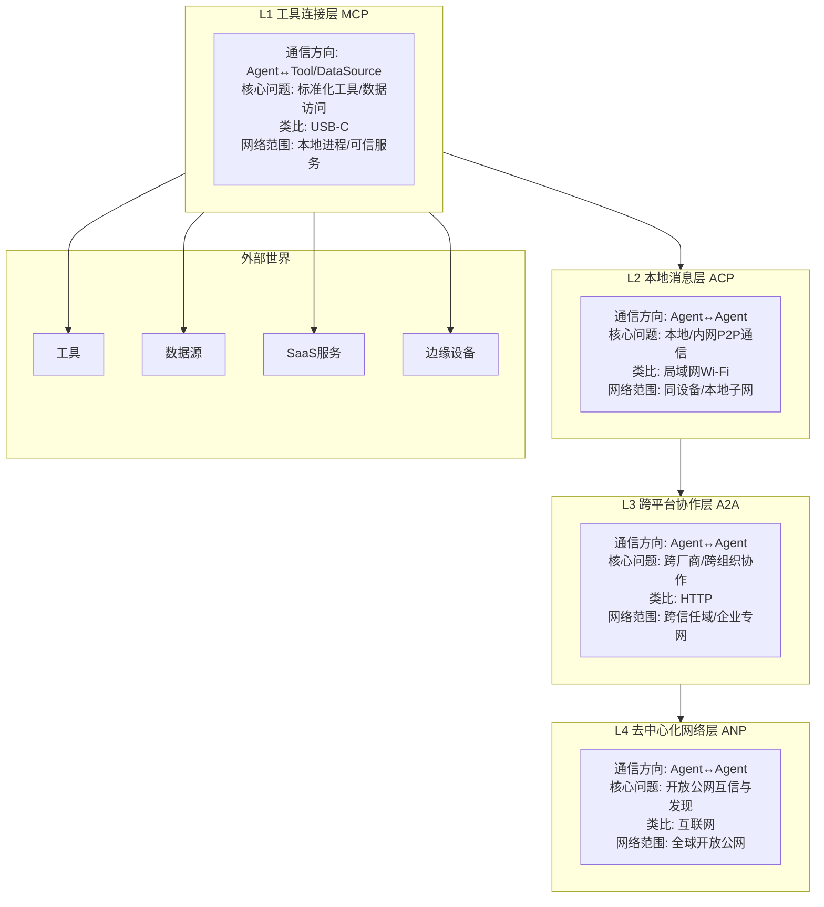
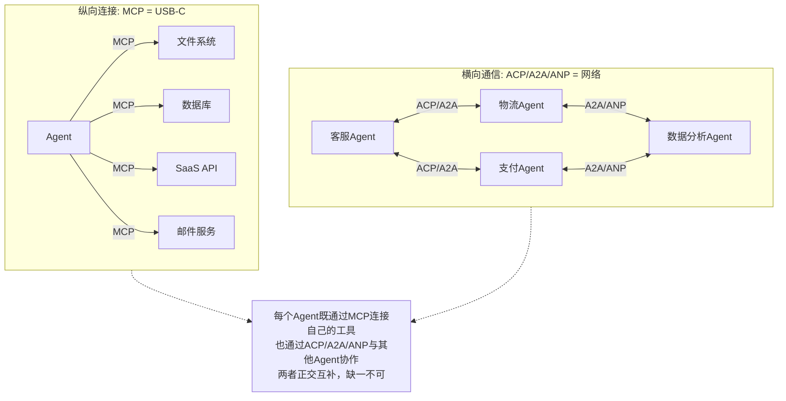
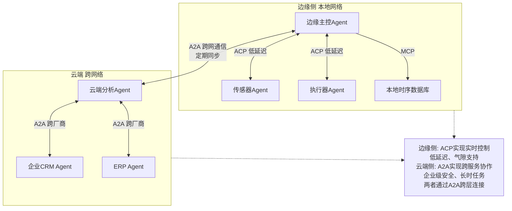
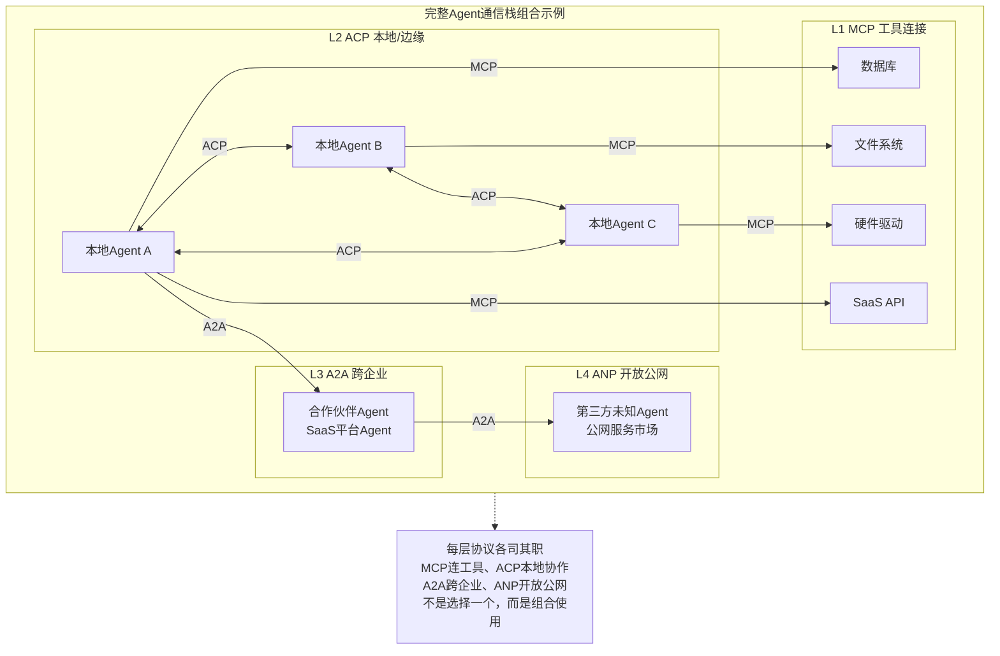

# 05、协议对比与分层架构

## 5.1 本章导读

在前面四章中，我们分别详细学习了MCP、ACP、A2A、ANP四个协议的设计理念、技术细节和应用场景。本章作为关键整合章节，将帮助读者：

- 理解四层协议栈的整体架构，明确每个协议在栈中的位置和职责
- 从多维度系统对比四个协议的技术特性
- 区分纵向连接（MCP）与横向通信（ACP/A2A/ANP）的本质差异
- 深入对比最容易混淆的ACP与A2A两大横向协议
- 建立"互补而非竞争"的核心认知——没有"最佳协议"，只有"最佳组合"
- 掌握基于场景的选型决策方法
- 了解符合当前生态成熟度的分阶段采用路径

阅读完本章后，读者应该能够根据自身业务场景，清晰判断应该采用哪些协议、如何组合使用，以及制定合理的技术演进路线。

## 5.2 四层协议栈全景图

Agent通信协议并非孤立存在，而是构成一个从下到上、各司其职的四层协议栈。每一层解决特定范围、特定信任模型下的通信问题，层与层之间是互补而非替代关系。



### 四层协议栈层级说明

| 层级 | 协议 | 核心职责 | 类比 | 典型网络范围 |
|------|------|---------|------|-------------|
| **L1 工具连接层** | MCP | 标准化Agent与工具/数据源的连接方式 | USB-C接口 | 本地进程、可信远程服务 |
| **L2 本地消息层** | ACP | 同一环境内多Agent的低延迟P2P通信 | 局域网Wi-Fi | 同设备、本地子网、气隙环境 |
| **L3 跨平台协作层** | A2A | 跨厂商、跨组织、跨信任域的Agent协作 | HTTP协议 | 企业专网、跨云、合作伙伴网络 |
| **L4 去中心化网络层** | ANP | 开放公网无预置信任的Agent发现与协作 | 互联网本身 | 全球开放公网、去中心化Agent经济 |

从L1到L4，网络范围逐步扩大，信任边界逐步开放，延迟逐步增加，但协作的广度和灵活性也逐步提升。

## 5.3 多维度技术对比大表

以下表格从17个关键维度系统对比四个协议的技术特性，帮助读者快速建立整体认知：

| 对比维度 | MCP | ACP | A2A | ANP |
|---------|-----|-----|-----|-----|
| **发起方/治理** | Anthropic发起<br/>Linux基金会治理 | IBM Research/BeeAI发起<br/>Linux基金会AI&Data治理 | Google发起<br/>Linux基金会治理 | 社区驱动<br/>规范演进中 |
| **发布时间** | 2024年11月 | 2025年3月 | 2025年4月 | 早期探索阶段 |
| **通信方向** | 纵向<br/>Agent↔工具/数据 | 横向本地<br/>Agent↔Agent(P2P) | 横向跨域<br/>Agent↔Agent(C/S) | 横向公网<br/>Agent↔Agent(去中心化) |
| **核心定位** | Agent连接外部世界的USB-C接口 | 本地优先的Agent间P2P通信 | 跨厂商Agent协作的HTTP | 开放公网Agent经济基础设施 |
| **架构模型** | Client-Server | 去中心化P2P | Client-Server | 去中心化网络 |
| **传输协议** | stdio/Streamable HTTP/SSE | REST HTTP/gRPC/ZeroMQ/IPC | HTTP/HTTPS（强制） | 构建于A2A/ACP之上 |
| **消息格式** | JSON-RPC 2.0 | REST + JSON/OpenAPI | JSON-RPC 2.0 over HTTP | JSON-LD + DID/VC |
| **发现机制** | 用户配置Server地址<br/>initialize能力发现 | mDNS本地广播<br/>静态离线Agent Card | Well-Known URI<br/>/.well-known/agent.json | 去中心化发现(DHT/区块链等) |
| **SDK依赖程度** | 需要官方SDK | 零SDK<br/>原生HTTP即可 | 需要官方SDK | 待定 |
| **交互模式** | 同步请求/响应<br/>SSE流式通知 | 同步请求/响应<br/>异步任务轮询/回调 | 同步/SSE流式/Webhook推送 | 待定 |
| **安全模型** | stdio天然安全<br/>远程OAuth 2.1 | DID + 本地RBAC<br/>TLS可选 | 企业级OAuth 2.0/OIDC<br/>强制HTTPS | W3C DID + VC<br/>去中心化信任链 |
| **典型网络环境** | 本地进程<br/>可信远程服务 | 同设备IPC<br/>本地子网<br/>气隙离线环境 | 公网<br/>企业专线<br/>跨云/跨组织 | 完全开放公网<br/>无预置信任环境 |
| **延迟特性** | 极低（stdio）<br/>中高（远程HTTP） | 极低（IPC/gRPC）<br/>低（本地HTTP） | 中高（跨网络） | 高（公网+验证开销） |
| **任务模型** | 无状态工具调用<br/>单次请求响应为主 | 有状态Task<br/>四状态简单状态机 | 丰富有状态Task<br/>支持input-required多轮循环 | 待定 |
| **多模态支持** | Text/Image/Resource（通过content） | MIME类型协商<br/>multipart/form-data | TextPart/DataPart/FilePart<br/>三类型原生混合 | 语义化数据表示 |
| **生态规模/成熟度** | 生产就绪<br/>数千Server<br/>主流IDE原生支持 | 快速发展<br/>BeeAI平台支撑 | 广泛采用<br/>150+组织支持<br/>全语言SDK | 早期概念阶段<br/>无生产部署 |
| **典型应用场景** | IDE插件<br/>工具调用<br/>数据读取<br/>SaaS集成 | 边缘设备/机器人<br/>内网多Agent<br/>气隙环境<br/>嵌入式系统 | 跨企业协作<br/>SaaS Agent集成<br/>长时任务工作流<br/>客服/ERP场景 | 开放Agent市场<br/>去中心化AI服务<br/>自主Agent经济 |

## 5.4 纵向 vs 横向：MCP与ACP/A2A/ANP的本质区别

理解MCP与另外三个协议的区别是掌握整个协议栈的关键——它们解决的是**根本不同的问题**，处于完全不同的维度，因此不存在竞争关系，而是天然互补。

### 5.4.1 维度差异对比

| 维度 | 纵向（MCP） | 横向（ACP/A2A/ANP） |
|------|------------|-------------------|
| **通信双方** | Agent ↔ 工具/数据源 | Agent ↔ Agent |
| **对方角色** | 被动执行的"工具" | 自主决策的"对等智能体" |
| **交互确定性** | 确定性：调用X得到预期结果Y | 非确定性：Agent自主决定如何完成任务 |
| **核心问题** | 如何统一工具调用接口 | Agent之间如何发现、协商、协作 |
| **是否暴露内部状态** | 不暴露，只暴露函数签名 | 可暴露能力描述（Agent Card） |
| **典型类比** | USB-C：连接外设 | 网络：连接计算机 |
| **状态模型** | 无状态调用为主 | 有状态任务/会话 |
| **调用深度** | 单次函数调用 | 多轮对话、长时任务 |

### 5.4.2 USB-C vs 网络类比详解

为了更直观地理解这种差异，我们用计算机领域的经典类比：

**MCP ≈ USB-C（通用串行总线Type-C）**

- USB-C解决的是"电脑如何连接外部设备"的问题
- 你插入一个U盘、显示器、键盘、充电器，都用同一个接口
- 设备是被动的，等待电脑调用
- 连接范围短（通常几米内），信任度高（你自己买的设备）
- MCP解决的是"Agent如何连接工具/数据"的问题
- 无论是文件系统、数据库、GitHub还是Slack，都用同一个协议
- 工具是被动的，等待Agent调用
- 连接范围通常是本地或可信服务，信任度高

**ACP/A2A/ANP ≈ 网络（Wi-Fi/HTTP/互联网）**

- 网络解决的是"电脑如何与其他电脑通信"的问题
- 每台电脑都是自主的，有自己的CPU、内存、操作系统
- 通信范围可以从局域网（Wi-Fi）到广域网（HTTP）再到全球互联网
- 信任模型从完全信任（局域网）到预置信任（企业专网）到零信任（公网）
- ACP/A2A/ANP解决的是"Agent如何与其他Agent通信"的问题
- 每个Agent都是自主的，有自己的大模型、记忆、决策逻辑
- 通信范围可以从本地IPC（ACP）到跨组织（A2A）再到全球公网（ANP）
- 信任模型从本地信任（ACP）到企业信任（A2A）到去中心化信任（ANP）

### 5.4.3 为什么它们不竞争而是互补

一台电脑既需要USB-C接口连接外设，也需要网卡连接网络——二者缺一不可。同理，一个完整的Agent系统：

- 需要通过**MCP**连接本地文件、数据库、各种SaaS工具（纵向连接外设）
- 需要通过**ACP/A2A/ANP**与其他Agent协作完成复杂任务（横向连接其他电脑）

没有MCP，Agent就失去了与外部世界交互的"手"和"眼"；没有ACP/A2A/ANP，Agent就成为孤立的"孤岛"，无法利用其他Agent的专业能力。两者是正交关系，而非替代关系。



## 5.5 ACP vs A2A：两大横向协议深度对比

在四个协议中，ACP和A2A最容易被混淆——它们都解决Agent间横向通信问题，但设计哲学、适用场景和技术路线截然不同。理解两者的差异是做出正确选型的关键。

### 5.5.1 架构哲学差异

| 哲学维度 | ACP | A2A |
|---------|-----|-----|
| **核心隐喻** | AI的局域网Wi-Fi | AI的互联网HTTP |
| **设计哲学** | 本地优先（Local-first） | 跨网优先（Cross-network first） |
| **架构取向** | 去中心化P2P | Client-Server |
| **信任假设** | 本地信任边界内 | 跨信任边界，需要强安全 |
| **SDK理念** | 零SDK，原生HTTP即可 | 官方SDK降低接入门槛 |
| **发现哲学** | 零配置自动发现（mDNS） | 显式配置发现（Well-Known URI） |
| **网络依赖** | 可完全离线运行 | 依赖HTTP网络 |

### 5.5.2 设计目标差异

| 设计目标 | ACP优先级 | A2A优先级 |
|---------|----------|----------|
| **低延迟** | ⭐⭐⭐⭐⭐ 最高 | ⭐⭐ 中 |
| **零SDK依赖** | ⭐⭐⭐⭐⭐ 最高 | ⭐ 低 |
| **气隙/离线支持** | ⭐⭐⭐⭐⭐ 最高 | ⭐⭐ 中（需配置） |
| **跨厂商互操作** | ⭐⭐ 中 | ⭐⭐⭐⭐⭐ 最高 |
| **企业级安全** | ⭐⭐ 中（本地模型） | ⭐⭐⭐⭐⭐ 最高 |
| **长时任务支持** | ⭐⭐ 中 | ⭐⭐⭐⭐⭐ 最高 |
| **生态兼容性** | ⭐⭐⭐ 中 | ⭐⭐⭐⭐⭐ 最高 |
| **资源受限环境适配** | ⭐⭐⭐⭐⭐ 最高 | ⭐⭐ 中 |

### 5.5.3 优劣势分析

**ACP核心优势：**
1. **极低延迟**：本地IPC/gRPC/ZeroMQ，适合实时控制场景
2. **零SDK依赖**：curl/wget/任意HTTP客户端即可集成
3. **原生气隙支持**：完全离线环境正常工作
4. **无单点故障**：纯P2P架构，单个Agent下线不影响网络
5. **轻量**：适合嵌入式、边缘设备等资源受限环境
6. **离线发现**：Agent Card支持静态分发，未运行也可被感知

**ACP主要劣势：**
1. **网络范围受限**：仅适用于本地子网/内网，无法原生跨公网
2. **生态规模较小**：相比A2A，合作伙伴和SDK支持较少
3. **长时任务模型简单**：四状态状态机，不支持input-required多轮循环
4. **企业级安全特性较弱**：面向信任边界内场景，跨域使用需额外加固
5. **流式支持依赖传输层**：没有原生SSE，需依赖gRPC或ZeroMQ实现

**A2A核心优势：**
1. **跨网能力强**：基于HTTP/HTTPS，可穿越防火墙、负载均衡
2. **企业级安全内置**：OAuth 2.0/OIDC、强制HTTPS、审计日志
3. **长时任务原生支持**：丰富的状态机、SSE流式进度、Webhook通知
4. **生态规模大**：150+组织支持，全语言SDK，主流AI框架采纳
5. **多模态原生支持**：TextPart/DataPart/FilePart三类型，混合消息
6. **多轮交互支持**：input-required状态实现人机协作循环

**A2A主要劣势：**
1. **延迟较高**：HTTP协议开销，跨网络延迟不可避免
2. **SDK依赖**：虽然可以裸写JSON-RPC，但官方SDK大幅降低复杂度
3. **气隙支持需要配置**：不能原生工作在完全离线环境
4. **中心化架构**：Client-Server模式存在服务端单点故障风险
5. **发现需要Agent在线**：Well-Known URI要求Agent必须运行才能被发现

### 5.5.4 适用场景对照

| 场景 | 选择 | 原因 |
|------|------|------|
| 工业机器人多关节实时协同 | **ACP** | 毫秒级延迟要求、本地网络、气隙环境 |
| 车载多模块低延迟通信 | **ACP** | 车载内网、无外网、可靠性要求高 |
| IoT网关内多传感器Agent | **ACP** | 边缘设备、资源受限、本地处理 |
| 金融/政府内网多Agent协作 | **ACP** | 数据不出域、气隙要求、合规需求 |
| 嵌入式设备多Agent | **ACP** | 零SDK、资源受限、无法运行重型依赖 |
| 企业客服Agent调用SaaS Agent | **A2A** | 跨厂商、OAuth认证、公网运行 |
| 跨企业供应链协同 | **A2A** | 跨信任域、长时任务、审计需求 |
| 多供应商SaaS Agent编排 | **A2A** | 生态兼容、标准HTTP、企业级安全 |
| 跨云混合云Agent协作 | **A2A** | 跨网络、HTTPS穿透、负载均衡友好 |
| 需要小时级长时任务 | **A2A** | 丰富状态机、SSE进度、Webhook通知 |
| 需要多轮对话式协作 | **A2A** | input-required状态支持人机循环 |

### 5.5.5 两者共存的场景

ACP和A2A不是非此即彼的选择——在复杂系统中，它们经常组合使用，各司其职：

**边缘ACP + 云端A2A混合架构**是最典型的共存模式：



**典型混合场景示例：智能工厂系统**
1. **车间层（ACP）**：机器人控制器、PLC、传感器Agent之间通过ACP实现毫秒级实时协同，断网也能继续运行
2. **工厂层（A2A）**：车间边缘Agent与MES、WMS等工厂管理系统Agent通过A2A通信
3. **企业层（A2A）**：工厂Agent通过A2A与ERP、CRM、供应链合作伙伴的Agent跨企业协作
4. **工具层（MCP）**：每个Agent通过MCP连接自己需要的数据库、文件系统、API等工具

## 5.6 互补而非竞争

理解四层协议栈的核心是建立一个认知：**没有"最佳协议"，只有"最佳组合"**。每个协议都专注于解决特定范围的问题，优秀的系统架构师应该根据需求选择合适的协议组合，而非试图用单一协议解决所有问题。

### 5.6.1 常见组合模式

**组合1：MCP + A2A——最常见的生产级组合**

这是目前生态最成熟、应用最广泛的组合：
- **MCP（L1）**：Agent通过MCP连接本地文件、数据库、SaaS工具
- **A2A（L3）**：Agent通过A2A调用其他厂商/平台的Agent能力

**适用场景**：企业级AI助手、SaaS平台集成、跨系统工作流编排

**示例架构**：
```
企业内部助理Agent
├─ 通过MCP连接：内部知识库、CRM、邮件系统、文件服务器
└─ 通过A2A调用：客服工单Agent、物流查询Agent、支付处理Agent
```

**组合2：MCP + ACP——本地多Agent系统**

适合边缘计算、机器人、嵌入式设备等本地优先场景：
- **MCP（L1）**：每个Agent通过MCP连接自己的硬件驱动、本地数据
- **ACP（L2）**：同设备/同局域网的多个Agent通过ACP低延迟P2P通信

**适用场景**：机器人、自动驾驶、IoT网关、工业控制、气隙环境

**示例架构**：
```
自动驾驶车载系统
├─ 感知Agent ──通过MCP连接──摄像头、雷达、激光雷达
├─ 决策Agent ──通过MCP连接──本地地图、行为模型
├─ 控制Agent ──通过MCP连接──转向、刹车、油门
└─ 三个Agent之间通过ACP实时通信，延迟<10ms
```

**组合3：MCP + ACP + A2A——边缘云协同完整栈**

适合需要边缘实时性+云端智能的复杂场景：
- **MCP（L1）**：所有Agent都通过MCP连接各自的工具和数据源
- **ACP（L2）**：边缘侧多个Agent通过ACP低延迟P2P协作
- **A2A（L3）**：边缘Agent与云端Agent通过A2A跨网通信

**适用场景**：智能制造、智慧城市、远程医疗、智能零售

**组合4：MCP + ACP + A2A + ANP——完整Agent通信栈（未来愿景）**

当开放的Agent经济成熟时，四层协议将全部发挥作用：
- 底层通过MCP连接工具、ACP本地协作、A2A跨企业协作
- 顶层通过ANP在开放公网中去中心化发现陌生Agent、验证身份、建立信任、进行价值交换

这是长期愿景，当前（2025-2026年）ANP仍在早期探索阶段，生产系统重点关注前三层即可。



## 5.7 选型决策树

面对具体场景时，可通过以下决策树逐步引导，从场景需求出发选择合适的协议（可多选组合）：

```mermaid
flowchart TD
    Start["决策起点: 你的场景是什么?"]
    Q1{"需要连接外部工具<br/>或数据源吗?"}
    Q2{"Agent需要在同设备<br/>或本地子网通信吗?"}
    Q3{"需要跨组织/跨厂商<br/>或跨公网协作吗?"}
    Q4{"需要去中心化公网<br/>Agent经济能力吗?"}
    Q5{"需要小时/天级<br/>长时任务支持吗?"}
    Q6{"有气隙/完全离线<br/>运行要求吗?"}
    Q7{"需要实时流式<br/>进度推送吗?"}
    R1["选择: MCP<br/>立即采用,生态成熟"]
    R2["选择: ACP<br/>本地优先,低延迟,零SDK"]
    R3["选择: A2A<br/>企业级安全,长任务,大生态"]
    R4["关注: ANP<br/>早期阶段,等待规范成熟"]
    R5["MCP + A2A组合<br/>目前最常见生产组合"]
    R6["MCP + ACP组合<br/>本地多Agent系统"]
    R7["MCP + ACP + A2A组合<br/>边缘云协同架构"]
    R8["三层组合 + SSE<br/>MCP(SSE)/A2A(SSE)/ACP("gRPC流式")"]
    Start --> Q1
    Start --> Q2
    Start --> Q3
    Start --> Q4
    Q1 -->|"是"| R1
    Q2 -->|"是"| Q6
    Q3 -->|"是"| Q5
    Q4 -->|"是"| R4
    Q5 -->|"是"| R3
    Q5 -->|"否,常规任务"| R3
    Q6 -->|"是"| R2
    Q6 -->|"否"| R3
    Q1 -->|"同时需要工具+跨网"| R5
    Q1 -->|"同时需要工具+本地"| R6
    Q2 -->|"同时本地+跨网"| R7
    Q3 -->|"同时本地+跨网"| R7
    Q7{"需要实时流式<br/>进度推送吗?"}
    R1 --> Q7
    R2 --> Q7
    R3 --> Q7
    Q7 -->|"是"| R8
    Q7 -->|"否"| decision_end
    R4 --> decision_end
    R5 --> Q7
    R6 --> Q7
    R7 --> Q7
    R8 --> decision_end
```

### 决策树使用说明

1. **起点问题**：从"你的场景是什么"开始，根据实际需求回答多个问题（协议可以多选组合）
2. **连接工具/数据**：只要Agent需要调用外部工具、读取数据、访问API，就需要MCP——这几乎是所有Agent系统的标配
3. **本地通信**：如果有多个Agent在同设备或本地子网运行，且对延迟敏感或有离线要求，选择ACP
4. **跨网协作**：如果需要调用其他厂商、其他组织、其他平台的Agent，选择A2A
5. **长时任务**：需要小时级以上、多轮交互、人工介入的任务，A2A是最佳选择
6. **气隙要求**：完全离线、网络隔离、数据不出域场景，ACP是唯一原生支持的选择
7. **流式进度**：三个协议都支持流式（MCP SSE、A2A SSE、ACP gRPC流式），按需选择即可
8. **ANP选择**：当前阶段只建议跟踪研究，不建议在生产系统中重度依赖

## 5.8 分阶段采用路线图

基于四个协议当前的生态成熟度和规范稳定性，我们推荐以下分阶段采用路线图，帮助团队循序渐进地引入Agent通信协议栈，控制技术风险。

### 阶段1（现在，2025年）：MCP——立即采用

| 维度 | 说明 |
|------|------|
| **推荐时间** | 立即开始 |
| **技术就绪度** | 生产就绪（TRL 9） |
| **风险等级** | 极低 |
| **核心动作** | 将所有Agent工具调用、数据访问统一到MCP标准 |

**为什么MCP应该最先采用：**
- MCP是四层协议中最成熟、生态最完善的
- 数千个现成MCP Server可用，覆盖主流SaaS和数据库
- Claude Desktop、Cursor、Windsurf等主流工具原生支持
- 采用MCP可以立即解决工具集成碎片化问题，获得"一次开发，到处使用"的收益
- 无论上层选择ACP还是A2A，L1层MCP都是刚需，不会浪费投资

**阶段1行动建议：**
1. 盘点现有Agent系统中的所有工具集成
2. 将非标准工具调用逐步封装为MCP Server
3. 为新工具优先采用MCP标准开发
4. 团队培训MCP开发模式，积累Server开发经验

### 阶段2（近期，2025-2026年）：ACP + A2A——根据场景选择，两者可共存

| 维度 | 说明 |
|------|------|
| **推荐时间** | MCP落地后，根据场景需求启动 |
| **技术就绪度** | A2A: 广泛采用/快速增长（TRL 7-8）; ACP: 快速发展（TRL 6-7） |
| **风险等级** | A2A: 低; ACP: 中 |
| **核心动作** | 根据业务场景选择ACP或A2A，实现Agent间通信 |

**场景驱动选择：**
- **优先选A2A的场景**：SaaS平台、企业跨系统集成、跨企业协作、长时工作流
- **优先选ACP的场景**：边缘计算、机器人、IoT、嵌入式、气隙环境、内网多Agent
- **两者都用**：边缘云协同等复杂场景，采用"边缘ACP + 云端A2A"混合架构

**阶段2行动建议：**
1. 评估是否真的需要多Agent协作（很多场景单Agent+MCP足够）
2. 若有跨厂商/跨SaaS协作需求，优先引入A2A
3. 若有本地低延迟/离线需求，引入ACP
4. 避免"为了多Agent而多Agent"，从实际业务价值出发

### 阶段3（中期，2026年及以后）：ACP + A2A深度集成

| 维度 | 说明 |
|------|------|
| **推荐时间** | ACP/A2A分别落地后 |
| **技术就绪度** | 取决于生态整合（预计TRL 8） |
| **风险等级** | 中 |
| **核心动作** | 实现多层协议混合架构，边缘云协同 |

当ACP和A2A都在各自场景落地后，可以进一步探索深度集成：
1. 统一Agent能力描述（Agent Card跨协议互认）
2. 跨协议任务路由（本地ACP任务自动转发到云端A2A）
3. 统一安全模型和身份管理
4. 统一可观测性和监控体系

### 阶段4（远期，2027年及以后）：ANP——关注但等待规范成熟

| 维度 | 说明 |
|------|------|
| **推荐时间** | 规范稳定、有成熟SDK和生产案例后 |
| **技术就绪度** | 早期探索（TRL 2-3） |
| **风险等级** | 极高 |
| **核心动作** | 跟踪社区进展，参与标准讨论，技术储备，不急于生产落地 |

**对ANP的正确态度：**
- ✅ **应该做**：关注W3C DID/VC标准进展、跟踪ANP社区讨论、做原型验证和技术储备
- ❌ **不应该做**：在生产系统中重度依赖、基于尚未定型的规范做大规模架构投入、过早优化去中心化场景

开放的去中心化Agent经济是值得期待的长期愿景，但技术成熟需要时间，理性的团队应该在控制风险的前提下跟踪进展，等待时机成熟再快速跟进。

### 路线图总览

| 阶段 | 时间 | 重点协议 | 就绪度 | 风险 | 核心目标 |
|------|------|---------|--------|------|---------|
| 阶段1 | 现在 | **MCP** | 生产就绪 | 极低 | 统一工具连接层，解决N×M集成问题 |
| 阶段2 | 近期 | **ACP/A2A** | A2A快速增长<br/>ACP发展中 | A2A低<br/>ACP中 | 根据场景选择横向协议，实现Agent间协作 |
| 阶段3 | 中期 | **ACP+A2A深度集成** | 生态整合中 | 中 | 边缘云协同，多层协议混合架构 |
| 阶段4 | 远期 | **ANP** | 早期探索 | 极高 | 关注进展，技术储备，等待成熟 |

## 5.9 章节导航

| 导航 | 链接 |
|------|------|
| 返回总览 | [Agent通信协议总览](../agent-communication-protocols-wiki.md) |
| 上一章 | [04、ANP协议概述：Agent Network Protocol](./04-anp.md) |
| **下一章** | [06、典型交互流程与最佳实践](./06-flows.md) |
