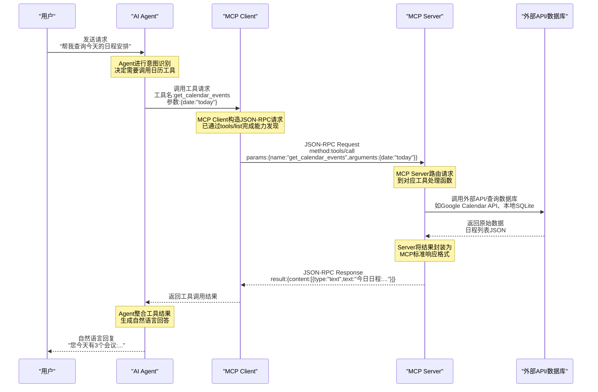
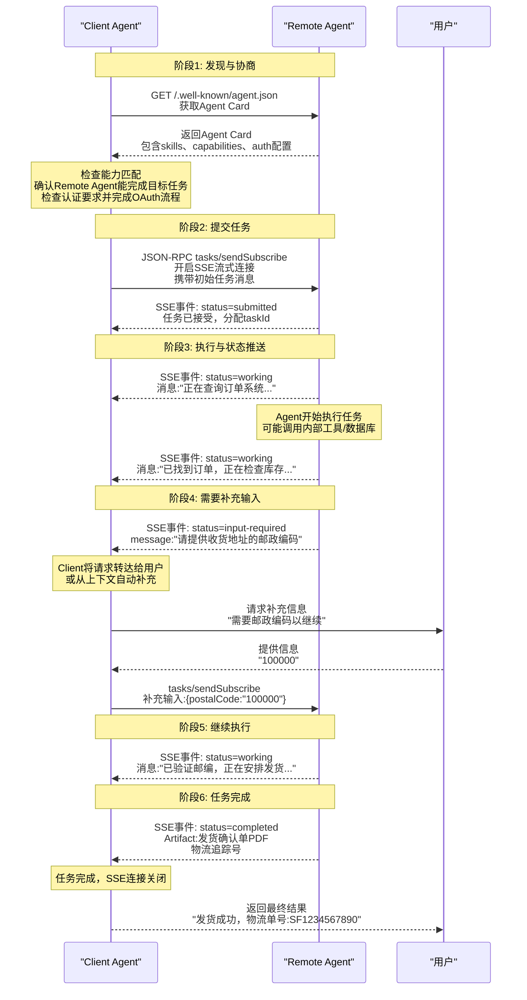
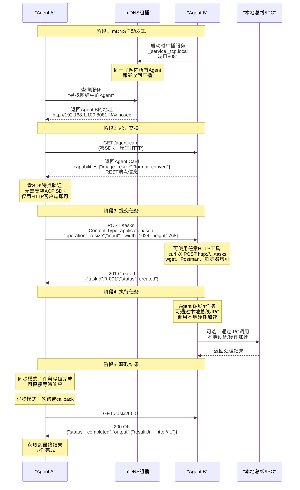
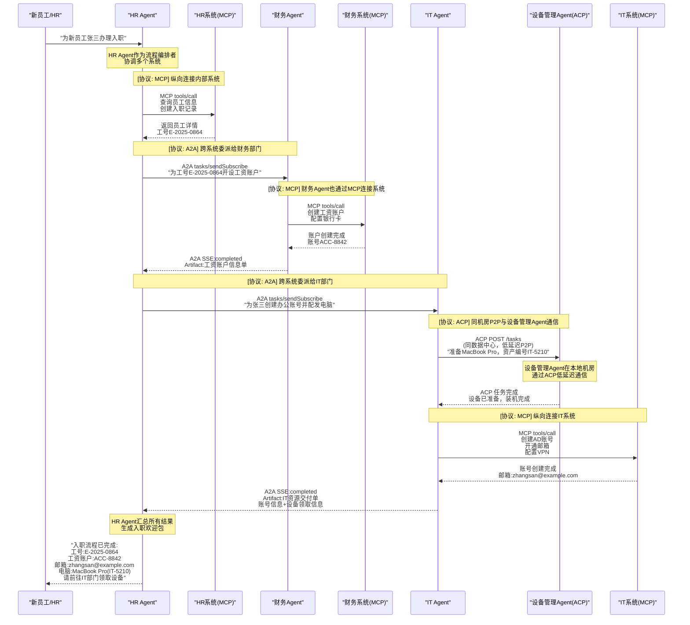
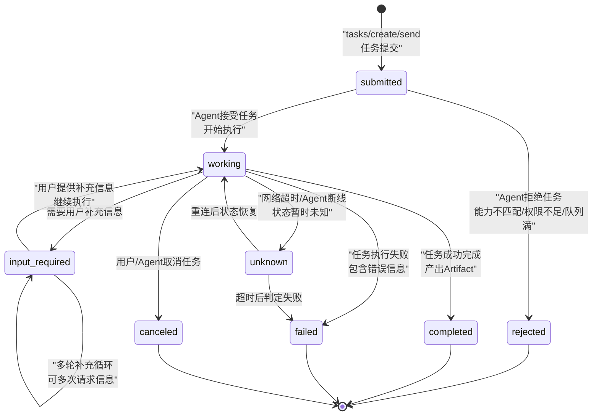
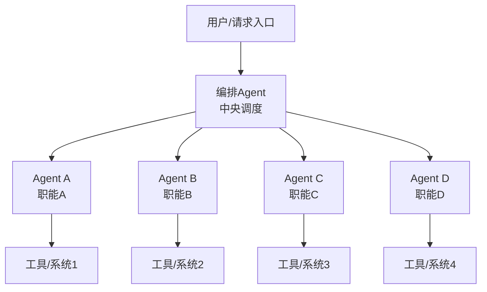
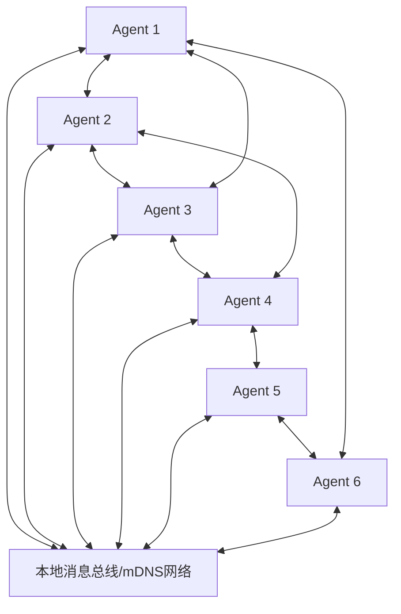
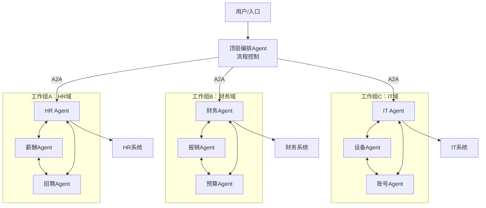

# 06、交互流程与协作模式

## 6.1 本章导读

协议的价值在于实际交互流程。前几章分别讲解了MCP、ACP、A2A、ANP的协议细节，本章通过**时序图**的方式，直观展示四种典型交互场景的完整消息流，并进一步抽象出多Agent系统的典型协作模式。

理解流程是掌握协议的最好方式——当你能在脑海中清晰"看到"消息如何在Agent之间流转时，协议设计的取舍和适用场景自然就清晰了。

本章包含：
- 4个端到端交互时序图
- 1个任务生命周期状态图
- 3种协作模式架构图
- 各流程适用场景分析

## 6.2 流程1：单Agent通过MCP调用工具

这是最基础也是最常见的场景：单个Agent通过MCP协议调用外部工具/数据，是AI IDE、个人助手等产品的核心工作模式。



### 流程步骤说明

| 步骤 | 说明 | 关键技术点 |
|------|------|-----------|
| 1. 用户发起请求 | 用户用自然语言向Agent提出需求 | 自然语言理解在Agent内部完成 |
| 2. Agent决策 | Agent分析意图，决定是否需要调用工具、调用哪个工具 | 基于大模型的函数调用能力，工具通过MCP提前发现 |
| 3. Client构造请求 | MCP Client将工具调用转换为标准JSON-RPC 2.0格式 | 严格遵循MCP规范，使用tools/call方法 |
| 4. Server路由 | MCP Server根据工具名找到对应处理函数 | Server在初始化时已注册所有工具 |
| 5. 调用外部系统 | 工具处理函数实际调用外部API、数据库或本地功能 | 这一步是MCP的价值所在——连接真实世界 |
| 6. 结果逐层返回 | 从外部系统→Server→Client→Agent→用户，完整返回链 | 每层都有标准格式封装，保证互操作性 |

### 适用场景

- **AI IDE代码辅助**：Cursor、Windsurf、Claude Code中，Agent通过MCP调用文件读写、终端执行、Git操作等工具
- **个人桌面助手**：Claude Desktop通过MCP连接日历、邮件、文件系统、Slack等个人服务
- **企业内部助手**：企业知识助手通过MCP连接内部Wiki、CRM、工单系统等
- **数据分析场景**：Agent通过MCP连接数据库、执行SQL、生成可视化

### 流程特点

- **简单直接**：单次请求响应，无复杂状态管理
- **同步为主**：大多数工具调用是同步等待结果
- **无状态**：MCP本身是无状态协议，状态由Agent维护
- **延迟敏感**：工具调用延迟直接影响用户体验，MCP stdio传输延迟可低至毫秒级

## 6.3 流程2：多Agent通过A2A跨平台任务委派

A2A面向跨厂商、跨平台、跨组织的Agent协作，典型特征是支持长时任务、流式状态更新、多轮input-required交互。



### 流程步骤说明

| 阶段 | 步骤 | 说明 |
|------|------|------|
| **发现与协商** | 获取Agent Card | Client通过标准Well-Known URI获取Remote Agent的能力描述，无需预先知道API细节 |
| | 能力匹配 | Client检查Agent Card中的skills和capabilities，确认对方能胜任任务 |
| | 认证 | 完成OAuth 2.0/OIDC认证流程，获取Access Token |
| **提交任务** | tasks/sendSubscribe | Client使用SSE模式提交任务，建立长连接用于后续流式推送 |
| | submitted状态 | Remote Agent确认接受任务，返回taskId用于后续追踪 |
| **执行与流式更新** | working状态 | Agent开始执行，通过SSE持续推送进度消息，Client可实时反馈给用户 |
| **补充输入（可选）** | input-required | 这是A2A区别于简单RPC的核心特性——任务执行中可多次请求补充信息 |
| | 用户交互 | Client将补充请求转发给用户（或从上下文自动补全） |
| | 继续执行 | 用户提供信息后任务继续，可循环多次input-required |
| **任务完成** | completed状态 | 任务成功完成，通过Artifact返回最终产物（文档、数据、文件等） |

### 适用场景

- **企业跨系统协作**：HR系统Agent通过A2A调用财务系统Agent、IT系统Agent完成员工入职流程
- **SaaS间互操作**：CRM Agent通过A2A调用邮件营销Agent、客服Agent完成客户旅程自动化
- **跨云服务商协作**：AWS上的Agent通过A2A调用Azure上的Agent、GCP上的Agent
- **供应链协同**：采购Agent通过A2A调用供应商Agent、物流Agent完成采购流程

### A2A流程关键特性

- **长时任务支持**：任务可持续数分钟、数小时甚至数天，状态持久化
- **SSE流式推送**：实时进度更新，避免轮询开销
- **多轮交互**：input-required循环支持人机协作、多轮对话式任务
- **Artifact产物**：任务完成后返回结构化产物，而非简单文本
- **企业级安全**：OAuth 2.0/OIDC认证，HTTPS加密传输，适合跨信任边界场景

## 6.4 流程3：本地多Agent通过ACP对等协作

ACP专为本地/内网环境设计，核心特点是去中心化P2P、零SDK依赖、REST原生、mDNS自动发现，一条curl命令即可调用。



### 流程步骤说明

| 阶段 | 步骤 | 说明 | ACP特色 |
|------|------|------|---------|
| **mDNS发现** | 服务广播 | Agent启动时通过mDNS在本地子网广播自身服务 | 零配置，无需DNS服务器或注册中心 |
| | 服务发现 | Agent A通过mDNS查询自动发现Agent B | 类似AirPrint发现打印机，完全自动 |
| **能力交换** | 获取Agent Card | 通过GET /agent-card获取能力描述 | REST原生，GET请求即可，支持静态离线发现 |
| **提交任务** | POST /tasks | 标准HTTP POST创建任务 | 零SDK！用curl即可完成，无需学习专有API |
| | 任务接受 | 返回201状态码和taskId | 符合REST最佳实践 |
| **任务执行** | 本地执行 | Agent B执行任务，可使用IPC/gRPC/ZeroMQ等本地传输 | 低延迟，本地网络/IPC，无公网开销 |
| | 可选本地总线 | 同设备Agent可通过IPC通信，延迟最低 | 边缘/IoT场景核心优势 |
| **获取结果** | 轮询/同步 | 短任务同步返回，长任务轮询GET /tasks/{id} | 简单直观，符合HTTP语义 |

### curl零SDK调用示例

正如时序图中展示的，ACP的核心优势是零SDK——不需要安装任何专门的ACP库，用任意HTTP客户端就能调用：

```bash
# 发现Agent后，直接用curl创建任务
curl -X POST http://192.168.1.100:8081/tasks \
  -H "Content-Type: application/json" \
  -d '{"operation":"resize","input":{"width":1024,"height":768}}'

# 查询任务状态
curl http://192.168.1.100:8081/tasks/t-001
```

这对于资源受限的嵌入式设备、非标准技术栈、气隙环境至关重要——只要能发HTTP请求，就能接入ACP网络。

### 适用场景

- **IoT设备集群**：智能家居中各类设备Agent本地P2P通信，无需云端
- **机器人协作**：工业机器人多关节控制器本地实时协同，毫秒级延迟
- **边缘计算**：边缘网关上多传感器处理Agent本地通信，数据不上云
- **气隙环境**：涉密场所、军事设施、工业控制系统等完全离线环境
- **嵌入式设备**：树莓派、Jetson等资源受限设备，无法运行重型SDK
- **企业内网P2P**：金融、政府等强合规行业内网，数据不出域

### ACP流程关键特性

- **去中心化**：无中央调度器，Agent间直接通信
- **零SDK**：curl/wget/Postman/任意HTTP库即可调用
- **mDNS零配置发现**：插网线就能发现同伴，无需配置IP/端口
- **离线/气隙支持**：完全无网络也能工作，支持静态Agent Card离线分发
- **极低延迟**：本地网络/IPC，延迟可低至亚毫秒级
- **多传输选项**：REST/gRPC/ZeroMQ/IPC根据场景选择

## 6.5 流程4：混合场景——企业数字员工团队端到端协作

真实企业场景中，往往需要MCP+ACP+A2A三协议协同工作，各司其职。以下是新员工入职流程的完整端到端协作示例。



### 混合场景协议标注

| 交互环节 | 使用协议 | 选择原因 |
|---------|---------|---------|
| HR Agent → HR系统 | **MCP** | Agent连接内部工具/数据库，纵向连接，MCP最适合 |
| HR Agent → 财务Agent | **A2A** | 跨部门、跨系统委派，财务系统是独立Agent，跨信任域A2A适合 |
| 财务Agent → 财务系统 | **MCP** | Agent连接自己内部的工具/数据，纵向连接 |
| HR Agent → IT Agent | **A2A** | 跨部门、跨系统委派，IT是独立部门Agent |
| IT Agent → 设备管理Agent | **ACP** | 同机房、同内网，P2P低延迟通信，设备管理在本地机房ACP最适合 |
| IT Agent → IT系统 | **MCP** | Agent连接AD、邮箱、VPN等内部系统 |

### 三协议分层协作模型

这个混合场景完美展示了四层协议栈的分工：

```
┌─────────────────────────────────────────────────────────────┐
│ L3 A2A 跨系统协作层                                          │
│  HR Agent ──A2A──> 财务Agent     (跨部门、跨系统、跨组织)     │
│  HR Agent ──A2A──> IT Agent       (企业级安全、长任务、流式)   │
├─────────────────────────────────────────────────────────────┤
│ L2 ACP 本地消息层                                            │
│  IT Agent ──ACP──> 设备管理Agent  (同机房、低延迟、P2P)       │
├─────────────────────────────────────────────────────────────┤
│ L1 MCP 工具连接层                                            │
│  HR Agent  ──MCP──> HR系统     (查询员工、创建入职记录)       │
│  财务Agent ──MCP──> 财务系统   (创建工资账户)                 │
│  IT Agent   ──MCP──> IT系统     (AD账号、邮箱、VPN)           │
└─────────────────────────────────────────────────────────────┘
```

### 为什么不只用一种协议？

每种协议都有其设计取舍，混合使用能最大化各协议优势：

- **全用MCP？** MCP是Client-Server工具调用模式，不支持Agent间对等协作、长时任务、状态推送、跨组织认证
- **全用A2A？** A2A太重，本地低延迟场景用A2A杀鸡用牛刀，且A2A需要SDK、不支持mDNS零配置发现
- **全用ACP？** ACP面向本地/内网，没有企业级OAuth、不适合跨公网/跨组织场景

## 6.6 任务生命周期状态转换

任务是Agent协作的核心单元，A2A定义了最完整的任务状态机，涵盖了长时任务、人机协作、异常处理等场景。



### 状态详细说明

| 状态 | 说明 | 是否终态 | 可转换到 |
|------|------|---------|---------|
| **submitted** | 任务已提交，等待Agent接受处理 | 否 | working, rejected |
| **working** | Agent正在执行任务，可推送进度更新 | 否 | input_required, completed, failed, canceled, unknown |
| **input-required** | Agent需要更多信息才能继续，等待用户输入 | 否 | working（可循环多次） |
| **completed** | 任务成功完成，包含最终Artifact产物 | 是 | 终态 |
| **failed** | 任务执行失败，包含结构化错误信息 | 是 | 终态 |
| **canceled** | 任务被用户或Agent主动取消 | 是 | 终态 |
| **rejected** | Agent在任务开始前拒绝接受（能力不匹配、权限不足、队列已满等） | 是 | 终态 |
| **unknown** | 任务状态未知（网络超时、Agent重启、连接断开） | 否 | working（恢复）, failed（超时） |

### 关键状态流转设计要点

1. **input-required多轮循环**：这是Agent协作区别于传统RPC的核心——任务执行过程中可以多次请求用户补充信息，实现"人机协同"而非全自动
2. **rejected快速失败**：Agent可以在任务开始前明确拒绝，避免浪费资源执行不适合的任务
3. **unknown状态容错**：分布式系统中网络故障不可避免，unknown状态支持断线重连后的状态恢复，提升系统鲁棒性
4. **终态明确**：四个终态（completed/failed/canceled/rejected）覆盖了所有结束场景，调用方可清晰判断任务结果

> 注：ACP定义了更简单的四状态机（created→running→completed/failed），适合本地简单场景；A2A状态机更丰富，适合复杂跨域协作。

## 6.7 典型协作模式分类

多Agent系统的协作模式可归纳为三类：中心化编排模式、去中心化P2P模式、分层混合模式。实际企业应用中，分层混合模式最为实用。

### 6.7.1 中心化编排模式（Orchestrator模式）

一个中央编排Agent（Orchestrator）统一调度其他Agent，所有交互都经过中心节点，流程明确可控。



#### 特点

| 维度 | 说明 |
|------|------|
| **拓扑结构** | 星形结构，中心编排Agent是唯一调度者 |
| **控制流** | 完全由编排Agent控制，工作流预定义 |
| **Agent间通信** | Worker Agent之间不直接通信，所有消息经编排器转发 |
| **优点** | 流程可控、易于调试、权限集中管理、事务一致性好 |
| **缺点** | 中心节点是瓶颈、单点故障风险、扩展性受限、不够灵活 |
| **推荐协议** | A2A（中心到各Agent跨系统）+ MCP（各Agent到内部工具） |
| **类比** | 传统BPM工作流引擎、项目经理分配任务 |

#### 适用场景

- 流程明确、规则固定的企业流程（如入职、报销、审批）
- 需要强一致性、可审计的场景（金融交易、合规流程）
- Agent数量较少（<20个）、团队规模可控的场景
- 初期快速搭建多Agent系统，降低复杂度

### 6.7.2 去中心化P2P模式（Swarm模式）

Agent之间直接对等通信，无中央调度节点，每个Agent自主决策与谁协作、如何协作，类似蜂群、鸟群的群体智能。



#### 特点

| 维度 | 说明 |
|------|------|
| **拓扑结构** | 网状结构，无中心节点 |
| **控制流** | 分布式控制，每个Agent自主决策 |
| **Agent间通信** | Agent之间直接通信，可任意发起对话 |
| **优点** | 无单点故障、高可用、高扩展、灵活自适应、低延迟 |
| **缺点** | 流程不可控、调试困难、一致性难保证、可能出现循环调用 |
| **推荐协议** | ACP（本地P2P），辅以MCP连接工具 |
| **类比** | 蜂群、蚁群、P2P文件共享（BitTorrent） |

#### 适用场景

- IoT设备集群、机器人 swarm、自动驾驶车车通信
- 实时性要求高、需要快速响应的场景
- 边缘计算、本地环境，无中心基础设施
- Agent数量多、动态上下线频繁的场景
- 探索性、创造性任务（如集体头脑风暴）

### 6.7.3 分层混合模式（Hierarchical模式）

前两种模式的结合：上层用中心化编排模式处理跨部门、跨系统的宏观流程；下层在局部工作组内用P2P模式实现灵活高效的本地协作。这是企业实际应用中最实用的模式。



#### 特点

| 维度 | 说明 |
|------|------|
| **拓扑结构** | 分层结构：顶层编排器连接各工作组组长，组内P2P网状 |
| **控制流** | 宏观流程由顶层编排器控制，组内灵活协作 |
| **Agent间通信** | 跨组通过组长经编排器，组内直接P2P |
| **优点** | 兼顾可控性与灵活性、扩展性好、故障隔离、符合企业组织架构 |
| **缺点** | 设计相对复杂、需要合理划分工作组边界 |
| **推荐协议** | 顶层A2A（跨域）+ 组内ACP（本地P2P）+ MCP（纵向工具连接） |
| **类比** | 企业组织架构：CEO→部门经理→员工，部门内灵活协作，跨部门经经理协调 |

#### 适用场景

- 中大型企业数字员工团队（最主流场景）
- 跨部门、跨系统、跨地域的复杂业务流程
- 既需要全局流程管控，又需要局部灵活高效的场景
- 按职能/业务域划分Agent团队的组织方式

### 三种模式对比总结

| 对比维度 | 中心化编排 | 去中心化P2P | 分层混合 |
|---------|-----------|-------------|---------|
| **复杂度** | 低 | 中 | 中高 |
| **可控性** | 高 | 低 | 中高 |
| **灵活性** | 低 | 高 | 中高 |
| **扩展性** | 受限 | 极好 | 好 |
| **单点故障** | 有 | 无 | 组长有但可隔离 |
| **调试难度** | 易 | 难 | 中等 |
| **延迟** | 较高（经中心） | 极低（P2P直连） | 组内低、跨组中 |
| **典型协议** | A2A+MCP | ACP+MCP | A2A+ACP+MCP |
| **企业适用度** | 小团队/简单流程 | IoT/边缘场景 | **中大型企业主流** |
| **成熟度** | 高 | 早期探索 | 快速增长 |

## 6.8 章节导航

| 导航 | 链接 |
|------|------|
| 返回总览 | [Agent通信协议总览](../agent-communication-protocols-wiki.md) |
| 上一章 | [05、协议对比与选型指南](./05-comparison.md) |
| **下一章** | [07、实现与部署最佳实践](./07-implementation.md) |
