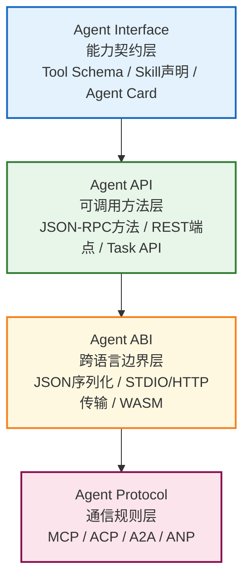

# Agent视角：Interface/API/ABI/Protocol四层技术栈总览

## 引言

在[通用概念Wiki](../interface-api-abi-protocol-wiki/00-overview.md)中，我们从通用软件开发角度建立了Interface→API→ABI→Protocol的四层抽象框架。但当你深入AI Agent开发时，会发现这四个概念在Agent生态中有非常具体且独特的表现形式：

- 你在写MCP Tool的`inputSchema`时，这是在定义什么？——Interface
- 你调用MCP Server的`tools/call`方法时，这是在使用什么？——API
- Python写的MCP Server为什么能被Node.js的Client调用？——ABI边界
- MCP和A2A都用JSON-RPC，它们的区别是什么？——Protocol分层

本教程从Agent技术实现与交互视角出发，系统解析这四个核心概念如何映射到MCP/ACP/A2A/ANP等Agent通信协议生态中，帮助你在Agent框架开发、多Agent系统设计、工具开发等场景中做出正确的技术选型。

## Agent技术栈四层抽象模型

Agent生态中四个概念形成了从能力声明到消息传输的完整技术栈：

**层次演进方向**：从"Agent能做什么"（能力声明）→"怎么调用它"（API方法）→"不同语言如何交互"（ABI兼容）→"Agent之间如何对话"（协议规范）。

## 核心区别速览（Agent语境）

| 概念 | Agent中核心关注点 | Agent中对应物 | 解决的Agent问题 |
|------|------------------|--------------|----------------|
| **Interface** | 能力声明契约 | MCP Tool inputSchema、SKILL.md、A2A Agent Card | "这个Tool/Skill/Agent能做什么？参数是什么？" |
| **API** | 可调用的方法端点 | MCP JSON-RPC方法(tools/list等)、A2A Task API、ACP REST API | "如何发起一次具体的调用/任务？" |
| **ABI** | 跨语言/跨运行时兼容 | JSON序列化、STDIO/HTTP/SSE传输层、WASM | "Python写的Server和Node.js写的Client为什么能通信？" |
| **Protocol** | 完整通信规则集 | MCP协议、A2A协议、ACP协议、ANP协议 | "Agent之间如何握手、发现、协商、委派任务？" |

## 与已有Wiki的关系

本教程不是重复基础概念，而是在已有资产基础上做Agent视角的深度延伸：

| 已有资产 | 本教程与它的关系 |
|---------|----------------|
| [interface-api-abi-protocol-wiki](../interface-api-abi-protocol-wiki/00-overview.md) | 基础概念参考，本教程聚焦Agent特有实现，基础概念提供跳转链接 |
| [agent-communication-protocols](../agent-communication-protocols/00-overview.md) | 协议详解参考，本教程不重复MCP/A2A完整规范，而是从四层抽象角度分析Protocol与Interface/API/ABI的关系 |

## 阅读路径指南

本教程共分7章，建议按顺序阅读：

1. **第00章 总览**（本章）：建立Agent四层技术栈框架
2. **第01章 Agent Interface**：Tool/Skill/Agent Card的能力声明模式，JSON Schema驱动的Interface设计
3. **第02章 Agent API**：JSON-RPC 2.0作为Agent API标准，MCP/ACP/A2A的API设计
4. **第03章 Agent ABI**：跨语言MCP交互的二进制边界，为什么JSON+STDIO/HTTP是Agent生态的ABI选择
5. **第04章 Agent Protocol**：MCP/ACP/A2A/ANP四层协议定位，消息流程与传输层
6. **第05章 对比分析**（核心章节）：Agent语境9维度对比、全链路Mermaid图、FAQ、决策指南
7. **第06章 参考资料**：Agent术语表、官方规范链接、进阶阅读路径

## 章节导航

| 章节 | 内容 |
|------|------|
| [00 - 总览](00-overview.md) | Agent四层技术栈、核心区别速览、阅读路径指南 |
| [01 - Agent Interface](01-agent-interface.md) | 能力契约层：Tool Schema、Skill声明、Agent Card |
| [02 - Agent API](02-agent-api.md) | 可调用方法层：JSON-RPC、MCP API、A2A Task API |
| [03 - Agent ABI](03-agent-abi.md) | 跨语言边界层：JSON序列化、传输层抽象、WASM |
| [04 - Agent Protocol](04-agent-protocol.md) | 通信规则层：MCP/ACP/A2A/ANP协议分层 |
| [05 - 对比分析](05-agent-comparison.md) | 9维度对比表、全链路图、FAQ、Agent技术选型决策指南 |
| [06 - 参考资料](06-agent-resources.md) | Agent术语表、官方规范链接、进阶学习路径 |

---

**下一章**：[01 - Agent Interface：能力契约层](01-agent-interface.md)
