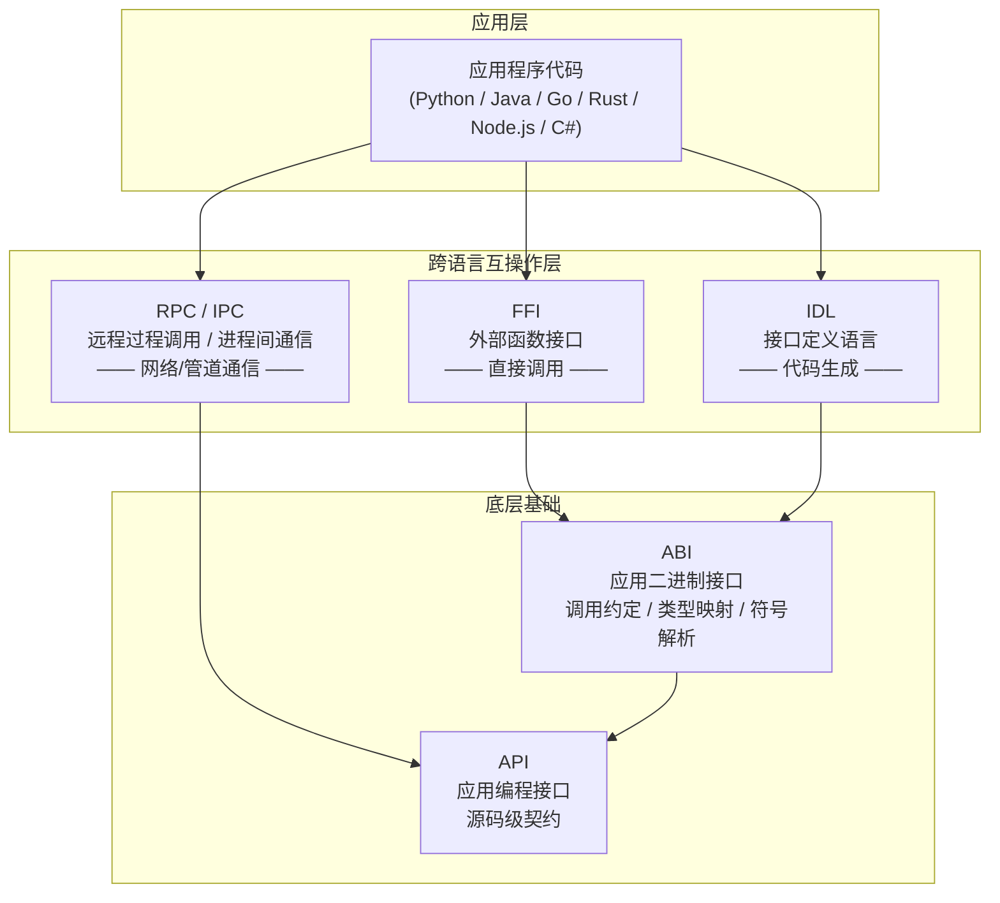

# FFI（Foreign Function Interface，外部函数接口）教程

## 教程简介

FFI（Foreign Function Interface，外部函数接口）是允许用一种编程语言编写的代码调用另一种编程语言编写的代码的机制。它是实现多语言互操作性的核心技术——当你需要在 Python 中调用高性能的 C 库、在 Rust 中集成遗留的 C++ 代码、在 Java 中访问操作系统原生 API 时，FFI 就是连接这些语言世界的桥梁。

本教程系统地介绍 FFI 的定义、工作原理、主流编程语言中的实现方式、实际应用案例、优势与局限性，以及 FFI 与 ABI/API/IDL/RPC/IPC 等相关概念的对比分析。

## FFI 在跨语言技术栈中的定位

FFI 位于 **ABI 之上**，直接操作二进制接口实现跨语言调用；IDL 通过代码生成间接使用 ABI；RPC/IPC 则通过网络或管道在进程间通信。三者解决不同场景的跨语言互操作问题。

## 章节导航

| 章节 | 标题 | 内容概要 | 文件 |
|---|---|---|---|
| 1 | FFI 定义与核心概念 | 标准定义、核心概念、发展历史、与 ABI/API 的关系 | [01-what-is-ffi.md](01-what-is-ffi.md) |
| 2 | FFI 工作原理 | 调用约定、名称修饰、数据封送、内存管理、绑定生成 | [02-working-principles.md](02-working-principles.md) |
| 3 | 不同编程语言中的 FFI 实现 | Python/Java/Go/Rust/Node.js/C# 六种主流实现 | [03-language-implementations.md](03-language-implementations.md) |
| 4 | 实际应用案例与代码示例 | 矩阵运算加速、图形库集成、压缩库调用等完整案例 | [04-use-cases.md](04-use-cases.md) |
| 5 | 优势与局限性 | 性能、安全、调试、平台依赖等多维度分析 | [05-advantages-limitations.md](05-advantages-limitations.md) |
| 6 | 相关概念对比 | FFI vs ABI/API/RPC/IPC/IDL 多维度对比与选型决策 | [06-comparison.md](06-comparison.md) |
| 7 | 术语表与参考资料 | 术语表、权威参考、分级阅读建议、项目内交叉引用 | [07-resources.md](07-resources.md) |

## 目标读者

本教程适合以下读者：

- **系统编程开发者**：需要在 C/Rust 等系统语言与高级语言之间建立互操作
- **跨语言集成工程师**：负责将不同语言编写的组件整合为统一系统
- **高性能计算开发者**：需要用 C/Fortran 库加速 Python/R 等语言的计算密集型任务
- **需要复用 C 库的开发者**：希望利用已有 C 生态中成熟的库（如 OpenSSL、FFmpeg、zlib）

**前置知识要求**：具备基础编程知识（至少熟悉一门编程语言），对 C 语言基础语法有基本了解。

## 阅读路径建议

### 线性阅读（推荐新手）

按章节顺序从 1 到 7 完整阅读，建立从概念到实践的完整知识体系：

1. 先理解 **FFI 是什么**（第 1 章）
2. 再深入 **FFI 如何工作**（第 2 章）
3. 然后了解 **各语言如何实现**（第 3 章）
4. 通过 **实战案例** 巩固理解（第 4 章）
5. 评估 **适用性与风险**（第 5 章）
6. 辨析 **与相关概念的区别**（第 6 章）
7. 利用 **参考资料** 继续深入学习（第 7 章）

### 按需查阅（推荐有经验者）

- 想了解某语言的具体 FFI 方案 → 直接跳转 [第 3 章](03-language-implementations.md)
- 想评估 FFI 是否适合当前项目 → 阅读 [第 5 章](05-advantages-limitations.md) 和 [第 6 章](06-comparison.md)
- 想查找术语定义 → 查阅 [第 7 章术语表](07-resources.md)

## 延伸阅读

本教程与项目内其他 wiki 教程形成三阶段递进知识体系：

- [interface-api-abi-protocol-wiki](../interface-api-abi-protocol-wiki/00-overview.md) — 接口/API/ABI/协议四概念基础，建议在阅读 FFI 教程前先建立 ABI 与 API 的基础认知
- [idl-wiki](../idl-wiki/00-overview.md) — IDL（接口定义语言）教程，FFI 手动绑定与 IDL 代码生成是跨语言互操作的两种互补路径

---

> **开始阅读**：[第 1 章 — FFI 定义与核心概念 →](01-what-is-ffi.md)