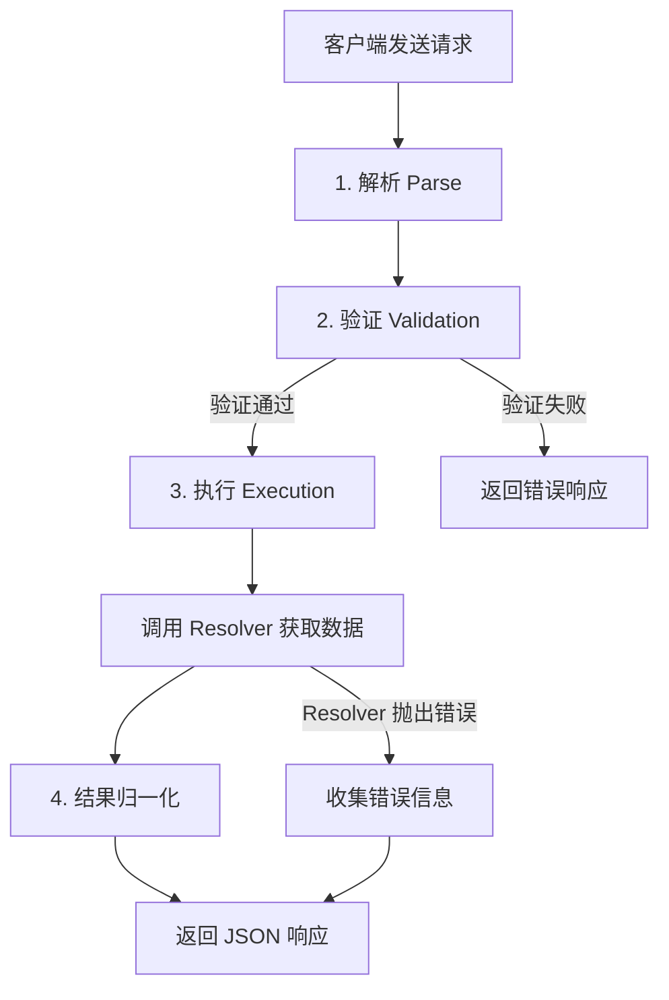
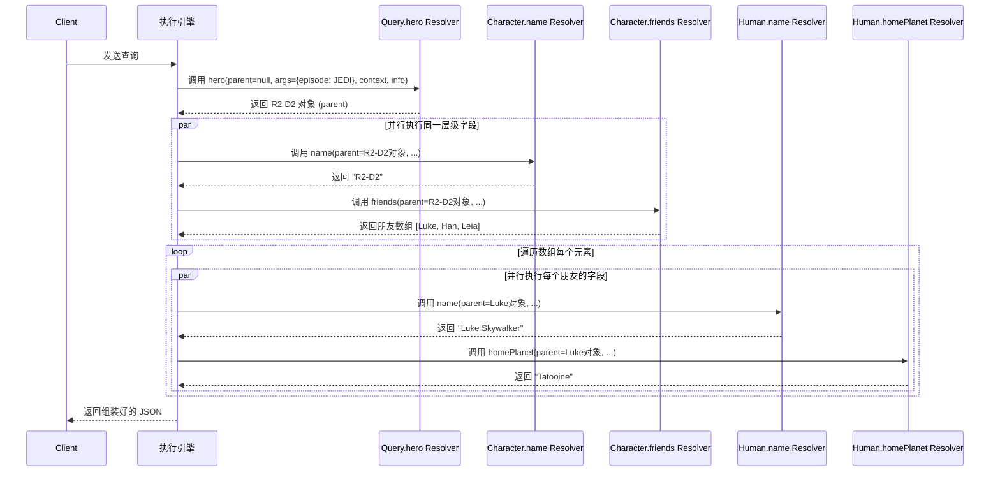

# 第 4 章：GraphQL 验证与执行

本章将深入讲解 GraphQL 查询从接收到响应的完整生命周期，包括验证阶段的各项检查、解析器（Resolver）的工作原理、执行策略、响应格式以及错误处理机制。理解执行流程是掌握 GraphQL 服务端开发的关键。

## GraphQL 执行流程概述

GraphQL 服务端接收到查询请求后，会经历一系列标准化阶段，最终生成响应。理解这一流程有助于调试问题和优化性能。

### 从请求到响应的完整过程

一个 GraphQL 请求的生命周期包含以下阶段：



各阶段的具体职责：

1. **解析（Parse）**：将 GraphQL 查询字符串解析为抽象语法树（Abstract Syntax Tree，AST，一种树形数据结构，表示源代码的语法结构）
2. **验证（Validation）**：根据 Schema 对 AST 进行语义检查，确保查询合法
3. **执行（Execution）**：从根类型开始，按字段逐层调用 Resolver 获取数据
4. **结果归一化**：将 Resolver 返回的数据组装成与查询结构一致的 JSON
5. **响应返回**：将数据和错误信息打包返回给客户端

---

## 查询验证（Validation）

**验证（Validation）**是 GraphQL 在执行查询前进行的一系列静态检查，确保查询符合 Schema 定义和语法规则。验证发生在执行之前，所有无效查询都会被拒绝，不会进入执行阶段，这有效避免了运行时错误。

### 为什么需要验证

- **提前发现错误**：错误在执行前就能被捕获，避免无效的数据库查询或业务逻辑执行
- **类型安全保证**：确保查询中的字段、参数、类型都与 Schema 一致
- **性能保护**：拒绝结构不良的查询，防止恶意或错误的查询拖垮服务

### 核心验证规则

GraphQL 规范定义了一套标准验证规则，所有符合规范的实现都必须执行这些检查：

#### 1. 字段存在性检查

验证查询中请求的字段在对应类型上是否存在。

**错误示例**：查询不存在的字段 `gender`：

```graphql
{
  human(id: "1000") {
    name
    gender  # Human 类型上没有 gender 字段
  }
}
```

**验证错误信息**：
```
Cannot query field "gender" on type "Human". Did you mean "name" or "height"?
```

#### 2. 类型检查

验证字段的返回值类型是否与查询中嵌套选择的类型匹配。只有对象类型（Object Type）、接口类型（Interface Type）和联合类型（Union Type）才能有子字段选择集。

**错误示例**：在标量字段上选择子字段：

```graphql
{
  human(id: "1000") {
    name {
      first  # String 是标量类型，不能有子字段
    }
  }
}
```

**验证错误信息**：
```
Field "name" must not have a selection since type "String!" has no subfields.
```

#### 3. 参数类型检查

验证字段参数的类型是否正确，必填参数是否提供，以及参数值是否在枚举范围内。

**错误示例**：向需要 `ID!`（非空 ID）的参数传递整数：

```graphql
{
  human(id: 1000) {  # id 参数类型是 ID!，应该用字符串 "1000"
    name
  }
}
```

**验证错误信息**：
```
Expected value of type "ID!", found 1000.
```

**错误示例**：缺少必填参数：

```graphql
{
  human {  # 缺少必填的 id 参数
    name
  }
}
```

**验证错误信息**：
```
Field "human" argument "id" of type "ID!" is required, but it was not provided.
```

#### 4. 片段有效性检查

验证片段（Fragment）定义的正确性，包括：
- 片段应用的类型是否存在
- 片段内选择的字段是否在目标类型上存在
- 片段不能形成循环引用
- 内联片段（`... on Type`）的类型必须与父字段的类型兼容（是其实现类型或成员类型）

**错误示例**：片段应用到不存在的类型：

```graphql
{
  hero {
    ...wookieFields  # Wookie 类型不存在
  }
}

fragment wookieFields on Wookie {
  name
  furColor
}
```

**验证错误信息**：
```
Unknown type "Wookie".
```

#### 5. 变量类型检查

验证变量声明与使用是否匹配，包括：
- 变量类型必须与参数类型兼容
- 所有使用的变量必须在操作头部声明
- 必填变量必须在变量字典中提供值

**错误示例**：变量类型不匹配：

```graphql
query Hero($episode: Int!) {  # 参数期望 Episode 枚举类型
  hero(episode: $episode) {
    name
  }
}
```

**验证错误信息**：
```
Variable "$episode" of type "Int!" used in position expecting type "Episode".
```

#### 6. 其他常见验证规则

- **指令验证**：指令只能用在允许的位置，指令参数必须正确
- **操作名称唯一性**：同一文档中的多个操作不能重名
- **参数唯一性**：同一字段上不能重复传递同名参数
- **值合法性**：枚举值必须在定义范围内，标量值格式正确

> **注意**：验证阶段不检查用户权限、数据存在性等业务逻辑问题，这些属于执行阶段的职责。

---

## 解析器（Resolver）的工作原理

**解析器（Resolver）**是 GraphQL 服务端负责获取单个字段数据的函数，是 GraphQL 执行引擎与实际数据源之间的桥梁。每个字段在 Schema 中都对应一个 Resolver 函数，当查询需要该字段时，执行引擎就会调用对应的 Resolver。

### Resolver 的核心地位

GraphQL 并不知道你的数据存储在哪里——是数据库、微服务、REST API 还是静态文件，所有的数据获取逻辑都由 Resolver 负责。Resolver 是 GraphQL 服务端最核心的业务逻辑载体。

### Resolver 函数签名

每个 Resolver 都是一个接收特定参数并返回字段值的函数。虽然不同编程语言的实现语法略有差异，但所有 GraphQL 实现的 Resolver 都遵循相同的四参数签名模式：

```
resolverFunction(parent, args, context, info) -> 字段值
```

### Resolver 四个参数详解

| 参数 | 名称 | 作用 |
|---|---|---|
| 1 | **parent / root** | 父字段解析返回的结果对象，当前字段是其父对象的一个属性 |
| 2 | **args** | 字段的参数对象，包含查询中传递给该字段的所有参数（键值对形式） |
| 3 | **context** | 上下文对象，在所有 Resolver 之间共享，用于存放请求级信息（如当前用户、数据库连接、数据源实例等） |
| 4 | **info** | 执行信息对象，包含字段的 Schema 定义、AST 节点、根值、操作名称等执行元信息 |

#### 参数 1：parent（父对象）

- 在根字段（Query/Mutation/Subscription 的直接子字段）上，parent 通常是 `undefined` 或配置的根值
- 在嵌套字段上，parent 是父字段 Resolver 返回的结果
- 通过 parent 参数，子字段可以访问父对象的数据

#### 参数 2：args（参数）

- 包含查询中传递给该字段的所有参数
- 如果查询中没有传递参数，args 是空对象 `{}`
- 参数已经过类型转换和验证，枚举值会转换为对应的内部表示

#### 参数 3：context（上下文）

- 在整个请求执行周期内，同一个 context 对象会传递给所有 Resolver
- 典型用途：存放数据库连接、当前登录用户信息、数据源实例、请求追踪 ID 等
- 每次请求应该创建新的 context 实例，避免请求间数据污染

#### 参数 4：info（执行信息）

- 包含当前字段的 Schema 类型信息、路径、AST 节点
- 高级用法：动态构建子查询、实现字段级权限、性能监控
- 大多数简单场景不需要使用 info 参数

### 默认 Resolver

如果某个字段没有显式定义 Resolver，GraphQL 会使用默认 Resolver：
1. 检查 parent 对象上是否存在与字段同名的属性
2. 如果存在且是函数，调用该函数
3. 如果存在且不是函数，直接返回该属性值
4. 如果不存在，返回 `undefined`

这就是为什么很多时候你只需要为根字段和需要特殊处理的字段编写 Resolver。

---

## 执行策略

### 广度优先执行（Breadth-First Execution）

**广度优先执行（Breadth-First Execution）**是 GraphQL 默认的字段执行策略：同一层级的字段并行执行，完成后再执行下一层级的字段。这种策略确保了 Resolver 链的有序执行，同时最大化并行效率。

### Resolver 链与执行顺序

以一个嵌套查询为例：

```graphql
{
  hero(episode: JEDI) {
    name
    friends {
      name
      homePlanet
    }
  }
}
```

执行顺序如下：



### Mutation 的顺序执行

与 Query 不同，Mutation 的根字段是**按书写顺序串行执行**的，而不是并行执行。这确保了多个写操作按预期顺序执行，避免竞态条件。

例如：

```graphql
mutation {
  createReview(...) { ... }  # 先执行
  updateHero(...) { ... }    # 等 createReview 完成后再执行
  deleteReview(...) { ... }  # 等 updateHero 完成后再执行
}
```

> **注意**：Mutation 根字段的子字段仍然是并行执行的，只有根层级的字段按顺序执行。

---

## 响应格式

GraphQL 响应始终是一个 JSON 对象，遵循标准化格式。无论查询成功还是部分失败，响应结构保持一致。

### 标准响应结构

```json
{
  "data": { ... },
  "errors": [ ... ]
}
```

- **`data` 字段**：包含查询请求的数据结果，结构与查询的选择集完全对应
- **`errors` 字段**（可选）：包含执行过程中发生的错误列表，仅在有错误时出现

### 完全成功响应

当所有字段都成功解析时，响应只包含 `data` 字段：

```json
{
  "data": {
    "hero": {
      "name": "R2-D2",
      "friends": [
        { "name": "Luke Skywalker" },
        { "name": "Han Solo" }
      ]
    }
  }
}
```

### 部分失败处理

GraphQL 的一个重要特性是支持**部分失败**：如果某个字段的 Resolver 抛出错误，它不会影响其他字段的执行，错误字段在 `data` 中返回 `null`，错误信息添加到 `errors` 数组中。

例如，查询三个字段，其中一个出错：

```graphql
{
  hero(episode: JEDI) {
    name
    secretBackstory  # 这个字段的 Resolver 抛出错误
    friends {
      name
    }
  }
}
```

**响应示例**：

```json
{
  "data": {
    "hero": {
      "name": "R2-D2",
      "secretBackstory": null,
      "friends": [
        { "name": "Luke Skywalker" },
        { "name": "Han Solo" }
      ]
    }
  },
  "errors": [
    {
      "message": "You are not authorized to view secret backstory",
      "locations": [{ "line": 4, "column": 5 }],
      "path": ["hero", "secretBackstory"]
    }
  ]
}
```

可以看到：
- `name` 和 `friends` 字段正常返回数据
- `secretBackstory` 字段为 `null`
- 错误信息在 `errors` 数组中，明确指出错误位置和路径
- 其他字段的执行不受影响

---

## 错误处理

GraphQL 错误对象遵循标准化结构，包含足够的信息帮助客户端定位和处理错误。

### 错误对象结构

每个错误对象包含以下字段：

| 字段 | 类型 | 必填 | 描述 |
|---|---|---|---|
| `message` | String | ✅ 是 | 错误的人类可读描述信息 |
| `locations` | Array | ❌ 否 | 错误在查询文档中的位置（行号和列号），仅验证错误和解析错误提供 |
| `path` | Array | ❌ 否 | 错误字段在响应数据中的路径，用于定位哪个字段出错 |
| `extensions` | Object | ❌ 否 | 扩展信息对象，可用于存放错误码、异常分类、调试信息等自定义元数据 |

#### locations 字段

`locations` 数组中的每个元素包含 `line` 和 `column`，从 1 开始计数：

```json
"locations": [{ "line": 4, "column": 5 }]
```

这表示错误发生在查询文档的第 4 行第 5 列。

#### path 字段

`path` 数组表示从响应根到出错字段的路径，包含字段名（字符串）和数组索引（数字）：

```json
"path": ["hero", "friends", 1, "name"]
```

这表示错误发生在 `data.hero.friends[1].name`（第二个朋友的 name 字段）。

#### extensions 字段

`extensions` 是开放字段，服务端可以自定义添加任何额外信息，推荐的用法包括：

```json
"extensions": {
  "code": "UNAUTHORIZED",
  "exception": { ... },
  "timestamp": "2026-08-05T10:30:00Z",
  "requestId": "abc-123-def"
}
```

常见自定义扩展：
- `code`：机器可读的错误码（如 `UNAUTHORIZED`、`NOT_FOUND`、`VALIDATION_FAILED`）
- `exception`：原始异常堆栈（仅开发环境）
- `classification`：错误分类（如 `validation`、`execution`、`persisted_query`）

### 错误类型

GraphQL 中的错误可以分为三类：

1. **语法错误（Syntax Error）**：查询字符串不符合 GraphQL 语法，解析阶段失败
2. **验证错误（Validation Error）**：查询通过解析但不符合 Schema，验证阶段失败
3. **执行错误（Execution Error）**：查询合法但在 Resolver 执行过程中发生的错误（如权限不足、数据库连接失败、数据不存在）

语法错误和验证错误会导致整个查询被拒绝，没有 `data` 字段；执行错误是字段级的，支持部分失败。

---

## Introspection（内省查询）

**内省（Introspection）**是 GraphQL 内置的强大能力，允许客户端通过查询来获取 Schema 本身的信息。内省系统是 GraphQL 工具生态（如 GraphiQL、Playground、Apollo DevTools、代码生成器）的基础。

### 内省系统的工作原理

GraphQL Schema 本身也是用 GraphQL 类型系统描述的，存在一组特殊的内省类型和元字段（以双下划线 `__` 开头），可以像查询普通数据一样查询 Schema 元信息。

### 常用内省元字段

| 元字段 | 类型 | 描述 |
|---|---|---|
| `__schema` | `__Schema` | 查询 Schema 的根入口，包含所有类型、指令等信息 |
| `__type(name: String!)` | `__Type` | 查询指定名称的类型的详细信息 |
| `__typename` | `String!` | 获取当前对象的类型名称（可用于任何对象） |

### 内省查询示例

#### 示例 1：查询 Schema 中所有类型名称

查询当前 Schema 定义了哪些类型：

```graphql
{
  __schema {
    types {
      name
      kind
      description
    }
  }
}
```

**返回示例（部分）**：

```json
{
  "data": {
    "__schema": {
      "types": [
        { "name": "Query", "kind": "OBJECT", "description": "The root query type" },
        { "name": "Human", "kind": "OBJECT", "description": "A human character in Star Wars" },
        { "name": "Droid", "kind": "OBJECT", "description": "A mechanical droid character" },
        { "name": "Character", "kind": "INTERFACE", "description": "A character in Star Wars" },
        { "name": "Episode", "kind": "ENUM", "description": "One of the Star Wars films" },
        { "name": "String", "kind": "SCALAR", "description": "The String scalar type" },
        { "name": "Int", "kind": "SCALAR", "description": "The Int scalar type" },
        { "__typename": "__Type" }
      ]
    }
  }
}
```

`kind` 字段表示类型种类：`SCALAR`、`OBJECT`、`INTERFACE`、`UNION`、`ENUM`、`INPUT_OBJECT`、`LIST`、`NON_NULL`。

#### 示例 2：查询特定类型的详细信息

查询 `Human` 类型有哪些字段：

```graphql
{
  __type(name: "Human") {
    name
    kind
    description
    fields {
      name
      description
      type {
        name
        kind
        ofType {
          name
          kind
        }
      }
      args {
        name
        type {
          name
          kind
        }
        defaultValue
      }
    }
  }
}
```

**返回示例（部分）**：

```json
{
  "data": {
    "__type": {
      "name": "Human",
      "kind": "OBJECT",
      "description": "A human character in Star Wars",
      "fields": [
        {
          "name": "id",
          "description": "The ID of the human",
          "type": { "name": null, "kind": "NON_NULL", "ofType": { "name": "ID", "kind": "SCALAR" } },
          "args": []
        },
        {
          "name": "name",
          "description": null,
          "type": { "name": null, "kind": "NON_NULL", "ofType": { "name": "String", "kind": "SCALAR" } },
          "args": []
        },
        {
          "name": "height",
          "description": "Height in the specified unit",
          "type": { "name": "Float", "kind": "SCALAR", "ofType": null },
          "args": [
            {
              "name": "unit",
              "type": { "name": "LengthUnit", "kind": "ENUM", "ofType": null },
              "defaultValue": "METER"
            }
          ]
        }
      ]
    }
  }
}
```

注意 `ofType` 字段用于表示包装类型（LIST、NON_NULL）的内部类型，形成链式结构。

#### 示例 3：查询 Query 根类型的所有可用查询

查看 API 支持哪些查询操作：

```graphql
{
  __schema {
    queryType {
      name
      fields {
        name
        description
        args {
          name
          type {
            name
            kind
          }
        }
        type {
          name
          kind
        }
      }
    }
  }
}
```

#### 示例 4：查询指令信息

```graphql
{
  __schema {
    directives {
      name
      description
      locations
      args {
        name
        type {
          name
          kind
        }
      }
    }
  }
}
```

### 内省查询的使用场景

- **IDE 自动补全**：GraphiQL、Playground 等工具通过内省获取 Schema，提供字段自动补全和文档提示
- **代码生成**：根据 Schema 自动生成客户端 TypeScript 类型、服务端类型定义
- **Schema 文档**：自动生成 API 文档
- **客户端缓存归一化**：Apollo Client 等使用 `__typename` 进行缓存归一化

> **生产环境注意**：某些团队选择在生产环境禁用内省查询作为安全措施，防止 Schema 泄露。但这会导致工具链无法工作，需要权衡利弊。如果禁用，应通过其他方式（如 Schema 导出文件）提供给受信任的客户端。

---

## Resolver 概念性示例

下面用通用伪代码展示 Resolver 的概念模型，不绑定具体编程语言。

### 基础 Resolver 示例

以 Star Wars Schema 为例，展示几个典型字段的 Resolver：

```伪代码
// 数据存储（可以是数据库、API、内存等）
const humans = {
  "1000": { id: "1000", name: "Luke Skywalker", homePlanet: "Tatooine", height: 1.72, friendIds: ["1002", "2000", "2001"] },
  "1002": { id: "1002", name: "Han Solo", homePlanet: "Corellia", height: 1.8, friendIds: ["1000", "1003", "2001"] },
  "1003": { id: "1003", name: "Leia Organa", homePlanet: "Alderaan", height: 1.5, friendIds: ["1000", "1002", "2000"] }
};

const droids = {
  "2000": { id: "2000", name: "C-3PO", primaryFunction: "Protocol", friendIds: ["1000", "1002", "1003", "2001"] },
  "2001": { id: "2001", name: "R2-D2", primaryFunction: "Astromech", friendIds: ["1000", "1002", "2000"] }
};

// Query.hero Resolver：根据 episode 返回对应英雄
function heroResolver(parent, args, context, info) {
  // args.episode 是枚举值
  if (args.episode === "EMPIRE") {
    return humans["1000"];  // Luke
  } else if (args.episode === "JEDI") {
    return droids["2001"];  // R2-D2
  } else {
    return humans["1000"];  // 默认
  }
}

// Query.human Resolver：根据 ID 获取人类角色
function humanResolver(parent, args, context, info) {
  // args.id 是非空 ID 参数
  const human = humans[args.id];
  if (!human) {
    throw new Error(`Human with id ${args.id} not found`);
  }
  return human;
}

// Character.friends Resolver：获取朋友列表
// 注意：parent 是上一步返回的角色对象
function friendsResolver(parent, args, context, info) {
  // parent.friendIds 存储的是朋友的 ID 列表
  const friendIds = parent.friendIds || [];
  
  // 根据 ID 查找所有朋友（可能在 humans 或 droids 中）
  const friends = friendIds.map(id => {
    if (humans[id]) return humans[id];
    if (droids[id]) return droids[id];
    return null;
  }).filter(friend => friend !== null);
  
  // 支持 first 参数限制数量
  if (args.first) {
    return friends.slice(0, args.first);
  }
  
  return friends;
}

// Human.height Resolver：处理单位转换
function heightResolver(parent, args, context, info) {
  // parent.height 存储的是米
  const heightInMeters = parent.height;
  
  // 根据 unit 参数转换
  const unit = args.unit || "METER";
  
  if (unit === "FOOT") {
    return heightInMeters * 3.28084;
  } else {
    return heightInMeters;
  }
}

// Mutation.createReview Resolver：创建评论（写入操作）
function createReviewResolver(parent, args, context, info) {
  // 从 context 获取当前用户（在 middleware 中设置）
  const currentUser = context.currentUser;
  if (!currentUser) {
    throw new Error("Authentication required");
  }
  
  const { episode, review } = args;
  
  // 创建新评论对象
  const newReview = {
    id: generateNewId(),
    episode: episode,
    stars: review.stars,
    commentary: review.commentary,
    createdAt: new Date(),
    authorId: currentUser.id
  };
  
  // 保存到数据库
  saveReviewToDatabase(newReview);
  
  // 返回新创建的评论
  return newReview;
}
```

### Resolver 链工作示例

当执行以下查询时：

```graphql
{
  human(id: "1000") {
    name
    height(unit: FOOT)
    friends(first: 2) {
      name
    }
  }
}
```

Resolver 调用流程（概念）：

1. 调用 `humanResolver(parent=null, args={id: "1000"}, ...)` → 返回 Luke 对象 `{ id: "1000", name: "Luke Skywalker", ... }`
2. Luke 对象作为 parent，并行执行其字段 Resolver：
   - `name` 没有自定义 Resolver，默认 Resolver 直接读取 `parent.name` → 返回 `"Luke Skywalker"`
   - 调用 `heightResolver(parent=Luke, args={unit: "FOOT"}, ...)` → 转换单位后返回 `5.64`
   - 调用 `friendsResolver(parent=Luke, args={first: 2}, ...)` → 返回前两个朋友数组 `[Han对象, Leia对象]`
3. 对 friends 数组中的每个朋友对象，并行执行其 `name` 字段：
   - Han：默认 Resolver 读取 `parent.name` → `"Han Solo"`
   - Leia：默认 Resolver 读取 `parent.name` → `"Leia Organa"`
4. 组装所有结果，返回最终 JSON

---

## 本章核心概念总结

| 概念 | 一句话解释 |
|---|---|
| 验证（Validation） | 执行前根据 Schema 对查询进行静态检查，确保字段、参数、类型都合法 |
| 解析器（Resolver） | 负责获取单个字段数据的函数，是 GraphQL 与数据源之间的桥梁 |
| parent 参数 | 父字段 Resolver 返回的结果对象，子字段通过它访问父对象数据 |
| context 参数 | 请求级共享上下文，存放当前用户、数据库连接等跨 Resolver 信息 |
| 广度优先执行 | 同层字段并行执行，完成后再执行下一层，是 Query 的默认策略 |
| 部分失败 | 单个字段错误不影响其他字段，错误字段为 null，错误信息在 errors 数组 |
| 错误 path | 错误对象中的路径数组，精确定位哪个字段出错 |
| 内省（Introspection） | 通过查询特殊 `__` 开头的元字段获取 Schema 自身信息的能力 |
| __schema | 内省查询根入口，可获取所有类型、指令、根类型信息 |
| __type(name) | 查询指定名称的类型的详细信息 |
| __typename | 元字段，获取当前对象的类型名称，用于缓存和类型判断 |

---

**上一章**：[GraphQL Schema 与类型系统 ←](03-schema-types.md)

**下一章**：[GraphQL 客户端基础 →](05-client-basics.md)
