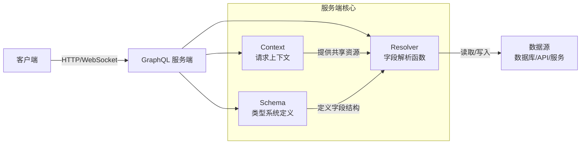
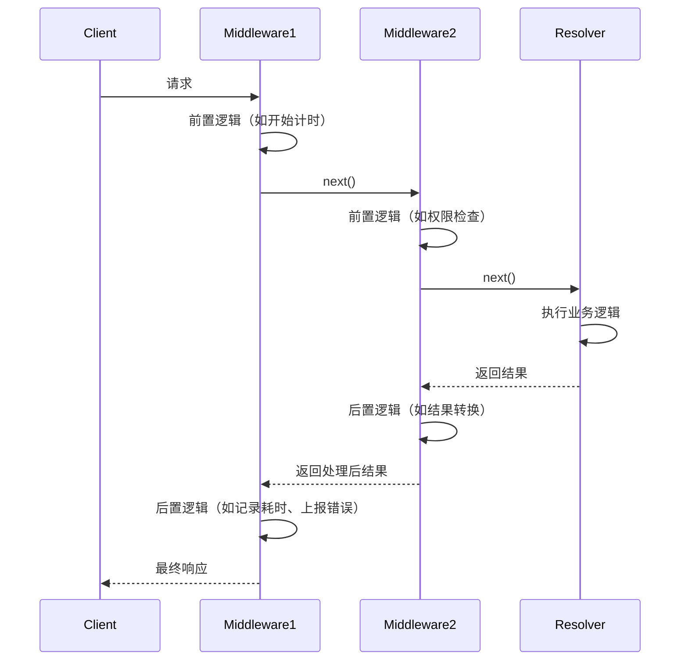

# 第 6 章：GraphQL 服务端核心概念

本章将介绍 GraphQL 服务端开发的基础知识，包括服务端的三大核心组成部分、两种 Schema 开发模式、上下文与解析器的设计、错误处理策略、中间件机制、HTTP 协议集成，以及生产环境部署需要考虑的安全因素。掌握这些概念是构建健壮、可扩展 GraphQL 服务的基础。

## GraphQL 服务端架构概述

GraphQL 服务端是接收并处理客户端 GraphQL 请求的后端程序，其核心职责是验证查询、解析字段、获取数据并返回结果。

### 三大核心组成

一个典型的 GraphQL 服务由以下三个核心部分构成：



**Schema（模式）**：使用 GraphQL SDL（Schema Definition Language，模式定义语言）定义的类型系统，描述了 API 提供的所有类型、字段、参数、查询和变更操作。Schema 是客户端与服务端之间的契约。

**Resolver（解析器）**：为 Schema 中每个字段提供数据的函数。当客户端查询某个字段时，GraphQL 执行引擎会调用对应的 Resolver 函数获取该字段的值。Resolver 是 GraphQL 服务端最核心的业务逻辑载体。

**Context（上下文）**：在单次请求生命周期内、跨所有 Resolver 共享的对象，用于传递请求相关的信息和共享资源，如数据库连接、认证用户信息、数据源实例等。

### 请求执行流程

当一个 GraphQL 请求到达服务端时，通常经历以下步骤：

1. **解析（Parse）**：将查询字符串解析为抽象语法树（AST，Abstract Syntax Tree）
2. **验证（Validate）**：根据 Schema 验证查询的语法和语义正确性（如字段是否存在、参数类型是否正确等）
3. **上下文构建**：为本次请求创建 Context 对象，注入认证信息、数据库连接等
4. **执行（Execute）**：从根操作（Query/Mutation/Subscription）开始，按照查询结构递归调用 Resolver 解析每个字段
5. **结果组装**：将 Resolver 返回的数据按照查询结构组装成响应格式
6. **返回响应**：将包含 `data` 和/或 `errors` 的 JSON 响应返回给客户端

---

## 两种 Schema 开发模式

构建 GraphQL Schema 有两种主流的开发范式：Schema First（模式优先）和 Code First（代码优先），各有其适用场景和优缺点。

### Schema First（模式优先）

**Schema First**（也称为 SDL First）是最直观的开发模式：先使用 GraphQL SDL 编写完整的 Schema 定义，再为每个字段编写对应的 Resolver 实现。

**开发流程**：

1. 用 `.graphql` 文件或模板字符串编写完整的类型定义（type、input、enum、interface、union 等）
2. 定义根类型 Query、Mutation、Subscription
3. 为每个字段编写对应的 Resolver 函数，Resolver 映射到 Schema 中的字段路径
4. 将 Schema 和 Resolvers 组合在一起构建可执行的 Schema

**示例（伪代码）**：

```graphql
# 1. 先写 Schema (schema.graphql)
type User {
  id: ID!
  name: String!
  email: String!
  posts: [Post!]!
}

type Post {
  id: ID!
  title: String!
  author: User!
}

type Query {
  user(id: ID!): User
  posts: [Post!]!
}

type Mutation {
  createUser(name: String!, email: String!): User!
}
```

```javascript
// 2. 再写 Resolvers
const resolvers = {
  Query: {
    user: (parent, args, context, info) => {
      return context.db.users.findById(args.id);
    },
    posts: (parent, args, context, info) => {
      return context.db.posts.findAll();
    }
  },
  Mutation: {
    createUser: (parent, args, context, info) => {
      return context.db.users.create({
        name: args.name,
        email: args.email
      });
    }
  },
  User: {
    posts: (parent, args, context, info) => {
      // parent 是上一层解析出的 User 对象
      return context.db.posts.findByAuthorId(parent.id);
    }
  },
  Post: {
    author: (parent, args, context, info) => {
      return context.db.users.findById(parent.authorId);
    }
  }
};

// 3. 组合成可执行 Schema
const schema = makeExecutableSchema({
  typeDefs: fs.readFileSync('schema.graphql', 'utf-8'),
  resolvers: resolvers
});
```

**优点**：

- Schema 即文档，SDL 可读性强，前后端可以围绕 Schema 并行开发
- Schema 与业务逻辑分离，结构清晰
- 适合 API 设计先行（Design First）的开发流程，团队可以先讨论确定 Schema 再实现
- 生态工具支持完善，Schema 文件可以被各种工具直接使用（如代码生成、文档生成、Mock 等）

**缺点**：

- Schema 定义与 Resolver 实现分离在两个地方，需要维护对应关系，字段多时代码跳转不便
- 类型定义需要重复：SDL 中写一遍类型，代码中（特别是 TypeScript）可能需要再写一遍类型
- 重构时需要同时修改 SDL 和 Resolver，容易不同步

**代表框架/库**：Apollo Server、GraphQL.js（原始 reference implementation）、graphql-tools、gqlgen（Go）。

### Code First（代码优先）

**Code First**（也称为 Resolver First 或 Code-first Schema）通过编程语言的类型系统和装饰器（Decorator）/类定义来定义 Schema，运行时自动从代码生成 SDL。

**开发流程**：

1. 使用编程语言的类、类型注解、装饰器定义类型和字段
2. 在类方法上使用装饰器标记 Query、Mutation、Resolver 等
3. 框架在启动时自动从代码生成完整的 GraphQL Schema
4. 不需要单独编写 SDL 文件

**示例（TypeScript + TypeGraphQL 风格伪代码）**：

```typescript
// 直接用类和装饰器定义，无需单独写 SDL
@ObjectType()
class User {
  @Field(type => ID)
  id: string;

  @Field()
  name: string;

  @Field()
  email: string;

  @Field(type => [Post])
  async posts(@Ctx() context: Context) {
    return context.db.posts.findByAuthorId(this.id);
  }
}

@ObjectType()
class Post {
  @Field(type => ID)
  id: string;

  @Field()
  title: string;

  @Field(type => User)
  async author(@Ctx() context: Context) {
    return context.db.users.findById(this.authorId);
  }
}

@Resolver()
class UserResolver {
  @Query(returns => User, { nullable: true })
  async user(@Arg('id') id: string, @Ctx() context: Context) {
    return context.db.users.findById(id);
  }

  @Query(returns => [Post])
  async posts(@Ctx() context: Context) {
    return context.db.posts.findAll();
  }

  @Mutation(returns => User)
  async createUser(
    @Arg('name') name: string,
    @Arg('email') email: string,
    @Ctx() context: Context
  ) {
    return context.db.users.create({ name, email });
  }
}

// 自动从代码生成 Schema
const schema = await buildSchema({
  resolvers: [UserResolver]
});
```

**优点**：

- 单一数据源（Single Source of Truth）：Schema 定义与 Resolver 实现在同一处，无需维护对应关系
- 类型安全：在 TypeScript 等强类型语言中，可以充分利用类型系统，编译时发现错误
- 重构友好：IDE 可以自动重命名、跳转、查找引用，重构更安全
- 减少重复：不需要在 SDL 和代码中重复定义类型

**缺点**：

- Schema 隐藏在代码中，不如独立的 SDL 文件直观可见，需要运行才能看到最终 SDL
- 装饰器语法有一定学习成本，不同框架的装饰器 API 不同
- 不太适合纯 API 设计先行的工作流，因为需要写代码才能看到 Schema
- 某些复杂的 Schema 特性（如 directive）在 Code First 中表达可能不够直观

**代表框架/库**：TypeGraphQL（TypeScript）、Nexus（TypeScript）、GraphQL Nexus、Strawberry（Python）、GraphQL Spring Boot（Java/Kotlin，通过注解）、Sangria（Scala）。

### 如何选择

| 维度 | Schema First | Code First |
|---|---|---|
| **Schema 可见性** | 高，SDL 文件直接可读 | 低，需运行生成 |
| **类型安全** | 需要额外工具生成类型 | 原生利用语言类型系统 |
| **学习曲线** | 平缓，SDL 语法简单 | 较陡，需学习装饰器 API |
| **重构体验** | 一般，需同步修改两处 | 好，IDE 支持完善 |
| **API 设计先行** | 非常适合 | 不太适合 |
| **团队协作** | Schema 作为契约清晰 | 代码即契约 |

**建议**：
- 小团队、快速原型、前后端协作需要明确 Schema 契约：选择 **Schema First**
- TypeScript/强类型语言项目、追求类型安全、重构频繁：选择 **Code First**
- 团队中有非技术人员参与 API 设计：Schema First 的 SDL 更容易理解
- 个人项目、代码即文档：Code First 开发效率更高

两种模式没有绝对的优劣，选择符合团队技术栈和工作流的方式即可。

---

## Context（上下文）的作用

**Context** 是 GraphQL 服务端中一个非常重要的概念：它是在单次请求开始时创建、在该请求所有 Resolver 之间共享的对象，用于传递跨 Resolver 需要的公共信息和资源。

### Context 中通常包含什么

Context 是一个普通对象，可以放入任何需要在 Resolver 中共享的内容，常见的有：

| 内容 | 说明 |
|---|---|
| **请求对象** | 原始的 HTTP 请求对象（req），包含请求头、Cookie 等 |
| **响应对象** | HTTP 响应对象（res），用于设置 Cookie、响应头等 |
| **认证用户** | 解析后的当前登录用户信息（如 user 对象，未登录则为 null） |
| **数据库连接** | ORM 实例（如 Prisma、TypeORM、Drizzle）、数据库连接池 |
| **数据加载器** | DataLoader 实例（用于解决 N+1 问题，见后文） |
| **服务/数据源实例** | 调用其他微服务、第三方 API 的客户端实例 |
| **配置信息** | 环境变量、业务配置等 |
| **日志记录器** | Logger 实例，用于记录请求级别的日志 |
| **请求 ID** | 用于链路追踪的唯一请求 ID |

### Context 的创建时机

Context 是**每个请求单独创建**的，而不是全局单例。这一点非常重要：

- 每个 HTTP 请求到达时，创建一个新的 Context 对象
- 请求处理完成后，Context 被丢弃
- 不同请求的 Context 完全隔离，不会互相污染

**为什么必须请求级创建？**

1. **用户隔离**：不同请求的认证用户不同，如果 Context 是全局的，会导致用户信息串号
2. **请求状态**：每个请求有自己的请求头、Cookie 等信息
3. **DataLoader 缓存**：DataLoader 的缓存是请求级的，跨请求缓存会导致数据不一致

**伪代码示例**：

```javascript
// Context 创建函数，每个请求调用一次
const context = async ({ req, res }) => {
  // 1. 从请求头解析认证 Token
  const token = req.headers.authorization?.replace('Bearer ', '');
  
  // 2. 验证 Token，获取当前用户
  let currentUser = null;
  if (token) {
    try {
      currentUser = await verifyTokenAndGetUser(token);
    } catch (e) {
      // Token 无效，用户未登录
    }
  }

  // 3. 返回 Context 对象，所有 Resolver 都能拿到
  return {
    req,
    res,
    currentUser,
    db: prisma,  // 数据库 ORM 实例（通常是单例，但通过 context 传递）
    logger: createRequestLogger(req.requestId),
    dataLoaders: {
      userLoader: createUserLoader(prisma),
      postLoader: createPostLoader(prisma)
    }
  };
};

// 在 Resolver 中使用 Context
const resolvers = {
  Query: {
    me: (parent, args, context, info) => {
      // 直接从 context 获取当前用户
      if (!context.currentUser) {
        throw new AuthenticationError('请先登录');
      }
      return context.currentUser;
    }
  }
};
```

### Context 使用原则

1. **只放共享资源**：不要把 Resolver 内部的临时变量放到 Context 中，Context 只放确实需要跨 Resolver 访问的内容
2. **避免循环引用**：Context 中的对象不要互相循环引用，避免内存泄漏
3. **不要过度使用**：不是所有东西都需要放 Context，只放真正全局/请求级共享的资源。如果某个资源只在一个 Resolver 中使用，不需要放 Context
4. **保持可序列化（可选）**：某些场景下（如持久化、测试）Context 需要可序列化，避免放入函数、Socket 句柄等不可序列化内容（根据实际需求）

---

## Resolver 最佳实践

**Resolver**（解析器）是 GraphQL 服务端的核心，负责为 Schema 中的每个字段获取并返回数据。理解 Resolver 的工作原理和最佳实践是编写高性能、可维护 GraphQL 服务的关键。

### Resolver 函数签名

每个 Resolver 都是一个函数，接收四个位置参数：

```javascript
fieldName: (parent, args, context, info) => {
  // 返回该字段的值
}
```

| 参数 | 名称 | 说明 |
|---|---|---|
| 1 | `parent`（也称为 `root`/`obj`/`source`） | 上一级（父）字段解析返回的结果。对于根 Query/Mutation 上的字段，parent 是初始化值（通常是 `undefined` 或 `null`） |
| 2 | `args`（arguments） | 该字段接收的参数，是一个普通对象，key 为参数名，value 为参数值 |
| 3 | `context` | 请求上下文对象，即上文介绍的 Context，所有 Resolver 共享 |
| 4 | `info` | 执行信息对象，包含字段的 Schema 定义、查询 AST、路径、缓存键等高级信息，通常用于中间件、DataLoader、性能追踪等场景，一般业务逻辑中不常使用 |

**Resolver 返回值**：Resolver 可以直接返回值，也可以返回 Promise（异步解析）。GraphQL 执行引擎会自动处理 Promise，等待其 resolve 后再继续。

### Resolver 职责单一原则

**单一职责原则（Single Responsibility Principle）** 同样适用于 Resolver 设计：每个 Resolver 函数只负责解析自己对应的字段，不要在父 Resolver 中预先获取子字段需要的数据。

**错误做法**（过度获取）：

```javascript
// ❌ 错误：在 posts 查询中获取了所有关联的 author 数据，即使客户端没要
Query: {
  posts: async (parent, args, context) => {
    // 用 JOIN 一次性查出所有帖子和作者
    return db.posts.findAll({ include: { author: true } });
  }
}
// 如果客户端只查询 posts { id title }，没有查 author，那 JOIN 查询就是浪费
```

**正确做法**（按需解析）：

```javascript
// ✅ 正确：每个 Resolver 只负责自己的字段
Query: {
  posts: async (parent, args, context) => {
    // 只查 posts，不预取 author
    return db.posts.findAll();
  }
},
Post: {
  // 只有当客户端查询了 post.author 时，这个 Resolver 才会被调用
  author: async (parent, args, context) => {
    // parent 是 posts 查出的 Post 对象，包含 authorId
    return db.users.findById(parent.authorId);
  }
}
```

这种模式的好处是：
- 客户端不查询的字段，对应的 Resolver 永远不会执行，不会浪费数据库查询
- Resolver 之间解耦，每个字段的解析逻辑独立
- 天然支持按需获取，这正是 GraphQL 的核心优势之一

### N+1 查询问题

Resolver 按需解析的模式虽然优雅，但如果不加注意，很容易遇到 GraphQL 最著名的性能问题：**N+1 问题**。

**什么是 N+1 问题？**

以查询「所有帖子及其作者」为例：

```graphql
{
  posts {
    id
    title
    author {
      name
    }
  }
}
```

执行时：
1. `Query.posts` Resolver 执行：1 次 SQL 查询获取所有 N 篇帖子
2. 对每一篇帖子，`Post.author` Resolver 分别执行，每篇 1 次 SQL 查询查询作者：N 次查询

总共执行 **1 + N 次**数据库查询，这就是 N+1 问题。如果有 100 篇帖子，就会执行 101 次数据库查询，性能极差。

**示例**：

```
1. SELECT * FROM posts;  -- 1 次查询，返回 N=100 篇帖子

2. SELECT * FROM users WHERE id = 1;  -- 第 1 篇帖子的作者
3. SELECT * FROM users WHERE id = 2;  -- 第 2 篇帖子的作者
...
101. SELECT * FROM users WHERE id = 5;  -- 第 100 篇帖子的作者（可能作者重复）
```

更糟糕的是，如果有多层嵌套字段，会变成 N+1、N+1+M... 性能指数级下降。

### DataLoader 模式简介

**DataLoader** 是由 Facebook 开发的通用工具库，用于解决 GraphQL 中的 N+1 查询问题。其核心原理是**批处理（Batching）+ 缓存（Caching）**。

#### DataLoader 工作原理

1. **批处理（Batching）**：在同一事件循环 tick（单次执行帧）内，所有对同一个 DataLoader 的 `.load()` 调用会被收集起来，合并成一次批处理请求。
2. **缓存（Caching）**：同一请求内，对同一个 key 的重复 `.load()` 调用会直接返回缓存结果，不会重复请求。

**使用 DataLoader 后的执行流程**：

```
1. Query.posts 执行：1 次查询获取 100 篇帖子
2. 100 篇帖子的 Post.author Resolver 分别调用 userLoader.load(parent.authorId)
3. DataLoader 收集到这 100 个 load(id) 调用，在事件循环末尾去重（比如 100 篇帖子只有 5 个不同作者），传给批处理函数
4. 批处理函数执行 1 次 SQL：SELECT * FROM users WHERE id IN (1, 2, 3, 4, 5);
5. DataLoader 将结果按 key 分发回各个 Resolver
```

总共 **2 次**数据库查询，而不是 101 次！

#### DataLoader 基本用法（伪代码）：

```javascript
const { DataLoader } = require('dataloader');

// 1. 创建批处理函数：接收 keys 数组，返回对应顺序的结果数组
const batchGetUsers = async (userIds) => {
  // userIds 是收集到的所有需要查询的 id 数组，如 [1, 2, 3, 4, 5]
  const users = await db.users.findAll({
    where: { id: { in: userIds } }
  });
  
  // ⚠️ 关键：返回结果必须与传入的 userIds 数组顺序一一对应！
  // DataLoader 依靠顺序把结果分发回对应的 .load() 调用
  return userIds.map(id => users.find(u => u.id === id) || null);
};

// 2. 在 Context 中每个请求创建新的 DataLoader 实例
const context = async () => {
  return {
    db,
    dataLoaders: {
      // ⚠️ 重要：DataLoader 必须每个请求创建新实例！不能全局共享
      userLoader: new DataLoader(batchGetUsers),
      postLoader: new DataLoader(batchGetPosts)
    }
  };
};

// 3. Resolver 中使用
const resolvers = {
  Post: {
    author: async (parent, args, context) => {
      // 原来：return db.users.findById(parent.authorId);
      // 现在：使用 DataLoader.load()
      return context.dataLoaders.userLoader.load(parent.authorId);
    }
  }
};
```

#### DataLoader 关键注意事项

1. **必须请求级创建实例**：DataLoader 的缓存是请求级的，绝对不能做成全局单例，否则会导致跨请求的数据缓存和内存泄漏。必须在 Context 创建函数中为每个请求 `new DataLoader()`。
2. **批处理函数结果顺序必须与 keys 顺序一致**：这是最常见的错误——SQL IN 查询返回的结果顺序不一定与传入的 ids 顺序相同，必须手动排序映射，确保每个 key 对应正确的结果位置，返回 `null` 表示该 key 对应的数据不存在。
3. **缓存是请求级的**：DataLoader 的缓存只在单次请求内生效，不同请求之间不共享。如果需要跨请求缓存，需要另外使用 Redis、HTTP 缓存等方案。
4. **不仅限于数据库**：DataLoader 是通用的批处理工具，可以用于任何 IO 操作：数据库查询、HTTP API 调用、微服务 RPC 调用等，原理相同。

> **DataLoader 不是 GraphQL 特有的**，但它是 GraphQL 生态中解决 N+1 问题的标准方案，几乎所有语言的 GraphQL 生态都有对应的 DataLoader 实现。

---

## 错误处理策略

GraphQL 服务端的错误处理与传统 REST API 有显著区别：REST API 通常通过 HTTP 状态码（200/400/401/404/500 等）表示错误，而 GraphQL 通常始终返回 **HTTP 200 OK**，错误信息放在响应体的 `errors` 数组中。

### GraphQL 响应格式

一个 GraphQL 响应可能包含 `data` 和 `errors` 两个字段：

- **只有 data**：执行完全成功，无错误
- **既有 data 又有 errors**：部分成功，部分字段出错（如某个非空字段解析失败，但其他字段成功）
- **只有 errors**：完全失败（如语法错误、验证错误、根字段出错导致整个查询无法执行）

**部分成功响应示例**：

```json
{
  "data": {
    "user": {
      "id": "1",
      "name": "Alice",
      "email": null
    },
    "posts": null
  },
  "errors": [
    {
      "message": "无权查看该用户的邮箱",
      "locations": [{ "line": 5, "column": 5 }],
      "path": ["user", "email"],
      "extensions": {
        "code": "FORBIDDEN",
        "timestamp": "2026-08-05T12:00:00Z"
      }
    },
    {
      "message": "数据库连接失败",
      "locations": [{ "line": 7, "column": 3 }],
      "path": ["posts"],
      "extensions": {
        "code": "DATABASE_ERROR"
      }
    }
  ]
}
```

每个错误对象包含：
- `message`：错误信息（必填）
- `locations`：错误在查询字符串中的位置（行、列）
- `path`：错误发生在查询结果中的哪个字段路径
- `extensions`：扩展信息，可包含错误码、堆栈跟踪、时间戳等元数据

### 抛出错误 vs 返回错误

在 Resolver 中有两种处理错误的方式：**抛出错误（Throw）** 和 **返回错误（Return）**。

#### 方式一：抛出错误（推荐用于真正的错误）

当遇到无法正常返回数据的错误情况时，直接抛出 Error 对象。GraphQL 执行引擎会捕获这个错误，将其放入 `errors` 数组，并将对应字段设置为 `null`。

```javascript
import { AuthenticationError, ForbiddenError, UserInputError } from 'apollo-server-errors';

const resolvers = {
  Query: {
    me: (parent, args, context) => {
      // 认证错误：抛出
      if (!context.currentUser) {
        throw new AuthenticationError('请先登录');
      }
      return context.currentUser;
    },
    user: async (parent, args, context) => {
      const user = await context.db.users.findById(args.id);
      
      // 未找到：抛出
      if (!user) {
        throw new UserInputError('用户不存在', {
          argumentName: 'id',
          userId: args.id
        });
      }
      
      // 权限错误：抛出
      if (!canViewUser(context.currentUser, user)) {
        throw new ForbiddenError('无权查看该用户信息');
      }
      
      return user;
    }
  }
};
```

常用的标准错误类型（大多数服务端库都提供）：

| 错误类型 | HTTP 对应语义 | 使用场景 |
|---|---|---|
| `AuthenticationError` | 401 Unauthorized | 用户未认证、Token 无效/过期 |
| `ForbiddenError` | 403 Forbidden | 用户已认证但无权限执行该操作 |
| `UserInputError` | 400 Bad Request | 用户输入参数无效、格式错误 |
| `ApolloError` / `GraphQLError` | 500 自定义 | 自定义错误类型的基类 |

#### 方式二：返回错误（用于可预期的业务结果）

某些情况下，「错误」实际上是业务逻辑的正常分支（如登录失败、表单验证不通过），此时更适合返回一个包含错误信息的结果对象，而不是抛出异常。这通常用于 Mutation。

**Union 类型返回错误**：使用 Union 类型可以让客户端明确处理成功和失败情况。

```graphql
type Mutation {
  login(email: String!, password: String!): LoginResult!
}

union LoginResult = LoginSuccess | LoginFailed

type LoginSuccess {
  token: String!
  user: User!
}

type LoginFailed {
  message: String!
  remainingAttempts: Int
}
```

```javascript
const resolvers = {
  LoginResult: {
    __resolveType: (obj) => {
      if (obj.token) return 'LoginSuccess';
      return 'LoginFailed';
    }
  },
  Mutation: {
    login: async (parent, args, context) => {
      const user = await context.db.users.findByEmail(args.email);
      
      if (!user) {
        return { message: '邮箱或密码错误', remainingAttempts: 3 };
      }
      
      if (!verifyPassword(args.password, user.passwordHash)) {
        return { message: '邮箱或密码错误', remainingAttempts: getRemainingAttempts(user) };
      }
      
      const token = generateToken(user);
      return { token, user };
    }
  }
};
```

客户端查询时需要使用内联片段处理两种情况：

```graphql
mutation Login($email: String!, $password: String!) {
  login(email: $email, password: $password) {
    ... on LoginSuccess {
      token
      user { id name email }
    }
    ... on LoginFailed {
      message
      remainingAttempts
    }
  }
}
```

#### 选择原则

| 场景 | 抛出错误 | 返回错误（Union） |
|---|---|---|
| 认证/授权失败 | ✅ 使用 | ❌ |
| 系统错误（数据库挂了、网络错误） | ✅ 使用 | ❌ |
| 参数格式错误、类型错误 | ✅ 使用 | ❌ |
| 业务逻辑可预期失败（登录失败、库存不足） | ❌ | ✅ 使用 |
| 表单验证错误（多个字段错误） | ❌ | ✅ 使用（或返回 errors 数组） |
| 字段解析失败不影响其他字段 | ✅ 自动将该字段设为 null | - |

> **提示**：不要过度使用抛出异常的方式处理业务逻辑。异常应该用于「异常」情况，即程序正常流程不应该走到的路径。对于用户输入错误、业务规则校验失败这类可预期的情况，优先考虑返回结构化的错误结果。

### 自定义错误类型与错误码

为了让客户端能够程序化地处理错误（而不只是显示错误消息字符串），应该使用自定义错误类型和错误码（error code），通过 `extensions.code` 传递。

```javascript
import { ApolloError } from 'apollo-server-errors';

// 定义自定义错误类
class NotFoundError extends ApolloError {
  constructor(message: string, properties?: Record<string, any>) {
    super(message, 'NOT_FOUND', properties);
    Object.defineProperty(this, 'name', { value: 'NotFoundError' });
  }
}

class InsufficientBalanceError extends ApolloError {
  constructor(message: string, balance: number, required: number) {
    super(message, 'INSUFFICIENT_BALANCE', { balance, required });
    Object.defineProperty(this, 'name', { value: 'InsufficientBalanceError' });
  }
}

// 使用
throw new InsufficientBalanceError('余额不足', 50, 100);
```

客户端可以根据 `extensions.code` 而非 `message` 字符串来判断错误类型，做不同的 UI 处理（如跳转到登录页、显示表单错误等）。

**生产环境注意**：默认情况下，GraphQL 服务在开发环境会在 `extensions` 中返回完整的堆栈跟踪（stacktrace），生产环境应该禁用以避免泄露代码结构信息。

---

## 中间件/插件概念

**中间件（Middleware）**（在某些框架中称为插件/Plugin/Directive）是拦截 GraphQL 执行流程、在 Resolver 执行前后插入通用逻辑的机制。用于处理日志、认证、性能监控、缓存、错误上报等**横切关注点**（Cross-cutting Concerns）——即多个 Resolver 都需要的、与核心业务逻辑无关的通用功能。

### 横切关注点示例

以下功能通常都通过中间件实现，而不是在每个 Resolver 中重复编写：

| 功能 | 说明 |
|---|---|
| **认证/授权** | 统一检查用户是否登录、是否有权限访问某个字段 |
| **操作日志** | 记录每个请求的查询、耗时、操作人、IP 等 |
| **性能监控** | 统计每个字段的执行时间，识别慢查询 |
| **错误上报** | 统一捕获错误并上报到 Sentry/APM 等监控系统 |
| **字段级缓存** | 对某些高频查询字段添加缓存层 |
| **输入验证** | 统一验证参数格式 |
| **数据脱敏** | 返回前对敏感字段（如手机号、身份证）进行脱敏处理 |
| **请求限流** | 对复杂查询或高频访问进行速率限制 |

### 中间件工作原理

中间件通常采用**洋葱模型**：在 Resolver 执行前（Before）执行前置逻辑，然后调用 next() 进入下一个中间件或实际的 Resolver，Resolver 执行后（After）可以对结果进行处理或捕获错误。



### 常见中间件实现方式

不同的服务端框架提供了不同的中间件 API，但概念是相通的。常见的有：

#### 1. Resolver 级中间件（包装 Resolver）

通过高阶函数包装 Resolver，在其前后执行逻辑：

```javascript
// 日志中间件：包装一个 Resolver，记录执行时间
const withLogging = (resolverFn) => async (parent, args, context, info) => {
  const start = Date.now();
  const fieldName = info.parentType.name + '.' + info.fieldName;
  
  try {
    const result = await resolverFn(parent, args, context, info);
    const duration = Date.now() - start;
    console.log(`[${fieldName}] 执行成功，耗时 ${duration}ms`);
    return result;
  } catch (error) {
    const duration = Date.now() - start;
    console.error(`[${fieldName}] 执行失败，耗时 ${duration}ms`, error);
    throw error;
  }
};

// 使用：包装需要日志的 Resolver
const resolvers = {
  Query: {
    user: withLogging(async (parent, args, context) => {
      return context.db.users.findById(args.id);
    }),
    posts: withLogging(async (parent, args, context) => {
      return context.db.posts.findAll();
    })
  }
};
```

#### 2. 全局中间件/插件

Apollo Server 等框架提供了 Plugin 机制，可以在请求生命周期的各个钩子点插入逻辑：

```javascript
// 全局请求日志插件（Apollo Server Plugin 风格）
const loggingPlugin = {
  async requestDidStart(requestContext) {
    const start = Date.now();
    const operationName = requestContext.request.operationName;
    console.log(`请求开始: ${operationName || '(匿名操作)'}`);
    
    return {
      async didEncounterErrors(requestContext) {
        console.error(`请求出错，错误数: ${requestContext.errors.length}`);
      },
      async willSendResponse(requestContext) {
        const duration = Date.now() - start;
        console.log(`请求完成，耗时 ${duration}ms`);
      }
    };
  }
};
```

#### 3. Schema Directive（指令）

通过自定义 Schema 指令（Directive）在 Schema 中声明式地添加中间件逻辑：

```graphql
type Query {
  me: User @auth  # 使用 @auth 指令标记该字段需要认证
  users: [User!]! @rateLimit(limit: 100, duration: 60)
}
```

指令的优点是：Schema 上直接声明了该字段的额外行为，意图清晰，不需要在 Resolver 代码中重复样板代码。

---

## GraphQL 与 HTTP

GraphQL 规范本身不绑定特定传输协议，但在实际应用中，绝大多数 GraphQL 服务通过 HTTP 提供服务，Subscription 通过 WebSocket 实现。

### 单一端点（Single Endpoint）

与 REST API 通常为每个资源设计不同的 URL（如 `/users`、`/users/1/posts` 等）不同，GraphQL 服务通常只暴露**一个端点**，常见路径为：

- `/graphql`
- `/api/graphql`
- `/graph`

所有的查询、变更都发送到这同一个端点，通过请求体中的 `query` 字段来指定要执行的操作。这种设计让 API 不再受 URL 结构的限制，客户端可以灵活获取需要的数据。

### HTTP 方法

GraphQL 服务通常支持两种 HTTP 方法：

#### POST 方法（推荐，支持所有操作）

POST 是 GraphQL 的标准请求方式，支持 Query、Mutation 操作。请求体为 JSON 格式，包含以下字段：

| 字段 | 类型 | 说明 |
|---|---|---|
| `query` | String | GraphQL 查询/变更字符串（必填） |
| `variables` | Object | 变量对象（可选） |
| `operationName` | String | 操作名称（当 query 包含多个操作时指定执行哪个，可选） |
| `extensions` | Object | 扩展配置（如持久化查询、APQ 等，可选） |

**Content-Type**：标准的 Content-Type 为 `application/json`。

#### GET 方法（仅用于查询）

对于幂等的 Query 操作（无副作用），可以使用 GET 请求，将参数作为 URL 查询参数传递。这种方式可以利用 HTTP 缓存（浏览器缓存、CDN 缓存），适合公开数据的查询。

URL 参数与 POST 请求体字段对应：
- `?query=...`（URL 编码后的查询字符串）
- `&variables=...`（URL 编码后的 JSON 变量对象）
- `&operationName=...`（操作名称）

**注意**：GET 方法仅适用于 Query，绝对不能用于 Mutation（违反 HTTP 语义，且可能被中间代理/CDN缓存导致重复执行变更操作）。

### 响应状态码

关于 GraphQL 与 HTTP 状态码的最佳实践：

- **成功（或部分成功）**：返回 **HTTP 200 OK**，即使响应中有 `errors` 数组（部分字段失败）
- **语法/验证错误**：通常也返回 200，错误在 `errors` 中描述；部分框架选择返回 400 Bad Request
- **认证失败**：可以返回 401 Unauthorized，或者在 `errors` 中通过 code 标记
- **禁止访问**：可以返回 403 Forbidden
- **请求过大/过深**：返回 400 Bad Request 或 413 Payload Too Large
- **限流**：返回 429 Too Many Requests
- **服务器内部错误**：返回 500 Internal Server Error（通常是未捕获的异常）

社区的主流做法是：**默认始终返回 200**，真正的 HTTP 错误状态码只用于 HTTP 层面的错误（如无法到达端点、请求格式错误等），GraphQL 层面的错误通过 `errors` 数组和 `extensions.code` 表达。这样做的好处是客户端可以统一处理响应格式，不需要因为不同状态码写不同的解析逻辑。

### GraphQL over WebSocket（Subscription）

**Subscription**（订阅）是 GraphQL 的第三种操作类型，用于实现服务器主动向客户端推送实时数据（如聊天消息、实时通知、协作编辑、实时仪表盘等）。

HTTP 是请求-响应模式，客户端不发请求服务器就不能发响应，无法实现服务器主动推送。因此 Subscription 需要基于长连接协议，最常用的是 **WebSocket**。

**GraphQL over WebSocket 协议**（由 `graphql-ws` 或 `subscriptions-transport-ws` 库实现）：

1. 客户端通过 WebSocket 握手与服务端建立连接
2. 客户端发送 `subscribe` 消息，包含查询、变量等
3. 服务端验证后，维持订阅，当触发事件时主动向客户端发送 `next` 消息推送数据
4. 客户端可以发送 `complete` 消息取消订阅
5. 连接关闭时自动清理所有订阅

**常见 WebSocket 端点路径**：
- `/graphql`（与 HTTP 同端点，通过 Upgrade 头升级）
- `/graphql/stream`
- `/subscriptions`

在生产环境中，WebSocket 连接通常需要通过反向代理（如 Nginx、Cloudflare）支持配置连接超时、粘性会话（Sticky Session）等。

---

## 部署考虑事项

将 GraphQL 服务部署到生产环境时，除了常规的后端部署注意事项外，还有一些 GraphQL 特有的安全和性能问题需要关注。

### CORS 设置

**CORS（Cross-Origin Resource Sharing，跨域资源共享）**是浏览器的安全机制，限制网页从不同源（域名/端口/协议不同）向服务器发送请求。由于前端应用和 GraphQL 服务通常不在同一个源上，需要正确配置 CORS。

**配置要点**：

1. **开发环境**：可以允许所有来源（`*`）方便开发
2. **生产环境**：应该严格限制允许的来源（origin）白名单，只允许可信的前端域名访问
3. **允许的方法**：POST、GET、OPTIONS（预检请求）
4. **允许的请求头**：`Content-Type`、`Authorization`、`Apollo-Require-Preflight` 等实际使用的头
5. **凭证（Credentials）**：如果需要跨域发送 Cookie（如基于 Cookie 的 Session 认证），需要设置 `credentials: true`，此时 `Access-Control-Allow-Origin` 不能为 `*`，必须指定具体域名。

**伪代码示例（Apollo Server CORS）**：

```javascript
const server = new ApolloServer({
  schema,
  context,
  cors: {
    origin: [
      'https://www.example.com',
      'https://app.example.com',
      process.env.NODE_ENV === 'development' ? 'http://localhost:3000' : null
    ].filter(Boolean),
    credentials: true,
    allowedHeaders: ['Content-Type', 'Authorization'],
    methods: ['GET', 'POST', 'OPTIONS']
  }
});
```

### 请求大小限制

GraphQL 查询可以任意复杂，客户端可能发送非常大的查询字符串或变量（如上传大文件、批量操作）。需要配置 HTTP 服务器的请求体大小限制，防止超大请求耗尽服务器资源。

**常见配置**：
- 默认 body parser 限制通常是 100kb 或 1mb
- 根据业务需求调整，如支持文件上传则需要更大的限制
- 过大的请求直接返回 413 Payload Too Large

```javascript
// Express 示例：限制请求体不超过 2mb
app.use(express.json({ limit: '2mb' }));
```

### 查询深度限制（Query Depth Limit）

GraphQL 的类型之间可以有循环关联（如 User 有 posts，Post 有 author，User 又有 posts...），恶意攻击者可以构造极深的嵌套查询，让服务器递归解析消耗大量资源，造成拒绝服务攻击（DoS）。

**恶意查询示例**：

```graphql
query DeepNest {
  user(id: "1") {
    posts {
      author {
        posts {
          author {
            posts {
              author {
                # 可以无限嵌套下去...
                name
              }
            }
          }
        }
      }
    }
  }
}
```

**防护措施**：配置**查询深度限制**，限制查询的最大嵌套层数（通常建议设为 5-15 层，根据业务需求调整），超过限制的查询直接拒绝。

大多数 GraphQL 服务端库都有对应的插件或配置：

```javascript
import depthLimit from 'graphql-depth-limit';

const server = new ApolloServer({
  schema,
  context,
  validationRules: [
    depthLimit(10)  // 允许最大 10 层嵌套
  ]
});
```

### 查询复杂度限制（Query Complexity）

仅仅限制深度还不够，因为一个「宽」的查询（如一次查询 10000 个用户，每个用户再查询其所有数据）即使深度不高也会造成巨大负载。**查询复杂度分析**通过给每个字段分配复杂度成本，计算整个查询的总复杂度，超过阈值则拒绝。

**简单的复杂度计算示例**：

- 每个标量字段：复杂度 +1
- 每个连接/列表字段：复杂度 +10 或乘以分页参数中的 limit
- 每个数据库关联查询：额外加权

```graphql
# 这个查询的复杂度：1 (posts) + 10*20 (20 个 Post) + 20*1 (每个 post 的 title) + 20*10 (每个 post 的 author)
# = 1 + 200 + 20 + 200 = 421
{
  posts(first: 20) {
    title
    author {
      name
    }
  }
}
```

可以使用 `graphql-query-complexity` 等库在验证阶段计算复杂度并进行限制。

### 其他安全建议

| 措施 | 说明 |
|---|---|
| **禁用生产环境 GraphiQL/Playground** | 交互式 IDE 会暴露完整 Schema 和查询入口，生产环境应关闭或加上认证保护 |
| **查询持久化（Persisted Queries）** | 客户端只发送查询 ID 和变量，服务端根据 ID 查找预注册的查询，防止任意查询执行（适合移动端/公开 API） |
| **自动持久化查询（APQ）** | 优化大查询传输：先发送查询哈希，服务端没有则客户端再发送完整查询，后续只发哈希 |
| **速率限制（Rate Limiting）** | 基于 IP/用户 ID 限制请求频率，防止暴力请求 |
| **超时设置** | 设置查询执行超时时间（如 5-30 秒），防止慢查询占用资源 |
| ** introspection 限制** | 内省查询（Introspection）会暴露完整 Schema，生产环境可以考虑限制（但会影响 GraphiQL 和某些客户端工具），公开 API 建议开放，内部 API 可关闭 |
| **字段白名单/黑名单** | 对敏感操作（如删除所有数据的 Mutation）增加额外的权限检查 |

---

## Hello World GraphQL 服务概念示例

下面用通用伪代码演示一个最简单的 GraphQL 服务的完整结构，不绑定任何具体编程语言或框架，理解核心概念即可。

### 步骤 1：定义 Schema（以 Schema First 为例）

```graphql
# schema.graphql
type Query {
  """向指定名字问候"""
  hello(name: String = "World"): String!
  """获取服务器当前时间"""
  serverTime: String!
}

type Mutation {
  """简单的计数器累加示例"""
  incrementCounter(step: Int = 1): Int!
}
```

### 步骤 2：编写 Resolvers

```javascript
// resolvers.js

// 简单的内存状态（实际应用中会有数据库）
let counter = 0;

const resolvers = {
  Query: {
    // hello 字段解析器
    hello: (parent, args, context, info) => {
      // args.name 是客户端传入的参数，默认值 "World" 由 Schema 保证
      return `Hello, ${args.name}!`;
    },
    
    // serverTime 字段解析器
    serverTime: (parent, args, context, info) => {
      // context 中可能有时区配置等
      return new Date().toISOString();
    }
  },
  
  Mutation: {
    // incrementCounter 变更解析器
    incrementCounter: (parent, args, context, info) => {
      counter += args.step;
      return counter;
    }
  }
};
```

### 步骤 3：配置 Context 创建函数

```javascript
// context.js
const createContext = async ({ req }) => {
  // 每个请求创建一个新的 Context
  return {
    requestId: generateRequestId(),
    startTime: Date.now(),
    // 在实际应用中，这里会解析 token、创建数据库连接、初始化 DataLoader 等
    // currentUser: await getCurrentUser(req),
    // db: databaseConnection,
    // dataLoaders: createDataLoaders(db)
  };
};
```

### 步骤 4：组合 Schema + Resolvers + Context，启动服务

```javascript
// server.js
async function startServer() {
  // 1. 读取 Schema
  const typeDefs = readFileSync('schema.graphql', 'utf-8');
  
  // 2. 创建可执行 Schema
  const schema = makeExecutableSchema({ typeDefs, resolvers });
  
  // 3. 应用中间件/验证规则（如深度限制、日志插件等）
  // const schemaWithMiddleware = applyMiddleware(schema, authMiddleware, loggingMiddleware);
  
  // 4. 创建并启动 HTTP 服务器
  const server = createServer({
    schema,
    context: createContext,
    // validationRules: [depthLimit(10)],
    // plugins: [loggingPlugin],
    // cors: { origin: 'http://localhost:3000' },
    port: 4000
  });
  
  const { url } = await server.listen();
  console.log(`🚀 GraphQL 服务已启动: ${url}`);
  console.log(`📊 GraphiQL IDE: ${url} (开发环境)`);
}

startServer();
```

### 步骤 5：测试查询

服务启动后，可以发送以下请求测试：

**查询 1：默认问候**

```graphql
query {
  hello
  serverTime
}
```

**响应**：

```json
{
  "data": {
    "hello": "Hello, World!",
    "serverTime": "2026-08-05T12:34:56.789Z"
  }
}
```

**查询 2：带参数问候**

```graphql
query {
  hello(name: "GraphQL Developer")
}
```

**响应**：

```json
{
  "data": {
    "hello": "Hello, GraphQL Developer!"
  }
}
```

**变更：累加计数器**

```graphql
mutation {
  incrementCounter(step: 5)
}
```

**第一次响应**：`{ "data": { "incrementCounter": 5 } }`
**第二次响应**：`{ "data": { "incrementCounter": 10 } }`

这就是一个最小但完整的 GraphQL 服务的所有核心部分！实际项目中，Schema、Resolvers、数据源、中间件等会按模块化方式组织到不同文件中，但核心概念始终是这三个：Schema、Resolver、Context。

---

## 本章核心概念总结

| 概念 | 一句话解释 |
|---|---|
| Schema | GraphQL 的类型系统契约，用 SDL 定义所有可用的类型、字段、操作 |
| Resolver | 为每个字段获取数据的函数，接收 parent/args/context/info 四个参数 |
| Context | 单次请求内跨 Resolver 共享的上下文对象，每个请求单独创建 |
| Schema First | 先写 SDL Schema，再写 Resolver 的开发模式，Schema 即文档 |
| Code First | 通过代码装饰器/类型定义自动生成 Schema，类型安全重构友好 |
| parent 参数 | Resolver 的第一个参数，即父字段解析返回的结果对象 |
| args 参数 | Resolver 的第二个参数，包含字段接收的所有参数 |
| N+1 问题 | GraphQL 中逐个解析关联对象导致的 1+N 次数据库查询性能问题 |
| DataLoader | 通过批处理+缓存解决 N+1 问题的通用工具，必须请求级创建实例 |
| errors 数组 | GraphQL 响应中存放错误的数组，与 data 同级，支持部分成功部分失败 |
| AuthenticationError | 认证错误类型，对应 HTTP 401，表示用户未登录或 Token 无效 |
| ForbiddenError | 权限错误类型，对应 HTTP 403，表示用户无权限访问 |
| Union 返回错误 | 用 Union 类型返回业务逻辑上的失败结果，而非抛出异常 |
| 中间件/Plugin | 在 Resolver 执行前后插入通用逻辑的机制，处理横切关注点 |
| 横切关注点 | 多个 Resolver 共用的非业务逻辑，如日志、认证、监控 |
| 单一端点 | GraphQL 通常只暴露一个 URL 端点处理所有请求，如 `/graphql` |
| WebSocket Subscription | 通过 WebSocket 长连接实现服务器主动推送实时数据 |
| CORS | 跨域资源共享配置，生产环境需严格限制允许的来源域名 |
| 查询深度限制 | 限制查询最大嵌套层数，防止恶意嵌套查询导致 DoS |
| 查询复杂度限制 | 计算查询总复杂度，防止宽查询导致服务器过载 |
| GraphiQL/Playground | 交互式 GraphQL IDE，生产环境应禁用或加认证保护 |

---

**上一章**：[GraphQL 客户端基础 ←](05-client-basics.md)

**下一章**：[Python GraphQL 生态 →](07-python-ecosystem.md)
